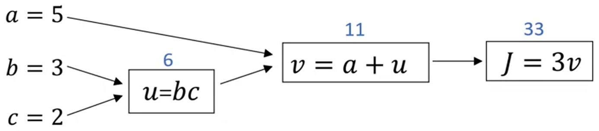
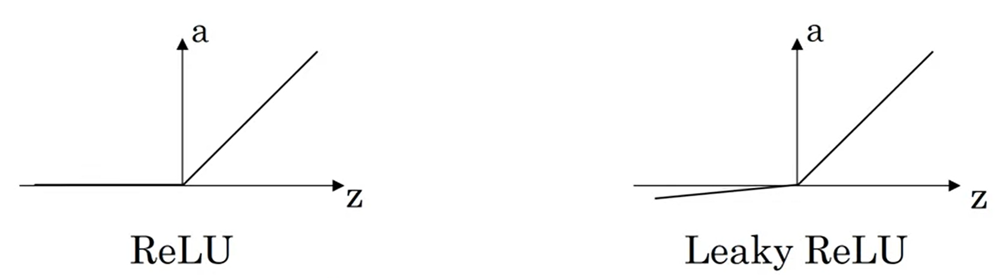
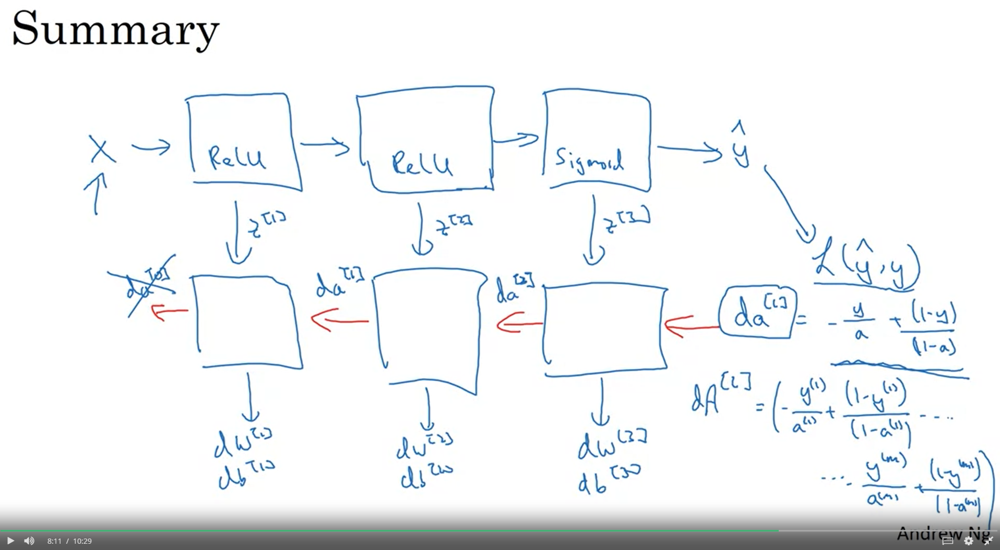
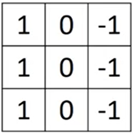
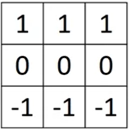

## 炼丹学习笔记

### 专有名词

前向传播、反向传播、二元分类、逻辑回归、计算图、微积分链式法则、矢量化、广播、激活函数、恒等激活函数（线性激活函数）、超参数、随机失活正则化、反向随机失活正则化、正交化（orthogonalization）、Xavier初始化、梯度检验、停滞区、鞍点、局部最优、批量归一化、mini-batch、softmax回归

### 注意事项

将训练数据转换为向量、然后所有数据组成矩阵、组成矩阵时，一个向量组成一列，这样运算更加方便。结果向量以列组成$1\times m$的向量。

当使用mini-batch时，参数b是多余的。

### 需要加强学习

交叉验证集（开发集）、随机失活正则化、指数加权平均

### 逻辑回归

$$
\hat{y}=\sigma(w^{T}x+b)\\
\sigma(z)=\frac{1}{1+e^{-z}}
$$

损失函数：
$$
\cal{L}(\hat{y},y)=-(y\log\hat{y}+(1-y)\log(1-\hat{y}))
$$
代价函数：
$$
\cal{J}(w,b)=\frac{1}{m}\sum_{i=1}^{m}\cal{L}(\hat{y}^{(i)},y^{(i)})
=-\frac{1}{m}\sum_{i=1}^{m}y^{(i)}\log\hat{y}^{(i)}+(1-y^{(i)})\log(1-\hat{y}^{(i)})
$$
梯度下降：
$$
w:=w-\alpha\frac{\partial}{\partial w}\cal{J}(w,b)\\
b:=b-\alpha\frac{\partial}{\partial d}\cal{J}(w,b)
$$
逻辑回归解决的是二分类问题，而Softmax回归解决的是C分类问题。

#### Softmax回归

激活函数：
$$
a^{[l]}=\frac{e^{z^{[l]}}}{\sum_{j=1}^{C}t_{i}}
$$


损失函数：
$$
\cal{L}(\hat{y},y)=-\sum_{j=1}^{C}y_{j}\log \hat{y}_{j}
$$


### 计算图



可以通过计算图来快速计算求导

### 矢量化/向量化

在面对大数据量训练时，矢量化可以有效地减少代码中地循环，并且优化深度学习

实现方法也很“简单”，只需要把计算转化为库内置函数运算即可，可以是numpy、也可以是其他框架。

python广播机制：

```python
(m,n) +-*/ (1,n) ~> (m,n)#python将自动扩充矩阵到维数一致进行计算。（向量与常数的计算也会广播）
```

python中`reshape`能检查矩阵向量的维度

### 神经网络

激活函数：
$$
\sigma(z)=\frac{1}{1+e^{-z}}\\
g(z)=tanh(z)=\frac{e^{z}-e^{-z}}{e^{z}+e^{-z}}
$$



随机初始化：

```python
w1=np.random.randn((2,2)) * 0.01
```

#### 矢量化方法

前向传播（输入：$A^{[l-1]}$）
$$
Z^{[l]}=W^{[l]}A^{[l-1]}+B^{[l]}\\
A^{[l]}=g^{[l]}(Z^{[l]})\\
$$
反向传播（输入：$dA^{[l]}$）
$$
dz^{[l]}=da^{[l]}*g^{[l]'}(z^{[l]})\\
dw^{[l]}=dz^{[l]}\cdot a^{[l-1]T}\\
db^{[l]}=dz^{[l]}\\
da^{[l-1]}=w^{[l]T}\cdot dz^{[l]}\\
dz^{[l]}=w^{[l]T}\cdot dz^{[l]}*g^{[l]'}(z^{[l]})\\
$$

$$
dZ^{[l]}=dA^{[l]}*g^{[l]'}(Z^{[l]})\\
dA^{[l-1]}=W^{[l]T}\cdot dZ^{[l]}\\
dW^{[l]}=\frac{1}{m}dZ^{[l]}\cdot A^{[l-1]T}\\
dB^{[l]}=\frac{1}{m}np.sum(dZ^{[l]},axis=1,keepdims=True)\\
$$


参数设置
$$
W^{[l]}:(n^{l},n^{l-1})\\
B^{[l]}:(n^{l},1)\\
dW^{[l]}:(n^{l},n^{l-1})\\
dB^{[l]}:(n^{l},1)
$$


### 正则化

==`lambda`是python中的保留关键字，使用时注意少输入a避免程序错误。==
$$
\|w^{[l]}\|^{2}=\sum_{i=1}^{n^{[l]}}\sum_{j=1}^{n^{[l-1]}}(w_{i,j}^{[l]})^{2}
$$
L2正则化（逻辑回归）
$$
J(w,b)=\frac{1}{m}\sum_{i=1}^{m}\cal{L}(\hat{y}^{(i)},y^{(i)})+\frac{\lambda}{2m}\|w\|_{2}^{2}\\
\|w\|^{2}_{2}=\sum_{j=1}^{n}w_{j}^{2}=w^{T}w
$$
Dropout（丢弃法）正则化（随机失活正则化）

### 常见问题与解决方法

#### 规范化输入

#### 梯度消失或爆炸

当神经网络层数过多并且参数一致时，梯度将会出现指数级的增长

#### 神经网络优化方法

梯度下降（全量、随机、小批量、动能）

#### 动能梯度下降

$$
V_{dw}=\beta V_{dw}+(1-\beta)dw\\
V_{db}=\beta V_{dw}+(1-\beta)db\\
w:=w-\alpha V_{dw}\\
b:=b-\alpha V_{db}
$$

$\beta$值一般为0.9

#### 指数加权平均

#### RMSprop（均方根传递）

$$
S_{dw}=\beta S_{dw}+(1-\beta)dw^{2}\\
S_{db}=\beta S_{db}+(1-\beta)db^{2}\\
w:=w-\alpha\frac{dw}{\sqrt{S_{dw}}+\epsilon}\\
b:=b-\alpha\frac{db}{\sqrt{S_{db}}+\epsilon}
$$

$\epsilon$的值一般为：$10^{-8}$

#### Adam优化算法(自适应矩估计)

结合了动能梯度下降以及RMSSprop
$$
V_{dw}^{corrected}=V_{dw}/(1-\beta_{1}^{t})\\
V_{db}^{corrected}=V_{db}/(1-\beta_{1}^{t})\\
S_{dw}^{corrected}=S_{dw}/(1-\beta_{2}^{t})\\
S_{db}^{corrected}=S_{db}/(1-\beta_{2}^{t})\\
w:=w-\alpha\frac{V_{dw}^{corrected}}{\sqrt{S_{dw}^{corrected}}+\epsilon}\\
b:=b-\alpha\frac{V_{db}^{corrected}}{\sqrt{S_{db}^{corrected}}+\epsilon}
$$
$\beta_{1}$取值0.9

$\beta_{2}$取值0.999

$\epsilon$取值$10^{-8}$

#### 学习率衰减

$$
\alpha=\frac{1}{1+decayRate\times epochNumber}\alpha_{0}
$$

decayRate：衰减率

### Batch Norm

$$
\mu=\frac{1}{m}\sum_{i}z^{(i)}\\
\sigma^{2}=\frac{1}{m}\sum_{i}(z^{(i)}-\mu)^{2}\\
z_{norm}^{(i)}=\frac{z^{(i)}-\mu}{\sqrt{\sigma^{2}+\epsilon}}\\
\tilde{z}^{(i)}=\gamma z_{norm}^{(i)}+\beta
$$

### 卷积神经网络

卷积是一种计算，定义一个过滤器/核子对矩阵进行“卷积“运算。

因为卷积运算会缩小矩阵大小，一个$n\times n$的矩阵与一个$f \times f$的过滤器进行卷积运算，最终得到的矩阵大小为$(n-f+1)\times(n-f+1)$。所以需要在运算前扩大矩阵，填充数字为0，扩大的格数为p，扩大之后运算得到的矩阵大小为：$(n-f+2p+1)\times(n-f+2p+1)$。（$p=\frac{f-1}{2}$）

有时会将步长不设置为1（stride），步长为s，最后的结果为$\lfloor(\frac{n+2p-f}{s}+1)\rfloor\times\lfloor(\frac{n+2p-f}{s})\rfloor$。

当输入图片是RGB图片时，输入的像素矩阵具有三个通道/层，过滤器也要定义三层，最后得到的结果和一个通道时一致，当定义多个过滤器时，得到的结果也具有多层。

**max poling**

只需要定义f与s，核的大小以及步长，每步选择核中的最大值，只需要定义超参数，不需要训练。

**average poling**

与max pooling的区别只是核中取平均值。

#### 专业名词：

Pooling（池化层）、Fully connected（完全连通层）、卷积层

过滤器举例：

**垂直边缘检测                                         水平边界检测**

