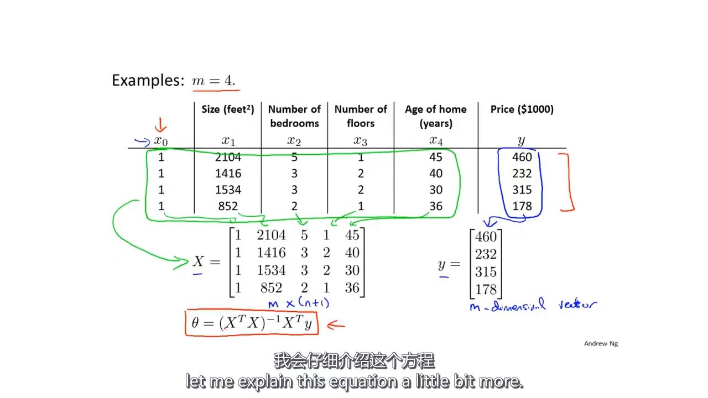
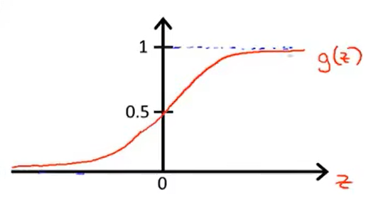

## 机器学习学习记录

### 梯度下降算法（批量梯度下降）

使用梯度下降算法时，如果特征值设置过大，可能会导致登高线图变得细长，下降过程会出现来回振荡，导致下降速度变慢，可以通过设置合理的值来优化。（接近$-1 \leqslant x \leqslant 1$这个区间最好，被称为归一化）
$$
\theta = \theta - \alpha \frac {\partial} {\partial \theta}J(\theta)
$$

### 归一化方式

特征值设置归一化的方式：
$$
x=\frac {x-\mu}{s}
$$
$\mu$的值最好为样本平均值，$s$的值为样本最大值减去最小值

### 学习率选择

通过选择十倍为间隔的多个$\alpha$值来确定合适的值，通过观察代价函数的值在迭代次数的影响下的变化，判断是否合适，基本上，只要出现问题，缩小$\alpha$值就可以了。

### 正规方程法

将每组特征值之前加上1后作为矩阵对应行组成矩阵$X$，然后将结果值组成一个向量$\overrightarrow {y}$

然后使用以下式子，即可求解出使代价函数最小的$\theta$值。(使用这个方法时不需要特征值缩放)
$$
\theta = (X^{T}X)^{-1} X^{T}\overrightarrow{y}
$$
举例：

### 梯度下降法与正规方程法的对比

**梯度下降法：**

需要选择学习率$\alpha$、需要迭代、在特征值很多时也可以运行得很好、在其他问题上依旧有很好的表现。

**正规方程法：**

不需要选择学习率$\alpha$，不需要迭代，在特征值很多时运行很慢（因为需要运行$(X^{T}X)^{-1}$的时间复杂度为$O(n^{3})$，这个值非常大，这个值的参考值是10000以下）、只适合于线性回归

### 使用正规方程法时，如果矩阵不可逆的解决方法

1、检查特征值是否有多余

2、特征值数量大于或等于样本数量：删除一些特征值或者使用正规化方法

### octave常用命令

`!=`使用`~=`、异或使用`xor()`、语句之后加上`;`则不打印结果、使用`pi`表示圆周率、使用`[2 3; 4 5; 6 7;]`创建一个$3\times 2$的矩阵、使用`1:0.1:6`来生成1开始，步长为0.1，到6的$1\times n$矩阵、使用`ones(2,3)`生成$2\times 3$的之全为1的矩阵、使用`hist()`来输出直方图、使用`eye()`来生成单位矩阵

### octave数据操作

使用`size()`获取矩阵维数（行和列）、使用`length()`获取矩阵最大的维数（行或列）、`pwd`显示当前路径、`cd`命令进入指定目录（需要以字符串方式传参）、`load`命令加载数据文件、`who`命令显示所有的变量、`whos`显示所有变量的详细信息、`clear`命令删除变量、`save`命令存储变量到文件（文件在前，变量再后，带上`-ascii`将数据以文本形式存储）、使用括号直接访问索引位置（从1开始，使用`:`表示输出当前列或行`A(:,2)`输出第二列全部，使用`A(:)`将矩阵所有数据放入一个列向量中）

### octave计算操作

`A'`表示求$A^{T}$、`*`表示叉乘、`.*`表示将矩阵对应元素进行相乘（可以替换成其他运算）、`log()`用来求对数、`exp()`表示以$e$为底，输入数据为指数的运算（$e{^x}$）、`abs()`求绝对值、`max()`返回最大值、`sum()`求矩阵所有元素和、`prod()`求所有元素乘积、`floor()`进行向下取整、`ceil()`向上取整、`flipud()`翻转矩阵（相当于左右镜像）、`pinv()`求矩阵的逆矩阵（伪逆矩阵，不可逆时依旧有结果）

### octave画图

`plot()`曲线图、`hold on`在原有图上添加图、`print -dpng 'test.png'`保存图形、`subplot(1,2,1)`表示在一个$1\times 2$的窗口的第一个位置绘制图形、`axis()`命令改变坐标轴、`imagesc`将矩阵可视化、`imagesc(A), colorbar, colormap gray `创建一个灰度分布图、

### octave函数

需要在目录中创建以函数名命名的m类型文件、可以通过`addpath`命令使得指定目录下的函数始终被读取加载、函数允许有多个返回值。

### 使用octave进行运算时的简便方法

当需要计算$\sum^{n}_{j=0} \theta_{j}x_{j}$时，只需要将$\theta$和$x$的数组向量化进行相乘（$\theta^{T}x$），因为线性代数函数库进行了优化，这个运算将比直接实现要快。

### 分类问题

#### 1、不推荐使用线性回归来解决分类问题

​	当样本数据不够集中时，会出现大量预测错误。

#### 2、适合于分类的算法为logistic回归算法

$$
g(z) = \frac {1} {1+e^{z}}
$$
​	

#### 3、决策边界

​	指logistic函数将样本分类的点或直线，样本组合在边界一侧为一个结果，另一侧为另一个结果。

​	当不能以直线进行区分时，可以在z中添加高阶多项式来定义不同的决策边界。

#### 4、代价函数

$$
J(\theta)=\frac {1} {m} \sum_{i=1}^{m}Cost(h_{\theta}(x^{(i)}),y^{(i)})
$$

$$
Cost(h_{\theta}(x),y) = \begin{cases}
-log(h_{\theta}(x)) & \mbox{if } y=1 \\
-log(1-h_{\theta}(x)) & \mbox{if } y=0
\end{cases}
$$
​	这个代价函数的特点就是，但$y=1$时，预测值为1时，代价函数值为0，但预测值与0越接近时，代价函数值越趋近于无穷大。但$y=0$时刚好相反。

等价于：
$$
Cost(h_{\theta}(x),y)=\mbox{-y }log(h_{\theta}(x))-(1-y)log(1-h_{\theta}(x))
$$

$$
J(\theta)=-\frac{1}{m}[\sum_{i=1}^{m}y^{(i)}\mbox{ }log(h_{\theta}(x^{(i)}))+(1-y^{(i)})log(1-h_{\theta}(x^{(i)}))]
$$

#### 5、梯度下降

$$
\theta_{j}:=\theta_{j}-\alpha\sum_{i=1}^{m}(h_{\theta}(x^{(i)}-y^{(i)})x_{j}^{(i)}
$$
#### 6、优化方法

​	1、共轭梯度法BFGS

​	2、L-BFGS

​	3、Gradient descent

​	4、Conjugate gradient

​	这些算法比直接梯度下降要快，并且不需要选择学习率$\alpha$，但是要复杂很多。

#### 7、octave内部实现优化方法

​	`fminunc(@costFunction, initualTheta, options)`

#### 8、多类别分类

具有多个类别时，将每个类别单独作为正样本，其他类别作为负样本进行分类，然后在判定时使用所有的分类器进行判定，选择概率最高的类别。

### 过拟合问题

解决方式：1、去除多余特征变量、使用模型选择来筛选特征变量；2、正则化，通过减少特征变量的量级来减少特征变量的影响

### 正则化方式

$$
J(\theta)=\frac{1}{2m}[\sum_{i=1}^{m}(h_{\theta}(x^{(i)})-y^{(i)})^{2}+\lambda\sum_{i=1}^{n}\theta_{j}^{2}]
$$
通过这种方式来同时缩小所有的特征变量，$\lambda$是正则化参数。

当参数设置过大时，可能会导致特征变量的影响过小，从而出现欠拟合的现象。

当使用正则化方式来缩小特征变量时

1、线性回归

梯度下降
$$
\theta_{j}:=\theta_{j}(1-\alpha\frac{\lambda}{m})-\alpha\frac{1}{m}\sum_{i=1}^{m}(h_{\theta}(x^{(i)})-y^{(i)})x_{j}^{(i)}
$$

正规方程法（以特征变量数量为2时举例，即$h_{\theta}(x)=\theta_{0}+\theta_{1}x+\theta_{2}x^{2}$时），此方法还可以解决$X^{T}X$不可逆的问题
$$
\theta=(X^{T}X+\lambda\begin{bmatrix}
0 & 0 & 0 \\
0 & 1 & 0 \\
0 & 0 & 1
\end{bmatrix})^{-1}X^{T}y
$$

### 神经网络

神经网络由多个神经元组成，具有输入层、隐藏层、输出层

专业名词：偏置单元、梯度检验、交叉验证集、训练集、测试集、学习曲线、偏差、方差、偏斜类、查准率、召回率、F值公式

需要重点复习的知识点：

神经网络代价函数、神经网络代价函数偏导数、反向传播算法、支持向量机

重点强调：可以使用梯度校验来验证模型是否正确，但是训练时一定要关闭梯度校验

如果使用多个隐藏层，每个隐藏层的神经元数量应该相等

### 如何设计机器学习系统

首先实现一个“不完美”的模型，然后根据模型出现的问题进行具体的优化、在构建机器学习算法时，同时需要构建一个评估方法

### 支持向量机（SVM）

 有时被称为大间距分类器

专业名词：（高斯）核函数

核函数：
$$
f_{i}=similarity(x,l^{(i)})=exp(-\frac{||x-l^{(i)}||^{2}}{2\sigma^{2}})
$$
使用高斯核函数的条件是：特征变量数量较多、样本数量较少、适合于拟合非常复杂的决策边界

所有的核函数都遵循默塞尔定理（Mercer’s Theorem）、还有的核函数有：多项式核函数、字符串、卡方、直方图交叉

### 聚类（无监督学习）

k-均值算法

代价函数：
$$
J(c^{(1)},...,c^{(m)},\mu_{1},...,\mu_{K})=\frac{1}{m}\sum_{i=1}^{m}||x^{(i)}-\mu_{c^{(i)}}||^{2}
$$
聚类中心初始化问题：随机选择样本中$K$个点即可

专业名词：肘部法则（选择K的数值时，需要将K-J(x)进行绘图，选择图中的肘点（即从快速下降转变为慢速下降的点））

### 维数约减（无监督学习）

适用于数据压缩、数据降维

### 主成分分析法（PCA）

寻找一个低维的平面/直线，将数据投射到这个平面上，数据点到投影平面上的举例被称为投影误差，使用PCA时先进行均值归一化和特征规范化。PCA与线性回归的区别在于，误差计算方式不同。
$$
Sigma=\frac{1}{m}\sum_{i=1}^{m}(x^{(i)})(x^{(i)})^{T}=\frac{1}{m}X^{T}X\\
[U,S,V]=svd(Sigma)\\
Ureduce=U(:,1:k)\\
z=Ureduce^{T}x
$$
专业名词：奇异值分解、对称正定、协方差矩阵

具有一个k值，需要选择k以达到以下的条件（此式子的意思是，降维后还原的数据比原数据，99%的差异性被保留）
$$
\frac{\frac{1}{m}\sum_{i=1}^{m}\| x^{(i)}x_{approx}^{(i)}\|^{2}}{\frac{1}{m}\sum_{i=1}^{m}\|x^{(i)}\|^{2}}\leqslant0.01
$$
数学计算方式（S矩阵中只有对角线非零）
$$
[U,S,V]=svd(Sigma)\\
1-\frac{\sum_{i=1}^{k}S_{ii}}{\sum_{i=1}^{n}S_{ii}}\leqslant0.01
$$
只需要调用一次svd函数，不断调整k来使得结果符合要求

PCA不适合用来避免过拟合

### 异常检测

==**以下内容还未完全搞懂，注意验证！！！**==

#### **高斯分布（正态分布）**

$$
p(x)=\prod_{j=1}^{n}p(x_{j};\mu_{j},\sigma_{j}^{2})\\
\mu_{j}=\frac{1}{m}\sum_{i=1}^{m}x_{j}^{(i)}\\
\sigma_{j}^{2}=\frac{1}{m}\sum_{i=1}^{m}(x_{j}^{(i)}-\mu_{j})^{2}\\
p(x)=\prod_{j=1}^{n}\frac{1}{\sqrt{2\pi}\sigma_{j}}exp(-\frac{(x_{j}^{(i)}-\mu_{j})^{2}}{2\sigma_{j}^{2}})
$$

异常检测与监督学习的比较

异常学习有偏斜类也没有关系、只需要大量的负样本就可以很好的拟合、但是监督学习具有偏斜类时会影响拟合效果；当异常类（正样本）的特征会经常出现变化，异常检测更好。

如果数据看上去不满足高斯分布，可以对数据进行一些处理

只能针对一维数据进行异常检测、在多维数据上无法检测出问题

#### **多元高斯分布**

$$
p(x;\mu,\Sigma)=\frac{1}{(2\pi)^{\frac{n}{2}}|\Sigma|^{\frac{1}{2}}}exp(-\frac{1}{2}(x-\mu)^{T}\Sigma^{-1}(x-\mu))\\
\Sigma=
\begin{vmatrix}
\sigma^{2}_{1}&0&0&0\\
0&\sigma^{2}_{2}&0&0\\
0&0&\ddots&0\\
0&0&0&\sigma^{2}_{n}
\end{vmatrix}
$$

多元高斯模型具有能够捕捉特征变量之间的相关性的优势、但是不适合与数据量很大的情况

### 协同过滤

$$
J(x^{(1)},\ldots,x^{(n_{m})},\theta^{(1)},\ldots,\theta^{(n_{u})})=\\
\frac{1}{2}\sum_{(i,j):r(i,j)=1}((\theta^{(j)})^{T}x^{(i)}-y^{(i,j)})^{2}
+\frac{\lambda}{2}\sum^{n_{m}}_{i=1}\sum^{n}_{k=1}(x^{(i)}_{k})^{2}
+\frac{\lambda}{2}\sum^{n_{u}}_{j=1}\sum^{n}_{k=1}(\theta^{(j)}_{k})^{2}
$$

关于用户没有进行评分时的推荐方法，可以将评分矩阵数值进行归一化，最后给该用户的结果将是所有用户对电影评分的平均数。

### 大数据量训练

当面对大数据量的训练时，可以先从数据中提取一小部分数据用来验证算法是否合理。

**随机梯度下降**和**映射化简**

#### 随机梯度下降

1、将所有数据进行打乱

2、按顺序遍历数据，每次使用一组数据进行参数下降，这个过程可能会使参数没有被正确调整，但是总体会朝着最优值方向下降，到最后时，参数将处于最优值附近，这可以节省很多计算。

#### 小批量梯度下降

就是把批量梯度下降的计算数量进行缩小，从原本计算全部到计算一个$d$数量的数据。之所以在某些情况下会优于其他两个，因为计算$\theta$时可以通过正规方程法来进行计算。

#### 验证算法已经收敛

验证随机梯度下降已经收敛的方法是：取数据集最后1000组数据计算损失函数，观察图中曲线是否由快速下降变为平稳

### 在线学习（待补充）

通过选择小量的数据来优化参数，这个数据可能来自数据流中。

### 映射约减（MapReduce）

就是将求和运算或求乘积运算分开来并行运算，使得计算速度翻倍、这就是Hadoop中MapReduce的来源。

### 机器学习流水线

专业名词：人工数据合成、上限分析

就是将机器学习分步骤完成

### 图片识别

先使用“滑动窗”识别图中需要的部分，然后使用“展开器”扩大选中的部分