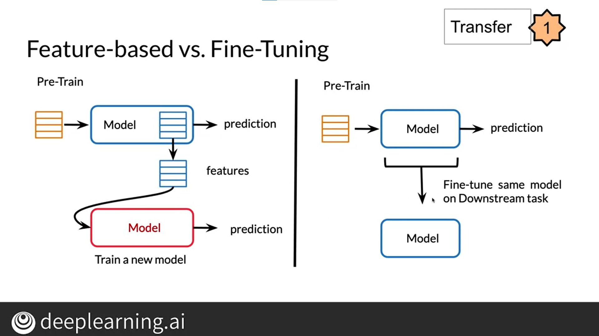
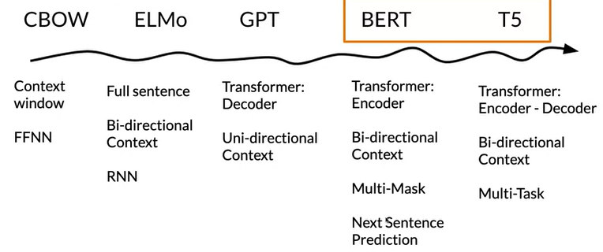

## 自然语言处理学习

### 专业名词

T5模型、BERT模型、迁移学习、T5模型、mT5模型、reformer模型、LSH Attention、可逆残差连接

### 插图

基于特征/微调的区别



模型发展史以及比较



### 迁移学习

迁移学习具有三个主要优点：

- 减少培训时间
- 改进预测
- 允许您使用较小的数据集

### BERT

BERT模型具有12层（12个transformer块）、12个注意力头、1.1亿个参数

### 微调BERT

#### 测试运行环境

使用文本分类任务作为测试

- git 克隆BERT代码
- 下载文本分类相关数据
- 安装tensorflow、CUDA Toolkit、cuDNN
- 运行训练任务

**windows下运行命令**

```
set BERT_BASE_DIR=../models/uncased_L-2_H-128_A-2
set GLUE_DIR=../data
```

快速复制版本

```
python run_classifier.py --task_name=MRPC --do_train=true --do_eval=true --data_dir=%GLUE_DIR%/MRPC --vocab_file=%BERT_BASE_DIR%/vocab.txt --bert_config_file=%BERT_BASE_DIR%/bert_config.json --init_checkpoint=%BERT_BASE_DIR%/bert_model.ckpt --max_seq_length=128 --train_batch_size=1 --learning_rate=2e-5 --num_train_epochs=3.0 --output_dir=../output/mrpc/
```

条理清晰版本

```
python run_classifier.py ^
  --task_name=MRPC ^
  --do_train=true ^
  --do_eval=true ^
  --data_dir=%GLUE_DIR%/MRPC ^
  --vocab_file=$BERT_BASE_DIR/vocab.txt ^
  --bert_config_file=%BERT_BASE_DIR%/bert_config.json ^
  --init_checkpoint=%BERT_BASE_DIR%/bert_model.ckpt ^
  --max_seq_length=128 ^
  --train_batch_size=1 ^
  --learning_rate=2e-5 ^
  --num_train_epochs=3.0 ^
  --output_dir=../output/mrpc/
```

**备用环境变量配置**

```
CUDA_PATH_V11_1
C:\Program Files\NVIDIA GPU Computing Toolkit\CUDA\v11.1
NVCUDASAMPLES11_1_ROOT
C:\ProgramData\NVIDIA Corporation\CUDA Samples\v11.1
C:\Program Files\NVIDIA GPU Computing Toolkit\CUDA\v11.1\bin
C:\Program Files\NVIDIA GPU Computing Toolkit\CUDA\v11.1\libnvvp
```

**注：**目前最便捷有效的方式，就是微调大模型，这个大模型唯一的缺点就是消耗资源多，但是这个可以说不是缺点了，但是对于我想要做的东西还算一个缺点，毕竟我要在一个4核4线程加8G的无独显的机器上跑起来至少两个模型（目前确定的），还要加上一个图数据库，一个关系型数据库，还有一个接口处理模块（类似于网关，但还要包括根据模型返回数据自动转发这些，想试试用go来写），不过还要开发一个（或者几个？）客户端，用于接受语音并发送请求，这一块想用rust来写，手机端还不确定，但是我的目标中，显示这一块是次要的，主要是要保持后台活动，就像手机自带的语音助手一样，毕竟是自己的设备，应该可以实现，实在不行，再学一下嵌入式吧，嵌入式肯定能用rust，不过目前最主要的是把核心的文本分类弄出来，然后训练一个通过文本输出图数据库语音来修改图的模型，难的是后面那个，但是有百度的uie模型，应该可以小样本训练出来，但是文本分类这个可能就会要很多数据，找了这么久没有想要的数据，好像只能自己标了。慢慢来了。（碎碎念）