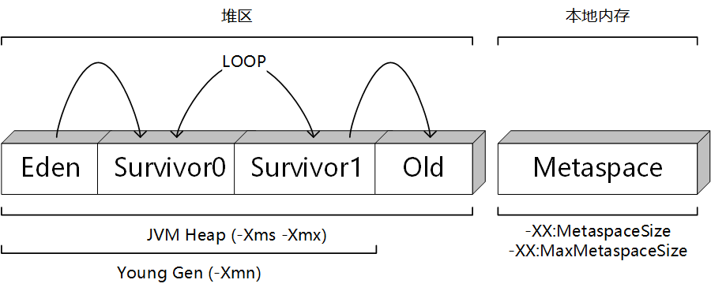

## 笔记

### Mybatis-plus的使用细节

#### 1、使用querywrapper时自定义SQL进行查询

mapper.xml编写方法：

```xml
<select id="getInfo" resultType="ResultClass">
	select * from table
    <if test="ew.emptyOfWhere == false">
        ${ew.customSqlSegment}
    </if>
</select>
```

使用分页时Dao方法的格式：

```java
IPage<ResultClass> getInfo(@Param("page") IPage<ResultClass> page,
                           @Param(Constants.WRAPPER) Wrapper<ResultClass> queryWrapper);
```

### Java的使用细节

#### 1、启动参数设置



因为Java1.8的内存模型，当`-Xmn`和`-Xmx`设置成同样大小时，如果触发了`Full GC`，当有老年代对象需要放入Old区时，就会触发`OOM`，因此：**不要将`-Xmn`和`-Xmx`设置成同样大小**

### SQL的使用细节

#### 1、删除某些字段重复的重复记录直到只剩一条

```sql
delete from table_name where id not in (select * from (select max(id) from table_name group by username, nick_name) t);
```

