neo4j中文文档-入门指南
--------------

本文转自 [https://www.cnblogs.com/wheaesong/p/15649547.html#/c/subject/p/15649547.html](https://www.cnblogs.com/wheaesong/p/15649547.html#/c/subject/p/15649547.html)，如有侵权，请联系删除。

### Neo4j v4.4

许可：[知识共享 4.0](https://neo4j.com/docs/license/)

#### **neo4j**

Neo4j 是世界领先的图形数据库。该架构旨在优化管理、存储和遍历节点和关系。图数据库采用属性图方法，这对遍历性能和操作运行时都有好处。

#### \*\*Cypher \*\*

Cypher 是 Neo4j 的图形查询语言，允许用户从图形数据库中存储和检索数据。它是一种声明式的、受 SQL 启发的语言，用于使用 ASCII 艺术语法描述图形中的视觉模式。语法提供了一种视觉和逻辑方式来匹配图中节点和关系的模式。Cypher 旨在让每个人都易于学习、理解和使用，而且还融合了其他标准数据访问语言的强大功能。

**本指南的内容**

Neo4j 入门指南涵盖以下领域：

*   [开始使用 Neo4j](https://neo4j.com/docs/getting-started/current/get-started-with-neo4j/#get-started-with-neo4j) — 如何开始使用 Neo4j。
*   [图数据库概念](https://neo4j.com/docs/getting-started/current/graphdb-concepts/#graphdb-concepts) -[图数据库概念](https://neo4j.com/docs/getting-started/current/graphdb-concepts/#graphdb-concepts)介绍。
*   [Cypher](https://neo4j.com/docs/getting-started/current/cypher-intro/#cypher-intro) 简介 — 图查询语言 Cypher 简介。

_谁应该读这个？_

本指南是为正在探索 Neo4j 和 Cypher 的任何人编写的。

开始使用 Neo4j
----------

关于如何安装 Neo4j 以及如何开始运行 Cypher 查询，有许多选项。

### 1\. 安装 Neo4j

设置使用 Neo4j 和 Cypher 开发应用程序的环境的最简单方法是使用 Neo4j Desktop。从https://neo4j.com/download/下载 Neo4j Desktop，然后按照您操作系统的安装说明进行操作。

有关如何开始使用 Neo4j 和 Cypher 的更多选项，请参阅https://neo4j.com/try-neo4j/。

### 2\. 文档

所有官方文档都可以在[https://neo4j.com/docs/ 获得](https://neo4j.com/docs/)。

在这里您可以找到完整的手册，例如：

*   [Cypher 手册](https://neo4j.com/docs/cypher-manual/4.4/#cypher-manual) — 这是 Cypher 的综合手册。
*   [操作手册](https://neo4j.com/docs/operations-manual/4.4/#operations-manual) ——本手册描述了如何部署和维护 Neo4j。

The [Cypher Refcard](https://neo4j.com/docs/cypher-refcard/current) 是学习和编写 Cypher 时的宝贵儿准确的资料

此外，您可以找到更专业的文档以及 API 文档和旧 Neo4j 版本的文档。

图数据库概念
------

Neo4j 使用_属性图_数据库模型。

图数据结构由可以通过**关系**连接的**节点**（离散对象）组成。

示例 1. 图结构的概念。

具有三个节点（圆圈）和三个关系（箭头）的图。

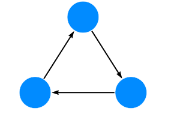

Neo4j 属性图数据库模型包括：

*   **节点**描述域的实体（离散对象）。
*   **节点**可以有零个或多个**标签**来定义（分类）它们是什么类型的节点。
*   **关系**描述了_源节点_和_目标节点_之间的连接。
*   **关系**总是有一个方向（一个方向）。
*   **关系**必须有一个**类型**（一种类型）来定义（分类）它们是什么类型的关系。
*   节点和关系可以具有进一步描述它们的**属性**（键值对）。

在数学中，图论是对图的研究。在图论中：节点也称为顶点或点。关系也称为边、链接或线。

### 1\. 示例图

下面的示例图，介绍了属性图的基本概念：

示例 2. 示例图。

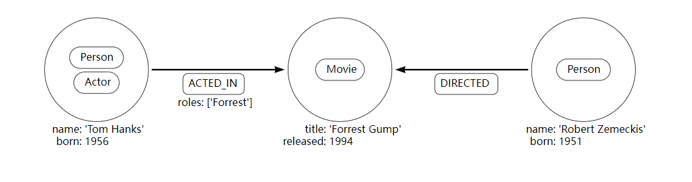

示例 3. 密码。

要创建示例图，请使用 Cypher 子句`CREATE`。

```
CREATE (:Person:Actor {name: 'Tom Hanks', born: 1956})-[:ACTED_IN {roles: ['Forrest']}]->(:Movie {title: 'Forrest Gump'})<-[:DIRECTED]-(:Person {name: 'Robert Zemeckis', born: 1951})

```

### 2.节点

节点用于表示域的_实体_（离散对象）。

最简单的图是没有关系的单个节点。考虑下图，由单个节点组成。

示例 4. 节点。

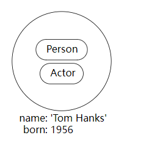

节点标签是：

*   `Person`
*   `Actor`

属性是：

*   `name: Tom Hanks`
*   `born: 1956`

可以使用 Cypher 使用查询创建节点：

```
CREATE (:Person:Actor {name: 'Tom Hanks', born: 1956})

```

### 3\. 节点标签

标签通过将节点分组（分类）到集合中来塑造域，其中具有特定标签的所有节点都属于同一集合。

例如，所有代表用户的节点都可以用标签来标记`User`。有了它，您就可以让 Neo4j 仅在您的用户节点上执行操作，例如查找具有给定名称的所有用户。

由于可以在运行时添加和删除标签，因此它们还可用于标记节点的临时状态。一个`Suspended`标签可以用来表示已暂停的银行账户，并且`Seasonal`标签可以表示蔬菜目前在季节。

一个节点可以有零到多个标签。

在该示例图中，节点的标签，`Person`，`Actor`，和`Movie`，用于描述（分类）的节点。可以添加更多标签来表示数据的不同维度。

下图显示了多个标签的使用。

示例 5. 多个标签。

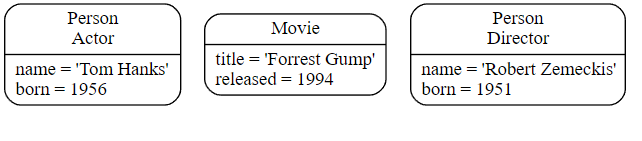

### 4\. 关系

关系描述了_源节点_和_目标节点_之间的连接如何相关。节点可能与自身有关系。

关系：

*   连接_源节点_和_目标节点_。
*   有一个方向（一个方向）。
*   必须有一个**类型**（一种类型）来定义（分类）它是什么类型的关系。
*   可以有属性（键值对），进一步描述关系。

关系将节点组织成结构，允许图类似于列表、树、地图或复合实体——其中任何一个都可以组合成更复杂、相互关联丰富的结构。

示例 6. 关系。

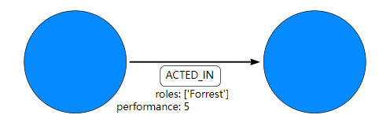

节点类型： `ACTED_IN`

属性是：

*   `roles: ['Forrest']`
*   `performance: 5`

该`roles`属性有一个数组值，其中包含单个项目 ( `'Forrest'`)。

可以使用 Cypher 使用查询创建关系：

```
CREATE ()-[:ACTED_IN {roles: ['Forrest'], performance: 5}]->()

```

您必须创建或引用_源节点_和_目标节点_才能创建关系。

关系总是有方向的。但是，如果方向没有用处，则可以忽略该方向。这意味着除非需要正确描述数据模型，否则无需添加相反方向的重复关系。

一个节点可以与它自己有关系。要表达`Tom Hanks` `KNOWS`他自己将被表达为：

示例 7. 与单个节点的关系。

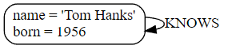

### 5\. 关系类型

一个关系必须只有一种关系类型。

下面是一个`ACTED_IN`关系，随着`Tom Hanks`节点作为_源节点_和`Forrest Gump`作为_目标节点_。

示例 8. 关系类型。

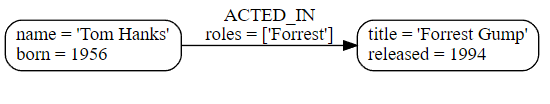

观察`Tom Hanks`节点有_传出_关系，而`Forrest Gump`节点有_传入_关系。

### 6\. 属性

属性是用于存储节点和关系数据的键值对。

属性的值部分：

*   可以容纳不同的数据类型，例如`number`，`string`或`boolean`。
*   可以保存包含例如字符串、数字或布尔值的同类列表（数组）。

示例 9. 数字

```
CREATE (:Example {a: 1, b: 3.14})

```

*   该属性`a`具有`integer`值为的类型`1`。
*   该属性`b`具有`float`值为的类型`3.14`。

示例 10. 字符串和布尔值

```
CREATE (:Example {c: 'This is an example string', d: true, e: false})

```

*   该属性`c`具有`string`值为的类型`'This is an example string'`。
*   该属性`d`具有`boolean`值为的类型`true`。
*   该属性`e`具有`boolean`值为的类型`false`。

示例 11. 列表

```
CREATE (:Example {f: [1, 2, 3], g: [2.71, 3.14], h: ['abc', 'example'], i: [true, true, false]})

```

*   该属性`f`包含一个值为 的数组`[1, 2, 3]`。
*   该属性`g`包含一个值为 的数组`[2.71, 3.14]`。
*   该属性`h`包含一个值为 的数组`['abc', 'example']`。
*   该属性`i`包含一个值为 的数组`[true, true, false]`。

有关可用数据类型的详细说明，请参阅[Cypher 手册 → 值和类型](https://neo4j.com/docs/cypher-manual/4.4/syntax/values/#cypher-values)。

### 7\. 遍历和路径

遍历是您查询图形以找到问题答案的方式，例如：“我的朋友喜欢哪些音乐但我尚未拥有？”或“如果此电源中断，哪些 Web 服务会受到影响？ ”。

遍历图是指按照一定的规则遵循关系来访问节点。在大多数情况下，只会访问图的一个子集。

示例 12. 路径匹配。

为了根据微型示例数据库找出汤姆汉克斯出演的电影，遍历将从`Tom Hanks`节点开始，遵循`ACTED_IN`连接到节点的任何关系，最后`Forrest Gump`得到结果（见虚线）：

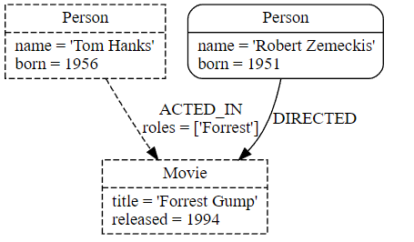

遍历结果可以作为长度为 的路径返回`1`：

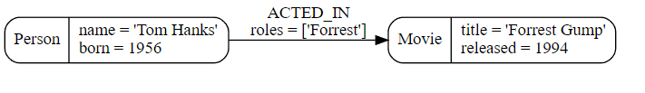

最短路径的长度为零。它包含一个节点，没有关系。

示例 13. 长度为零的路径。

仅包含单个节点的路径的长度为`0`。

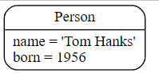

示例 14. 长度为 1 的路径。

包含一个关系的路径的长度为`1`。

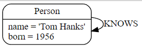

### 8\. 架构

Neo4j 中的_模式_指的是索引和约束。

Neo4j 通常被描述为_schema optional_，这意味着没有必要创建索引和约束。您可以创建数据——节点、关系和属性——而无需预先定义架构。可以在需要时引入索引和约束，以获得性能或建模优势。

### 9\. 索引

索引用于提高性能。要查看如何[使用索引的](https://neo4j.com/docs/getting-started/current/cypher-intro/schema/#cypher-intro-indexes)示例，请参阅[使用索引](https://neo4j.com/docs/getting-started/current/cypher-intro/schema/#cypher-intro-indexes)。有关如何在 Cypher 中使用索引的详细说明，请参阅[Cypher 手册 → 索引](https://neo4j.com/docs/cypher-manual/4.4/indexes-for-full-text-search/#administration-indexes-fulltext-search)。

### 10\. 约束

约束用于确保数据符合域的规则。要查看如何[使用约束的](https://neo4j.com/docs/getting-started/current/cypher-intro/schema/#cypher-intro-constraints)示例，请参阅[使用约束](https://neo4j.com/docs/getting-started/current/cypher-intro/schema/#cypher-intro-constraints)。有关如何在 Cypher 中使用约束的详细说明，请参阅[Cypher 手册 → 约束](https://neo4j.com/docs/cypher-manual/4.4/constraints/)。

### 11.命名约定

节点标签、关系类型和属性（关键部分）区分大小写，例如，这意味着属性与属性`name`不同`Name`。

建议使用以下命名约定：

| 图实体   | 推荐款式                     | 例子                                     |
| -------- | ---------------------------- | ---------------------------------------- |
| 节点标签 | 驼峰式大小写，以大写字符开头 | :VehicleOwner`rather than`:vehice\_owner |
| 关系类型 | 大写，使用下划线分隔单词     | :OWNS\_VEHICLE`rather than`:ownsVehicle  |
| 财产     | 驼峰小写，以小写字符开头     | firstName`rather than`first\_name        |

具体的命名规则请参考[Cypher 手册→命名规则和建议](https://neo4j.com/docs/cypher-manual/4.4/syntax/naming/#cypher-naming)。

Cypher 简介
---------

本节将向您介绍图查询语言 Cypher。它将帮助您开始思考图形和模式，将这些知识应用于简单的问题，并学习如何编写 Cypher 语句。

有关 Cypher 的完整参考，请参阅[Cypher 手册](https://neo4j.com/docs/cypher-manual/4.4/#cypher-manual)。

### （一）、图案（Patterns）

Neo4j 的属性图由节点和关系组成，其中任何一个都可能具有属性。节点代表实体，例如概念、事件、地点和事物。关系连接成对的节点。

但是，节点和关系可以被视为低级构建块。属性图的真正优势在于它能够对连接节点和关系的_模式_进行编码。单个节点或关系通常编码的信息很少，但节点和关系的模式可以编码任意复杂的想法。

Neo4j 的查询语言 Cypher 强烈基于模式。具体来说，模式用于匹配所需的图形结构。一旦找到或创建了匹配结构，Neo4j 就可以使用它进行进一步处理。

一个简单的模式，只有一个关系，连接一对节点（或者，偶尔，一个节点到它自己）。例如，_一个人_ `LIVES_IN` _是一个城市_或_一个城市是_ `PART_OF` _一个国家_。

复杂模式，使用多重关系，可以表达任意复杂的概念并支持各种有趣的用例。例如，我们可能想要匹配_Person_ `LIVES_IN` _和 Country 的_实例。以下 Cypher 代码将两个简单的模式组合成一个稍微复杂的模式来执行此匹配：

```
(:Person) -[:LIVES_IN]-> (:City) -[:PART_OF]-> (:Country)

```

由图标和箭头组成的图表通常用于可视化图形。文本注释提供标签、定义属性等。

#### 1、节点语法

Cypher 使用一对括号来表示一个节点：`()`. 这让人想起带有圆形端盖的圆形或矩形。下面是一些节点示例，提供了不同类型和变量的细节：

```
()
(matrix)
(:Movie)
(matrix:Movie)
(matrix:Movie {title: 'The Matrix'})
(matrix:Movie {title: 'The Matrix', released: 1997})

```

最简单的形式，`()`代表一个匿名的、无特征的节点。如果我们想在别处引用该节点，我们可以添加一个变量，例如：`(matrix)`。变量仅限于单个语句。它在另一个陈述中可能具有不同的含义或没有含义。

该`:Movie`模式声明了节点的标签。这允许我们限制模式，使其不匹配（例如）具有`Actor`该位置的节点的结构。

例如`title`，节点的属性表示为键值对列表，括在一对大括号内，例如：`{name: 'Keanu Reeves'}`。属性可用于存储信息和/或限制模式。

#### 2\. 关系语法

Cypher 使用一对破折号 ( `--`) 表示无向关系。定向关系的一端有一个箭头 ( `<--`, `-->`)。括号表达式 ( `[...]`) 可用于添加详细信息。这可能包括变量、属性和类型信息：

```
-->
-[role]->
-[:ACTED_IN]->
-[role:ACTED_IN]->
-[role:ACTED_IN {roles: ['Neo']}]->

```

关系的括号对中的语法和语义与节点括号之间使用的语法和语义非常相似。`role`可以定义一个变量（例如，role），以便在语句的其他地方使用。关系的类型（例如，`:ACTED_IN`）类似于节点的标签。属性（例如，`roles`）完全等同于节点属性。

#### 3\. 模式语法

结合节点和关系的语法，我们可以表达模式。以下可能是该领域中的一个简单模式（或事实）：

```
(keanu:Person:Actor {name: 'Keanu Reeves'})-[role:ACTED_IN {roles: ['Neo']}]->(matrix:Movie {title: 'The Matrix'})

```

相当于节点标签，`:ACTED_IN`模式声明了关系的关系类型。变量（例如，`role`）可以在语句的其他地方使用来指代关系。

如同节点属性，关系属性被表示为一对大括号括起来，例如键/值对的列表：`{roles: ['Neo']}`。在这种情况下，我们为 使用了一个数组属性`roles`，允许指定多个角色。属性可用于存储信息和/或限制模式。

#### 4\. 模式变量

为了增加模块化并减少重复，Cypher 允许将模式分配给变量。这允许检查匹配路径，用于其他表达式等。

```
acted_in = (:Person)-[:ACTED_IN]->(:Movie)

```

该`acted_in`变量将包含两个节点以及找到或创建的每条路径的连接关系。有多项功能的路径，例如访问细节：`nodes(path)`，`relationships(path)`，和`length(path)`。

#### 5\. 规则

Cypher 语句通常有多个_子句_，每个_子句_执行一个特定的任务，例如：

*   在图中创建和匹配模式
*   过滤、投影、排序或分页结果
*   撰写部分陈述

通过组合 Cypher 子句，我们可以组合更复杂的语句来表达我们想要知道或创建的内容。

### 模式实践

#### 1\. 创建数据

我们将首先研究允许我们创建数据的子句。

要添加数据，我们只使用我们已经知道的模式。通过提供模式，我们可以指定我们希望将哪些图形结构、标签和属性作为图形的一部分。

显然，最简单的子句称为`CREATE`。它会继续直接创建您指定的模式。

对于我们目前看到的模式，它可能如下所示：

**Cypher**

```
CREATE (:Movie {title: 'The Matrix', released: 1997})

```

如果我们执行此语句，Cypher 会返回更改的数量，在本例中添加 1 个节点、1 个标签和 2 个属性。

```
Created Nodes: 1
Added Labels: 1
Set Properties: 2
Rows: 0

```

当我们从一个空数据库开始时，我们现在有一个包含单个节点的数据库：

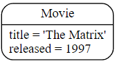

如果我们还想返回创建的数据，我们可以添加一个`RETURN`子句，它引用我们分配给模式元素的变量。

**Cypher**

```
CREATE (p:Person {name: 'Keanu Reeves', born: 1964})
RETURN p

```

这是返回的内容：

```
Created Nodes: 1
Added Labels: 1
Set Properties: 2
Rows: 1

+----------------------------------------------+
| p                                            |
+----------------------------------------------+
| (:Person {name: 'Keanu Reeves', born: 1964}) |
+----------------------------------------------+

```

如果我们想创建多个元素，我们可以用逗号（ , ）分隔元素或使用多个`CREATE`语句。

我们当然也可以创建更复杂的结构，例如`ACTED_IN`与角色信息或`DIRECTED`导演信息的关系。

**Cypher**

```
CREATE (a:Person {name: 'Tom Hanks', born: 1956})-[r:ACTED_IN {roles: ['Forrest']}]->(m:Movie {title: 'Forrest Gump', released: 1994})
CREATE (d:Person {name: 'Robert Zemeckis', born: 1951})-[:DIRECTED]->(m)
RETURN a, d, r, m

```

这是我们刚刚更新的图表部分：

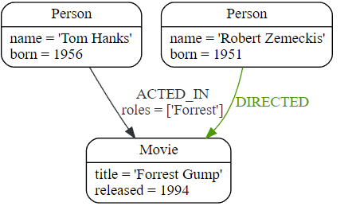

在大多数情况下，我们希望将新数据连接到现有结构。这要求我们知道如何在我们的图形数据中找到现有的模式，我们将在接下来进行研究。

#### 2\. 匹配模式

匹配模式是`MATCH`语句的任务。我们传递到目前为止使用的相同类型的模式`MATCH`来描述我们正在寻找的内容。它类似于_query by example_，只是我们的例子也包括结构。

一条`MATCH`语句将搜索我们指定的模式，并_为每个成功的模式匹配_返回_一行_。

为了找到到目前为止我们创建的数据，我们可以开始寻找所有标有`Movie`标签的节点。

**Cypher**

```
MATCH (m:Movie)
RETURN m

```

结果如下：

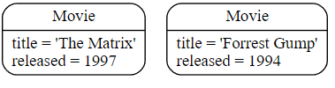

这应该同时显示_The Matrix_和_Forrest Gump_。

我们也可以找一个特定的人，比如_基努里维斯_。

**Cypher**

```
MATCH (p:Person {name: 'Keanu Reeves'})
RETURN p

```

此查询返回匹配的节点：

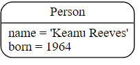

在这里需要注意的是，我们仅提供足够的信息来查找节点，并非所有属性都是必需的。在大多数情况下，您需要查找关键属性，例如 SSN、ISBN、电子邮件、登录名、地理位置或产品代码。

我们还可以找到更多有趣的联系，例如_汤姆汉克斯_扮演的电影名称和他扮演的角色。

**Cypher**

```
MATCH (p:Person {name: 'Tom Hanks'})-[r:ACTED_IN]->(m:Movie)
RETURN m.title, r.roles


```
```
Rows: 1

+------------------------------+
| m.title        | r.roles     |
+------------------------------+
| 'Forrest Gump' | ['Forrest'] |
+------------------------------+

```

在这种情况下，我们只返回我们感兴趣的节点和关系的属性。您可以通过点符号在任何地方访问它们`identifer.property`。

当然，这只是列出了他在《_阿甘正传》中_作为_Forrest 的_角色，因为这是我们添加的所有数据。

现在我们知道足以将新节点连接到现有节点，并且可以组合`MATCH`并`CREATE`附加结构到图中。

#### 3\. 附着结构

为了用新信息扩展图，我们首先匹配现有的连接点，然后通过关系将新创建的节点附加到它们。将_Cloud Atlas_添加为_Tom Hanks_的新电影可以这样实现：

**Cypher**

```
MATCH (p:Person {name: 'Tom Hanks'})
CREATE (m:Movie {title: 'Cloud Atlas', released: 2012})
CREATE (p)-[r:ACTED_IN {roles: ['Zachry']}]->(m)
RETURN p, r, m

```

以下是数据库中的结构：

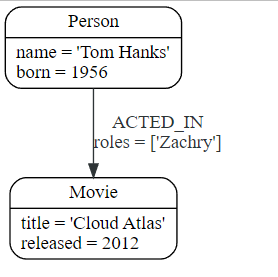

重要的是要记住，我们可以为节点和关系分配变量并在以后使用它们，无论它们是创建的还是匹配的。

可以在单个`CREATE`子句中附加节点和关系。为了可读性，将它们分开是有帮助的。

`MATCH`和组合的一个棘手方面`CREATE`是我们_每个匹配的模式_都得到_一行_。这会导致`CREATE`对每一行执行一次后续语句。在许多情况下，这正是您想要的。如果这不是故意的，请将`CREATE`语句移到之前`MATCH`，或者使用稍后讨论的方法更改查询的基数，或者使用下一个子句的_get 或 create_语义：`MERGE`。

#### 4\. 完成模式

每当我们从外部系统获取数据或不确定图中是否已经存在某些信息时，我们都希望能够表达可重复（幂等）的更新操作。在 Cypher 中`MERGE`有这个功能。它的作用类似于`MATCH` _or_ 的组合`CREATE`，它在创建数据之前首先检查数据是否存在。与`MERGE`您一起定义要查找或创建的模式。通常，与`MATCH`您一样，您只想包含要在核心模式中查找的关键属性。 `MERGE`允许您提供要设置的其他属性`ON CREATE`。

如果我们不知道我们的图形是否已经包含_Cloud Atlas，_我们可以再次将其合并。

**Cypher**

```
MERGE (m:Movie {title: 'Cloud Atlas'})
ON CREATE SET m.released = 2012
RETURN m


```
```
Created Nodes: 1
Added Labels: 1
Set Properties: 2
Rows: 1

+-------------------------------------------------+
| m                                               |
+-------------------------------------------------+
| (:Movie {title: 'Cloud Atlas', released: 2012}) |
+-------------------------------------------------+

```

我们在任何两种情况下都会得到结果：要么是图中已经存在的数据（可能不止一行），要么是一个新创建的`Movie`节点。

其中`MERGE`没有任何先前分配的变量的子句匹配完整模式或创建完整模式。它永远不会在模式中产生匹配和创建的部分混合。要实现部分匹配/创建，请确保对不应受到影响的部分使用已定义的变量。

因此，最重要的`MERGE`是确保您不能创建重复的信息或结构，但这需要首先检查现有匹配项的成本。特别是在大型图上，扫描大量标记节点以获得特定属性的成本可能很高。您可以通过创建支持索引或约束来缓解其中的一些问题，我们将在稍后讨论。但它仍然不是免费的，所以每当你一定不会创建重复数据使用`CREATE`了`MERGE`。

`MERGE`也可以断言关系只创建一次。为此，您_必须_从先前的模式匹配中_传入_两个节点。

**Cypher**

```
MATCH (m:Movie {title: 'Cloud Atlas'})
MATCH (p:Person {name: 'Tom Hanks'})
MERGE (p)-[r:ACTED_IN]->(m)
ON CREATE SET r.roles =['Zachry']
RETURN p, r, m

```

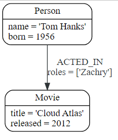

如果关系的方向是任意的，您可以不使用箭头。 `MERGE`然后将检查任一方向的关系，如果未找到匹配关系，则创建新的定向关系。

如果您选择只传入前一个子句中的一个节点，`MERGE`则会提供一个有趣的功能。然后它只会在给定模式的提供节点的直接邻域内匹配，如果没有找到，则创建它。这对于创建例如树结构非常方便。

**Cypher**

```
CREATE (y:Year {year: 2014})
MERGE (y)<-[:IN_YEAR]-(m10:Month {month: 10})
MERGE (y)<-[:IN_YEAR]-(m11:Month {month: 11})
RETURN y, m10, m11

```

这是创建的图形结构：

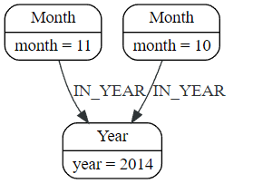

这里没有对这两个`Month`节点进行全局搜索；仅在_2014_ `Year`节点的上下文中搜索它们。

### 返回正确的结果

#### 1\. 示例图

首先，我们创建一些数据用于我们的示例：

**Cypher**

```
CREATE (matrix:Movie {title: 'The Matrix', released: 1997})
CREATE (cloudAtlas:Movie {title: 'Cloud Atlas', released: 2012})
CREATE (forrestGump:Movie {title: 'Forrest Gump', released: 1994})
CREATE (keanu:Person {name: 'Keanu Reeves', born: 1964})
CREATE (robert:Person {name: 'Robert Zemeckis', born: 1951})
CREATE (tom:Person {name: 'Tom Hanks', born: 1956})
CREATE (tom)-[:ACTED_IN {roles: ['Forrest']}]->(forrestGump)
CREATE (tom)-[:ACTED_IN {roles: ['Zachry']}]->(cloudAtlas)
CREATE (robert)-[:DIRECTED]->(forrestGump)

```

这是结果图：

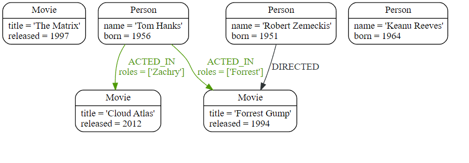

#### 2\. 过滤结果

到目前为止，我们已经在图中匹配了模式，并且总是返回我们找到的所有结果。现在我们将研究过滤结果的选项，只返回我们感兴趣的数据子集。这些过滤条件使用`WHERE`子句表示。这个子句允许使用任意数量的布尔表达式，的_谓词_，结合`AND`，`OR`，`XOR`和`NOT`。最简单的谓词是比较；尤其是等于（=）。

**Cypher**

```
MATCH (m:Movie)
WHERE m.title = 'The Matrix'
RETURN m


```
```
Rows: 1

+------------------------------------------------+
| m                                              |
+------------------------------------------------+
| (:Movie {title: 'The Matrix', released: 1997}) |
+------------------------------------------------+

```

上面的查询，使用`WHERE`子句，相当于这个查询，它在模式匹配中包含条件：

**Cypher**

`MATCH (m:Movie {title: 'The Matrix'}) RETURN m`

其他选项包括数字比较、匹配正则表达式以及检查列表中值的存在。

`WHERE`以下示例中的子句包括正则表达式匹配、大于比较和用于查看列表中是否存在某个值的测试：

**Cypher**

```
MATCH (p:Person)-[r:ACTED_IN]->(m:Movie)
WHERE p.name =~ 'K.+' OR m.released > 2000 OR 'Neo' IN r.roles
RETURN p, r, m


```
```
Rows: 1

+-------------------------------------------------------------------------------------------------------------------------------+
| p                                         | r                               | m                                               |
+-------------------------------------------------------------------------------------------------------------------------------+
| (:Person {name: 'Tom Hanks', born: 1956}) | [:ACTED_IN {roles: ['Zachry']}] | (:Movie {title: 'Cloud Atlas', released: 2012}) |
+-------------------------------------------------------------------------------------------------------------------------------+

```

一个高级方面是模式可以用作谓词。在`MATCH`扩展匹配模式的数量和形状的地方，模式谓词限制当前结果集。它只允许满足指定模式的路径通过。正如我们可以预期，采用`NOT`只允许路径传递那些_不_符合指定的模式。

**Cypher**

```
MATCH (p:Person)-[:ACTED_IN]->(m)
WHERE NOT (p)-[:DIRECTED]->()
RETURN p, m


```
```
Rows: 2

+----------------------------------------------------------------------------------------------+
| p                                         | m                                                |
+----------------------------------------------------------------------------------------------+
| (:Person {name: 'Tom Hanks', born: 1956}) | (:Movie {title: 'Cloud Atlas', released: 2012})  |
| (:Person {name: 'Tom Hanks', born: 1956}) | (:Movie {title: 'Forrest Gump', released: 1994}) |
+----------------------------------------------------------------------------------------------+

```

返回图如下：

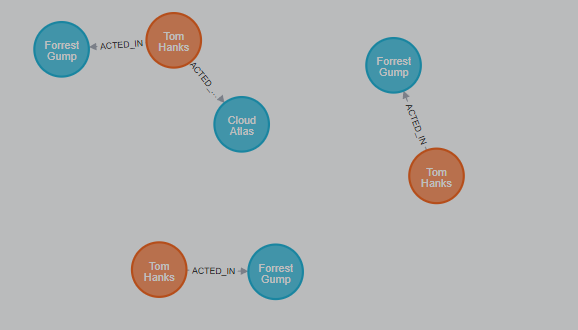

在这里，我们找到演员，因为他们建立了`ACTED_IN`关系，但随后跳过了`DIRECTED`任何电影中的那些演员。

还有更高级的过滤方法，例如_列表谓词_，我们将在本节后面讨论。

#### 3\. 返回结果

到目前为止，我们已经直接通过它们的变量返回了节点、关系和路径。但是，该`RETURN`子句可以返回任意数量的表达式。但是 Cypher 中的表达式是什么？

最简单的表达式是文字值。文字值的示例包括：数字、字符串、数组（例如：）`[1,2,3]`和映射（例如：）`{name: 'Tom Hanks', born:1964, movies: ['Forrest Gump', ...], count: 13}`。的任何节点，关系或地图各个属性可以使用访问_点语法_，例如：`n.name`。可以使用下标检索单个元素或数组切片，例如：`names[0]`和`movies[1..-1]`。每个功能的评价，例如：`length(array)`，`toInteger('12')`，`substring('2014-07-01', 0, 4)`和`coalesce(p.nickname, 'n/a')`，也是一个表达式。

`WHERE`子句中使用的谓词算作_布尔表达式_。

可以组合和连接简单的表达式以形成更复杂的表达式。

默认情况下，表达式本身将用作列的标签，在许多情况下，您希望使用`expression AS alias`. 随后可以使用别名来引用该列。

**Cypher**

```
MATCH (p:Person)
RETURN
  p,
  p.name AS name,
  toUpper(p.name),
  coalesce(p.nickname, 'n/a') AS nickname,
  {name: p.name, label: head(labels(p))} AS person


```
```
Rows: 3

+-------------------------------------------------------------------------------------------------------------------------------------------------+
| p                                               | name              | toUpper(p.name)   | nickname | person                                     |
+-------------------------------------------------------------------------------------------------------------------------------------------------+
| (:Person {name: 'Keanu Reeves', born: 1964})    | 'Keanu Reeves'    | 'KEANU REEVES'    | 'n/a'    | {name: 'Keanu Reeves', label: 'Person'}    |
| (:Person {name: 'Robert Zemeckis', born: 1951}) | 'Robert Zemeckis' | 'ROBERT ZEMECKIS' | 'n/a'    | {name: 'Robert Zemeckis', label: 'Person'} |
| (:Person {name: 'Tom Hanks', born: 1956})       | 'Tom Hanks'       | 'TOM HANKS'       | 'n/a'    | {name: 'Tom Hanks', label: 'Person'}       |
+-------------------------------------------------------------------------------------------------------------------------------------------------+

```

如果我们希望只显示唯一的结果，我们可以使用`DISTINCT`after 关键字`RETURN`：

**Cypher**

```
MATCH (n)
RETURN DISTINCT labels(n) AS Labels


```
```
Rows: 2

+------------+
| Labels     |
+------------+
| ['Movie']  |
| ['Person'] |
+------------+

```

#### 4\. 汇总信息

在许多情况下，我们希望在遍历图中的模式时对遇到的数据进行聚合或分组。在 Cypher 中，聚合发生在`RETURN`计算最终结果的子句中。许多常见的聚集功能的支持，例如`count`，`sum`，`avg`，`min`，和`max`，但也有几个。

可以通过以下方式计算数据库中的人数：

**Cypher**

```
MATCH (:Person)
RETURN count(*) AS people


```
```
Rows: 1

+--------+
| people |
+--------+
| 3      |
+--------+

```

请注意，`NULL`聚合期间会跳过值。要仅聚合唯一值，请使用`DISTINCT`，例如：`count(DISTINCT role)`。

聚合在 Cypher 中隐式工作。我们指定要聚合的结果列。Cypher 将使用所有非聚合列作为分组键。

聚合会影响哪些数据在排序或稍后的查询部分中仍然可见。

下面的陈述找出了演员和导演一起工作的频率：

**Cypher**

```
MATCH (actor:Person)-[:ACTED_IN]->(movie:Movie)<-[:DIRECTED]-(director:Person)
RETURN actor, director, count(*) AS collaborations


```
```
Rows: 1

+--------------------------------------------------------------------------------------------------------------+
| actor                                     | director                                        | collaborations |
+--------------------------------------------------------------------------------------------------------------+
| (:Person {name: 'Tom Hanks', born: 1956}) | (:Person {name: 'Robert Zemeckis', born: 1951}) | 1              |
+--------------------------------------------------------------------------------------------------------------+

```

#### 5\. 排序和分页

使用 聚合后进行排序和分页是很常见的`count(x)`。

使用`ORDER BY expression [ASC|DESC]`子句进行排序。表达式可以是任何表达式，只要它可以从返回的信息中计算出来。

例如，如果我们返回`person.name`我们仍然可以，`ORDER BY person.age`因为两者都可以从`person`引用中访问。我们不能按未退回的东西订购。这对于聚合和`DISTINCT`返回值尤其重要，因为两者都会消除聚合数据的可见性。

分页是使用`SKIP {offset}`and`LIMIT {count}`子句完成的。

一个常见的模式是聚合一个计数（_score_或_frequency_），按它排序，然后只返回 top-n 条目。

例如，为了找到我们可以做的最多产的演员：

**Cypher**

```
MATCH (a:Person)-[:ACTED_IN]->(m:Movie)
RETURN a, count(*) AS appearances
ORDER BY appearances DESC LIMIT 10


```
```
Rows: 1

+---------------------------------------------------------+
| a                                         | appearances |
+---------------------------------------------------------+
| (:Person {name: 'Tom Hanks', born: 1956}) | 2           |
+---------------------------------------------------------+

```

#### 6\. 采集聚合

一个非常有用的聚合函数是`collect()`，它将所有聚合值收集到一个列表中。这在许多情况下非常有用，因为在聚合时不会丢失任何细节信息。

`collect()`非常适合检索典型的父子结构，其中每行返回一个核心实体（_parent_、_root_或_head_）及其所有相关信息，这些信息位于用`collect()`. 这意味着无需为每个子行重复父信息，也无需运行`n+1`语句来分别检索父行及其子行。

以下语句可用于检索我们数据库中每部电影的演员表：

**Cypher**

```
MATCH (m:Movie)<-[:ACTED_IN]-(a:Person)
RETURN m.title AS movie, collect(a.name) AS cast, count(*) AS actors


```
```
Rows: 2

+-----------------------------------------+
| movie          | cast          | actors |
+-----------------------------------------+
| 'Forrest Gump' | ['Tom Hanks'] | 1      |
| 'Cloud Atlas'  | ['Tom Hanks'] | 1      |
+-----------------------------------------+

```

创建的列表`collect()`可以从使用 Cypher 结果的客户端使用，也可以直接在具有任何列表函数或谓词的语句中使用。

### 编写复杂语句

#### 1\. 示例图( Example graph)

我们继续使用与之前相同的示例数据：

**Cypher**

```
CREATE (matrix:Movie {title: 'The Matrix', released: 1997})
CREATE (cloudAtlas:Movie {title: 'Cloud Atlas', released: 2012})
CREATE (forrestGump:Movie {title: 'Forrest Gump', released: 1994})
CREATE (keanu:Person {name: 'Keanu Reeves', born: 1964})
CREATE (robert:Person {name: 'Robert Zemeckis', born: 1951})
CREATE (tom:Person {name: 'Tom Hanks', born: 1956})
CREATE (tom)-[:ACTED_IN {roles: ['Forrest']}]->(forrestGump)
CREATE (tom)-[:ACTED_IN {roles: ['Zachry']}]->(cloudAtlas)
CREATE (robert)-[:DIRECTED]->(forrestGump)

```

这是结果图：

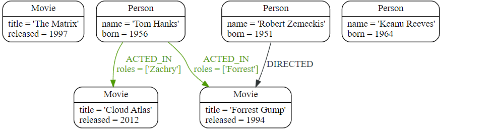

#### 2\. UNION

如果要合并具有相同结果结构的两个语句的结果，可以使用 。`UNION [ALL]`

例如，以下语句同时列出了演员和导演：

**Cypher**

```
MATCH (actor:Person)-[r:ACTED_IN]->(movie:Movie)
RETURN actor.name AS name, type(r) AS type, movie.title AS title
UNION
MATCH (director:Person)-[r:DIRECTED]->(movie:Movie)
RETURN director.name AS name, type(r) AS type, movie.title AS title


```
```
Rows: 3

+-------------------------------------------------+
| name              | type       | title          |
+-------------------------------------------------+
| 'Tom Hanks'       | 'ACTED_IN' | 'Cloud Atlas'  |
| 'Tom Hanks'       | 'ACTED_IN' | 'Forrest Gump' |
| 'Robert Zemeckis' | 'DIRECTED' | 'Forrest Gump' |
+-------------------------------------------------+

```

请注意，在所有子句中，返回的列必须以相同的方式命名。

上面的查询等效于这个更紧凑的查询：

**Cypher**

```
MATCH (actor:Person)-[r:ACTED_IN|DIRECTED]->(movie:Movie) RETURN actor.name AS name, type(r) AS type, movie.title AS title

```

#### 3\. WITH

在Cypher中，可以将语句片段链接在一起，类似于在数据流管道中完成的方式。每个片段都处理前一个片段的输出，其结果可以馈送到下一个片段。_只有_子句中声明的列在后续查询部分中可用。`WITH`

该子句用于组合各个部分，并声明哪些数据从一个部分流向另一个部分。 类似于子句。不同之处在于，子句不会完成查询，而是为下一部分准备输入。表达式、聚合、排序和分页的使用方式与子句中的使用方式相同。唯一的区别是所有列都必须有别名。`WITH``WITH``RETURN``WITH``RETURN`

在下面的示例中，我们收集了某人出演的电影，然后过滤掉那些只出现在一部电影中的电影：

**Cypher**

```
MATCH (person:Person)-[:ACTED_IN]->(m:Movie)
WITH person, count(*) AS appearances, collect(m.title) AS movies
WHERE appearances > 1
RETURN person.name, appearances, movies


```
```
Rows: 1

+-------------------------------------------------------------+
| person.name | appearances | movies                          |
+-------------------------------------------------------------+
| 'Tom Hanks' | 2           | ['Cloud Atlas', 'Forrest Gump'] |
+-------------------------------------------------------------+

```

### 定义模式

#### 1\. 示例图

首先创建一些数据用于我们的示例：

**Cypher**

```
CREATE (forrestGump:Movie {title: 'Forrest Gump', released: 1994})
CREATE (robert:Person:Director {name: 'Robert Zemeckis', born: 1951})
CREATE (tom:Person:Actor {name: 'Tom Hanks', born: 1956})
CREATE (tom)-[:ACTED_IN {roles: ['Forrest']}]->(forrestGump)
CREATE (robert)-[:DIRECTED]->(forrestGump)

```

这是结果图：

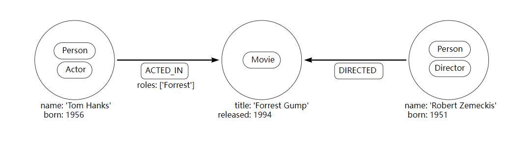

#### 2\. 使用索引

在图数据库中使用索引的主要原因是为了找到图遍历的起点。一旦找到该起点，遍历就依赖于图内结构来实现高性能。

可以随时添加索引。

如果数据库中已有数据，则索引上线需要一些时间。

以下查询创建一个索引以加快在数据库中按名称查找演员的速度：

**Cypher**

```
CREATE INDEX example_index_1 FOR (a:Actor) ON (a.name)

```

在大多数情况下，查询数据时不需要指定索引，因为将自动使用适当的索引。

可以使用_索引提示_指定在特定查询中使用哪个索引。这是查询调优的几个选项之一，在[Cypher 手册 → 查询调优](https://neo4j.com/docs/cypher-manual/4.4/query-tuning/#query-tuning)中有详细描述。

例如，以下查询将自动使用`example_index_1`：

**Cypher**

```
MATCH (actor:Actor {name: 'Tom Hanks'})
RETURN actor

```

**A** 综合指数是对具有特定标签的所有节点的多个属性的索引。例如，以下语句将在所有标有`Actor`和 且同时具有 a`name`和 a`born`属性的节点上创建一个复合索引。请注意，由于`Actor`标签`name`为“基努·里维斯”的节点不具有该`born`属性。因此该节点不会被添加到索引中。

**Cypher**

```
CREATE INDEX example_index_2 FOR (a:Actor) ON (a.name, a.born)

```

您可以查询数据库`SHOW INDEXES`以找出定义了哪些索引。

**Cypher**

```
SHOW INDEXES YIELD name, labelsOrTypes, properties, type


```
```
Rows: 2

+----------------------------------------------------------------+
| name              | labelsOrTypes | properties       | type    |
+----------------------------------------------------------------+
| 'example_index_1' | ['Actor']     | ['name']         | 'BTREE' |
| 'example_index_2' | ['Actor']     | ['name', 'born'] | 'BTREE' |
+----------------------------------------------------------------+

```

在[Cypher Manual → Indexes 中](https://neo4j.com/docs/cypher-manual/4.4/indexes-for-full-text-search/#administration-indexes-fulltext-search)了解有关索引的更多信息。

#### 3\. 使用约束

约束用于确保数据符合域的规则。例如：

> “如果一个节点的标签为`Actor`，属性为`name`，则 的值`name`在所有具有`Actor`标签的节点中必须是唯一的”。

示例 1. 唯一性约束

此示例显示如何为具有标签`Movie`和属性的节点创建约束`title`。约束指定`title`属性必须是唯一的。

添加唯一约束将隐式添加该属性的索引。如果删除了约束，但仍然需要索引，则必须显式创建索引。

**Cypher**

```
CREATE CONSTRAINT constraint_example_1 FOR (movie:Movie) REQUIRE movie.title IS UNIQUE

```

Neo4j 4.4 中的语法发生了变化，旧的语法是：`CREATE CONSTRAINT constraint_example_1 ON (movie:Movie) ASSERT movie.title IS UNIQUE Deprecated`

可以将约束添加到已经有数据的数据库中。这要求现有数据符合正在添加的约束。

您可以查询数据库以找出使用`SHOW CONSTRAINTS`Cypher 语法定义的约束。

示例 2. 约束查询

此示例显示了一个 Cypher 查询，该查询返回已为数据库定义的约束。

**Cypher**

```
SHOW CONSTRAINTS YIELD id, name, type, entityType, labelsOrTypes, properties, ownedIndexId


```
```
Rows: 1

+-----------------------------------------------------------------------------------------------------+
| id | name                   | type         | entityType | labelsOrTypes | properties | ownedIndexId |
+-----------------------------------------------------------------------------------------------------+
| 4  | 'constraint_example_1' | 'UNIQUENESS' | 'NODE'     | ['Movie']     | ['title']  | 3            |
+-----------------------------------------------------------------------------------------------------+

```

上述约束适用于 Neo4j 的所有版本。Neo4j 企业版有额外的限制。

在[Cypher 手册 → 约束中](https://neo4j.com/docs/cypher-manual/4.4/constraints/#administration-constraints)了解有关约束的更多信息。

### 导入数据

> 本教程演示了如何使用 .csv 文件从 CSV 文件导入数据`LOAD CSV`。

结合 Cypher 子句`LOAD CSV`, `MERGE`, 和`CREATE`您可以方便地将数据导入 Neo4j。 `LOAD CSV`允许您访问数据值并对其执行操作。

有关 的完整说明`LOAD CSV`，请参阅[Cypher 手册 →`LOAD CSV`](https://neo4j.com/docs/cypher-manual/4.4/clauses/load-csv/#query-load-csv)。有关 Cypher 子句的完整列表，请参阅[Cypher 手册 → 子句](https://neo4j.com/docs/cypher-manual/4.4/clauses/#query-clause)。

#### 1\. 数据文件

在本教程中，您将从以下 CSV 文件导入数据：

*   _persons.csv_
*   _movies.csv_
*   _roles.csv_

_people.csv_文件的内容：

persons.csv

**Cypher**

```
id,name
1,Charlie Sheen
2,Michael Douglas
3,Martin Sheen
4,Morgan Freeman

```

该_persons.csv_文件包含两列`id`和`name`。每一行代表一个人，他有一个唯一的`id`和一个`name`。

_movies.csv_文件的内容：

movies.csv

**Cypher**

```
id,title,country,year
1,Wall Street,USA,1987
2,The American President,USA,1995
3,The Shawshank Redemption,USA,1994

```

该_movies.csv_文件包含列`id`，`title`，`country`，和`year`。每一行代表一部电影，它有一个 unique `id`、 a `title`、 a `country`of origin 和 a release `year`。

_roles.csv_文件的内容：

角色.csv

**Cypher**

```
personId,movieId,role
1,1,Bud Fox
4,1,Carl Fox
3,1,Gordon Gekko
4,2,A.J. MacInerney
3,2,President Andrew Shepherd
5,3,Ellis Boyd 'Red' Redding

```

该_roles.csv_文件包含列`personId`，`movieId`和`role`。每一行代表与有关的人的关系数据的一个角色`id`（从_persons.csv_文件）和电影`id`（从_movies.csv_文件）。

#### 2\. 图模型

以下简单数据模型显示了此数据集的图形模型可能是什么样子：

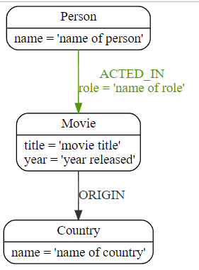

这是基于 CSV 文件数据的结果图：

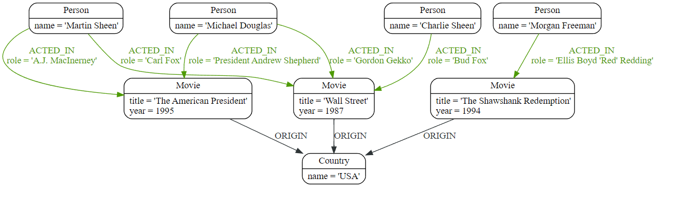

#### 3\. 先决条件

本教程使用 Linux 或 macOS tarball 安装。

它假设您当前的工作目录是tarball 安装的目录，并且 CSV 文件放置在默认_导入_目录中。

有关其他安装的默认目录，请参阅[操作手册 → 文件位置](https://neo4j.com/docs/operations-manual/4.4/configuration/file-locations/#file-locations)。导入位置可通过[操作手册 →`dbms.directories.import`](https://neo4j.com/docs/operations-manual/4.4/reference/configuration-settings/#config_dbms.directories.import)进行配置。

#### 4.准备数据库

在导入数据之前，您应该通过创建索引和约束来准备要使用的数据库。

您应该通过对`Person`和`Movie`节点`id`创建约束来确保它们具有唯一的属性。

创建唯一约束也会隐式创建索引。通过索引`id`属性，节点查找（例如 by `MATCH`）会快得多。

此外，最好为国家/地区`name`建立索引以进行快速查找。

**1、启动neo4j。**

**Shell**

```
bin/neo4j start

```

默认用户名是`neo4j`和密码`neo4j`。

**2\. 创建一个约束，使每个`Person`节点都有一个唯一的`id`属性。**

您`id`对`Person`节点的属性创建约束以确保带有`Person`标签的节点将具有唯一的`id`属性。

使用_Neo4j 浏览器_，运行以下 Cypher：

**Cypher**

```
CREATE CONSTRAINT personIdConstraint FOR (person:Person) REQUIRE person.id IS UNIQUE

```

或者使用[_Neo4j Cypher Shell_](https://neo4j.com/docs/operations-manual/4.4/tools/cypher-shell/#cypher-shell)，运行命令：

**Shell**

```
bin/cypher-shell --database=neo4j "CREATE CONSTRAINT personIdConstraint FOR (person:Person) REQUIRE person.id IS UNIQUE"

```

**3\. 创建一个约束，使每个`Movie`节点都有一个唯一的`id`属性。**

您`id`对`Movie`节点的属性创建约束以确保带有`Movie`标签的节点将具有唯一的`id`属性。

使用_Neo4j 浏览器_，运行以下 Cypher：

**Cypher**

```
CREATE CONSTRAINT movieIdConstraint FOR (movie:Movie) REQUIRE movie.id IS UNIQUE

```

或者使用[_Neo4j Cypher Shell_](https://neo4j.com/docs/operations-manual/4.4/tools/cypher-shell/#cypher-shell)，运行命令：

**Shell**

```
bin/cypher-shell --database=neo4j "CREATE CONSTRAINT movieIdConstraint FOR (movie:Movie) REQUIRE movie.id IS UNIQUE"

```

**4.`Country`为`name`属性创建节点索引。**

在节点的`name`属性上创建索引`Country`以确保快速查找。

使用`MERGE`或`MATCH`with 时`LOAD CSV`，请确保对要合并的属性具有[索引](https://neo4j.com/docs/getting-started/current/cypher-intro/schema/#cypher-intro-indexes)或[唯一约束](https://neo4j.com/docs/getting-started/current/cypher-intro/schema/#cypher-intro-constraints)。这将确保查询以高性能方式执行。

使用_Neo4j 浏览器_，运行以下 Cypher：

**Cypher**

```
CREATE INDEX FOR (c:Country) ON (c.name)

```

或者使用[_Neo4j Cypher Shell_](https://neo4j.com/docs/operations-manual/4.4/tools/cypher-shell/#cypher-shell)，运行命令：

**Shell**

```
bin/cypher-shell --database=neo4j "CREATE INDEX FOR (c:Country) ON (c.name)"

```

#### 5.导入数据使用 `LOAD CSV`

**1\. 从\*persons.csv\*文件加载数据。**

您创建具有`Person`标签和属性的节点`id`以及`name`。

使用_Neo4j 浏览器_，运行以下 Cypher：

**Cypher**

```
LOAD CSV WITH HEADERS FROM "file:///persons.csv" AS csvLine
CREATE (p:Person {id: toInteger(csvLine.id), name: csvLine.name})

```

或者使用[_Neo4j Cypher Shell_](https://neo4j.com/docs/operations-manual/4.4/tools/cypher-shell/#cypher-shell)，运行命令：

**Shell**

```
bin/cypher-shell --database=neo4j 'LOAD CSV WITH HEADERS FROM "file:///persons.csv" AS csvLine CREATE (p:Person {id:toInteger(csvLine.id), name:csvLine.name})'

```

**Return**

```
Added 4 nodes, Set 8 properties, Added 4 labels

```

`LOAD CSV`还支持通过`HTTPS`、`HTTP`和访问 CSV 文件`FTP`，请参阅[密码手册 →`LOAD CSV`](https://neo4j.com/docs/cypher-manual/4.4/clauses/load-csv/#query-load-csv)。

**2\. 从\*movies.csv\*文件加载数据。**

您可以使用`Movie`标签和属性`id`、`title`、 和 来创建节点`year`。

您还可以使用`Country`标签创建节点。在多部电影具有相同原产国的情况下，使用`MERGE`可避免创建重复`Country`节点。

与类型的关系`ORIGIN`将连接`Country`节点和`Movie`节点。

使用_Neo4j 浏览器_，运行以下 Cypher：

**Cypher**

```
LOAD CSV WITH HEADERS FROM "file:///movies.csv" AS csvLine
MERGE (country:Country {name: csvLine.country})
CREATE (movie:Movie {id: toInteger(csvLine.id), title: csvLine.title, year:toInteger(csvLine.year)})
CREATE (movie)-[:ORIGIN]->(country)

```

或者使用[_Neo4j Cypher Shell_](https://neo4j.com/docs/operations-manual/4.4/tools/cypher-shell/#cypher-shell)，运行命令：

**Shell**

```
bin/cypher-shell --database=neo4j 'LOAD CSV WITH HEADERS FROM "file:///movies.csv" AS csvLine MERGE (country:Country {name:csvLine.country}) CREATE (movie:Movie {id:toInteger(csvLine.id), title:csvLine.title, year:toInteger(csvLine.year)}) CREATE (movie)-[:ORIGIN]->(country)'

```

**Return**

```
Added 4 nodes, Created 3 relationships, Set 10 properties, Added 4 labels

```

**3.从\*roles.csv\*文件中加载数据**

从_roles.csv_文件导入数据就是找到`Person`节点和`Movie`节点，然后在它们之间创建关系。

对于较大的数据文件，它是使用提示有用`USING PERIODIC COMMIT`的条款`LOAD CSV`。这个提示告诉 Neo4j 查询可能会建立过多的事务状态，因此需要定期提交。有关更多信息，请参阅[4.4@cypher-manual:ROOT:query-tuning/using/index.adoc#query-using-periodic-commit-hint](https://neo4j.com/docs/cypher-manual/4.4/query-tuning/using/#query-using-periodic-commit-hint)。

使用_Neo4j 浏览器_，运行以下 Cypher：

**Cypher**

```
USING PERIODIC COMMIT 500
LOAD CSV WITH HEADERS FROM "file:///roles.csv" AS csvLine
MATCH (person:Person {id: toInteger(csvLine.personId)}), (movie:Movie {id: toInteger(csvLine.movieId)})
CREATE (person)-[:ACTED_IN {role: csvLine.role}]->(movie)

```

或者使用[_Neo4j Cypher Shell_](https://neo4j.com/docs/operations-manual/4.4/tools/cypher-shell/#cypher-shell)，运行命令：

**Shell**

```
bin/cypher-shell --database=neo4j 'USING PERIODIC COMMIT 500 LOAD CSV WITH HEADERS FROM "file:///roles.csv" AS csvLine MATCH (person:Person {id:toInteger(csvLine.personId)}), (movie:Movie {id:toInteger(csvLine.movieId)}) CREATE (person)-[:ACTED_IND {role:csvLine.role}]->(movie)'

```

**Return**

```
Created 5 relationships, Set 5 properties

```

#### 6\. 验证导入的数据

通过查找所有具有关系的节点来检查结果数据集。

使用_Neo4j 浏览器_，运行以下 Cypher：

**Cypher**

```
MATCH (n)-[r]->(m) RETURN n, r, m

```

或者使用[_Neo4j Cypher Shell_](https://neo4j.com/docs/operations-manual/4.4/tools/cypher-shell/#cypher-shell)，运行命令：

**Shell**

```
bin/cypher-shell --database=neo4j 'MATCH (n)-[r]->(m) RETURN n, r, m'

```

**Return**

```
+-----------------------------------------------------------------------------------------------------------------------------------------------------------------------------------+
| n                                                               | r                                               | m                                                             |
+-----------------------------------------------------------------------------------------------------------------------------------------------------------------------------------+
| (:Movie {id: 3, title: "The Shawshank Redemption", year: 1994}) | [:ORIGIN]                                       | (:Country {name: "USA"})                                      |
| (:Movie {id: 2, title: "The American President", year: 1995})   | [:ORIGIN]                                       | (:Country {name: "USA"})                                      |
| (:Movie {id: 1, title: "Wall Street", year: 1987})              | [:ORIGIN]                                       | (:Country {name: "USA"})                                      |
| (:Person {name: "Morgan Freeman", id: 4})                       | [:ACTED_IN {role: "Carl Fox"}]                  | (:Movie {id: 1, title: "Wall Street", year: 1987})            |
| (:Person {name: "Charlie Sheen", id: 1})                        | [:ACTED_IN {role: "Bud Fox"}]                   | (:Movie {id: 1, title: "Wall Street", year: 1987})            |
| (:Person {name: "Martin Sheen", id: 3})                         | [:ACTED_IN {role: "Gordon Gekko"}]              | (:Movie {id: 1, title: "Wall Street", year: 1987})            |
| (:Person {name: "Martin Sheen", id: 3})                         | [:ACTED_IN {role: "President Andrew Shepherd"}] | (:Movie {id: 2, title: "The American President", year: 1995}) |
| (:Person {name: "Morgan Freeman", id: 4})                       | [:ACTED_IN {role: "A.J. MacInerney"}]           | (:Movie {id: 2, title: "The American President", year: 1995}) |
+---------------------------------------------------------------------------------------------------------------
​```</neo4j-home>
```

  

本文转自 [https://www.cnblogs.com/wheaesong/p/15649547.html#/c/subject/p/15649547.html](https://www.cnblogs.com/wheaesong/p/15649547.html#/c/subject/p/15649547.html)，如有侵权，请联系删除。
