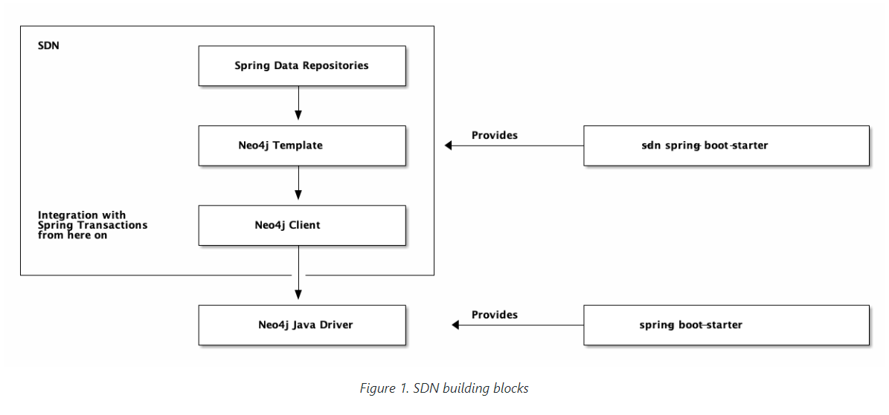

参考官方文档：[Spring Data Neo4j Documentation Version 7.0.0](https://docs.spring.io/spring-data/neo4j/docs/current/reference/html)

> 本文件的副本可供你自己使用和分发给其他人，但你不得对这些副本收取任何费用，而且每份副本都要包含本版权声明，无论是以印刷品还是电子方式分发。

来自：[csdn博客](https://blog.csdn.net/weixin_45119331/article/details/128348944)

1\. 阅读本文档的方式
-------------------------------------------------------------------------------

本文档试图在众多可能的用户之间搭建桥梁：

*   初次接触Spring生态系统的人，包括Spring框架、Spring Data、具体模块（这里指Spring Data Neo4j）和Neo4j。
*   有经验的Neo4j开发者，他们是Spring Data的新手，想充分利用他们的Neo4j知识，但不熟悉声明式事务，例如，如何将后者与Neo4j集群要求相结合。
*   经验丰富的Spring Data开发人员，他们是这个特定模块和Neo4j的新手，需要学习构建块如何相互作用。虽然该模块的编程模式与Spring Data JDBC、Mongo等非常一致，但查询语言（Cypher）、事务和集群行为是不同的，无法抽象。

以下是我们如何满足这些不同的需求：

很多Neo4j的具体问题可以在 "[常见问题 Frequently Asked Questions](https://docs.spring.io/spring-data/neo4j/docs/current/reference/html/#faq) "中找到。这些问题对于那些非常了解Neo4j具体需求并想知道如何用Spring Data Neo4j来解决这些需求的人来说特别有意义。

如果你已经熟悉了Spring Data的核心概念，请直接进入[第七章](https://docs.spring.io/spring-data/neo4j/docs/current/reference/html/#getting-started)。本章将引导你了解配置应用程序连接到Neo4j实例的不同选项，以及如何对你的领域进行建模。

在大多数情况下，你将需要一个领域。转到[第8章](https://docs.spring.io/spring-data/neo4j/docs/current/reference/html/#mapping) ，了解如何将节点和关系映射到你的领域模型。

之后，你将需要一些方法来查询领域。可以选择Neo4j存储库、Neo4j模板或更低层次的Neo4j客户端。所有这些都可以以响应式的方式进行。除了分页机制外，标准存储库的所有功能都可以在响应式中使用。

如果你来自旧版本的Spring Data Neo4j（通常缩写为SDN+OGM或SDN5），你很可能会对[SDN的介绍](https://docs.spring.io/spring-data/neo4j/docs/current/reference/html/#preface.sdn)感兴趣，尤其是[SDN+OGN和当前SDN之间](https://docs.spring.io/spring-data/neo4j/docs/current/reference/html/#faq.sdn-related-to-ogm)的关系。在同一章中，你将了解SDN6的[构建块](https://docs.spring.io/spring-data/neo4j/docs/current/reference/html/#building-blocks) 。

要了解更多关于存储库的一般概念，请转到[第9章](https://docs.spring.io/spring-data/neo4j/docs/current/reference/html/#repositories)。

当然，你可以继续读下去，继续读序言，并提供一个温和的入门指南。

2\. 介绍Neo4j
------------------------------------------------------------------------------

图数据库是一种存储引擎，专门用于存储和检索庞大的信息网络。它将数据有效地存储为与其他节点甚至相同节点有关系的节点，从而允许对这些结构进行高性能检索和查询。属性可以被添加到节点和关系中。节点可以由0个或更多的标签来标记，关系总是有方向性的，并被命名。

图数据库非常适用于存储大多数类型的领域模型。在几乎所有的领域中，都有某些事物与其他事物相连。在大多数其他建模方法中，事物之间的关系被简化为没有身份和属性的单一链接。图数据库允许保持源自领域的丰富关系在数据库中同样得到很好的体现，而不需要将这些关系也建模为 “事物”。当把现实生活中的领域放入图数据库时，几乎不存在 "阻抗失配 "的情况。

[Neo4j](https://neo4j.com/)是一个开源的NoSQL图数据库。它是一个完全事务性的数据库（ACID），存储的数据结构为由节点组成的图，由关系连接。受现实世界结构的启发，它允许在复杂数据上实现高查询性能，同时对开发者来说保持直观和简单。

学习Neo4j的起点是 [neo4j.com](https://neo4j.com/)。下面是一份有用的资源清单：

*   [Neo4j 文档](https://neo4j.com/docs/) 介绍了Neo4j，并包含入门指南、参考文档和教程的链接
*   [在线沙盒(online sandbox)](https://neo4j.com/sandbox/) 提供了一种方便的方式，结合在线[教程](https://neo4j.com/developer/get-started/)与Neo4j实例进行互动
*   Neo4j [Java Bolt Driver](https://neo4j.com/developer/java/)
*   有几本[书籍](https://neo4j.com/books/)可供购买，还有[视频](https://www.youtube.com/neo4j)可供观看

3\. 介绍Spring Data
------------------------------------------------------------------------------------

Spring Data使用Spring框架的[核心](https://docs.spring.io/spring/docs/6.0.0/reference/html/core.html)功能，如[IoC](https://docs.spring.io/spring/docs/6.0.0/reference/html/core.html#beans)容器、[类型转换系统](https://docs.spring.io/spring/docs/6.0.0/reference/html/core.html#core-convert)、[表达式语言](https://docs.spring.io/spring/docs/6.0.0/reference/html/core.html#expressions)、[JMX集成](https://docs.spring.io/spring/docs/6.0.0/reference/html/integration.html#jmx)和可移植的[DAO异常层次结构](https://docs.spring.io/spring/docs/6.0.0/reference/html/data-access.html#dao-exceptions)。虽然没有必要了解所有的Spring API，但了解它们背后的概念是必要的。至少，IoC背后的理念应该是熟悉的。

要了解更多关于Spring的信息，你可以参考详细解释Spring框架的综合文档。关于这个问题，有很多文章、博客条目和书籍——请查看SpringFramework[主页](https://spring.io/docs)了解更多信息。

Spring Data的优点在于它将相同的编程模型应用于各种不同的存储，例如JPA、JDBCMongo和其他存储。因此，本文档中包含了部分通用Spring Data文档，特别是关于[使用Spring Data Repositories](https://docs.spring.io/spring-data/neo4j/docs/current/reference/html/#repositories)的通用章节。如果您过去没有使用过SpringData模块，请务必查看一下。

4\. 介绍Spring Data Neo4j
------------------------------------------------------------------------------------------

Spring Data Neo4j或简称SDN是下一代[Spring Data](https://spring.io/projects/spring-data)模块，由[Neo4j公司](https://neo4j.com/)与[VMware](https://www.vmware.com/)的Spring Data团队紧密合作创建和维护。它支持所有官方支持的Neo4j版本，包括Neo4j AuraDB。Spring Data Neo4j项目将上述的Spring Data概念应用于使用Neo4j图数据存储的解决方案的开发。

SDN完全依赖于[Neo4j Java Driver](https://github.com/neo4j/neo4j-java-driver)，没有在映射框架和驱动程序之间引入另一个“驱动程序”或“传输”层。Neo4j Java Driver（有时被称为Bolt或Bolt驱动程序）用作一种协议，就像JDBC用于关系数据库一样。

SDN是一个对象-图-映射（OGM）库。OGM将图中的节点和关系映射到领域模型中的对象和引用。对象实例被映射到节点，而对象引用则使用关系来映射，或序列化为属性（例如对日期的引用）。JVM基元被映射到节点或关系属性。OGM对数据库进行了抽象，并提供了一种方便的方式来在图中持久化你的领域模型，并对其进行查询，而不必直接使用低级别的驱动程序。它还为开发者提供了灵活性，在SDN生成的查询不充分的情况下提供自定义查询。

SDN是之前的SDN第5版的_**正式继承者**_，本文档将其称为SDN+OGM。SDN版本5使用了一个单独的对象映射框架，就像Spring Data JPA与JPA的关系一样。这个独立的层，又称Neo4j OGM（Neo4j对象图映射器），现在包含在这个模块本身。Spring Data Neo4j本身是一个对象映射器，专门用于Spring和Spring Boot应用程序以及一些支持的Jakarta EE环境中。它不需要也不支持单独的对象映射器的实现。

值得注意的是，目前的SDN版本与之前的SDN+OGM不同的特点是：

*   SDN是一个独立的完整的OGM
*   完全支持不可变的实体，因此完全支持Kotlin的数据类
*   完全支持Spring框架本身和Spring Data中的响应式编程模型
*   Neo4j客户端和响应式客户端功能，在普通驱动上复活了模板的概念，缓解了数据库访问问题

我们提供存储库作为存储和查询文件的高级抽象，以及用于通用领域访问或通用查询执行的模板和客户端。所有这些都与Spring的应用事务集成。

Neo4j支持的核心功能可以通过`Neo4j Client`或 `Neo4j Template`或其响应式变体直接使用。所有这些都提供了与Spring的应用层事务的集成。在较低的层次上，你可以获取Bolt驱动程序实例，但在这些情况下，您必须管理自己的事务。

> 即使在现代的Spring Boot应用程序中，您仍然可以使用Neo4j OGM。但是您**不能**将它与SDN6一起使用。如果您尝试了，您将在两个不同且不相关的持久性上下文中拥有两组不同的实体。因此，如果您想坚持使用Neo4j OGM 3.2.x，可以使用Spring Boot实例化的Java驱动程序，并将其传递到Neo4j OGM会话。Neo4j OGM 3.2.x仍然受支持，我们建议在Quarkus等框架中使用它。然而，在Spring Boot应用程序中，您的主要选择应该是SDN 6。

请务必阅读[常见问题](https://docs.spring.io/spring-data/neo4j/docs/current/reference/html/#faq)，在这里我们解决了许多关于我们的映射决策的重复出现的问题，但也解决了如何与Neo4j集群实例（如[Neo4j AuraDB](https://neo4j.com/cloud/platform/aura-graph-database/)）和内部集群部署的互动可以得到显著改善。

需要理解的重要概念是Neo4j书签，[可能需要](https://medium.com/neo4j/try-and-then-retry-there-can-be-failure-30bf336383da)引入适当的重试机制，如[Spring Retry](https://github.com/spring-projects/spring-retry)或[Resilience4j](https://github.com/resilience4j/resilience4j)（我们建议使用后者，因为这一知识也适用于Spring之外），以及Neo4j集群上下文中只读与写查询的重要性。

5\. Spring Data Neo4j的构建模块
---------------------------------------------------------------------------------------------

### 5.1. 概述

SDN由可组合的构建块组成。它构建在[Neo4j Java Driver](https://github.com/neo4j/neo4j-java-driver)之上。Java驱动程序的实例是通过Spring Boot的自动配置本身提供的。驱动程序的所有配置选项都可以在名称空间 `spring.neo4j`中访问。驱动程序bean提供了与Neo4j交互的命令式、异步和响应式方法。

您可以使用驱动程序在该bean上提供的所有事务方法，例如[自动提交事务](https://neo4j.com/docs/driver-manual/4.0/terminology/#term-auto-commit)、[事务函数](https://neo4j.com/docs/driver-manual/4.0/terminology/#term-transaction-function)和非托管事务。请注意，这些事务与正在进行的Spring事务并不紧密。

与Spring Data和Spring平台或响应式事务管理器的集成始于[Neo4j客户端](https://docs.spring.io/spring-data/neo4j/docs/current/reference/html/#neo4j-client)。客户端是SDN的一部分。它通过一个单独的启动器`spring-bot-starter-data-neo4j`进行配置。该启动器的配置名称空间为`spring.data.neo4j`。

客户端是映射不可知的。它不知道你的领域类，你要负责将结果映射到适合你需要的对象上。

下一个更高级别的抽象是Neo4j模板。它知道您的领域，您可以使用它查询任意域对象。该模板在具有大量领域类或自定义查询的场景中非常有用，您不想为这些场景创建额外的存储库抽象。

最高级别的抽象是Spring数据存储库。

SDN的所有抽象都以命令式和响应式的方式出现。不建议在同一应用程序中混合使用两种编程风格。响应式基础设施需要Neo4j 4.0+数据库。



模板机制类似于其他存储的模板。在我们的常见问题解答中查找有关它的更多信息。Neo4j客户端是SDN独有的。您可以在附录中找到其文档。

### 5.2. 包层级

| **Package**                                       | **Description**                                              |
| ------------------------------------------------- | ------------------------------------------------------------ |
| org.springframework.data.neo4j.config             | 这个包包含了与配置相关的支持类，可用于特定应用的、有注释的配置类。如果你不依赖Spring Boot的自动配置，那么抽象基类就很有帮助。该包提供了一些额外的注解，可以进行审计。 |
| org.springframework.data.neo4j.core               | 这个包包含了创建一个可以执行查询的命令式或反应式客户端的核心基础设施。标记为 `@API(status = API.Status.STABLE)`的包可以安全使用。核心包提供了对客户端和模板的命令式和反应式变体的访问。 |
| org.springframework.data.neo4j.core.convert       | 提供了一套SDN支持的模拟类型。`Neo4jConversions`允许带入额外的、自定义的转换器。 |
| org.springframework.data.neo4j.core.support       | 这个包提供了一些可能对你的领域有帮助的支持类，例如一个表示某些事务可能被重试的谓词和额外的转换器和id生成器。 |
| org.springframework.data.neo4j.core.transaction   | 包含了将非管理的Neo4j事务转换为Spring管理的事务的核心基础设施。将强制性和响应性的`TransactionManager`作为 `Neo4jTransactionManager`和 `ReactiveNeo4jTransactionManager`公开。 |
| org.springframework.data.neo4j.repository         | 这个包提供了Neo4j的命令式和响应式存储库API。                 |
| org.springframework.data.neo4j.repository.config  | Neo4j特定存储库的配置基础设施，特别是专用注解，以实现强制性和响应性的Spring Data Neo4j存储库。 |
| org.springframework.data.neo4j.repository.support | 这个包提供了几个公共支持类，用于构建自定义的强制性和响应性Spring Data Neo4j存储库基类。这些支持类与SDN本身使用的类相同。 |

6\. 依赖
-------------------------------------------------------------------------

由于各个Spring Data模块的起始日期不同，它们中的大多数都有不同的主要和次要版本号。找到兼容的模块最简单的方法是依靠Spring Data发布系列BOM，我们在发布时定义了兼容版本。在Maven项目中，你可以在POM的`<dependencyManagement />`部分声明这一依赖关系，如下所示：

_示例1.使用 Spring Data发布系列BOM_

```
<dependencyManagement>
  <dependencies>
    <dependency>
      <groupId>org.springframework.data</groupId>
      <artifactId>spring-data-bom</artifactId>
      <version>2022.0.0</version>
      <scope>import</scope>
      <type>pom</type>
    </dependency>
  </dependencies>
</dependencyManagement>

```

当前发布的系列版本为2022.0.0。系列版本使用了图案为 `YYYY.MINOR.MICRO`的 [calver](https://calver.org/) 。对于GA版本和服务版本，版本名称遵循 `${calver}`，而对于所有其他版本则遵循以下模式：`${calver}-${modifier}`，其中 `modifier`可以是以下之一：

*   `SNAPSHOT`：当前快照
*   `M1、M2`等：里程碑
*   `RC1、RC2`等：发布候选项

你可以在我们的[Spring Data示例库](https://github.com/spring-projects/spring-data-examples/tree/master/bom)中找到一个使用BOM的工作实例。有了这些，你可以在`<dependencies />`块中声明你想使用的没有版本的Spring Data模块，如下所示：

_示例2.声明对Spring Data模块的依赖关系_

```
<dependencies>
  <dependency>
    <groupId>org.springframework.data</groupId>
    <artifactId>spring-data-jpa</artifactId>
  </dependency>
<dependencies>

```

### 6.1. 使用Spring Boot的依赖性管理

Spring Boot为你选择了一个最新版本的Spring Data模块。如果你仍然想升级到较新的版本，将 `spring-data-releasetrain.version`属性设置为你想使用的 [train version and iteration](https://docs.spring.io/spring-data/neo4j/docs/current/reference/html/#dependencies.train-version)。

### 6.2. Spring框架

当前版本的Spring Data模块需要Spring Framework 6.0.0或更高版本。这些模块也可能在该次要版本的较早的错误修复版本中工作。然而，强烈建议使用那一代中的最新版本。

参考文档 Reference Documentation
===============================================================================================

谁应该读这个？

本手册适用于：

*   研究Neo4j的Spring集成的企业架构师
*   工程师使用Neo4j开发基于Spring Data的应用程序

7\. 开始 Getting started
-----------------------------------------------------------------------------------------

我们为SDN提供了一个Spring Boot启动器。请通过依赖关系管理包含启动器模块，并配置要使用的bolt URL，例如`Spring.neo4j.uri=bolt://localhost:7687`.启动器假定服务器已禁用身份验证。由于SDN启动程序依赖于Java驱动程序的启动程序，所以这里所说的所有关于配置的内容也适用于此。关于可用属性的参考，请使用您的 IDE 在 `spring.neo4j` 命名空间中的自动完成。

SDN支持：

*   众所周知的命令式编程模型（就像Spring Data JDBC或JPA）
    
*   基于[Reactive Streams](https://www.reactive-streams.org/)的响应式编程，包括对[响应式事务](https://spring.io/blog/2019/05/16/reactive-transactions-with-spring)的全面支持
    

这些都包含在同一个二进制文件中。响应式编程模型在数据库方面需要一个4+Neo4j服务器，另一方面需要响应式Spring。

### 7.1. 准备数据库

在本例中，我们停留在[movie graph](https://neo4j.com/developer/movie-database/)中，因为每个Neo4j实例都是免费的。

如果您没有正在运行的数据库，但安装了Docker，请运行：

_清单1. 在Docker中启动本地Neo4j实例。_

```
docker run --publish=7474:7474 --publish=7687:7687 -e 'NEO4J_AUTH=neo4j/secret' neo4j:4.4.8

```

您现在可以访问 [http://localhost:7474](http://localhost:7474/browser/?cmd=play&arg=movies).上述命令将服务器的密码设置为 `secret`。请注意提示中准备运行的命令`（：播放电影）`。执行它以用一些测试数据填充数据库.

### 7.2. 创建一个新的Spring Boot项目

设置SpringBoot项目的最简单方法是 [start.spring.io](https://start.spring.io/) （它也集成在主要的IDE中，以防您不想使用该网站）。

选择“SpringWebStarter”以获取创建基于Spring的Web应用程序所需的所有依赖项。Spring Initializer将负责为您创建一个有效的项目结构，并为所选的构建工具提供所有文件和设置。

#### 7.2.1. 使用Maven

您可以对Spring Initializer发出`curl`请求，以创建一个基本的Maven项目：

_清单2. 使用Spring Initializer创建一个基本的Maven项目_

```
curl https://start.spring.io/starter.tgz \
  -d dependencies=webflux,data-neo4j  \
  -d bootVersion=2.6.3 \
  -d baseDir=Neo4jSpringBootExample \
  -d name=Neo4j%20SpringBoot%20Example | tar -xzvf -

```

这将创建一个新的文件夹 `Neo4jSpringBootExample`。由于这个启动器还没有在初始化器上，你将不得不在你的 `pom.xml`中手动添加以下依赖关系。

_清单3._ 将 `spring-data-neo4j-spring-boot-starter`包含在Maven项目中

```
<dependency>
	<groupId>org.springframework.boot</groupId>
	<artifactId>spring-boot-starter-data-neo4j</artifactId>
</dependency>

```

如果是一个现有的项目，你也可以手动添加依赖关系。

#### 7.2.2. 使用Gradle

想法是一样的，只需生成一个Gradle项目：

_清单4. 使用Spring Initializer创建一个基本Gradle项目_

```
curl https://start.spring.io/starter.tgz \
  -d dependencies=webflux,data-neo4j \
  -d type=gradle-project \
  -d bootVersion=2.6.3 \
  -d baseDir=Neo4jSpringBootExampleGradle \
  -d name=Neo4j%20SpringBoot%20Example | tar -xzvf -

```

Gradle的依赖关系如下所示，必须添加到 `build.Gradle`中：

清单5. 在Gradle项目中包含`spring-data-neo4j-spring-boot-starter`

```
dependencies {
    implementation 'org.springframework.boot:spring-boot-starter-data-neo4j'
}

```

如果是一个现有的项目，你也可以手动添加依赖关系。

### 7.3. 配置项目

现在在你喜欢的IDE中打开这些项目中的任何一个。找到 `application.properties`并配置你的Neo4j凭证：

```
spring.neo4j.uri=bolt://localhost:7687
spring.neo4j.authentication.username=neo4j
spring.neo4j.authentication.password=secret

```

这是你连接到Neo4j实例所需的最基本的东西。

当你使用这个启动器时，没有必要添加任何驱动程序的程序化配置。SDN存储库将被这个启动器自动启用。

### 7.4. 在模块路径上运行(Java 9以上)

Spring Data Neo4j可以在模块路径上运行。它的自动模块名称是 `spring.data.neo4j`。由于当前Spring Data构建设置的限制，它本身并不提供模块。因此，它使用一个自动但稳定的模块名称。然而，它确实依赖于一个模块化的库（[Cypher-DSL](https://github.com/neo4j-contrib/cypher-dsl)）。由于上述限制，如果没有 `module-info.java`，我们无法代表你表达对该库的需求。

因此，在你的项目中运行Spring Data Neo4j 6.1+的模块路径所需的最小 `module-info.java`是如下：

_清单6. 项目中的 module-info.java应该在模块路径上使用Spring Data Neo4j_

```
module your.module {

	requires org.neo4j.cypherdsl.core;

	requires spring.data.commons;
	requires spring.data.neo4j;

	opens your.domain to spring.core; //(1)

	exports your.domain; //(2)
}

```

> (1)Spring Data Neo4j使用Spring Data Commons及其反射功能，所以你至少需要将你的域包开放给spring.core
>
> (2)这里我们假设你的.domain也包含存储库。这些必须被导出，以便被`spring.beans`、`spring.context`和`spring.data.commons`访问。如果你不想把它们输出到全世界，你可以把它们限制在这些模块中

### 7.5. 创建你的领域

我们的领域层应该完成两件事：

*   将你的图映射到对象上
*   提供对这些对象的访问

#### 7.5.1. 节点-实体示例

SDN完全支持不可修改的实体，包括Java和Kotlin的数据类。因此，我们在这里将重点讨论不可修改的实体，清单7显示了这样一个实体。

SDN支持Neo4j Java驱动程序支持的所有数据类型，请参阅“Cypher类型系统”一章中的[将Neo4j类型映射到本地语言类型](https://neo4j.com/docs/driver-manual/current/cypher-workflow/#driver-type-mapping)。未来版本将支持其他转换器。

_清单7. MovieEntity.java_

```
import java.util.ArrayList;
import java.util.List;

import org.springframework.data.neo4j.core.schema.Id;
import org.springframework.data.neo4j.core.schema.Node;
import org.springframework.data.neo4j.core.schema.Property;
import org.springframework.data.neo4j.core.schema.Relationship;
import org.springframework.data.neo4j.core.schema.Relationship.Direction;

@Node("Movie") //(1)
public class MovieEntity {

	@Id //(2)
	private final String title;

	@Property("tagline") //(3)
	private final String description;

	@Relationship(type = "ACTED_IN", direction = Direction.INCOMING) //(4)
	private List<Roles> actorsAndRoles;

	@Relationship(type = "DIRECTED", direction = Direction.INCOMING)
	private List<PersonEntity> directors = new ArrayList<>();

	public MovieEntity(String title, String description) { //(5)
		this.title = title;
		this.description = description;
	}

	// Getters omitted for brevity
}

```

> (1)**@Node**是用来标记这个类为一个管理实体。它也被用来配置Neo4j的标签。如果你只是使用普通的 **@Node**，标签默认为类的名称
>
> (2)每个实体都必须有一个id。这里显示的电影类使用属性**title**作为唯一的业务键。如果你没有这样的唯一键，你可以使用 **@Id**和 **@GeneratedValue**的组合来配置SDN，以使用Neo4j的内部ID。我们也提供UUID的生成器
>
> (3)这显示了 **@Property**是一种为字段使用不同于图属性的名称的方式
>
> (4)这定义了一个与**PersonEntity**类型和**ACTED\_IN**关系类型的类的关系
>
> (5)这是你的应用代码要使用的构造函数

一般来说：使用内部生成的ID的不可变实体是有点矛盾的，因为SDN需要一种方法来设置字段与数据库生成的值。

如果你没有找到一个好的业务键，或者不想使用ID的生成器，这里有一个使用内部生成的ID的实体，以及一个常规的构造函数和一个所谓的 _wither_\-Method，它被SDN使用：

_清单8. MovieEntity.java_

```
import org.springframework.data.neo4j.core.schema.GeneratedValue;
import org.springframework.data.neo4j.core.schema.Id;
import org.springframework.data.neo4j.core.schema.Node;
import org.springframework.data.neo4j.core.schema.Property;

import org.springframework.data.annotation.PersistenceConstructor;

@Node("Movie")
public class MovieEntity {

	@Id @GeneratedValue
	private Long id;

	private final String title;

	@Property("tagline")
	private final String description;

	public MovieEntity(String title, String description) { //(1)
		this.id = null;
		this.title = title;
		this.description = description;
	}

	public MovieEntity withId(Long id) { //(2)
		if (this.id.equals(id)) {
			return this;
		} else {
			MovieEntity newObject = new MovieEntity(this.title, this.description);
			newObject.id = id;
			return newObject;
		}
	}
}

```

> (1)这是你的应用代码要使用的构造函数。它将id设置为null，因为包含内部id的字段不应该被操作
>
> (2)这是一个所谓的id-属性的凋谢。它创建一个新的实体并相应地设置字段，而不修改原始实体，从而使其不可改变。

当然，你可以用Kotlin使用SDN，用Kotlin的数据类来模拟你的领域。如果你想或需要纯粹留在Java内部，[Project Lombok](https://projectlombok.org/)是一个替代方案。

#### 7.5.2. 声明Spring Data存储库

你在这里基本上有两个选择：你可以用SDN以存储无关的方式工作，并使你的域特定扩展一个

*   org.springframework.data.repository.Repository
*   org.springframework.data.repository.CrudRepository
*   org.springframework.data.repository.reactive.ReactiveCrudRepository
*   org.springframework.data.repository.reactive.ReactiveSortingRepository

选择相应的命令式和响应式。

> Warning:
>
> 虽然在技术上没有被禁止，但不建议在同一个应用程序中混合使用命令式和响应式数据库访问。我们不会支持你这样的方案。

另一个选择是确定一个特定的存储实现，并获得我们支持的所有方法的开箱即用。这种方法的优点也是它最大的缺点：一旦出来，所有这些方法都将是你的API的一部分。大多数时候，拿掉一些东西比事后增加一些东西更难。此外，使用存储的具体情况会将你的存储泄漏到你的领域。从性能的角度来看，这并没有什么损失。

一个适合上述任何电影实体的响应式存储库看起来是这样的：

_清单 9. MovieRepository.java_

```
import reactor.core.publisher.Mono;
import org.springframework.data.neo4j.repository.ReactiveNeo4jRepository;

public interface MovieRepository extends ReactiveNeo4jRepository<MovieEntity, String> {

	Mono<MovieEntity> findOneByTitle(String title);
}

```

Tip:

测试响应式代码是通过 `reactor.test.StepVerifier`完成的。请看[Project Reactor的相应文档](https://projectreactor.io/docs/core/release/reference/#testing)或看我们的示例代码。

8\. 对象映射 Object Mapping
------------------------------------------------------------------------------------------

下面的章节将解释你的图和你的领域之间的映射过程。它被分成两部分。第一部分解释实际的映射和可用的工具，为你描述如何将节点、关系和属性映射到对象。第二部分将对Spring Data的对象映射基本原理进行考察。它给出了关于一般映射的有价值的提示，为什么你应该更喜欢不可变的领域对象，以及你如何用Java或Kotlin建模。

### 8.1. 基于元数据的映射

为了充分利用SDN中的对象映射功能，你应该用 `@Node`注解来注解你的映射对象。虽然映射框架没有必要有这个注解（即使没有任何注解，你的POJOs也能正确地被映射），但它可以让类路径扫描器找到并预处理你的领域对象，以提取必要的元数据。如果你不使用这个注解，你的应用程序在第一次存储领域对象时就会受到轻微的性能影响，因为映射框架需要建立它的内部元数据模型，这样它就知道你的领域对象的属性以及如何持久化它们。

#### 8.1.1. 映射注解概述

##### 来自SDN

*   `@Node`：在类级别应用，以指示该类是映射到数据库的候选类
*   `@Id`：在字段级别应用，以标记用于标识目的的字段
*   `@GeneratedValue`：在字段级别与 `@Id`一起应用，以指定应如何生成唯一标识符
*   `@Property`：在字段级别应用，以修改从属性到属性的映射
*   `@CompositeProperty`：在字段级别应用于Map类型的属性，这些属性应作为复合属性读取。请参见[复合属性Composite properties](https://docs.spring.io/spring-data/neo4j/docs/current/reference/html/#custom.conversions.composite-properties)
*   `@Relationship`：在字段级别应用，以指定关系的详细信息
*   `@DynamicLabels`：在字段级别应用，以指定动态标签的源
*   `@RelationshipProperties`：在类级别应用，以将该类指示为关系属性的目标
*   `@TargetNode`：应用于用 `@RelationshipProperties`注解的类的字段，以从另一端的角度标记该关系的目标

以下注释用于指定转换并确保与OGM的向后兼容性：

*   `@DateLong`
*   `@DateString`
*   `@ConvertWith`

更多相关信息请参见[Conversions](https://docs.spring.io/spring-data/neo4j/docs/current/reference/html/#conversions)。

##### From Spring Data commons

*   `@org.springframework.data.annotation.Id`与SDN中的`@Id`相同，事实上，`@Id`是用`Spring Data Common`的`Id`注解的
*   `@CreatedBy`：应用于字段级别，以指示节点的创建者
*   `@CreatedDate`：应用于字段级别，以指示节点的创建日期
*   `@LastModifiedBy`：应用于字段级别，以指示对节点的上次更改的作者
*   `@LastModifiedDate`：应用于字段级别，以指示节点的最后修改日期
*   `@PersistenceCreator`：应用于一个构造函数，以在读取实体时将其标记为首选构造函数
*   `@Persistent`：在类级别应用，表示该类是映射到数据库的候选类
*   `@Version`: 应用于字段级，用于乐观锁定，并检查保存操作的修改。初始值为零，每次更新时都会自动调整
*   `@ReadOnlyProperty`：在字段级别应用，将属性标记为只读。该属性将在数据库读取期间水合，但不受写入影响。当用于关系时，请注意，如果不相关，则该集合中的任何相关实体都不会被持久化

请参阅[第12章](https://docs.spring.io/spring-data/neo4j/docs/current/reference/html/#auditing)，了解有关审计支持的所有注解。

#### 8.1.2. 基本构建模块: @Node

`@Node`注解用于将类标记为托管领域类，由映射上下文进行类路径扫描。

要将一个Object映射到图中的节点，反之亦然，我们需要一个标签来标识要映射到的类和从中映射的类。

`@Node`有一个标签属性，允许你配置一个或多个标签，在读写注释类的实例时使用。`value`属性是 `labels`的一个别名。如果你不指定一个标签，那么简单的类名将被用作主要标签。如果你想提供多个标签，你可以选择：

1.  为 `labels`属性提供一个数组。数组中的第一个元素将被视为主标签
2.  为 `primaryLabel`提供一个值，并将其他标签放在 `labels`中

主标签应该始终是反映你的领域类的最具体的标签。

对于每个通过存储库或Neo4j模板编写的注解类实例，图中至少有一个带有主要标签的节点将被写入。反之亦然，所有带有主要标签的节点将被映射到注解类的实例中。

##### 关于类层次结构的说明

`@Node`注解不从超类型和接口中继承。然而，你可以在每个继承层次上单独注释你的领域类。这允许多态的查询。你可以传入基类或中间类，并为你的节点检索到正确的、具体的实例。这只支持用`@Node`注解的抽象基类。在这样的类上定义的标签将和具体实现的标签一起被用作额外的标签。

在某些情况下，我们也支持域-类-层次结构中的接口：

_清单10. 领域模型在一个单独的模块中，主要标签与接口名称相同_

```
public interface SomeInterface { //(1)

    String getName();

    SomeInterface getRelated();
}

@Node("SomeInterface") //(2)
public static class SomeInterfaceEntity implements SomeInterface {

    @Id 
    @GeneratedValue 
    private Long id;

    private final String name;

    private SomeInterface related;

    public SomeInterfaceEntity(String name) {
        this.name = name;
    }

    @Override
    public String getName() {
        return name;
    }

    @Override
    public SomeInterface getRelated() {
        return related;
    }
}

```

> (1)只需简单的接口名称，就像命名领域名一样
>
> (2)由于我们需要同步主标签，我们把@Node放在实现类上，这个实现类可能在另一个模块中。请注意，该值与实现的接口名称完全相同。重命名是不可能的

使用不同的主标签代替接口名称也是可能的：

_清单11. 不同的主标签_

```
@Node("PrimaryLabelWN") //(1)
public interface SomeInterface2 {

    String getName();

    SomeInterface2 getRelated();
}

public static class SomeInterfaceEntity2 implements SomeInterface2 {

    // Overrides omitted for brevity
}

```

> (1)将@Node注解放在接口上

也可以使用一个接口的不同实现，并拥有一个多态领域模型。当这样做时，至少需要两个标签。一个是决定接口的标签，一个是决定具体类的标签：

_清单12. 多重实现_

```
@Node("SomeInterface3") //(1)
public interface SomeInterface3 {

    String getName();

    SomeInterface3 getRelated();
}

@Node("SomeInterface3a") //(2)
public static class SomeInterfaceImpl3a implements SomeInterface3 {

    // Overrides omitted for brevity
}
@Node("SomeInterface3b") //(3)
public static class SomeInterfaceImpl3b implements SomeInterface3 {

    // Overrides omitted for brevity
}

@Node
public static class ParentModel { //(4)

    @Id
    @GeneratedValue
    private Long id;

    private SomeInterface3 related1; //(5)

    private SomeInterface3 related2;
}

```

> (1)在这种情况下，需要明确地指定识别接口的标签
>
> (2)这适用于第一个…
>
> (3)和第二个实现也是如此
>
> (4)这是一个客户端或父级模型，为两个关系透明地使用 SomeInterface3
>
> (5)没有指定具体的类型

下面的测试显示了所需的数据结构。OGM也会这样写：

_清单13. 使用多个不同接口实现所需的数据结构_

```
Long id;
try (Session session = driver.session(bookmarkCapture.createSessionConfig()); Transaction transaction = session.beginTransaction()) {
    id = transaction.run("" +
        "CREATE (s:ParentModel{name:'s'}) " +
        "CREATE (s)-[:RELATED_1]-> (:SomeInterface3:SomeInterface3b {name:'3b'}) " +
        "CREATE (s)-[:RELATED_2]-> (:SomeInterface3:SomeInterface3a {name:'3a'}) " +
        "RETURN id(s)")
        .single().get(0).asLong();
    transaction.commit();
}

Optional<Inheritance.ParentModel> optionalParentModel = transactionTemplate.execute(tx ->
        template.findById(id, Inheritance.ParentModel.class));

assertThat(optionalParentModel).hasValueSatisfying(v -> {
    assertThat(v.getName()).isEqualTo("s");
    assertThat(v).extracting(Inheritance.ParentModel::getRelated1)
            .isInstanceOf(Inheritance.SomeInterfaceImpl3b.class)
            .extracting(Inheritance.SomeInterface3::getName)
            .isEqualTo("3b");
    assertThat(v).extracting(Inheritance.ParentModel::getRelated2)
            .isInstanceOf(Inheritance.SomeInterfaceImpl3a.class)
            .extracting(Inheritance.SomeInterface3::getName)
            .isEqualTo("3a");
});

```

> Note：
>
> 接口不能定义一个标识符字段。因此，它们不是存储库的有效实体类型。

##### 动态或 "运行时 "管理标签

所有通过简单类名隐式定义或通过 `@Node`注解显式定义的标签是静态的。它们在运行时不能被改变。如果你需要额外的可以在运行时操作的标签，你可以使用 `@DynamicLabels`。`@DynamicLabels`是字段级的注解，它标记了一个 `java.util.Collection<String>`类型的属性（例如 `List`或 `Set`）作为动态标签的来源。

如果这个注解是存在的，所有存在于节点上的、没有通过 `@Node`和类名静态映射的标签，将在加载时被收集到该集合中。在写入时，节点的所有标签将被替换为静态定义的标签和集合的内容。

> Warning：
>
> 如果有其他应用程序向节点添加其他标签，请不要使用 `@DynamicLabels`。如果托管实体上存在`@DynamicLabels`，则生成的标签集将“真实”写入数据库。

#### 8.1.3.识别实例：@Id

虽然 `@Node`在一个类和具有特定标签的节点之间建立了一个映射，但我们也需要在该类的单个实例（对象）和节点的实例之间建立联系。

这就是 `@Id`发挥作用的地方。`@Id`标志着类的一个属性，是对象的唯一标识符。这个唯一的标识符在一个最佳的世界中是一个唯一的**业务键**，或者换句话说，是一个自然键。`@Id`可以用在所有支持简单类型的属性上。

然而，自然键是很难找到的。例如，人们的名字很少是唯一的，随着时间的推移而改变，或者更糟的是，不是每个人都有名字和姓氏。

因此，我们支持两种不同的\***代理键\***。

在一个 `long`或 `Long`类型的属性上，`@Id`可以和 `@GeneratedValue`一起使用。这将Neo4j的内部id（**不是节点或关系上的属性**，通常不可见）映射到属性上，并允许SDN检索该类的单个实例。

`@GeneratedValue`提供了属性 `generatorClass`。 `generatorClass`可以用来指定实现 `IdGenerator`的类。`IdGenerator`是一个功能接口，它的 `generateId`接收主标签和实例，为其生成一个Id。我们支持`UUIDStringGenerator`作为一个开箱即用的实现。

你也可以通过 `generatorRef`从 `@GeneratedValue`的应用上下文中指定一个Spring Bean。该Bean也需要实现 `IdGenerator`，但可以利用上下文中的一切，包括Neo4j客户端或模板与数据库交互。

> Note：
>
> 不要跳过[第8.2节](https://docs.spring.io/spring-data/neo4j/docs/current/reference/html/#mapping.id-handling)中关于ID处理的重要说明。

#### 8.1.4. 乐观锁：@Version

Spring Data Neo4j通过在`Long`类型的字段上使用 `@Version`注解来支持乐观锁。这个属性在更新过程中会自动递增，不得手动修改。

例如，如果不同线程的两个事务想要修改同一对象的版本 `x`，第一个操作将被成功持久化到数据库中。此刻，版本字段将被增加，所以它是 `x+1`。第二个操作将以 `OptimisticLockingFailureException`失败，因为它想修改数据库中不存在的版本为 `x`的对象。在这种情况下，该操作需要重试，从数据库中重新获取具有当前版本的对象开始。

如果使用了[业务ID](https://docs.spring.io/spring-data/neo4j/docs/current/reference/html/#mapping.id-handling.business-key)，`@Version`属性也是必须的。Spring Data Neo4j会检查这个字段，以确定该实体是新的还是之前已经被持久化了。

#### 8.1.5. 映射属性：@Property

`@Node`\-annotated类的所有属性将被持久化为Neo4j节点和关系的属性。无需进一步配置，Java或Kotlin类中的属性名称将被用作 `Neo4j`属性。

如果你正在使用现有的Neo4j模式，或者只是想让映射适应你的需求，你将需要使用 `@Property`。名称是用来指定数据库内的属性名称的。

#### 8.1.6. 连接节点：@Relationship

`@Relationship`注解可以用在所有不是简单类型的属性上。它适用于用 `@Node`注解的其他类型的属性或其集合和映射。

`type`或 `value`属性允许配置关系的类型，`direction`允许指定方向。SDN中的默认方向是`Relationship.Direction#OUTGOING`。

我们支持动态关系。动态关系被表示为 `Map<String, AnnotatedDomainClass>`或 `Map<Enum, AnnotatedDomainClass>`。在这种情况下，与其他领域类的关系的类型是由map键给出的，并且必须不通过 `@Relationship`来配置。

##### Map 关系属性

Neo4j不仅支持定义节点的属性，也支持定义关系的属性。为了在模型中表达这些属性，SDN提供了`@RelationshipProperties`来应用于一个简单的Java类。在属性类中，必须有一个标记为 `@TargetNode`的字段来定义关系所指向的实体。或者是来自，在一个 `INCOMING`关系的上下文中。

一个关系属性类和它的用法可能看起来像这样：

_清单 14. 关系属性 角色_

```
@RelationshipProperties
public class Roles {

	@RelationshipId
	private Long id;

	private final List<String> roles;

	@TargetNode
	private final PersonEntity person;

	public Roles(PersonEntity person, List<String> roles) {
		this.person = person;
		this.roles = roles;
	}

	public List<String> getRoles() {
		return roles;
	}
}

```

你必须为生成的内部ID（ `@RelationshipId`）定义一个属性，以便SDN在保存期间可以确定哪些关系可以安全地被覆盖而不丢失属性。如果SDN没有找到一个用于存储内部节点ID的字段，它将在启动时失败。

_清单 15. 为一个实体定义关系属性_

```
@Relationship(type = "ACTED_IN", direction = Direction.INCOMING) //(1)
private List<Roles> actorsAndRoles;

```

##### 

##### 关系查询备注

一般来说，在创建查询时，对关系/跳数没有限制。SDN会从你的建模节点中解析整个可到达的图。

这就是说，当有双向映射关系的想法时，意味着你在实体的两端都定义了关系，你可能会得到比你所期望的更多的东西。

举一个例子，一部电影有演员，你想让某部电影的所有演员都参与进来。如果从电影到演员的关系只是单向的，这就不会有问题。在双向场景中，SDN将获取特定电影、其演员以及根据关系定义为该演员定义的其他电影。在最坏的情况下，这将导致为一个实体获取整个图。

#### 8.1.7. 完整示例

把所有这些放在一起，我们可以创建一个简单的域。我们使用不同角色的电影和人物：

_示例3. MovieEntity_

```
import java.util.ArrayList;
import java.util.List;

import org.springframework.data.neo4j.core.schema.Id;
import org.springframework.data.neo4j.core.schema.Node;
import org.springframework.data.neo4j.core.schema.Property;
import org.springframework.data.neo4j.core.schema.Relationship;
import org.springframework.data.neo4j.core.schema.Relationship.Direction;

@Node("Movie") //(1)
public class MovieEntity {

	@Id //(2)
	private final String title;

	@Property("tagline") //(3)
	private final String description;

	@Relationship(type = "ACTED_IN", direction = Direction.INCOMING) //(4)
	private List<Roles> actorsAndRoles;

	@Relationship(type = "DIRECTED", direction = Direction.INCOMING)
	private List<PersonEntity> directors = new ArrayList<>();

	public MovieEntity(String title, String description) { //(5)
		this.title = title;
		this.description = description;
	}

	// Getters omitted for brevity
}

```

> (1)@Node是用来标记这个类为一个托管实体。它也被用来配置Neo4j的标签。如果你只是使用普通的@Node，标签默认为类的名称
>
> (2)每个实体都必须有一个ID。我们使用电影的名字作为唯一的标识符
>
> (3)这表明@Property是一种为字段使用与图属性不同的名称的方式
>
> (4)这将配置与某人的传入关系
>
> (5)这是应用程序代码和SDN使用的构造函数

人们在这里被映射为两个角色，演员和导演。领域类是相同的：

_例4. PersonEntity_

```
import org.springframework.data.neo4j.core.schema.Id;
import org.springframework.data.neo4j.core.schema.Node;

@Node("Person")
public class PersonEntity {

	@Id 
    private final String name;

	private final Integer born;

	public PersonEntity(Integer born, String name) {
		this.born = born;
		this.name = name;
	}

	public Integer getBorn() {
		return born;
	}

	public String getName() {
		return name;
	}

}

```

> Note：
>
> 我们还没有在两个方向上模拟电影和人之间的关系。这是为什么呢？我们将 `MovieEntity`视为拥有关系的聚合根。另一方面，我们希望能够从数据库中提取所有的人，而不选择与他们相关的所有电影。在尝试将数据库中的每个关系映射到各个方向之前，请考虑应用程序的用例。虽然可以做到这一点，但最终可能会在对象图中重建图形数据库，这不是映射框架的意图。如果您必须对循环域或双向域进行建模，并且不想获取整个图，那么可以使用[projections](https://docs.spring.io/spring-data/neo4j/docs/current/reference/html/#projections)定义要获取的数据的细粒度描述。

### 8.2. 处理和提供唯一ID

#### 8.2.1. 使用Neo4j的内部id

给你的领域类一个唯一的标识符，最简单的方法是在 `Long`类型的字段上结合 `@Id`和 `@GeneratedValue`（最好是对象，而不是标量的 `Long`，因为字面的 `null`更能说明一个实例是否是新的）。

_例5. 具有Neo4j内部ID的可变的MovieEntity_

```
@Node("Movie")
public class MovieEntity {

	@Id @GeneratedValue
	private Long id;

	private String name;

	public MovieEntity(String name) {
		this.name = name;
	}
}

```

你不需要为字段提供setter，SDN将使用反射来分配字段，但如果有setter，则使用setter。如果你想用内部生成的id创建一个不可变的实体，你必须提供一个 _wither_。

_示例6. 具有内部Neo4j id的不可变MovieEntity_

```
@Node("Movie")
public class MovieEntity {

	@Id 
    @GeneratedValue
	private final Long id; //(1)

	private String name;

	public MovieEntity(String name) { //(2)
		this(null, name);
	}

	private MovieEntity(Long id, String name) { //(3)
		this.id = id;
		this.name = name;
	}

	public MovieEntity withId(Long id) { //(4)
		if (this.id.equals(id)) {
			return this;
		} else {
			return new MovieEntity(id, this.title);
		}
	}
}

```

> (1)不可变的最终id字段，表示一个生成的值
>
> (2)公共构造函数，由应用程序和Spring Data使用
>
> (3)内部使用的构造函数
>
> (4)这是一个所谓的id属性的_wither_。它创建了一个新的实体，并相应地设置该字段，而不修改原始实体，从而使其成为不可变的。

你必须为id属性提供一个`setter`，或者提供类似于 `*wither*`的东西，如果你想拥有：

*   优点。很明显，id属性是代理业务密钥，使用它不需要进一步努力或配置
*   缺点：它与Neo4js内部数据库的id绑定，而这个id在数据库生命周期内对我们的应用实体并不唯一
*   劣势：创建一个不可变的实体需要更多的努力

#### 8.2.2. 使用外部提供的代用键

`@GeneratedValue`注解可以接受一个实现 `org.springframework.data.neo4j.core.schema.IdGenerator`的类作为参数。SDN提供了 `InternalIdGenerator`（默认）和 `UUIDStringGenerator`。后者为每个实体生成新的UUID，并将其作为 `java.lang.String`返回。一个使用该功能的应用实体将看起来像这样：

_例7. 可变的MovieEntity，带有外部生成的_ _surrogate key_

```
@Node("Movie")
public class MovieEntity {

	@Id 
    @GeneratedValue(UUIDStringGenerator.class)
	private String id;

	private String name;
}

```

我们必须讨论关于优点和缺点的两件不同的事情。任务本身和UUID策略。通用唯一标识符是指出于实际目的而唯一的标识符。引用维基百科的话：“因此，任何人都可以创建UUID，并使用它来识别某种东西，几乎可以肯定的是，该标识符不会与已经或将要创建的UUID重复，以识别其他东西。”我们的策略使用Java内部UUID机制，使用了一个加密性强的伪随机数生成器。在大多数情况下，这应该很好，但你的里程数可能会有所不同。

这就留下了任务本身：

*   优点：应用程序处于完全控制状态，可以生成一个唯一的密钥，该密钥对于应用程序的目的来说足够独特。生成的值将是稳定的，以后无需更改。
*   缺点：生成的策略应用于应用程序方面。在那些日子里，大多数应用程序将部署在多个实例中，以实现良好的扩展。如果您的策略倾向于生成重复项，那么插入将失败，因为主键的唯一性属性将被违反。因此，虽然在这个场景中您不必考虑唯一的业务密钥，但您必须考虑生成什么。

您有几个选项可以推出自己的ID生成器。一个是实现生成器的POJO：

_示例8. Naive序列生成器_

```
import java.util.concurrent.atomic.AtomicInteger;

import org.springframework.data.neo4j.core.schema.IdGenerator;
import org.springframework.util.StringUtils;

public class TestSequenceGenerator implements IdGenerator<String> {

	private final AtomicInteger sequence = new AtomicInteger(0);

	@Override
	public String generateId(String primaryLabel, Object entity) {
		return StringUtils.uncapitalize(primaryLabel) +
			"-" + sequence.incrementAndGet();
	}
}

```

另一种选择是提供一个额外的SpringBean，如下所示：

_示例9. 基于Neo4jClient的ID生成器_

```
@Component
class MyIdGenerator implements IdGenerator<String> {

	private final Neo4jClient neo4jClient;

	public MyIdGenerator(Neo4jClient neo4jClient) {
		this.neo4jClient = neo4jClient;
	}

	@Override
	public String generateId(String primaryLabel, Object entity) {
		return neo4jClient.query("YOUR CYPHER QUERY FOR THE NEXT ID") //(1)
			.fetchAs(String.class).one().get();
	}
}

```

> (1)准确使用你需要的查询或逻辑

上面的生成器将被配置为bean引用，如下所示：

_示例10. 使用Spring Bean作为Id生成器的可变MovieEntity_

```
@Node("Movie")
public class MovieEntity {

	@Id @GeneratedValue(generatorRef = "myIdGenerator")
	private String id;

	private String name;
}

```

#### 8.2.3. 使用业务键

我们一直在完整示例的MovieEntity和[PersonEntity](https://docs.spring.io/spring-data/neo4j/docs/current/reference/html/#mapping.complete-example.person)中使用业务键。该人员的名称是在构造时分配的，既可以由应用程序分配，也可以在通过Spring Data加载时分配。

这只有在你找到一个稳定的、唯一的业务键时才有可能，但这也是伟大的不可改变的领域对象。

*   优点：使用一个业务键或自然键作为主键是很自然的。有关的实体被清楚地识别出来，而且在你的领域的进一步建模中，它在大多数时候都是正确的。
*   缺点：一旦你意识到你找到的键并不像你想象的那样稳定，作为主键的业务键将很难更新。通常情况下，它可以改变，即使是在承诺的情况下。除此以外，要找到对一个事物来说真正独特的标识符是很难的。

请记住，在Spring Data Neo4j处理之前，业务键密钥总是被设置在域实体上。这意味着它无法确定该实体是否是新的（它总是假设该实体是新的），除非同时提供[@Version字段](https://docs.spring.io/spring-data/neo4j/docs/current/reference/html/#mapping.annotations.version)。

### 8.3. Spring Data 对象映射基础

本节介绍SpringData对象映射、对象创建、字段和属性访问、可变性和不变性的基础知识。

SpringData对象映射的核心职责是创建域对象的实例，并将存储本地数据结构映射到这些实例上。这意味着我们需要两个基本步骤：

1.  使用公开的构造函数之一创建实例
2.  实例填充以实现所有公开的属性

#### 8.3.1. 对象创建

Spring Data会自动尝试检测一个持久化实体的构造函数，以用于将该类型的对象具体化。该解析算法的工作原理如下：

1.  如果有一个无参数的构造器，它将被使用。其他构造函数将被忽略
2.  如果有一个带参数的单一构造函数，它将被使用
3.  如果有多个带参数的构造函数，Spring Data要使用的构造函数将必须用 `@PersistenceCreator`来注释

值解析假定构造器参数名称与实体的属性名称相匹配，也就是说，解析将在属性被填充的情况下进行，包括映射中的所有定制（不同的数据存储列或字段名等）。这也需要在类文件中提供参数名称信息，或者在构造函数上有一个`@ConstructorProperties`注解。

**对象创建的内部结构**

为了避免反射的开销，Spring Data对象的创建默认使用一个在运行时生成的工厂类，它将直接调用领域类的构造函数。例如，对于这个例子的类型：

```
class Person {
  Person(String firstname, String lastname) { … }
}

```

我们将在运行时创建一个语义上等同于此的工厂类：

```
class PersonObjectInstantiator implements ObjectInstantiator {

  Object newInstance(Object... args) {
    return new Person((String) args[0], (String) args[1]);
  }
}

```

这使我们的性能比反射有大约10%的提升。为了使领域类有资格进行这种优化，它需要遵守一系列的限制条件：

*   它不能是一个私有类
*   它不能是一个非静态的内部类
*   它不能是CGLib代理类
*   被Spring Data使用的构造函数不能是私有的

如果这些标准中的任何一个符合，Spring Data将通过反射返回到实体实例化。

#### 8.3.2. 属性填充

一旦实体的实例被创建，Spring Data就会填充该类的所有剩余持久化属性。除非已经由实体的构造函数填充（即通过其构造函数参数列表消耗），否则标识符属性将首先被填充，以允许解决循环对象引用。之后，所有尚未被构造函数填充的非瞬时属性都被设置在实体实例上。为此，我们使用以下算法：

1.  如果属性是不可变的，但暴露了一个_wither_ 方法（见下文），我们使用_wither_ 方法来创建一个具有新属性值的新实体实例
2.  如果定义了属性访问（即通过getters和setters访问），我们就调用setter方法
3.  默认情况下，我们直接设置字段值

**属性填充内部结构**

与我们在[对象构造中的优化](https://docs.spring.io/spring-data/neo4j/docs/current/reference/html/#mapping.fundamentals.object-creation.details)类似，我们也使用Spring Data运行时生成的访问器类来与实体实例进行交互。

```
class Person {

  private final Long id;
  private String firstname;
  private @AccessType(Type.PROPERTY) String lastname;

  Person() {
    this.id = null;
  }

  Person(Long id, String firstname, String lastname) {
    // Field assignments
  }

  Person withId(Long id) {
    return new Person(id, this.firstname, this.lastame);
  }

  void setLastname(String lastname) {
    this.lastname = lastname;
  }
}

```

_示例11. 生成的属性访问器_

```
class PersonPropertyAccessor implements PersistentPropertyAccessor {

  private static final MethodHandle firstname;              //(2)

  private Person person;                                    //(1)

  public void setProperty(PersistentProperty property, Object value) {

    String name = property.getName();

    if ("firstname".equals(name)) {
      firstname.invoke(person, (String) value);             //(2)
    } else if ("id".equals(name)) {
      this.person = person.withId((Long) value);            //(3)
    } else if ("lastname".equals(name)) {
      this.person.setLastname((String) value);              //(4)
    }
  }
}

```

> (1)PropertyAccessor持有底层对象的一个可变实例。这是为了使其他不可变的属性能够发生突变
>
> (2)默认情况下，Spring Data使用字段访问来读取和写入属性值。根据**私有字段**的可见性规则，**MethodHandles**被用来与字段交互
>
> (3)该类暴露了一个\*\*withId(…)**方法，用于设置标识符，例如，当一个实例被插入到数据存储中并且已经生成了一个标识符。调用**withId(…)\*\*可以创建一个新的顶点对象。所有后续的突变都将在新的实例中进行，而之前的实例不被触及
>
> (4)使用属性访问允许直接调用方法而不使用**MethodHandles**

这使我们在性能上比反射有了大约25%的提升。为了使领域类有资格进行这种优化，它需要遵守一系列的限制条件。

*   类型必须不在默认的或java包下
*   类型和它们的构造函数必须是公共的
*   作为内部类的类型必须是静态的
*   使用的Java Runtime必须允许在原ClassLoader中声明类。Java 9和更新的版本有一些限制

默认情况下，Spring Data会尝试使用生成的属性访问器，如果检测到限制，会退回到基于反射的访问器。

让我们看看以下实体：

_示例12. 示例实体_

```
class Person {

  private final @Id Long id;                                                //(1)
  private final String firstname, lastname;                                 //(2)
  private final LocalDate birthday;
  private final int age; //(3)

  private String comment;                                                   //(4)
  private @AccessType(Type.PROPERTY) String remarks;                        //(5)

  static Person of(String firstname, String lastname, LocalDate birthday) { //(6)

    return new Person(null, firstname, lastname, birthday,
      Period.between(birthday, LocalDate.now()).getYears());
  }

  Person(Long id, String firstname, String lastname, LocalDate birthday, int age) { //(6)

    this.id = id;
    this.firstname = firstname;
    this.lastname = lastname;
    this.birthday = birthday;
    this.age = age;
  }

  Person withId(Long id) {                                                  //(1)
    return new Person(id, this.firstname, this.lastname, this.birthday);
  }

  void setRemarks(String remarks) {                                         //(5)
    this.remarks = remarks;
  }
}

```

> (1)标识符属性是最终的，但在构造函数中设置为**空**。该类暴露了一个**withId(…)**方法，用于设置标识符，例如，当一个实例被插入到数据存储中并且已经生成了一个标识符。当一个新的顶点被创建时，原来的**顶点实例**保持不变。同样的模式通常适用于其他属性，这些属性是存储管理的，但可能必须为持久性操作而改变
>
> (2)**firstname**和**lastname**属性是普通的不可变的属性，可能通过getters暴露
>
> (3)**age**属性是一个不可变的，但从**生日属性**派生而来。通过所示的设计，数据库值将超过默认值，因为Spring Data使用唯一声明的构造函数。即使意图是首选计算，该构造函数也必须将年龄作为参数（可能忽略它），否则属性填充步骤将尝试设置年龄字段，并由于其不可变且不存在枯萎而失败
>
> (4)comment属性是可变的，可以通过直接设置其字段来填充
>
> (5)备注属性是可变的，通过直接设置注释字段或调用setter方法填充
>
> (6)该类公开了用于创建对象的工厂方法和构造函数。这里的核心思想是使用工厂方法而不是额外的构造函数，以避免通过`@PersistenceCreator`消除构造函数的歧义。相反，属性的默认值是在工厂方法中处理的

#### 8.3.3. 一般建议

*   尽量坚持使用不可变的对象——不可变的对象创建起来很简单，因为具体化一个对象只需要调用它的构造函数即可。另外，这也可以防止你的领域对象充满了允许客户端代码操纵对象状态的setter方法。如果你需要这些，最好使它们受到包的保护，这样它们只能由有限数量的共存类型调用。仅构造函数的物化比属性填充快30%。
*   提供一个全参数构造函数——即使你不能或不想将你的实体建模为不可变的值，提供一个将实体的所有属性作为参数（包括可变属性）的构造函数仍然有价值，因为这允许对象映射跳过属性填充以获得最佳性能。
*   使用工厂方法而不是重载构造函数来避免@PersistenceCreator — 对于最佳性能所需的全参数构造函数，我们通常希望公开更多应用程序用例特定的构造函数，这些构造函数省略了自动生成的标识符等内容。使用静态工厂方法公开这些全参数构造函数的变体是一种既定模式。
*   确保遵守允许使用生成的实例化器和属性访问器类的约束
*   对于要生成的标识符，仍然将final字段与_wither_方法结合使用
*   使用Lombok避免样板代码——由于持久性操作通常需要构造函数接受所有参数，因此它们的声明变成了对字段赋值的样板参数的单调重复，使用Lombok的@AllArgsConstructor可以最好地避免这种重复。

##### 关于不可变的映射的说明

尽管我们建议尽可能地使用不可变的映射和构造，但在涉及到映射时还是有一些限制。给定一个双向关系，即A对B有一个构造函数引用，而B对A有一个引用，或者更复杂的情况。这种母鸡/鸡蛋的情况对于Spring Data Neo4j来说是无法解决的。在A的实例化过程中，它急切地需要有一个完全实例化的B，而另一方面，B又需要A的一个实例（准确地说，是同一个实例）。SDN一般允许这样的模型，但如果从数据库返回的数据包含上述的这种星座，就会在运行时抛出MappingException。在这样的情况或场景中，如果您无法预测返回的数据是什么样子的，则更适合使用关系的可变字段。

#### 8.3.4. Kotlin支持

Spring Data适应了Kotlin的具体情况，允许对象创建和变异。

##### Kotlin对象创建

支持Kotlin类的实例化，所有的类默认是不可变的，需要明确的属性声明来定义可变的属性。考虑以下数据类`Vertex`:

```
data class Person(val id: String, val name: String)

```

上面的类编译成了一个典型的带有显式构造函数的类。我们可以通过添加另一个构造函数来定制这个类，并用 `@PersistenceCreator`来注释它，以表明构造函数的偏好:

```
data class Person(var id: String, val name: String) {

    @PersistenceCreator
    constructor(id: String) : this(id, "unknown")
}

```

Kotlin通过在未提供参数时允许使用默认值来支持参数可选性。当Spring Data检测到参数默认的构造函数时，如果数据存储不提供值（或简单地返回null），那么它将不存在这些参数，因此Kotlin可以应用参数默认。考虑对名称应用参数默认值的以下类

```
data class Person(var id: String, val name: String = "unknown")

```

每当name参数不是结果的一部分或其值为空时，名称默认为未知。

##### Kotlin数据类的属性总体

在Kotlin中，默认情况下所有类都是不可变的，并且需要显式属性声明来定义可变属性。考虑以下数据类Vertex：

```
data class Person(val id: String, val name: String)

```

这个类实际上是不可变的。它允许在Kotlin生成copy（…）方法时创建新实例，该方法创建新对象实例，从现有对象复制所有属性值，并将作为参数提供的属性值应用于该方法。

9\. 使用Spring Data Repositories
-------------------------------------------------------------------------------------------------

Spring Data Repositories抽象的目标是大大减少为各种持久性存储实现数据访问层所需的模板代码量。

> **重要**：
>
> _Spring Data Repositories文档和模块_
>
> 本章解释了Spring Data Repositories的核心概念和接口。本章中的信息来自SpringDataCommons模块。它使用Jakarta Persistence API（JPA）模块的配置和代码示例。如果要使用XML配置，则应将XML命名空间声明和要扩展的类型调整为所使用的特定模块的等效类型。\["[repositories.namespace-reference\]"](https://docs.spring.io/spring-data/neo4j/docs/current/reference/html/#repositories.namespace-reference)涵盖XML配置，所有支持存储库API的Spring Data模块都支持该配置。“[附录B](https://docs.spring.io/spring-data/neo4j/docs/current/reference/html/#repository-query-keywords)”涵盖了存储库抽象一般支持的查询方法关键字。有关模块特定功能的详细信息，请参阅本文档中有关该模块的章节。

### 9.1. 核心概念

Spring Data存储库抽象的中心接口是Repository。它把要管理的领域类以及领域类的ID类型作为类型参数。这个接口主要是作为一个标记接口来捕捉要处理的类型，并帮助你发现扩展这个接口的接口。[CrudRepository](https://docs.spring.io/spring-data/commons/docs/current/api/org/springframework/data/repository/CrudRepository.html)和[ListCrudRepository](https://docs.spring.io/spring-data/commons/docs/current/api/org/springframework/data/repository/ListCrudRepository.html)接口为被管理的实体类提供复杂的CRUD功能。

_示例13. CrudRepository接口_

```
public interface CrudRepository<T, ID> extends Repository<T, ID> {

  <S extends T> S save(S entity);      //(1)

  Optional<T> findById(ID primaryKey); //(2)

  Iterable<T> findAll();               //(3)

  long count();                        //(4)

  void delete(T entity);               //(5)

  boolean existsById(ID primaryKey);   //(6)

  // … more functionality omitted.
}

```

> (1)保存给定的实体
>
> (2)返回由给定ID识别的实体
>
> (3)返回所有实体
>
> (4)返回实体的数量
>
> (5)删除给定的实体
>
> (6)指示具有给定ID的实体是否存在

`ListCrudRepository`提供了同等的方法，但它们返回 `List`，而 `CrudRepository`的方法返回 `Iterable`。

> Note：
>
> 我们还提供了持久化技术的特定抽象，如 `JpaRepository`或 `MongoRepository`。这些接口扩展了`CrudRepository`，除了像 `CrudRepository`这样相当通用的持久化技术的接口之外，还暴露了底层持久化技术的能力。

除了 `CrudRepository`之外，还有一个 `PagingAndSortingRepository`的抽象，它增加了额外的方法来方便对实体的分页访问：

_示例14. PagingAndSortingRepository接口_

```
public interface PagingAndSortingRepository<T, ID>  {

  Iterable<T> findAll(Sort sort);

  Page<T> findAll(Pageable pageable);
}

```

要以20的页面大小访问 `User`的第二页，可以执行以下操作：

```
PagingAndSortingRepository<User, Long> repository = // … get access to a bean
Page<User> users = repository.findAll(PageRequest.of(1, 20));

```

除了查询方法之外，还可以对count和delete查询进行查询派生。以下列表显示派生计数查询的接口定义：

_示例15. 派生的计数查询_

```
interface UserRepository extends CrudRepository<User, Long> {

  long countByLastname(String lastname);
}

```

下面的列表显示了一个派生的删除查询的接口定义：

_示例16. 派生的删除查询_

```
interface UserRepository extends CrudRepository<User, Long> {

  long deleteByLastname(String lastname);

  List<User> removeByLastname(String lastname);
}

```

### 9.2. 查询方法

标准的CRUD功能存储库通常有对底层数据存储的查询。使用Spring Data，声明这些查询成为一个四步过程：

1.  声明一个扩展 `Repository`或其子接口之一的接口，并将其类型化为它应该处理的领域类和ID类型，如以下例子所示：

```
interface PersonRepository extends Repository<Person, Long> { … }

```

1.  在接口上声明查询方法

```
interface PersonRepository extends Repository<Person, Long> {
  List<Person> findByLastname(String lastname);
}

```

1.  设置Spring以使用 [JavaConfig](https://docs.spring.io/spring-data/neo4j/docs/current/reference/html/#repositories.create-instances.java-config) 或 [XML配置](https://docs.spring.io/spring-data/neo4j/docs/current/reference/html/#repositories.create-instances) 配置为这些接口创建代理实例

```
# JavaConfig
import org.springframework.data.….repository.config.EnableJpaRepositories;

@EnableJpaRepositories
class Config { … }
<?xml version="1.0" encoding="UTF-8"?>
<beans xmlns="http://www.springframework.org/schema/beans"
   xmlns:xsi="http://www.w3.org/2001/XMLSchema-instance"
   xmlns:jpa="http://www.springframework.org/schema/data/jpa"
   xsi:schemaLocation="http://www.springframework.org/schema/beans
     https://www.springframework.org/schema/beans/spring-beans.xsd
     http://www.springframework.org/schema/data/jpa
     https://www.springframework.org/schema/data/jpa/spring-jpa.xsd">

   <repositories base-package="com.acme.repositories"/>

</beans>

```

本例中使用的是JPA命名空间。如果你对任何其他存储使用存储库抽象，你需要将其改为你的存储模块的适当命名空间声明。换句话说，你应该把 `jpa`换成，例如 `mongodb`。

请注意，JavaConfig变量没有显式配置包，因为默认使用注释类的包。要自定义扫描的包，请使用数据存储特定库的 `@EnableJpaRepositories-annotation`的 `basePackage...`属性中的一个。

1.  注入存储库实例并使用它，如下例所示：

```
class SomeClient {

  private final PersonRepository repository;

  SomeClient(PersonRepository repository) {
    this.repository = repository;
  }

  void doSomething() {
    List<Person> persons = repository.findByLastname("Matthews");
  }
}

```

**接下来的章节将详细解释每个步骤：**

*   [第9.3节](https://docs.spring.io/spring-data/neo4j/docs/current/reference/html/#repositories.definition)
*   [第9.4节](https://docs.spring.io/spring-data/neo4j/docs/current/reference/html/#repositories.query-methods.details)
*   [第9.5节](https://docs.spring.io/spring-data/neo4j/docs/current/reference/html/#repositories.create-instances)
*   [第9.6节](https://docs.spring.io/spring-data/neo4j/docs/current/reference/html/#repositories.custom-implementations)

### 9.3. 定义存储库接口

要定义存储库接口，首先需要定义特定于领域类的存储库接口。接口必须扩展 `Repository`，并键入领域类和ID类型。如果要公开该域类型的CRUD方法，可以扩展 `CrudRepository`或其变体之一而不是 `Repository`。

#### 9.3.1. 微调存储库的定义

有几种变体可以让你开始使用你的存储库接口。

典型的方法是扩展 `CrudRepository`，它为CRUD功能提供了方法。CRUD代表创建、读取、更新和删除。在3.0版本中，我们还引入了 `ListCrudRepository`，它与 `CrudRepoository`非常相似，但对于那些返回多个实体的方法，它返回的是 `List`而不是 `Iterable`，这可能更容易使用。

如果您使用的是响应式存储，您可以选择 `ReactiveCrudRepository`或 `RxJava3CrudRepository`，具体取决于您使用的响应式框架。

如果您使用的是Kotlin，您可以选择使用Kotlin协同例程的 `CoroutineCrudRepository`。

此外，如果您需要允许指定排序抽象或在第一种情况下指定Pageable抽象的方法，则可以扩展 `PagingAndSortingRepository`、`ReactiveSortingRepository`、`RxJava3SortingRepository`或`CoroutineSortingRepository`。请注意，各种排序库不再像Spring Data 3.0之前的版本那样扩展各自的CRUD库。因此，如果你想获得这两个接口的功能，你需要扩展这两个接口。

如果你不想扩展Spring Data接口，你也可以用 `@RepositoryDefinition`来注解你的存储库接口。扩展CRUD仓库接口之一会暴露出一套完整的方法来操作你的实体。如果你想对暴露的方法有所选择，可以从CRUD仓库复制你想暴露的方法到你的域仓库。这样做时，你可以改变方法的返回类型。如果可能的话，Spring Data将尊重该返回类型。例如，对于返回多个实体的方法，你可以选择 `Iterable<T>`、`List<T>`、`Collection<T>`或VAVR列表。

如果你的应用程序中的许多资源库应该有相同的方法集，你可以定义你自己的基础接口来继承。这样的接口必须用`@NoRepositoryBean`来注释。这可以防止Spring Data试图直接创建它的实例而失败，因为它无法确定该存储库的实体，因为它仍然包含泛型类型变量。

下面的例子展示了如何有选择地公开CRUD方法（本例中是 `findById`和 `save`）：

_示例17. 选择性地公开CRUD方法_

```
@NoRepositoryBean
interface MyBaseRepository<T, ID> extends Repository<T, ID> {

  Optional<T> findById(ID id);

  <S extends T> S save(S entity);
}

interface UserRepository extends MyBaseRepository<User, Long> {
  User findByEmailAddress(EmailAddress emailAddress);
}

```

在前面的示例中，您为所有域存储库定义了一个公共基础接口，并公开了 `findById（…）`和 `save（…）`。这些方法被路由到Spring Data提供的您选择的存储的基本存储库实现中（例如，如果您使用 `JPA`，则实现为`SimpleJpaRepository`），因为它们与 `CrudRepository`中的方法签名匹配。因此，`UserRepository`现在可以保存用户，按ID查找单个用户，并触发查询以按电子邮件地址查找 `Users`。

> Note：
>
> 中间的存储库接口被注解为 `@NoRepositoryBean`。确保将该注释添加到所有存储库接口，Spring Data不应在运行时为其创建实例。

#### 9.3.2. 使用具有多个Spring Data模块的存储库

在应用程序中使用唯一的Spring Data模块使事情变得简单，因为定义范围内的所有存储库接口都绑定到Spring Data模块。有时，应用程序需要使用多个Spring Data模块。在这种情况下，存储库定义必须区分持久性技术。当它在类路径上检测到多个存储库工厂时，SpringData进入严格的存储库配置模式。严格配置使用存储库或域类的详细信息来决定存储库定义的Spring Data模块绑定：

1.  如果存储库定义扩展了[特定于模块的存储库](https://docs.spring.io/spring-data/neo4j/docs/current/reference/html/#repositories.multiple-modules.types)，则它是特定SpringData模块的有效候选
2.  如果领域类[使用模块特定的类型注释进行了注释](https://docs.spring.io/spring-data/neo4j/docs/current/reference/html/#repositories.multiple-modules.annotations)，则它是特定SpringData模块的有效候选。Spring Data模块接受第三方注释（如JPA的 `@Entity`）或提供自己的注释（如 `@Document` for Spring Data MongoDB和Spring Data Elasticsearch）。

以下示例显示了使用模块特定接口（本例中为JPA）的存储库：

_示例18. 使用模块特定接口的存储库定义_

```
interface MyRepository extends JpaRepository<User, Long> { }

@NoRepositoryBean
interface MyBaseRepository<T, ID> extends JpaRepository<T, ID> { … }

interface UserRepository extends MyBaseRepository<User, Long> { … }

```

> `MyRepository`和 `UserRepository`在其类型层次上扩展了`JpaRepository`。它们是Spring Data JPA模块的有效候选者。

以下示例显示了使用通用接口的存储库：

_示例19. 使用通用接口的存储库定义_

```
interface AmbiguousRepository extends Repository<User, Long> { … }

@NoRepositoryBean
interface MyBaseRepository<T, ID> extends CrudRepository<T, ID> { … }

interface AmbiguousUserRepository extends MyBaseRepository<User, Long> { … }

```

> `AmbiguousRepository`和 `AmbiguousUserRepository`在其类型层次结构中只扩展了 `Repository`和 `CrudRepository`。虽然在使用唯一的Spring Data模块时，这很好，但多个模块无法区分这些存储库应该绑定到哪个特定的Spring Data。

以下示例显示了使用带有注释的域类的存储库：

_示例20. 使用带有注释的领域类的存储库定义_

```
interface PersonRepository extends Repository<Person, Long> { … }

@Entity
class Person { … }

interface UserRepository extends Repository<User, Long> { … }

@Document
class User { … }

```

> `PersonRepository`引用了 `Person`，它被 `JPA`的 `@Entity`注解所注解，所以这个资源库显然属于Spring Data JPA。`UserRepository`引用了 `User`，它被Spring Data MongoDB的 `@Document`注释所注解。

以下错误示例显示了一个使用带有混合注释的域类的存储库：

_示例21. 使用带有混合注释的域类的存储库定义_

```
interface JpaPersonRepository extends Repository<Person, Long> { … }

interface MongoDBPersonRepository extends Repository<Person, Long> { … }

@Entity
@Document
class Person { … }

```

这个例子展示了一个同时使用 `JPA`和Spring Data MongoDB注解的领域类。它定义了两个存储库：`JpaPersonRepository`和 `MongoDBPersonRepository`。一个用于 `JPA`，另一个用于 `MongoDB`的使用。Spring Data不再能够区分这些存储库，这导致了未定义的行为。

[存储库类型详细信息](https://docs.spring.io/spring-data/neo4j/docs/current/reference/html/#repositories.multiple-modules.types)和[区分领域类注解](https://docs.spring.io/spring-data/neo4j/docs/current/reference/html/#repositories.multiple-modules.annotations)用于严格的存储库配置，以识别特定Spring Data模块的候选存储库。在同一域类型上使用多个持久性技术特定的注解是可能的，并支持跨多个持久化技术重用领域类型。然而，SpringData无法再确定绑定存储库的唯一模块。

区分存储库的最后一种方法是确定存储库基本包的范围。基本包定义了扫描存储库接口定义的起点，这意味着存储库定义位于适当的包中。默认情况下，注解驱动配置使用配置类的包。[基于XML的配置中的基本包](https://docs.spring.io/spring-data/neo4j/docs/current/reference/html/#repositories.create-instances.xml)是必需的。

以下示例显示了基本包的注解驱动配置：

_示例22. 基本包的注解驱动配置_

```
@EnableJpaRepositories(basePackages = "com.acme.repositories.jpa")
@EnableMongoRepositories(basePackages = "com.acme.repositories.mongo")
class Configuration { … }

```

### 9.4. 定义查询方法

存储库代理有两种方法从方法名称派生特定于存储的查询：

*   通过直接从方法名派生查询
*   通过使用一个手动定义的查询

可用选项取决于实际存储。然而，必须有一种策略来决定实际创建的查询。下一节介绍可用选项。

#### 9.4.1. 查询策略

以下策略可用于存储库基础结构来解决查询。使用XML配置，您可以通过查询查找策略属性在命名空间中配置策略。对于Java配置，可以使用`EnableJpaRepositorys`注解的`queryLookupStrategy`属性。某些策略可能不支持特定的数据存储。

*   CREATE试图从查询方法名称中构建一个特定于存储的查询。一般的方法是，从方法名中删除一组已知的前缀，然后解析方法的其余部分。你可以在 “[第9.4.2节](https://docs.spring.io/spring-data/neo4j/docs/current/reference/html/#repositories.query-methods.query-creation)” 中阅读更多关于查询构造的信息。
*   USE\_DECLARED\_QUERY 试图找到一个已声明的查询，如果找不到则抛出一个异常。查询可以由某处的注解来定义，也可以通过其他方式来声明。请参阅特定存储的文档以找到该存储的可用选项。如果版本库基础设施在启动时没有为该方法找到一个已声明的查询，则会失败。
*   CREATE\_IF\_NOT\_FOUND（默认）结合了 CREATE 和 USE\_DECLARED\_QUERY。它首先查找一个已声明的查询，如果没有找到已声明的查询，它将创建一个基于方法名的自定义查询。这是默认的查询策略，因此，如果你没有明确地配置任何东西，就会使用这种策略。它允许通过方法名快速定义查询，但也可以根据需要通过引入已声明的查询对这些查询进行自定义调整。

#### 9.4.2. 查询创建

内置于SpringData存储库基础结构中的查询构建器机制对于在存储库的实体上构建约束查询非常有用。

以下示例显示了如何创建多个查询：

_示例23. 从方法名称创建查询_

```
interface PersonRepository extends Repository<Person, Long> {

  List<Person> findByEmailAddressAndLastname(EmailAddress emailAddress, String lastname);

  // Enables the distinct flag for the query
  List<Person> findDistinctPeopleByLastnameOrFirstname(String lastname, String firstname);
  List<Person> findPeopleDistinctByLastnameOrFirstname(String lastname, String firstname);

  // Enabling ignoring case for an individual property
  List<Person> findByLastnameIgnoreCase(String lastname);
  // Enabling ignoring case for all suitable properties
  List<Person> findByLastnameAndFirstnameAllIgnoreCase(String lastname, String firstname);

  // Enabling static ORDER BY for a query
  List<Person> findByLastnameOrderByFirstnameAsc(String lastname);
  List<Person> findByLastnameOrderByFirstnameDesc(String lastname);
}

```

解析查询方法名称分为主语和谓语。第一部分（find…By, exists…By）定义了查询的主语，第二部分构成了谓语。引入句（主语）可以包含进一步的表达。在`find`（或其他引入关键词）和`By`之间的任何文本都被认为是描述性的，除非使用一个限制结果的关键词，如`Distinct`在要创建的查询上设置一个不同的标志，或[Top/First来限制查询结果](https://docs.spring.io/spring-data/neo4j/docs/current/reference/html/#repositories.limit-query-result)。

附录中包含了[查询方法主语关键词](https://docs.spring.io/spring-data/neo4j/docs/current/reference/html/#appendix.query.method.subject)和[查询方法谓语关键词的完整列表](https://docs.spring.io/spring-data/neo4j/docs/current/reference/html/#appendix.query.method.predicate)，包括排序和字母大小写修饰语。然而，第一个`By`作为一个分隔符，表示实际标准谓词的开始。在一个非常基本的层面上，你可以在实体属性上定义条件，并用`And`和`Or`来连接它们。

解析方法的实际结果取决于你为其创建查询的持久化存储。然而，有一些一般的东西需要注意：

*   表达式通常是属性遍历与可以串联的运算符的组合。你可以用`AND`和`OR`来组合属性表达式。你还可以得到对属性表达式的运算符的支持，如`Between`, `LessThan`, `GreaterThan`, 和`Like`。支持的运算符会因数据存储的不同而不同，所以请查阅参考文档的相应部分。
*   方法解析器支持为单个属性（例如，findByLastnameIgnoreCase(…)）或支持忽略大小写的类型的所有属性（通常是字符串实例–例如，findByLastnameAndFirstnameAllIgnoreCase(…)）设置忽略大小写标志。是否支持忽略大小写可能因存储而异，所以请查阅参考文档中的相关章节，了解特定存储的查询方法。
*   你可以通过在引用属性的查询方法中添加`OrderBy`子句和提供一个排序方向（Asc或Desc）来应用静态排序。要创建一个支持动态排序的查询方法，请参阅 “[第9.4.4节](https://docs.spring.io/spring-data/neo4j/docs/current/reference/html/#repositories.special-parameters)”。

#### 9.4.3. 属性表达式

属性表达式只能引用托管实体的直接属性，如前一示例所示。在创建查询时，您已经确保解析的属性是托管域类的属性。但是，也可以通过遍历嵌套属性来定义约束。考虑以下方法签名：

```
List<Person> findByAddressZipCode(ZipCode zipCode);

```

假设一个人有一个带有ZipCode的地址。在这种情况下，该方法创建x.address.zipCode属性遍历。解析算法首先将整个部分（AddressZipCode）解释为属性，并检查域类中是否有该名称的属性（未加首字母）。如果算法成功，它就使用该属性。如果没有，该算法将源头的骆驼字母部分从右侧分割成一个头和一个尾，并试图找到相应的属性–在我们的例子中，是AddressZip和Code。如果该算法找到了具有该头部的属性，它就取其尾部，并从那里继续向下构建树，以刚才描述的方式将尾部分割开来。如果第一次分割不匹配，该算法将分割点移到左边（Address, ZipCode）并继续。

尽管这在大多数情况下应该是有效的，但算法有可能选择错误的属性。假设Person类也有一个addressZip属性。该算法将在第一轮分割中已经匹配，选择错误的属性，并且失败（因为addressZip的类型可能没有代码属性）。

为了解决这种模糊性，你可以在你的方法名里面使用\_来手动定义遍历点。所以我们的方法名将如下：

```
List<Person> findByAddress_ZipCode(ZipCode zipCode);

```

因为我们把下划线字符当作一个保留字符，所以我们强烈建议遵循标准的Java命名惯例（也就是说，**不要在属性名中使用下划线，而要使用骆驼大写**）。

#### 9.4.4. 特殊参数处理

要处理查询中的参数，请定义前面示例中已经看到的方法参数。除此之外，基础结构还识别某些特定类型，如Pageable和Sort，以动态地对查询应用分页和排序。以下示例演示了这些功能：

_示例24. 在查询方法中使用Pageable、Slice和Sort_

```
Page<User> findByLastname(String lastname, Pageable pageable);

Slice<User> findByLastname(String lastname, Pageable pageable);

List<User> findByLastname(String lastname, Sort sort);

List<User> findByLastname(String lastname, Pageable pageable);

```

> **重要**：
>
> 采用 `Sort`和 `Pageable`的API期望将**非空值**传递给方法。如果不想应用任何排序或分页，请使用`Sort.unsorted()`和 `Pageable.unpaged()`。

第一个方法让你把 `org.springframework.data.domain.Pageable`实例传递给 `query`方法，以动态地将分页添加到你静态定义的查询中。一个 `Page`知道可用的元素和页面的总数。它是通过基础设施触发一个计数查询来计算总数量。由于这可能是昂贵的（取决于使用的存储），你可以改成返回一个 `Slice`。一个 `Slice`只知道下一个 `Slice`是否可用，这在走过一个较大的结果集时可能就足够了。

排序选项也是通过 `Pageable`实例处理的。如果你只需要排序，可以在你的方法中添加一个`org.springframework.data.domain.Sort`参数。正如你所看到的，返回一个List也是可能的。在这种情况下，构建实际的 `Page`实例所需的额外元数据不会被创建（这反过来意味着不需要发出额外的计数查询）。相反，它限制了查询，只查询给定范围的实体。

> Note：
>
> 要知道你在整个查询中得到多少页，你必须触发一个额外的计数查询。默认情况下，这个查询是由你实际触发的查询派生出来的。

##### 分页和排序

你可以通过使用属性名称来定义简单的排序表达式。你可以将表达式连接起来，将多个条件收集到一个表达式中。

_示例25. 定义排序表达式_

```
Sort sort = Sort.by("firstname").ascending()
  .and(Sort.by("lastname").descending());

```

要使用更安全的类型定义排序表达式，请从定义排序表达式的类型开始，并使用方法引用定义要排序的属性。

_示例26. 使用类型安全API定义排序表达式_

```
TypedSort<Person> person = Sort.sort(Person.class);

Sort sort = person.by(Person::getFirstname).ascending()
  .and(person.by(Person::getLastname).descending());

```

> Note：
>
> `TypedSort.by(...)`通过（通常）使用 CGlib来使用运行时代理，这在使用Graal VM Native等工具时可能会干扰本地图像的编译。

如果您的存储实现支持Querydsl，您还可以使用生成的元模型类型来定义排序表达式：

_示例27. 使用Querydsl API定义排序表达式_

```
QSort sort = QSort.by(QPerson.firstname.asc())
  .and(QSort.by(QPerson.lastname.desc()));

```

#### 9.4.5. 限制查询结果

你可以通过使用first或top关键字来限制查询方法的结果，这两个关键字可以互换使用。你可以在top或first后面附加一个可选的数值，以指定要返回的最大结果大小。如果不加数字，就会假定结果大小为1。下面的例子显示了如何限制查询的大小：

_示例28. 使用Top和First限制查询的结果大小_

```
User findFirstByOrderByLastnameAsc();

User findTopByOrderByAgeDesc();

Page<User> queryFirst10ByLastname(String lastname, Pageable pageable);

Slice<User> findTop3ByLastname(String lastname, Pageable pageable);

List<User> findFirst10ByLastname(String lastname, Sort sort);

List<User> findTop10ByLastname(String lastname, Pageable pageable);

```

对于支持不同查询的数据存储，限制表达式也支持Distinct关键字。另外，对于将结果集限制为一个实例的查询，支持用Optional关键字将结果包入。

如果分页或切片应用于限制性查询的分页（以及可用页数的计算），则会在限制性结果内应用。

> Note：
>
> 通过使用排序参数将结果与动态排序相结合，可以让你表达对 "K "最小元素和 "K "最大元素的查询方法。

#### 9.4.6. 返回集合或Iterable的存储库方法

返回多个结果的查询方法可以使用标准的Java Iterable、List和Set。除此之外，我们还支持返回Spring Data的Streamable，这是Iterable的自定义扩展，以及[Vavr](https://www.vavr.io/)提供的集合类型。请参考附录中对所有可能的[查询方法返回类型](https://docs.spring.io/spring-data/neo4j/docs/current/reference/html/#appendix.query.return.types)的解释。

##### 使用Streamable作为查询方法的返回类型

你可以使用 `Streamable`作为 `Iterable`或任何集合类型的替代。它提供了方便的方法来访问一个非并行的流（ `Iterable`所没有的），并且能够在元素上直接 `....filter(...)`和 `....map(...)`，并将 `Streamable`与其他元素连接起来：

_示例29. 使用Streamable组合查询方法结果_

```
interface PersonRepository extends Repository<Person, Long> {
  Streamable<Person> findByFirstnameContaining(String firstname);
  Streamable<Person> findByLastnameContaining(String lastname);
}

Streamable<Person> result = repository.findByFirstnameContaining("av")
  .and(repository.findByLastnameContaining("ea"));

```

##### 返回自定义的可流式封装器类型

为集合提供专用的包装器类型是一种常用的模式，为返回多个元素的查询结果提供API。通常，这些类型的使用是通过调用返回类似集合类型的存储库方法，并手动创建包装器类型的实例。你可以避免这个额外的步骤，因为Spring Data允许你使用这些包装器类型作为查询方法的返回类型，如果它们满足以下条件：

1.  该类型实现了Streamable
2.  该类型暴露了一个构造函数或一个名为of(…)或valueOf(…)的静态工厂方法，它将Streamable作为参数

下面的列表显示了一个示例：

```
class Product {                                         //(1)
  MonetaryAmount getPrice() { … }
}

@RequiredArgsConstructor(staticName = "of")
class Products implements Streamable<Product> {         //(2)

  private final Streamable<Product> streamable;

  public MonetaryAmount getTotal() {                    //(3)
    return streamable.stream()
      .map(Priced::getPrice)
      .reduce(Money.of(0), MonetaryAmount::add);
  }

  @Override
  public Iterator<Product> iterator() {                 //(4)
    return streamable.iterator();
  }
}

interface ProductRepository implements Repository<Product, Long> {
  Products findAllByDescriptionContaining(String text); //(5)
}

```

> (1)公开API以访问产品价格的产品实体
>
> (2)一个Streamable的封装类型，可以通过使用Products.of(…)（用Lombok注解创建的工厂方法）构建。使用Streamable的标准构造函数也可以做到
>
> (3)封装类型暴露了一个额外的API，计算Streamable上的新值
>
> (4)实现Streamable接口并委托给实际结果
>
> (5)那个包装类型的产品可以直接作为查询方法的返回类型使用。你不需要返回Streamable并在版本库客户端的查询后手动包装它

##### 对Vavr集合的支持

[Vavr](https://www.vavr.io/) 是一个拥抱Java中函数式编程概念的库。它带有一组自定义的集合类型，你可以将其作为查询方法的返回类型，如下表所：

| Vavr集合类型           | 使用的Vavr实现类型               | 有效的Java源类型   |
| ---------------------- | -------------------------------- | ------------------ |
| io.vavr.collection.Seq | io.vavr.collection.List          | java.util.Iterable |
| io.vavr.collection.Set | io.vavr.collection.LinkedHashSet | java.util.Iterable |
| io.vavr.collection.Map | io.vavr.collection.LinkedHashMap | java.util.Map      |

你可以使用第一列中的类型（或其子类型）作为查询方法的返回类型，并根据实际查询结果的Java类型（第三列），获得第二列中的类型作为实现类型使用。或者，你可以声明 `Traversable`（相当于 Vavr `Iterable`），然后我们从实际返回值中派生出实现类。也就是说，`java.util.List`会变成Vavr `List`或 `Seq`，`java.util.Set`会变成Vavr `LinkedHashSet` `Set`，以此类推。

#### 9.4.7. 存储库方法的空值处理

从Spring Data 2.0开始，返回单个聚合实例的存储库CRUD方法使用Java 8的 `Optional`来表示可能没有一个值。除此之外，Spring Data还支持在查询方法上返回以下封装类型：

*   com.google.common.base.Optional
*   scala.Option
*   io.vavr.control.Option

另外，查询方法可以选择完全不使用包装器类型。没有查询结果会通过返回 `null`来表示。返回集合、集合替代物、包装器和流的存储库方法保证不会返回 `null`，而是返回相应的空表示。详见 “[附录C](https://docs.spring.io/spring-data/neo4j/docs/current/reference/html/#repository-query-return-types)”。

##### 空属性注解

你可以通过使用[Spring Framework’s nullability annotations](https://docs.spring.io/spring-framework/docs/6.0.0/reference/html/core.html#null-safety)来表达存储库方法的 `nullability`约束。它们提供了一种工具友好型的方法，并在运行时选择加入空值检查，如下所示：

*   [@NonNullApi](https://docs.spring.io/spring/docs/6.0.0/javadoc-api/org/springframework/lang/NonNullApi.html): 在包的层面上使用，声明参数和返回值的默认行为分别是不接受也不产生空值
*   [@NonNull](https://docs.spring.io/spring/docs/6.0.0/javadoc-api/org/springframework/lang/NonNull.html): 用于不得为空的参数或返回值（在适用 `@NonNullApi`的参数和返回值上不需要）
*   [@Nullable](https://docs.spring.io/spring/docs/6.0.0/javadoc-api/org/springframework/lang/Nullable.html): 用于可以为空的参数或返回值

Spring注解是用[JSR 305](https://jcp.org/en/jsr/detail?id=305)注解（一个休眠但广泛使用的JSR）进行元注解的。JSR 305元注释让工具供应商（如[IDEA](https://www.jetbrains.com/help/idea/nullable-and-notnull-annotations.html)、[Eclipse](https://help.eclipse.org/oxygen/index.jsp?topic=/org.eclipse.jdt.doc.user/tasks/task-using_external_null_annotations.htm)和[Kotlin](https://kotlinlang.org/docs/reference/java-interop.html#null-safety-and-platform-types)）以通用的方式提供 `null-safety`支持，而无需对Spring注释进行硬编码支持。为了在运行时检查查询方法的无效性约束，你需要通过在 `package-info.java`中使用Spring的 `@NonNullApi`来激活包级别的无效性，如下面的例子所示。

_示例30. 在package-info.java中声明不可为空_

```
@org.springframework.lang.NonNullApi
package com.acme;

```

一旦设置了非空默认值，存储库查询方法调用将在运行时验证可为空性约束。如果查询结果违反了定义的约束，则会引发异常。当方法返回 `null`但声明为不可为 `null`时（默认情况下，在存储库所在的包上定义了注释），就会发生这种情况。如果您想再次选择可为 `null`的结果，请在单个方法上选择性地使用 `@nullable`。使用本节开头提到的结果包装器类型继续按预期工作：将空结果转换为表示缺席的值。

以下示例显示了刚才描述的一些技术：

_示例31. 使用不同的可空性约束_

```
package com.acme;                                                       //(1)

import org.springframework.lang.Nullable;

interface UserRepository extends Repository<User, Long> {

  User getByEmailAddress(EmailAddress emailAddress);                    //(2)

  @Nullable
  User findByEmailAddress(@Nullable EmailAddress emailAdress);          //(3)

  Optional<User> findOptionalByEmailAddress(EmailAddress emailAddress); //(4)
}

```

> (1)存储库位于我们为其定义了非空行为的包（或子包）中
>
> (2)当查询未生成结果时，引发 `EmptyResultDataAccessException`。当传递给方法的 `emailAddress`为空时，引发 `IllegalArgumentException`
>
> (3)当查询不产生结果时，返回 `null`。还接受 `null`作为 `emailAddress`的值
>
> (4)返回可选。当查询不产生结果时，返回 `empty()`。当传递给方法的 `emailAddress`为空时，引发`IllegalArgumentException`

##### 基于Kotlin的存储库中的空属性

Kotlin将[nullability constraints](https://kotlinlang.org/docs/reference/null-safety.html)的定义植入了语言中。Kotlin代码编译为字节码，它不通过方法签名来表达无效性约束，而是通过编译后的元数据。请确保在你的项目中包含kotlin-reflect JAR，以实现对Kotlin的nullability约束的反省。Spring Data存储库使用语言机制来定义这些约束，以应用相同的运行时检查，如下所示：

_示例32. 在Kotlin存储库上使用空属性约束_

```
interface UserRepository : Repository<User, String> {

  fun findByUsername(username: String): User     //(1)

  fun findByFirstname(firstname: String?): User? //(2)
}

```

> (1)该方法将参数和结果都定义为不可为空（Kotlin默认）。Kotlin编译器会拒绝那些向方法传递null的方法调用。如果查询产生一个空的结果，会抛出一个 `EmptyResultDataAccessException`。
>
> (2)这个方法接受 `firstname`参数为 `null`，如果查询没有产生结果，则返回 `null`。

#### 9.4.8. 流式查询结果

通过使用Java8 Stream＜T＞作为返回类型，可以增量处理查询方法的结果。不将查询结果包装在流中，而是使用特定于数据存储的方法来执行流，如以下示例所示：

_示例33. 使用Java 8 Stream＜T＞流化查询结果_

```
@Query("select u from User u")
Stream<User> findAllByCustomQueryAndStream();

Stream<User> readAllByFirstnameNotNull();

@Query("select u from User u")
Stream<User> streamAllPaged(Pageable pageable);

```

> Note：
>
> 一个 `Stream`可能包裹了底层数据存储的特定资源，因此，在使用后必须关闭。你可以通过使用 `close()`方法来手动关闭 `Stream`，或者使用 `Java 7 try-with-resources`块来关闭，如下面的例子中所示。

_示例34. 使用Stream＜T＞会导致try with resources块_

```
try (Stream<User> stream = repository.findAllByCustomQueryAndStream()) {
  stream.forEach(…);
}

```

> Note：
>
> 目前并非所有的Spring Data模块都支持Stream作为返回类型

#### 9.4.9. 异步查询结果

你可以通过使用[Spring的异步方法运行能力](https://docs.spring.io/spring-framework/docs/6.0.0/reference/html/integration.html#scheduling)来异步运行存储库查询。这意味着方法在调用后立即返回，而实际的查询发生在一个已经提交给Spring TaskExecutor的任务中。异步查询与反应式查询不同，不应混合使用。关于反应式支持的更多细节，请参见存储的特定文档。下面的例子显示了一些异步查询的情况：

```
@Async
Future<User> findByFirstname(String firstname);               //(1)

@Async
CompletableFuture<User> findOneByFirstname(String firstname); //(2)

```

> (1)使用 `java.util.concurrent.Future`作为返回类型
>
> (2)使用Java 8 `java.util.concurrent.CompletableFuture`作为返回类型

### 9.5. 创建存储库实例

本节包括如何为定义的存储库接口创建实例和Bean定义。

#### 9.5.1. Java 配置

在 Java 配置类上使用存储特有的`@EnableJpaRepositories`注解来定义存储库激活的配置。关于Spring容器基于Java的配置的介绍，请参见[Spring参考文档中的JavaConfig](https://docs.spring.io/spring-framework/docs/6.0.0/reference/html/core.html#beans-java)。

启用Spring Data存储库的示例配置如下所示：

_示例35. 基于注释的存储库配置示例_

```
@Configuration
@EnableJpaRepositories("com.acme.repositories")
class ApplicationConfiguration {

  @Bean
  EntityManagerFactory entityManagerFactory() {
    // …
  }
}

```

> Note：
>
> 前面的例子使用了JPA特定的注解，你可以根据你实际使用的存储模块来改变它。这同样适用于`EntityManagerFactory`Bean的定义。请看涉及存储特定配置的章节。

#### 9.5.2. XML配置

每个Spring Data模块都包括一个repositories元素，让你定义一个Spring为你扫描的基础包，如下例所示：

_示例36. 通过XML启用Spring数据存储库_

```
<?xml version="1.0" encoding="UTF-8"?>
<beans:beans xmlns:beans="http://www.springframework.org/schema/beans"
  xmlns:xsi="http://www.w3.org/2001/XMLSchema-instance"
  xmlns="http://www.springframework.org/schema/data/jpa"
  xsi:schemaLocation="http://www.springframework.org/schema/beans
    https://www.springframework.org/schema/beans/spring-beans.xsd
    http://www.springframework.org/schema/data/jpa
    https://www.springframework.org/schema/data/jpa/spring-jpa.xsd">

  <jpa:repositories base-package="com.acme.repositories" />

</beans:beans>

```

在前面的例子中，Spring被指示扫描`com.acme.repositories`及其所有子包，以寻找扩展`Repository`或其子接口之一的接口。对于找到的每个接口，基础设施都会注册持久化技术专用的 `FactoryBean`，以创建适当的代理，处理查询方法的调用。每个Bean都被注册在一个从接口名称衍生出来的Bean名称下，所以`UserRepository`的接口将被注册在`userRepository`下。嵌套的存储库接口的豆名是以其包围的类型名称为前缀。基础包属性允许通配符，这样你就可以定义一个扫描包的模式。

#### 9.5.3. 使用过滤器

默认情况下，基础设施会选择每个扩展了位于配置的基础包下的持久化技术特定的`Repository`子接口的接口，并为其创建一个 bean 实例。然而，你可能想要更精细地控制哪些接口为其创建Bean实例。要做到这一点，可以在存储库声明中使用过滤器元素。其语义与Spring的组件过滤器中的元素完全等同。详情请参见[Spring参考文档](https://docs.spring.io/spring-framework/docs/6.0.0/reference/html/core.html#beans-scanning-filters)中的这些元素。

例如，要排除某些接口作为 Repository beans 的实例化，你可以使用下面的配置：

_示例37. 使用过滤器_

```
@Configuration
@EnableJpaRepositories(basePackages = "com.acme.repositories",
    includeFilters = { @Filter(type = FilterType.REGEX, pattern = ".*SomeRepository") },
    excludeFilters = { @Filter(type = FilterType.REGEX, pattern = ".*SomeOtherRepository") })
class ApplicationConfiguration {

  @Bean
  EntityManagerFactory entityManagerFactory() {
    // …
  }
}
<repositories base-package="com.acme.repositories">
  <context:exclude-filter type="regex" expression=".*SomeRepository" />
  <context:include-filter type="regex" expression=".*SomeOtherRepository" />
</repositories>

```

前面的例子排除了所有以 `SomeRepository`结尾的接口被实例化，包括以 `SomeOtherRepository`结尾的接口。

#### 9.5.4. 独立使用

你也可以在Spring容器之外使用资源库基础设施——例如，在CDI环境中。你仍然需要在你的classpath中使用一些Spring库，但是，一般来说，你也可以通过编程来设置资源库。提供存储库支持的Spring Data模块都有一个特定于持久化技术的 `RepositoryFactory`，你可以使用它，如下所示：

_示例38. 存储库工厂的独立使用_

```
RepositoryFactorySupport factory = … // Instantiate factory here
UserRepository repository = factory.getRepository(UserRepository.class);

```

### 9.6. Spring Data存储库的自定义实现

SpringData提供了各种选项来创建很少编码的查询方法。但当这些选项不符合您的需要时，您也可以为存储库方法提供自己的自定义实现。本节介绍如何做到这一点。

#### 9.6.1. 自定义单个存储库

要使用自定义功能丰富存储库，必须首先定义自定义功能的片段接口和实现，如下所示：

_示例39. 自定义存储库功能的接口_

```
interface CustomizedUserRepository {
  void someCustomMethod(User user);
}

```

_示例40. 自定义存储库功能的实现_

```
class CustomizedUserRepositoryImpl implements CustomizedUserRepository {

  public void someCustomMethod(User user) {
    // Your custom implementation
  }
}

```

> Note：
>
> 与片段接口对应的类名中最重要的部分是`Impl`后缀

实现本身不依赖于SpringData，可以是一个普通的Springbean。因此，您可以使用标准依赖注入行为来注入对其他bean（例如JdbcTemplate）的引用，参与方面，等等。

然后，您可以让存储库接口扩展片段接口，如下所示：

_示例41. 对存储库接口的更改_

```
interface UserRepository extends CrudRepository<User, Long>, CustomizedUserRepository {

  // Declare query methods here
}

```

用你的存储库接口扩展片段接口，结合了CRUD和自定义功能，并使其对客户端可用。

Spring Data存储库是通过使用片段来实现的，这些片段构成了一个存储库组合。片段是基础存储库、功能方面（如[QueryDsl](https://docs.spring.io/spring-data/neo4j/docs/current/reference/html/#core.extensions.querydsl)），以及自定义接口和它们的实现。每当你为你的存储库接口添加一个接口，你就通过添加一个片段来增强组合。基础存储库和存储库方面的实现是由每个Spring Data模块提供的。

以下示例显示了自定义接口及其实现：

_示例42. 片段及其实现_

```
interface HumanRepository {
  void someHumanMethod(User user);
}

class HumanRepositoryImpl implements HumanRepository {

  public void someHumanMethod(User user) {
    // Your custom implementation
  }
}

interface ContactRepository {

  void someContactMethod(User user);

  User anotherContactMethod(User user);
}

class ContactRepositoryImpl implements ContactRepository {

  public void someContactMethod(User user) {
    // Your custom implementation
  }

  public User anotherContactMethod(User user) {
    // Your custom implementation
  }
}

```

以下示例显示了扩展 `CrudRepository`的自定义存储库的接口：

_示例43. 对存储库接口的更改_

```
interface UserRepository extends CrudRepository<User, Long>, HumanRepository, ContactRepository {

  // Declare query methods here
}

```

存储库可以由多个自定义实现组成，这些自定义实现按其声明的顺序被导入。自定义实现的优先级高于基础实现和存储库方面。这种排序可以让你覆盖基础版本库和方面的方法，并在两个片段贡献了相同的方法签名时解决歧义。存储库片段不限于在单一存储库接口中使用。多个存储库可以使用一个片段接口，让你在不同的存储库中重复使用定制的内容。

以下示例显示了存储库片段及其实现：

_示例44. 碎片覆盖保存（…）_

```
interface CustomizedSave<T> {
  <S extends T> S save(S entity);
}

class CustomizedSaveImpl<T> implements CustomizedSave<T> {

  public <S extends T> S save(S entity) {
    // Your custom implementation
  }
}

```

以下示例显示了使用前面存储库片段的存储库：

_示例45. 自定义存储库接口_

```
interface UserRepository extends CrudRepository<User, Long>, CustomizedSave<User> {
}

interface PersonRepository extends CrudRepository<Person, Long>, CustomizedSave<Person> {
}

```

##### 配置

存储库基础设施试图通过扫描发现存储库的包下面的类来自动检测自定义实现片段。这些类需要遵循后缀默认为`Impl`的命名惯例。

以下示例显示了使用默认后缀的存储库和为后缀设置自定义值的存储库：

_示例46. 配置示例_

```
@EnableJpaRepositories(repositoryImplementationPostfix = "MyPostfix")
class Configuration { … }
<repositories base-package="com.acme.repository" />

<repositories base-package="com.acme.repository" repository-impl-postfix="MyPostfix" />

```

前面例子中的第一个配置试图查找一个叫做 `com.acme.repository.CustomizedUserRepositoryImpl` 的类，作为一个自定义的仓库实现。第二个例子试图查找 `com.acme.repository.CustomizedUserRepositoryMyPostfix`。

###### 歧义的解决

如果在不同的包中找到多个具有匹配类名的实现，SpringData将使用bean名称来确定要使用哪个。

给定前面显示的 `CustomizedUserRepository`的以下两个自定义实现，将使用第一个实现。它的 `bean`名 称是 `customizedUserRepositoryImpl`，它与片段接口（ `CustomizedUserRepository`）加上后缀 `Impl`的名称相匹配。

_示例47. 解决不明确的实现_

```
package com.acme.impl.two;

@Component("specialCustomImpl")
class CustomizedUserRepositoryImpl implements CustomizedUserRepository {

  // Your custom implementation
}

```

如果你用`@Component("specialCustom")`来注解 `UserRepository`接口，那么 `bean`名称加上 `Impl`就会与 `com.acme.impl.two`中为存储库实现定义的名称相匹配，并被用来代替第一个bean。

###### 手动布线

如果你的自定义实现只使用基于注解的配置和自动布线，前面所示的方法就很好用，因为它被当作任何其他Spring Bean。如果你的实现片段Bean需要特殊的布线，你可以根据[上一节中](https://docs.spring.io/spring-data/neo4j/docs/current/reference/html/#repositories.single-repository-behaviour.ambiguity)描述的约定来声明Bean并命名它。然后，基础设施通过名称来引用手动定义的Bean定义，而不是自己创建一个。下面的例子展示了如何手动连接一个自定义的实现。

_示例48. 自定义实现的手动布线_

```
class MyClass {
  MyClass(@Qualifier("userRepositoryImpl") UserRepository userRepository) {
    …
  }
}
<repositories base-package="com.acme.repository" />

<beans:bean id="userRepositoryImpl" class="…">
  <!-- further configuration -->
</beans:bean>

```

#### 9.6.2. 自定义基本存储库

当你想定制基础存储库的行为，使所有存储库都受到影响时，[上一节](https://docs.spring.io/spring-data/neo4j/docs/current/reference/html/#repositories.manual-wiring)描述的方法需要定制每个存储库的接口。为了改变所有存储库的行为，你可以创建一个扩展持久化技术特定存储库基类的实现。然后这个类作为存储库代理的自定义基类，如下面的例子所示：

_示例49. 自定义存储库基类_

```
class MyRepositoryImpl<T, ID>
  extends SimpleJpaRepository<T, ID> {

  private final EntityManager entityManager;

  MyRepositoryImpl(JpaEntityInformation entityInformation,
                          EntityManager entityManager) {
    super(entityInformation, entityManager);

    // Keep the EntityManager around to used from the newly introduced methods.
    this.entityManager = entityManager;
  }

  @Transactional
  public <S extends T> S save(S entity) {
    // implementation goes here
  }
}

```

> **警告**：
>
> 该类需要有一个超类的构造器，存储特定的资源库工厂实现使用该构造器。如果存储库基类有多个构造函数，请覆盖其中一个构造函数，该构造函数需要一个 `EntityInformation` 和一个存储特定的基础设施对象（如 `EntityManager` 或模板类）。

最后一步是让SpringData基础设施知道定制的存储库基类。在配置中，可以通过使用 `repositoryBaseClass`来执行此操作，如下例所示：

_示例50. 配置自定义存储库基类_

```
@Configuration
@EnableJpaRepositories(repositoryBaseClass = MyRepositoryImpl.class)
class ApplicationConfiguration { … }
<repositories base-package="com.acme.repository"
     base-class="….MyRepositoryImpl" />

```

### 9.7. 从聚合根发布事件

由存储库管理的实体是聚合根。在领域驱动设计应用程序中，这些聚合根通常发布领域事件。Spring Data提供了一个名为 `@DomainEvents`的注解，您可以在聚合根的方法上使用该注解，以使发布尽可能简单，如下例所示：

_示例51. 从聚合根暴露领域事件_

```
class AnAggregateRoot {

    @DomainEvents //(1)
    Collection<Object> domainEvents() {
        // … return events you want to get published here
    }

    @AfterDomainEventPublication //(2)
    void callbackMethod() {
       // … potentially clean up domain events list
    }
}

```

> (1)使用 `@DomainEvents`的方法可以返回单个事件实例或事件集合。它不能有任何争论
>
> (2)发布所有事件后，我们有一个用 `@AfterDomainEventPublication`注解的方法。您可以使用它清除要发布的事件列表（以及其他用途）

每次调用Spring Data存储库的 `save(...)`、`saveAll(...)`、`delete(...)`或`deleteAll(...)`方法时都会调用这些方法。

### 9.8. Spring Data扩展

本节记录了一组Spring Data扩展，这些扩展可以让Spring Data在各种上下文中使用。目前，大部分的集成都是针对Spring MVC的。

#### 9.8.1. Querydsl扩展

[Querydsl](http://www.querydsl.com/)是一个框架，它可以通过其流畅的API构建静态类型的类似SQL的查询。

几个Spring Data模块通过 `QuerydslPredicateExecutor`提供与 `Querydsl`的集成，如下例所示：

_示例52. QuerydslPredicateExecutor接口_

```
public interface QuerydslPredicateExecutor<T> {

  Optional<T> findById(Predicate predicate);  //(1)

  Iterable<T> findAll(Predicate predicate);   //(2)

  long count(Predicate predicate);            //(3)

  boolean exists(Predicate predicate);        //(4)

  // … more functionality omitted.
}

```

> (1)查找并返回与谓词匹配的单个实体
>
> (2)查找并返回与谓词匹配的所有实体
>
> (3)返回与谓词匹配的实体数
>
> (4)返回与谓词匹配的实体数

要使用Querydsl支持，请在存储库接口上扩展 `QuerydslPredicateExecutor`，如下例所示：

_示例53. 存储库上的Querydsl集成_

```
interface UserRepository extends CrudRepository<User, Long>, QuerydslPredicateExecutor<User> {
}

```

前面的示例允许您使用Querydsl Predicate实例编写类型安全查询，如下例所示：

```
Predicate predicate = user.firstname.equalsIgnoreCase("dave")
	.and(user.lastname.startsWithIgnoreCase("mathews"));

userRepository.findAll(predicate);

```

#### 9.8.2. Web支持

支持存储库编程模型的Spring Data模块附带各种web支持。web相关组件要求Spring MVC JAR位于类路径中。其中一些甚至提供了与[Spring HATEOAS](https://github.com/spring-projects/spring-hateoas)的集成。通常，通过在JavaConfig配置类中使用@EnableSpringDataWebSupport注释来启用集成支持，如下例所示：

_示例54. 启用Spring Data web支持_

```
@Configuration
@EnableWebMvc
@EnableSpringDataWebSupport
class WebConfiguration {}
<bean class="org.springframework.data.web.config.SpringDataWebConfiguration" />

<!-- If you use Spring HATEOAS, register this one *instead* of the former -->
<bean class="org.springframework.data.web.config.HateoasAwareSpringDataWebConfiguration" />

```

`@EnableSpringDataWebSupport`注解注册了一些组件。我们将在本节后面讨论这些组件。它还会检测类路径上的Spring HATEOAS，并为其注册集成组件（如果存在）。

##### 基本Web支持

启用XML中的Spring Data web支持

[上一节](https://docs.spring.io/spring-data/neo4j/docs/current/reference/html/#core.web)所示的配置注册了几个基本组件。

*   [第9.8.2.1.1节](https://docs.spring.io/spring-data/neo4j/docs/current/reference/html/#core.web.basic.domain-class-converter)让Spring MVC从请求参数或路径变量中解析存储库管理的域类实例
    
*   [HandlerMethodArgumentResolver](https://docs.spring.io/spring-data/neo4j/docs/current/reference/html/#core.web.basic.paging-and-sorting)实现，让Spring MVC从请求参数中解析 `Pageable`和 `Sort`实例
    
*   [Jackson Modules](https://docs.spring.io/spring-data/neo4j/docs/current/reference/html/#core.web.basic.jackson-mappers)对点和距离等类型进行去/序列化，或存储特定的类型，这取决于使用的Spring数据模块
    

###### 使用DomainClassConverter类

`DomainClassConverter`类允许您直接在Spring MVC控制器方法签名中使用领域类型，因此您不需要通过存储库手动查找实例，如下例所示：

_示例55. 在方法签名中使用领域类型的Spring MVC控制器_

```
@Controller
@RequestMapping("/users")
class UserController {

  @RequestMapping("/{id}")
  String showUserForm(@PathVariable("id") User user, Model model) {

    model.addAttribute("user", user);
    return "userForm";
  }
}

```

该方法直接接收一个 `User`实例，而不需要进一步的查找。该实例可以通过让Spring MVC先将路径变量转换为领域类的id类型来解决，最终通过调用为领域类注册的存储库实例f `indById(...)`来访问该实例。

> Note:
>
> 目前，存储库必须实现 `CrudRepository`才能被发现进行转换

###### 可分页和排序的HandlerMethodArgumentResolver

[上一节](https://docs.spring.io/spring-data/neo4j/docs/current/reference/html/#core.web.basic.domain-class-converter)中显示的配置片段还注册了`PageableHandlerMethodArgumentResolver`以及`SortHandlerMethodargumentResolve`的实例。注册启用`Pageable`和`Sort`作为有效的控制器方法参数，如下例所示：

_示例56. 使用Pageable作为控制器方法参数_

```
@Controller
@RequestMapping("/users")
class UserController {

  private final UserRepository repository;

  UserController(UserRepository repository) {
    this.repository = repository;
  }

  @RequestMapping
  String showUsers(Model model, Pageable pageable) {

    model.addAttribute("users", repository.findAll(pageable));
    return "users";
  }
}

```

前面的方法签名导致Spring MVC尝试使用以下默认配置从请求参数派生Pageable实例：

_表1. 为Pageable实例评估的请求参数_

| page | 你想检索的页面。0-索引，默认为0。   |
| ---- | ----------------------------------- |
| size | 你想检索的页面的大小。默认为20。    |
| sort | 应该按格式 \`property,property(,ASC |

要自定义此行为，请分别注册一个实现 `PageableHandlerMethodArgumentResolverCustomizer`接口或`SortHandlerMethodargumentResolveCustomizer`接口的bean。它的 `customize()`方法被调用，允许您更改设置，如下例所示：

```
@Bean SortHandlerMethodArgumentResolverCustomizer sortCustomizer() {
    return s -> s.setPropertyDelimiter("<-->");
}

```

如果设置现有 `MethodArgumentResolver`的属性不足以满足你的目的，可以扩展`SpringDataWebConfiguration`或启用HATEOAS的等价物，覆盖 `pageableResolver()`或 `sortResolver()`方法，并导入你的自定义配置文件，而不是使用 `@Enable`注解。

如果你需要从请求中解析多个`Pageable`或 `Sort`实例（例如多个表），你可以使用Spring的 `@Qualifier`注解来区分一个和另一个。然后请求参数必须以 `${qualifier}_`为前缀。下面的例子显示了所产生的方法签名。

```
String showUsers(Model model,
      @Qualifier("thing1") 
      Pageable first,
      @Qualifier("thing2") 
      Pageable second) { … }

```

你必须填充 `thing1_page`、`thing2_page`，以此类推。

传入该方法的默认`Pageable`相当于一个 `PageRequest.of(0, 20)`，但你可以通过在 `Pageable`参数上使用`@PageableDefault`注解来定制它。

##### 对Pageable的超媒体支持

Spring HATEOAS附带了一个表示模型类（`PagedResources`），该类允许使用必要的 `Page`元数据以及链接来丰富 `Page`实例的内容，从而让客户端轻松浏览页面。`Page`到 `PagedResources`的转换是通过Spring HATEOAS `ResourceAssembler`接口的实现完成的，该接口称为 `PagedResosourcesAssembler`。以下示例显示如何将 `PagedResourcesAssembler`用作控制器方法参数：

_示例57. 使用PagedResourcesAssembler作为控制器方法参数_

```
@Controller
class PersonController {

  @Autowired PersonRepository repository;

  @RequestMapping(value = "/persons", method = RequestMethod.GET)
  HttpEntity<PagedResources<Person>> persons(Pageable pageable,
    PagedResourcesAssembler assembler) {

    Page<Person> persons = repository.findAll(pageable);
    return new ResponseEntity<>(assembler.toResources(persons), HttpStatus.OK);
  }
}

```

如前一个示例所示，启用该配置可以将 `PagedResourcesAssembler`用作控制器方法参数。对其调用 `toResources(…)`具有以下效果：

*   `Page`的内容成为`PagedResources`实例的内容
*   `PagedResources`对象获取附加的`PageMetadata`实例，并使用来自`Page`和底层`PageRequest`的信息填充该实例
*   `PagedResources`可能会附加上一个和下一个链接，具体取决于页面的状态。链接指向方法映射到的URI。添加到方法中的分页参数与`PageableHandlerMethodArgumentResolver`的设置相匹配，以确保以后可以解析链接

假设数据库中有30个`Person`实例。您现在可以触发请求（GET http://localhost:8080/persons)并看到类似于以下内容的输出：

```
{ "links" : [ { "rel" : "next",
                "href" : "http://localhost:8080/persons?page=1&size=20" }
  ],
  "content" : [
     … // 20 Person instances rendered here
  ],
  "pageMetadata" : {
    "size" : 20,
    "totalElements" : 30,
    "totalPages" : 2,
    "number" : 0
  }
}

```

汇编器生成了正确的URI，并选择了默认配置，以将参数解析为即将到来的请求的`Pageable`。这意味着，如果您更改了配置，链接将自动遵守更改。默认情况下，汇编器指向在其中调用的控制器方法，但您可以通过传递自定义链接来自定义该方法，该链接将用作构建分页链接的基础，从而重载 `PagedResourcesAssembler.toResource(…)`方法。

##### Spring Data Jackson模块

核心模块和一些特定于存储的模块附带一组Jackson模块，用于Spring Data领域使用的类型，如`org.springframework.data.geo.distance`和`org.springframework.data.geo.point`。一旦启用[网络支持](https://docs.spring.io/spring-data/neo4j/docs/current/reference/html/#core.web)和`com.fasterxml.jackson.databind.ObjectMapper`可用，就会导入这些模块。

在初始化过程中，`SpringDataJacksonModules`（如`SpringDataJackson`配置）会被基础结构获取，从而声明的 `com.fasterxml.jackson.databind.Modules`可用于`Jackson ObjectMapper`。

以下领域类型的数据绑定混合器由公共基础设施注册。

```
org.springframework.data.geo.Distance
org.springframework.data.geo.Point
org.springframework.data.geo.Box
org.springframework.data.geo.Circle
org.springframework.data.geo.Polygon

```

> Note：
>
> 单个模块可以提供额外的 `SpringDataJacksonModules`。

更多细节请参考存储的具体章节。

##### Web数据绑定支持

通过使用[JSONPath](https://goessner.net/articles/JsonPath/)表达式（需要 [Jayway JsonPath](https://github.com/json-path/JsonPath)）或 [XPath](https://www.w3.org/TR/xpath-31/)表达式（需要 [XmlBeam](https://xmlbeam.org/)），可以使用Spring Data投影（如[第10章](https://docs.spring.io/spring-data/neo4j/docs/current/reference/html/#projections)所述）绑定传入的请求有效负载，如下例所示：

_示例58. 使用JSONPath或XPath表达式的HTTP负载绑定_

```
@ProjectedPayload
public interface UserPayload {

  @XBRead("//firstname")
  @JsonPath("$..firstname")
  String getFirstname();

  @XBRead("/lastname")
  @JsonPath({ "$.lastname", "$.user.lastname" })
  String getLastname();
}

```

你可以将前面例子中的类型作为Spring MVC处理程序的方法参数，或者通过在RestTemplate的某个方法上使用`ParameterizedTypeReference`。前面的方法声明将尝试在给定文档中的任何地方找到`firstname`。`lastname`的XML查找是在传入文档的顶层进行的。JSON的变体首先尝试顶层的 `lastname`，但是如果前者没有返回一个值，也会尝试嵌套在用户子文档中的`lastname`。这样，源文档结构的变化可以很容易地得到缓解，而不需要客户端调用暴露的方法（通常是基于类的有效载荷绑定的一个缺点）。

如[第10章](https://docs.spring.io/spring-data/neo4j/docs/current/reference/html/#projections)所述，支持嵌套投射。如果方法返回一个复杂的非接口类型，则使用`Jackson ObjectMapper`来映射最终值。

对于Spring MVC，一旦`@EnableSpringDataWebSupport`被激活，并且classpath上有必要的依赖项，必要的转换器就会被自动注册。对于`RestTemplate`的使用，需要手动注册一个`ProjectingJackson2HttpMessageConverter`（JSON）或`XmlBeamHttpMessageConverter`。

有关更多信息，请参阅规范的[Spring Data Examples repository](https://github.com/spring-projects/spring-data-examples)中的[web projection example](https://github.com/spring-projects/spring-data-examples/tree/master/web/projection)。

##### Querydsl Web支持

对于那些集成了[QueryDSL](http://www.querydsl.com/)的存储，您可以从请求查询字符串中包含的属性派生查询。

考虑以下查询字符串：

```
?firstname=Dave&lastname=Matthews

```

给出前面例子中的`User`对象，你可以通过使用`QuerydslPredicateArgumentResolver`将一个查询字符串解析为以下值，如下所示：

```
QUser.user.firstname.eq("Dave").and(QUser.user.lastname.eq("Matthews"))

```

> Note：  
> 当在类路径上找到Querydsl时，该功能会自动启用，同时还会启用`@EnableSpringDataWebSupport`。

向方法签名中添加`@QuerydslPredicate`提供了一个随时可用的`Predicate`，您可以使用`QuerydslPredicateExecutor`来运行它。

> Tip:  
> 类型信息通常从方法的返回类型解析。由于该信息不一定与领域类型匹配，因此使用QuerydslPredicate的根属性可能是一个好主意。

以下示例显示了如何在方法签名中使用`@QuerydslPredicate`：

```
@Controller
class UserController {

  @Autowired UserRepository repository;

  @RequestMapping(value = "/", method = RequestMethod.GET)
  String index(Model model, @QuerydslPredicate(root = User.class) Predicate predicate,    //(1)
          Pageable pageable, @RequestParam MultiValueMap<String, String> parameters) {

    model.addAttribute("users", repository.findAll(predicate, pageable));

    return "index";
  }
}

```

> (1)解析查询字符串参数以匹配User的谓词

默认绑定如下：

*   简单属性的集合，如中所示
*   包含的集合类属性上的对象
*   简单属性的集合，如中所示

您可以通过`@QuerydslPredicate的bindings`属性或通过使用Java 8默认方法并将`QuerydslBinderCustomizer`方法添加到存储库接口来自定义这些绑定，如下所示：

```
interface UserRepository extends CrudRepository<User, String>,
                                 QuerydslPredicateExecutor<User>,                //(1)
                                 QuerydslBinderCustomizer<QUser> {               //(2)

  @Override
  default void customize(QuerydslBindings bindings, QUser user) {

    bindings.bind(user.username).first((path, value) -> path.contains(value))    //(3)
    bindings.bind(String.class)
      .first((StringPath path, String value) -> path.containsIgnoreCase(value)); //(4)
    bindings.excluding(user.password);                                           //(5)
  }
}

```

> (1)`QuerydslPredicateExecutor`提供对`Predicate`的特定查找方法的访问
>
> (2)在存储库接口上定义的`QuerydslBinderCustomizer`被自动拾取，并快捷地`@QuerydslPredicate(bindings=...)`
>
> (3)定义用户名属性的绑定是一个简单的包含绑定
>
> (4)定义字符串属性的默认绑定是一个不区分大小写的包含匹配
>
> (5)从`Predicate`解析中排除`password`属性

> Tip：
>
> 你可以在应用来自存储库或`@QuerydslPredicate`的特定绑定之前，注册一个持有默认Querydsl绑定的`QuerydslBinderCustomizerDefaults bean`。

#### 9.8.3. 存储库填充器

如果你使用Spring JDBC模块，你可能对用SQL脚本填充**数据源**的支持很熟悉。在存储库层面也有类似的抽象，尽管它不使用SQL作为数据定义语言，因为它必须是独立于存储的。因此，填充器支持XML（通过Spring的OXM抽象）和JSON（通过Jackson）来定义数据，用它来填充存储库。

假设你有一个名为`data.json`的文件，内容如下：

_示例59. JSON中定义的数据_

```
[ { "_class" : "com.acme.Person",
   "firstname" : "Dave",
   "lastname" : "Matthews" },
 { "_class" : "com.acme.Person",
  "firstname" : "Carter",
  "lastname" : "Beauford" } ]

```

你可以通过使用Spring Data Commons中提供的存储库命名空间的populator元素来填充你的存储库。为了将前面的数据填充到你的PersonRepository中，声明一个类似于下面的populator：

_示例60. 声明Jackson存储库填充器_

```
<?xml version="1.0" encoding="UTF-8"?>
<beans xmlns="http://www.springframework.org/schema/beans"
  xmlns:xsi="http://www.w3.org/2001/XMLSchema-instance"
  xmlns:repository="http://www.springframework.org/schema/data/repository"
  xsi:schemaLocation="http://www.springframework.org/schema/beans
    https://www.springframework.org/schema/beans/spring-beans.xsd
    http://www.springframework.org/schema/data/repository
    https://www.springframework.org/schema/data/repository/spring-repository.xsd">

  <repository:jackson2-populator locations="classpath:data.json" />

</beans>

```

前面的声明导致data.json文件被Jackson ObjectMapper读取和反序列化。

JSON对象被反序列化的类型是通过检查JSON文件的\_class属性来确定的。基础设施最终会选择适当的存储库来处理被反序列化的对象。

要使用XML来定义存储库应该填充的数据，可以使用unmarshaller populator元素。您可以将其配置为使用SpringOXM中可用的XML编组器选项之一。有关详细信息，详情请参见[Spring参考文档](https://docs.spring.io/spring-framework/docs/6.0.0/reference/html/data-access.html#oxm)。以下示例显示了如何使用JAXB解组存储库填充器：

_示例61. 声明解组存储库填充器（使用JAXB）_

```
<?xml version="1.0" encoding="UTF-8"?>
<beans xmlns="http://www.springframework.org/schema/beans"
  xmlns:xsi="http://www.w3.org/2001/XMLSchema-instance"
  xmlns:repository="http://www.springframework.org/schema/data/repository"
  xmlns:oxm="http://www.springframework.org/schema/oxm"
  xsi:schemaLocation="http://www.springframework.org/schema/beans
    https://www.springframework.org/schema/beans/spring-beans.xsd
    http://www.springframework.org/schema/data/repository
    https://www.springframework.org/schema/data/repository/spring-repository.xsd
    http://www.springframework.org/schema/oxm
    https://www.springframework.org/schema/oxm/spring-oxm.xsd">

  <repository:unmarshaller-populator locations="classpath:data.json"
    unmarshaller-ref="unmarshaller" />

  <oxm:jaxb2-marshaller contextPath="com.acme" />

</beans>

```

### 9.9. Query by Example

#### 9.9.1. 介绍

这一章介绍了Query by Example，并解释了如何使用它。

Query by Example (QBE)是一种用户友好的查询技术，接口简单。它允许动态创建查询，并且不要求你写包含字段名的查询。事实上，"Query by Example"根本不要求你通过使用存储特定的查询语言来编写查询。

#### 9.9.2. 用途

Query by Example API由四部分组成：

*   探针：具有填充字段的领域对象的实际示例
*   ExampleMatcher：ExampleMatcher包含如何匹配特定字段的详细信息。它可以在多个示例中重复使用。
*   Example：Example由探针和ExampleMatcher组成。它用于创建查询。
*   FetchableFluentQuery：FetchableFluentQuery提供了一个流畅的API，它允许进一步定制从一个例子中得到的查询。使用流畅的API，你可以为你的查询指定排序投影和结果处理。

Query by Example非常适合几个用例：

*   用一组静态或动态约束条件来查询你的数据存储
*   频繁地重构领域对象而不用担心破坏现有的查询
*   独立于底层数据存储的API工作

Query by Example也有几个限制：

*   不支持嵌套或分组的属性约束，如firstname = ?0或（firstname = ?1 and lastname = ?2）
*   只支持字符串的开始/包含/结束/regex匹配，其他属性类型的精确匹配

在开始使用Query by Example之前，您需要有一个领域对象。要开始，请为存储库创建一个接口，如下例所示：

_示例62. 示例Person对象_

```
public class Person {

  @Id
  private String id;
  private String firstname;
  private String lastname;
  private Address address;

  // … getters and setters omitted
}

```

前面的示例显示了一个简单的域对象。您可以使用它创建示例。默认情况下，忽略具有空值的字段，并使用特定于存储的默认值匹配字符串。

> Note：
>
> 将属性包含在“Query by Example”条件中是基于可为空性的。除非[ExampleMatcherignores属性路径](https://docs.spring.io/spring-data/neo4j/docs/current/reference/html/#query-by-example.matchers)，否则始终包含使用基元类型（int、double、…）的属性。

可以通过使用工厂方法或使用`ExampleMatcher`来构建示例。示例是不可变的。下面的列表显示了一个简单的示例：

_示例63. 简单示例_

```
Person person = new Person();                         //(1)
person.setFirstname("Dave");                          //(2)

Example<Person> example = Example.of(person);         //(3)

```

> (1)创建领域对象的新实例
>
> (2)创建域对象的新实例
>
> (3)创建示例

您可以使用存储库运行示例查询。为此，让存储库接口扩展`QueryByExampleExecutor＜T＞`。以下列表显示了`QueryByExampleExecutor`接口的摘录：

_示例64. QueryByExampleExecutor_

```
public interface QueryByExampleExecutor<T> {

  <S extends T> S findOne(Example<S> example);

  <S extends T> Iterable<S> findAll(Example<S> example);

  // … more functionality omitted.
}

```

#### 9.9.3. 匹配器实例

示例不限于默认设置。您可以使用·ExampleMatcher·为字符串匹配、空处理和特定于属性的设置指定自己的默认值，如下例所示：

_示例65. 具有定制匹配的示例匹配器_

```
Person person = new Person();                          //(1)
person.setFirstname("Dave");                           //(2)

ExampleMatcher matcher = ExampleMatcher.matching()     //(3)
  .withIgnorePaths("lastname")                         //(4)
  .withIncludeNullValues()                             //(5)
  .withStringMatcher(StringMatcher.ENDING);            //(6)

Example<Person> example = Example.of(person, matcher); //(7)

```

> (1)创建领域对象的新实例
>
> (2)设置属性
>
> (3)创建ExampleMatcher以期望所有值都匹配。即使没有进一步的配置，它也可以在这个阶段使用
>
> (4)构造一个新的ExampleMatcher以忽略lastname属性路径
>
> (5)构造一个新的ExampleMatcher以忽略lastname属性路径并包含空值
>
> (6)构造一个新的ExampleMatcher来忽略lastname属性路径，包括空值，并执行后缀字符串匹配
>
> (7)基于领域对象和配置的ExampleMatcher创建一个新的Example

默认情况下，ExampleMatcher希望探针上设置的所有值都能匹配。如果你想得到与任何隐式定义的谓词相匹配的结果，请使用 ExampleMatcher.matchingAny()。

你可以指定单个属性的行为（比如 "firstname "和 “lastname”，或者对于嵌套属性，“address.city”）。你可以用匹配选项和大小写敏感性来调整它，如下面的例子所示：

_示例66. 配置匹配器选项_ _Configuring matcher options_

```
ExampleMatcher matcher = ExampleMatcher.matching()
  .withMatcher("firstname", endsWith())
  .withMatcher("lastname", startsWith().ignoreCase());
}

```

配置匹配器选项的另一种方法是使用lambdas（在Java8中引入）。这种方法创建一个回调，要求实现者修改匹配器。您不需要返回匹配器，因为配置选项保存在匹配器实例中。以下示例显示了使用lambdas的匹配器：

_示例67. 使用lambdas配置匹配器选项_ _Configuring matcher options with lambdas_

```
ExampleMatcher matcher = ExampleMatcher.matching()
  .withMatcher("firstname", match -> match.endsWith())
  .withMatcher("firstname", match -> match.startsWith());
}

```

Example创建的查询使用的是配置的合并视图。默认的匹配设置可以在 ExampleMatcher 层面上设置，而个别设置可以应用于特定的属性路径。在 ExampleMatcher 上设置的设置会被属性路径设置所继承，除非它们被明确定义。属性补丁上的设置比默认设置有更高的优先权。下表描述了各种ExampleMatcher设置的范围：

_表2. ExampleMatcher设置的范围 Scope of ExampleMatcher settings_

| **Setting**          | **Scope**                        |
| -------------------- | -------------------------------- |
| Null-handling        | ExampleMatcher                   |
| String matching      | ExampleMatcher and property path |
| Ignoring properties  | Property path                    |
| Case sensitivity     | ExampleMatcher and property path |
| Value transformation | Property path                    |

#### 9.9.4. Fluent API

QueryByExampleExecutor提供了另外一种方法，我们到目前为止还没有提到：`<S extends T, R> R findBy(Example<S> example, Function<FluentQuery.FetchableFluentQuery<S>, R> queryFunction)` 。与其他方法一样，它执行从`Example`派生的查询。然而，通过第二个参数，你可以控制该执行的各个方面，否则你无法动态地控制。你可以通过调用第二个参数中的 `FetchableFluentQuery` 的各种方法来做到这一点。 `sortBy` 让你为你的结果指定一个排序。`as`让你指定你想把结果转化成的类型。`project`限制了被查询的属性。`first`, `firstValue`, `one`, `oneValue`, `all`, `page`, `stream`, `count`, 和 `exists` 定义了你得到什么样的结果以及当超过预期结果数量时查询的行为方式。

_示例68. 使用fluent API获取可能很多结果中的最后一个，按姓氏排序。Use the fluent API to get the last of potentially many results, ordered by lastname._

```
Optional<Person> match = repository.findBy(example,
    q -> q
        .sortBy(Sort.by("lastname").descending())
        .first()
);

```

### 9.10. Spring Data Neo4j扩展

#### 9.10.1. Spring Data Neo4j存储库的可用扩展程序

Spring Data Neo4j提供了一些可以添加到存储库的扩展或 “混合”。什么是mixin？根据[Wikipedia](https://en.wikipedia.org/wiki/Mixin)，混合器是一个语言概念，允许程序员将一些代码注入到一个类中。混合编程是一种软件开发风格，其中功能单元在一个类中创建，然后与其他类混合。

Java在语言层面上并不支持这一概念，但我们通过一些接口和运行时来模拟这一概念，并为其添加适当的实现和拦截程序。

默认添加的混合接口分别是`QueryByExampleExecutor`和`ReactiveQueryByExampleExecutor`。这些接口将在[第9.9节](https://docs.spring.io/spring-data/neo4j/docs/current/reference/html/#query-by-example)中详细解释。

提供的其他混合器有：

*   QuerydslPredicateExecutor
*   CypherdslConditionExecutor
*   CypherdslStatementExecutor
*   ReactiveQuerydslPredicateExecutor
*   ReactiveCypherdslConditionExecutor
*   ReactiveCypherdslStatementExecutor

##### 向生成的查询添加动态条件

`QuerydslPredicateExecutor`和`CypherdslConditionExecutor`都提供了相同的概念：SDN生成查询，您提供将添加的“谓词”（QueryDSL）或“条件”（CypherDSL）。我们推荐Cypher DSL，因为这是SDN 6本机使用的。您甚至可能想考虑使用为您生成静态元模型的[注解处理器](https://neo4j-contrib.github.io/cypher-dsl/2021.1.1/#thespringdataneo4j6annotationprocessor)。

这是如何工作的？如上所述声明存储库并添加以下接口之一：

```
interface QueryDSLPersonRepository extends
        Neo4jRepository<Person, Long>, //(1)
        QuerydslPredicateExecutor<Person> { //(2)
}

```

> (1)标准存储库声明
>
> (2)查询DSL混合

**OR**

```
import org.springframework.data.neo4j.repository.Neo4jRepository;
import org.springframework.data.neo4j.repository.support.CypherdslConditionExecutor;

    interface PersonRepository extends
            Neo4jRepository<Person, Long>, //(1)
            CypherdslConditionExecutor<Person> { //(2)
    }

```

> (1)标准存储库声明
>
> (2)Cypher DSL的混合元素

Cypher DSL条件执行器显示了示例性用法：

```
Node person = Cypher.node("Person").named("person"); //(1)
Property firstName = person.property("firstName"); //(2)
Property lastName = person.property("lastName");

assertThat(
        repository.findAll(
                firstName.eq(Cypher.anonParameter("Helge"))
                        .or(lastName.eq(Cypher.parameter("someName", "B."))), //(3)
                lastName.descending() //(4)
        ))
        .extracting(Person::getFirstName)
        .containsExactly("Helge", "Bela");

```

> (1)定义以查询根为目标的命名Node对象
>
> (2)从中导出一些属性
>
> (3)创建**或条件**。匿名参数用于firstname，命名参数用于lastname。这就是在这些片段中定义参数的方式，也是与`QueryDSL`混合的优势之一，后者无法做到这一点。文字可以用`Cypher.literalOf`表示
>
> (4)从其中一个属性定义`SortItem`

Query-DSL mixin的代码看起来非常相似。QueryDSL mixin的原因可能是对API的熟悉，以及它也可以与其他商店一起使用。反对它的原因是，在类路径上需要一个额外的库，它缺少对遍历关系的支持，以及上面提到的事实，即它不支持谓词中的参数（从技术上讲，它确实支持，但没有API方法将它们实际传递给正在执行的查询）。

##### 对实体和投影使用（动态）Cypher DSL语句

添加相应的mixin与使用[condition excecutor](https://docs.spring.io/spring-data/neo4j/docs/current/reference/html/#sdn-mixins.dynamic-conditions)没有区别：

```
interface PersonRepository extends
        Neo4jRepository<Person, Long>,
        CypherdslStatementExecutor<Person> {
}

```

扩展`ReactiveNeo4jRepository`时，请使用`ReactiveCypherdslStatementExecutor`。

`CypherdslStatementExecutor`附带了几个`findOne`和`findAll`重载。它们都将`Cypher DSL`语句作为第一个参数，并在投影方法的情况下，将其作为一个类型。

如果查询需要参数，则必须通过`Cypher DSL`本身定义参数，并由其填充，如下列表所示：

```
static Statement whoHasFirstNameWithAddress(String name) { //(1)
    Node p = Cypher.node("Person").named("p"); //(2)
    Node a = Cypher.anyNode("a");
    Relationship r = p.relationshipTo(a, "LIVES_AT");
    return Cypher.match(r)
            .where(p.property("firstName").isEqualTo(Cypher.anonParameter(name))) //(3)
            .returning(
                    p.getRequiredSymbolicName(),
                    Functions.collect(r),
                    Functions.collect(a)
            )
            .build();
}

@Test
void fineOneShouldWork(@Autowired PersonRepository repository) {

    Optional<Person> result = repository.findOne(whoHasFirstNameWithAddress("Helge"));  //(4)

    assertThat(result).hasValueSatisfying(namesOnly -> {
        assertThat(namesOnly.getFirstName()).isEqualTo("Helge");
        assertThat(namesOnly.getLastName()).isEqualTo("Schneider");
        assertThat(namesOnly.getAddress()).extracting(Person.Address::getCity)
                .isEqualTo("Mülheim an der Ruhr");
    });
}

@Test
void fineOneProjectedShouldWork(@Autowired PersonRepository repository) {

    Optional<NamesOnly> result = repository.findOne(
            whoHasFirstNameWithAddress("Helge"),
            NamesOnly.class  //(5)
    );

    assertThat(result).hasValueSatisfying(namesOnly -> {
        assertThat(namesOnly.getFirstName()).isEqualTo("Helge");
        assertThat(namesOnly.getLastName()).isEqualTo("Schneider");
        assertThat(namesOnly.getFullName()).isEqualTo("Helge Schneider");
    });
}

```

> (1)动态查询是以类型安全的方式在一个辅助方法中建立的
>
> (2)我们已经在这里看到了，在这里我们也定义了一些持有模型的变量
>
> (3)我们定义了一个匿名参数，用name的实际值来填充，它被传递到方法中
>
> (4)从辅助方法返回的语句被用来寻找一个实体
>
> (5)或一个投影

findAll方法的工作原理类似。必要性的Cypher-DSL语句执行器也提供了一个返回分页结果的重载

10\. 投影 Projections
--------------------------------------------------------------------------------------

Spring Data的查询方法通常会返回由存储库管理的聚合根的一个或多个实例。然而，有时可能需要根据这些类型的某些属性来创建投影。Spring Data允许建模专用的返回类型，以更有选择地检索管理的聚合体的部分视图。

设想一个存储库和聚合根类型，例如以下示例：

_示例69. 样本集合和存储库 A sample aggregate and repository_

```
class Person {

  @Id 
  UUID id;
  String firstname, lastname;
  Address address;

  static class Address {
    String zipCode, city, street;
  }
}

interface PersonRepository extends Repository<Person, UUID> {

  Collection<Person> findByLastname(String lastname);
}

```

现在想象一下，我们只想检索人名属性。Spring Data提供了什么手段来实现这一点？本章的其余部分将回答这个问题。

### 10.1. 基于接口的投影

将查询结果限制为仅名称属性的最简单方法是声明一个接口，该接口为要读取的属性暴露了访问器方法，如下例所示：

_示例70. 检索属性子集的投影界面_ _A projection interface to retrieve a subset of attributes_

```
interface NamesOnly {

  String getFirstname();
  String getLastname();
}

```

这里重要的一点是这里定义的属性与聚合根中的属性完全匹配。这样做可以添加如下查询方法：

_示例71. 使用基于接口的投影和查询方法的存储库 A repository using an interface based projection with a query method_

```
interface PersonRepository extends Repository<Person, UUID> {

  Collection<NamesOnly> findByLastname(String lastname);
}

```

查询执行引擎在运行时为返回的每个元素创建该接口的代理实例，并将对公开方法的调用转发给目标对象。

> Note：
>
> 在`Repository`中声明重写基方法的方法（例如在`CrudRepository`、特定于存储库的存储库接口或`Simple…Repository`中所声明的方法）会导致对基方法的调用，而不管声明的返回类型如何。确保使用兼容的返回类型，因为基本方法不能用于投影。一些存储模块支持`@Query`注释，以将重写的基方法转换为可用于返回投影的查询方法。

投影可以递归使用。如果还想包含一些`Address`信息，请为其创建一个投影接口，并从`getAddress()`声明中返回该接口，如下例所示：

_示例72. 检索属性子集的投影界面_ _A projection interface to retrieve a subset of attributes_

```
interface PersonSummary {

  String getFirstname();
  String getLastname();
  AddressSummary getAddress();

  interface AddressSummary {
    String getCity();
  }
}

```

在方法调用时，获取目标实例的地址属性，然后将其包装到投影代理中。

#### 10.1.1. 封闭式投影 Closed Projections

其访问器方法都与目标聚合的属性匹配的投影接口被视为封闭式投影。以下示例（我们在本章前面也使用过）是封闭式投影：

_示例73._ 封闭式_投影_ _A closed projection_

```
interface NamesOnly {

  String getFirstname();
  String getLastname();
}

```

如果使用封闭投影，SpringData可以优化查询执行，因为我们知道支持投影代理所需的所有属性。有关详细信息，请参阅参考文档的模块特定部分。

#### 10.1.2. 开放式投影 Open Projections

投影接口中的访问器方法也可以用于通过使用`@Value`注释来计算新值，如下例所示：

_示例74. 开放式投影_ _An Open Projection_

```
interface NamesOnly {

  @Value("#{target.firstname + ' ' + target.lastname}")
  String getFullName();
  …
}

```

支持投影的聚合根在目标变量中可用。使用`@Value`的投影界面是开放投影。在这种情况下，Spring Data无法应用查询执行优化，因为SpEL表达式可以使用聚合根的任何属性。

`@Value`中使用的表达式不应太复杂 — 您希望避免在字符串变量中编程。对于非常简单的表达式，一种选择可能是使用默认方法（在Java 8中引入），如下例所示：

_示例75. 使用自定义逻辑默认方法的投影接口_ _A projection interface using a default method for custom logic_

```
interface NamesOnly {

  String getFirstname();
  String getLastname();

  default String getFullName() {
    return getFirstname().concat(" ").concat(getLastname());
  }
}

```

这种方法要求您能够完全基于投影接口上公开的其他访问器方法来实现逻辑。第二个更灵活的选项是在Spring bean中实现自定义逻辑，然后从SpEL表达式调用该逻辑，如下例所示：

_示例76. 示例Person对象_ _Sample Person object_

```
@Component
class MyBean {

  String getFullName(Person person) {
    …
  }
}

interface NamesOnly {

  @Value("#{@myBean.getFullName(target)}")
  String getFullName();
  …
}

```

请注意，SpEL表达式如何引用`myBean`并调用`getFullName(…)``方法，并将投影目标作为方法参数转发。由SpEL表达式求值支持的方法也可以使用方法参数，然后可以从表达式中引用这些参数。方法参数可通过名为`args`的`Object`数组获得。以下示例显示如何从`args\`数组中获取方法参数：

_示例77. 示例Person对象_ _Sample Person object_

```
interface NamesOnly {

  @Value("#{args[0] + ' ' + target.firstname + '!'}")
  String getSalutation(String prefix);
}

```

同样，对于更复杂的表达式，应该使用Springbean并让表达式调用方法，[如前所述](https://docs.spring.io/spring-data/neo4j/docs/current/reference/html/#projections.interfaces.open.bean-reference)。

#### 10.1.3. 可空包装 Nullable Wrappers

投影接口中的获取器可以使用可空包装器来提高空安全性。当前支持的包装类型有：

*   `java.util.Optional`
*   `com.google.common.base`
*   `scala.Option`
*   `io.vavr.control.Option`

_示例78. 使用可空包装器的投影接口_ _A projection interface using nullable wrappers_

```
interface NamesOnly {

  Optional<String> getFirstname();
}

```

如果基础投影值不为空，则使用包装类型的当前表示返回值。如果`backing`值为`null`，则`getter`方法返回所用包装器类型的空表示。

### 10.2. 基于类的投影（DTOs） Class-based Projections (DTOs)

定义投影的另一种方法是使用值类型DTO（数据传输对象），这些DTO保存应该检索的字段的属性。这些DTO类型的使用方式与投影接口的使用方式完全相同，只是不发生代理，也不应用嵌套投影。

如果存储通过限制要加载的字段来优化查询执行，则要加载的域将根据公开的构造函数的参数名称来确定。

以下示例显示了投影DTO：

_示例79.投影DTO_ _A projecting DTO_

```
class NamesOnly {

  private final String firstname, lastname;

  NamesOnly(String firstname, String lastname) {

    this.firstname = firstname;
    this.lastname = lastname;
  }

  String getFirstname() {
    return this.firstname;
  }

  String getLastname() {
    return this.lastname;
  }

  // equals(…) and hashCode() implementations
}

```

> Tip：
>
> _避免投影DTO的模板代码_

通过使用Project Lombok，您可以极大地简化DTO的代码，它提供了`@Value`注释（不要与前面接口示例中显示的Spring的`@Value`注释混淆）。如果使用Project Lombok的`@Value`注释，前面显示的示例DTO将变成以下内容：

```
@Value
class NamesOnly {
	String firstname, lastname;
}

```

默认情况下，字段是私有`final`，并且类公开一个构造函数，该构造函数接受所有字段并自动获取`equals(…)`和`hashCode()`方法。

### 10.3. 动态投影 Dynamic Projections

到目前为止，我们已经将投影类型用作集合的返回类型或元素类型。但是，您可能希望选择在调用时使用的类型（这使其成为动态的）。要应用动态投影，请使用以下示例中所示的查询方法：

_示例80. 使用动态投影参数的存储库_ _A repository using a dynamic projection parameter_

```
interface PersonRepository extends Repository<Person, UUID> {

  <T> Collection<T> findByLastname(String lastname, Class<T> type);
}

```

通过这种方式，可以使用该方法按原样或应用投影获得聚合体，如下例所示：

_示例81. 使用带有动态投影的存储库_ _Using a repository with dynamic projections_

```
void someMethod(PersonRepository people) {

  Collection<Person> aggregates =
    people.findByLastname("Matthews", Person.class);

  Collection<NamesOnly> aggregates =
    people.findByLastname("Matthews", NamesOnly.class);
}

```

> Note：
>
> 对`Class`类型的查询参数进行检查，看它们是否符合动态投影参数的条件。如果查询的实际返回类型与`Class`参数的通用参数类型相同，那么匹配的`Class`参数就不能在查询或SpEL表达式中使用。如果你想使用一个`Class`参数作为查询参数，那么请确保使用不同的通用参数，例如`Class<?>`。

### 10.4. 概述 General remarks

如上所述，投影有两种类型：接口和基于DTO的投影。在Spring Data Neo4j中，这两种类型的投影都会直接影响到哪些属性和关系是通过线路传输的。因此，如果你要处理的节点和实体包含大量的属性，而这些属性在你的应用中可能并不是所有的使用场景都需要，那么这两种方法都可以减少你的数据库的负载。

对于基于接口和DTO的投影，Spring Data Neo4j将使用存储库的领域类型来构建查询。所有可能改变查询的属性的注释都会被考虑在内。领域类型是通过存储库声明定义的类型（给定一个声明，如interface TestRepository extends CrudRepository<TestEntity, Long>，领域类型将是TestEntity）。

基于接口的投射将始终是底层领域类型的动态代理。在这种接口上定义的访问器的名称（如getName）必须解析到投影实体上存在的属性（这里是：name）。这些属性在领域类型上是否有访问器并不重要，只要它们可以通过通用的Spring Data基础设施进行访问即可。后者已经得到了保证，因为领域类型首先就不是一个持久化的实体。

当与自定义查询一起使用时，基于DTO的推算在某种程度上更加灵活。虽然标准查询是从原始领域类型派生出来的，因此只能使用那里定义的属性和关系，但自定义查询可以添加额外的属性。

规则如下：首先，领域类型的属性被用来填充DTO。如果DTO声明了额外的属性——通过访问器或字段——Spring Data Neo4j会在结果记录中寻找匹配的属性。属性必须与名称完全匹配，可以是简单类型（如org.springframework.data.neo4j.core.convert.Neo4jSimpleTypes中定义的）或已知的持久化实体。支持这些的集合，但不支持地图。

### 10.5. 多级投影 Multi-level projections

Spring Data Neo4j还支持多级投影。

_清单28. 多级投影示例_ _Example of multi-level projection_

```
interface ProjectionWithNestedProjection {

    String getName();

    List<Subprojection1> getLevel1();

    interface Subprojection1 {
        String getName();
        List<Subprojection2> getLevel2();
    }

    interface Subprojection2 {
        String getName();
    }
}

```

即使有可能对循环投影进行建模，或者指向会产生循环的实体，但投影逻辑不会遵循这些循环，而只会创建无循环的查询。

多级投影是以它们应该投射的实体为界限的。在这种情况下，RelationshipProperties属于实体的范畴，如果投影被应用，需要得到尊重。

### 10.6. 投影的数据操作 Data manipulation of projections

如果你以DTO的形式获取了投影，你可以修改它的值。但如果你使用的是基于接口的投影，你就不能只更新接口。一个可以使用的典型模式是在你的领域实体类中提供一个方法，该方法消耗接口并使用从接口复制的值创建一个领域实体。这样，你就可以更新该实体，并按照下一节所述，用投影蓝图/掩码再次持久化它。

### 10.7. 投影的持久性 Persistence of projections

类似于通过投影检索数据，它们也可以用作持久性的蓝图。Neo4jTemplate提供了一个流畅的API来将这些投影应用于保存操作。

您可以为给定的域类保存投影

_清单29. 保存给定领域类的投影_ _Save projection for a given domain class_

```
Projection projection = neo4jTemplate.save(DomainClass.class).one(projectionValue);

```

或者您可以保存一个领域对象，但只考虑投影中定义的字段。

_清单30. 使用给定的投影蓝图保存域对象_ _Save domain object with a given projection blueprint_

```
Projection projection = neo4jTemplate.saveAs(domainObject, Projection.class);

```

在这两种情况下，也可用于基于集合的操作，只有在投影中定义的字段和关系才会得到更新。

> Note：
>
> 为了防止删除数据（例如删除关系），您应该始终加载至少所有稍后应持久化的数据。

### 10.8. 完整示例 A full example

给定以下实体、投影和相应的存储库：

清单31.一个简单的实体 _A simple entity_

```
@Node
class TestEntity {
    @Id 
    @GeneratedValue 
    private Long id;

    private String name;

    @Property("a_property") //(1)
    private String aProperty;
}

```

> (1)此属性在Graph中具有不同的名称

_清单32. 从TestEntity继承的派生实体_ _A derived entity, inheriting from TestEntity_

```
@Node
class ExtendedTestEntity extends TestEntity {

    private String otherAttribute;
}

```

_清单33. TestEntity的接口投影_ _Interface projection of TestEntity_

```
interface TestEntityInterfaceProjection {

    String getName();
}

```

_清单34.TestEntity的DTO投影，包括一个附加属性_ _DTO projection of TestEntity, including one additional attribute_

```
class TestEntityDTOProjection {

    private String name;

    private Long numberOfRelations; //(1)

    public String getName() {
        return name;
    }

    public void setName(String name) {
        this.name = name;
    }

    public Long getNumberOfRelations() {
        return numberOfRelations;
    }

    public void setNumberOfRelations(Long numberOfRelations) {
        this.numberOfRelations = numberOfRelations;
    }
}

```

> (1)投影实体上不存在此属性

TestEntity的存储库如下所示，其行为将如清单所述。

_清单35.TestEntity的存储库_ _A repository for the TestEntity_

```
interface TestRepository extends CrudRepository<TestEntity, Long> { //(1)

    List<TestEntity> findAll(); //(2)

    List<ExtendedTestEntity> findAllExtendedEntities(); //(3)

    List<TestEntityInterfaceProjection> findAllInterfaceProjections(); //(4)

    List<TestEntityDTOProjection> findAllDTOProjections(); //(5)

    @Query("MATCH (t:TestEntity) - [r:RELATED_TO] -> () RETURN t, COUNT(r) AS numberOfRelations") //(6)
    List<TestEntityDTOProjection> findAllDTOProjectionsWithCustomQuery();
}

```

> (1)存储库的领域类型是TestEntity
>
> (2)返回一个或多个TestEntity的方法将只返回它的实例，因为它符合领域类型
>
> (3)返回一个或多个扩展领域类型的类的实例的方法，将只返回扩展类的实例。有关方法的领域类型将是扩展类，它仍然满足资源库本身的领域类型
>
> (4)该方法返回一个接口投影，因此该方法的返回类型与存储库的域类型不同。该接口只能访问领域类型中定义的属性
>
> (5)这个方法返回一个 DTO 投影。执行它将导致SDN发出警告，因为DTO将`numberOfRelations`定义为附加属性，这不在领域类型的契约中。TestEntity中的注释属性`aProperty`在查询中会被正确翻译为`a_property`。如上所述，返回类型与存储库的域类型不同
>
> (6)这个方法也会返回一个DTO投影。然而，不会发出警告，因为查询包含了投影中定义的额外属性的拟合值

> Tip：
>
> 虽然[上面列表中](https://docs.spring.io/spring-data/neo4j/docs/current/reference/html/#projections.simple-entity-repository)的存储库使用具体的返回类型来定义投影，但另一种变体是使用[动态投影](https://docs.spring.io/spring-data/neo4j/docs/current/reference/html/#projection.dynamic)，这在Spring Data Neo4j与其他Spring Data项目共享的部分文档中有所解释。动态投影可以应用于封闭式和开放式接口的投影，也可以应用于基于类的DTO投影。

动态投影的关键是指定所需的投影类型作为存储库中查询方法的最后一个参数，如图所示。`<T> Collection<T> findByName(String name, Class<T> type)`。这是一个声明，可以添加到上面的`TestRepository`中，并允许由同一方法检索不同的投影，而不需要在几个方法上重复可能的`@Query`注解。

11\. 测试 Testing
----------------------------------------------------------------------------------

### 11.1. 不使用Spring Boot

我们在自己的集成测试中使用抽象基类进行了大量配置。它们可以这样使用：

_清单36. 一个没有Spring Boot的可能测试设置_ _One possible test setup without Spring Boot_

```
import org.junit.jupiter.api.Test;
import org.junit.jupiter.api.extension.ExtendWith;
import org.neo4j.driver.AuthTokens;
import org.neo4j.driver.Driver;
import org.neo4j.driver.GraphDatabase;
import org.springframework.beans.factory.annotation.Autowired;
import org.springframework.context.annotation.Bean;
import org.springframework.context.annotation.Configuration;
import org.springframework.data.neo4j.config.AbstractNeo4jConfig;
import org.springframework.data.neo4j.core.Neo4jTemplate;
import org.springframework.data.neo4j.repository.config.EnableNeo4jRepositories;
import org.springframework.test.context.junit.jupiter.SpringExtension;
import org.springframework.transaction.annotation.EnableTransactionManagement;

@ExtendWith(SpringExtension.class)
class YourIntegrationTest {

	@Test
	void thingsShouldWork(@Autowired Neo4jTemplate neo4jTemplate) {
		// Add your test
	}

	@Configuration
	@EnableNeo4jRepositories(considerNestedRepositories = true)
	@EnableTransactionManagement
	static class Config extends AbstractNeo4jConfig {

		@Bean
		public Driver driver() {
			return GraphDatabase.driver("bolt://yourtestserver:7687", AuthTokens.none()); //(1)
		}
	}
}

```

> (1)在这里，您应该提供到测试服务器或容器的连接。

响应性测试提供了类似的等级。

### 11.2. 使用Spring Boot和@DataNeo4jTest

Spring Boot通过`org.springframework.boot:spring-boot-starter-test`提供`@DataNeo4jTest`。后者带来了`org.springframework.boot:spring-boot-test-autoconfigure`，其中包含注解和所需的基础架构代码：

_清单37. 在Maven构建中包含Spring Boot Starter测试_ _Include Spring Boot Starter Test in a Maven build_

```
<dependency>
    <groupId>org.springframework.boot</groupId>
    <artifactId>spring-boot-starter-test</artifactId>
    <scope>test</scope>
</dependency>

```

_清单38. Gradle构建中包含Spring Boot Starter测试_ _Include Spring Boot Starter Test in a Gradle build_

```
dependencies {
    testImplementation 'org.springframework.boot:spring-boot-starter-test'
}

```

`@DataNeo4jTest`是一个Spring Boot[测试片断](https://docs.spring.io/spring-boot/docs/current/reference/html/spring-boot-features.html#boot-features-testing)。该测试片为使用Neo4j的测试提供了所有必要的基础设施：一个事务管理器、一个客户端、一个模板和已声明的存储库，根据存在或不存在的响应式依赖，它们都是命令式或反应式变体。测试片段已经包括`@ExtendWith(SpringExtension.class)`，这样它就可以自动运行JUnit 5（JUnit Jupiter）。

`@DataNeo4jTest`默认提供了命令式和反应式的基础架构，同时也添加了隐式的`@Transactional`。然而，在Spring测试中，`@Transactional`总是意味着命令式事务，因为声明式事务需要一个方法的返回类型来决定是否需要命令式的`PlatformTransactionManage`r或响应式的`ReactiveTransactionManager`。

为了断言响应式存储库或服务的正确交易行为，你需要在测试中注入`TransactionalOperator`，或者将你的领域逻辑包裹在使用注释方法的服务中，这些方法暴露了一个返回类型，使基础设施有可能选择正确的交易管理器。

测试片段并没有带来嵌入式数据库或任何其他连接设置。这取决于你是否使用适当的连接。

我们推荐两种选择之一：使用[Neo4j Testcontainers模块](https://www.testcontainers.org/modules/databases/neo4j/)或Neo4j test harness。Testcontainers是一个已知的项目，有很多不同服务的模块，而Neo4j test harness则相当陌生。它是一个嵌入式实例，在测试存储过程时特别有用，如《[测试基于Neo4j的Java应用程序](https://medium.com/neo4j/testing-your-neo4j-based-java-application-34bef487cc3c)》中所述。然而，The test harness也可以用来测试一个应用程序。由于它与你的应用程序在同一JVM中建立数据库，因此性能和时间可能与你的生产设置不一样。

为了您的方便，我们提供了三种可能的情况，Neo4j test harness3.5和4.0以及Testcontainers Neo4j。我们为3.5和4.0提供了不同的例子，因为Neo4j test harness在这两个版本之间有所改变。另外，4.0需要JDK 11。

#### 11.2.1. @DataNeo4jTest with Neo4j test harness 3.5

运行[清单40](https://docs.spring.io/spring-data/neo4j/docs/current/reference/html/#dataneo4jtest-harness35-example)需要以下依赖项：

_清单39. Neo4j 3.5测试线束依赖项_ _Neo4j 3.5 test harness dependencies_

```
<dependency>
    <groupId>org.neo4j.test</groupId>
    <artifactId>neo4j-harness</artifactId>
    <version>3.5.23</version>
    <scope>test</scope>
</dependency>

```

在`com.neo4j.test:neo4j-harness-enterprise`和适当的存储库配置下，可以获得Neo4j 3.5企业版的依赖性。

_清单40.使用Neo4j 3.5测试线束_ _Using Neo4j 3.5 test harness_

```
import static org.assertj.core.api.Assertions.assertThat;

import java.util.Optional;

import org.junit.jupiter.api.AfterAll;
import org.junit.jupiter.api.BeforeAll;
import org.junit.jupiter.api.Test;
import org.neo4j.harness.ServerControls;
import org.neo4j.harness.TestServerBuilders;
import org.springframework.beans.factory.annotation.Autowired;
import org.springframework.boot.test.autoconfigure.data.neo4j.DataNeo4jTest;
import org.springframework.data.neo4j.core.Neo4jClient;
import org.springframework.test.context.DynamicPropertyRegistry;
import org.springframework.test.context.DynamicPropertySource;

@DataNeo4jTest
class MovieRepositoryTest {

	private static ServerControls embeddedDatabaseServer;

	@BeforeAll
	static void initializeNeo4j() {

		embeddedDatabaseServer = TestServerBuilders.newInProcessBuilder() //(1)
			.newServer();
	}

	@AfterAll
	static void stopNeo4j() {

		embeddedDatabaseServer.close(); //(2)
	}

	@DynamicPropertySource  //(3)
	static void neo4jProperties(DynamicPropertyRegistry registry) {

		registry.add("spring.neo4j.uri", embeddedDatabaseServer::boltURI);
		registry.add("spring.neo4j.authentication.username", () -> "neo4j");
		registry.add("spring.neo4j.authentication.password", () -> null);
	}

	@Test
	public void findSomethingShouldWork(@Autowired Neo4jClient client) {

		Optional<Long> result = client.query("MATCH (n) RETURN COUNT(n)")
			.fetchAs(Long.class)
			.one();
		assertThat(result).hasValue(0L);
	}
}

```

> (1)创建嵌入式Neo4j的入口点
>
> (2)这是一个Spring Boot注解，允许动态注册应用程序属性。我们覆盖了相应的Neo4j设置
>
> (3)在所有测试结束后关闭Neo4j

#### 11.2.2. @DataNeo4jTest with Neo4j test harness 4.x

运行[清单42](https://docs.spring.io/spring-data/neo4j/docs/current/reference/html/#dataneo4jtest-harness40-example)需要以下依赖项：

_清单41._ _Neo4j test harness 4.x\*\*依赖项_ _Neo4j 4.x test harness dependencies_

```
<dependency>
    <groupId>org.neo4j.test</groupId>
    <artifactId>neo4j-harness</artifactId>
    <version>{neo4j-version}</version>
    <scope>test</scope>
    <exclusions>
        <exclusion>
            <groupId>org.slf4j</groupId>
            <artifactId>slf4j-nop</artifactId>
        </exclusion>
    </exclusions>
</dependency>

```

在`com.neo4j.test:neo4j-harness-enterprise`和适当的存储库配置下，可以获得Neo4j 4.x企业版的依赖项。

_清单42. 使用Neo4j4.x_ _test harness_

```
import static org.assertj.core.api.Assertions.assertThat;

import java.util.Optional;

import org.junit.jupiter.api.AfterAll;
import org.junit.jupiter.api.BeforeAll;
import org.junit.jupiter.api.Test;
import org.neo4j.harness.Neo4j;
import org.neo4j.harness.Neo4jBuilders;
import org.springframework.beans.factory.annotation.Autowired;
import org.springframework.boot.test.autoconfigure.data.neo4j.DataNeo4jTest;
import org.springframework.data.neo4j.core.Neo4jClient;
import org.springframework.test.context.DynamicPropertyRegistry;
import org.springframework.test.context.DynamicPropertySource;

@DataNeo4jTest
class MovieRepositoryTest {

	private static Neo4j embeddedDatabaseServer;

	@BeforeAll
	static void initializeNeo4j() {

		embeddedDatabaseServer = Neo4jBuilders.newInProcessBuilder() //(1)
			.withDisabledServer() //(2)
			.build();
	}

	@DynamicPropertySource //(3)
	static void neo4jProperties(DynamicPropertyRegistry registry) {

		registry.add("spring.neo4j.uri", embeddedDatabaseServer::boltURI);
		registry.add("spring.neo4j.authentication.username", () -> "neo4j");
		registry.add("spring.neo4j.authentication.password", () -> null);
	}

	@AfterAll
	static void stopNeo4j() {

		embeddedDatabaseServer.close(); //(4)
	}

	@Test
	public void findSomethingShouldWork(@Autowired Neo4jClient client) {

		Optional<Long> result = client.query("MATCH (n) RETURN COUNT(n)")
			.fetchAs(Long.class)
			.one();
		assertThat(result).hasValue(0L);
	}
}

```

> (1)创建嵌入式Neo4j的入口点
>
> (2)禁用不需要的Neo4j HTTP服务器
>
> (3)这是一个Spring Boot注解，允许动态注册应用程序属性。我们覆盖了相应的Neo4j设置
>
> (4)在所有测试结束后关闭Neo4j

#### 11.2.3. @DataNeo4jTest with Testcontainers Neo4j

当然，配置连接的原理仍然与清单43所示的Testcontainers相同

```
<dependency>
    <groupId>org.testcontainers</groupId>
    <artifactId>neo4j</artifactId>
    <version>1.14.3</version>
    <scope>test</scope>
</dependency>

```

以及一个完整的测试：

_清单43. 使用测试容器 Using Test containers_

```
import static org.assertj.core.api.Assertions.assertThat;

import java.util.Optional;

import org.junit.jupiter.api.AfterAll;
import org.junit.jupiter.api.BeforeAll;
import org.junit.jupiter.api.Test;
import org.springframework.beans.factory.annotation.Autowired;
import org.springframework.boot.test.autoconfigure.data.neo4j.DataNeo4jTest;
import org.springframework.data.neo4j.core.Neo4jClient;
import org.springframework.test.context.DynamicPropertyRegistry;
import org.springframework.test.context.DynamicPropertySource;
import org.testcontainers.containers.Neo4jContainer;

@DataNeo4jTest
class MovieRepositoryTCTest {

	private static Neo4jContainer<?> neo4jContainer;

	@BeforeAll
	static void initializeNeo4j() {

		neo4jContainer = new Neo4jContainer<>()
			.withAdminPassword("somePassword");
		neo4jContainer.start();
	}

	@AfterAll
	static void stopNeo4j() {

		neo4jContainer.close();
	}

	@DynamicPropertySource
	static void neo4jProperties(DynamicPropertyRegistry registry) {

		registry.add("spring.neo4j.uri", neo4jContainer::getBoltUrl);
		registry.add("spring.neo4j.authentication.username", () -> "neo4j");
		registry.add("spring.neo4j.authentication.password", neo4jContainer::getAdminPassword);
	}

	@Test
	public void findSomethingShouldWork(@Autowired Neo4jClient client) {

		Optional<Long> result = client.query("MATCH (n) RETURN COUNT(n)")
			.fetchAs(Long.class)
			.one();
		assertThat(result).hasValue(0L);
	}
}

```

#### 11.2.4. 替代@DynamicPropertySource的方法

在某些情况下，上述注释不适合您的用例。其中之一可能是您希望100%控制驱动程序的初始化方式。在运行测试容器的情况下，您可以使用如下嵌套的静态配置类来执行此操作：

```
@TestConfiguration(proxyBeanMethods = false)
static class TestNeo4jConfig {

    @Bean
    Driver driver() {
        return GraphDatabase.driver(
        		neo4jContainer.getBoltUrl(),
        		AuthTokens.basic("neo4j", neo4jContainer.getAdminPassword())
        );
    }
}

```

如果要使用属性但不能使用`@DynamicPropertySource`，则可以使用初始值设定项：

_清单44. 动态属性的替代注入_ _Alternative injection of dynamic properties_

```
@ContextConfiguration(initializers = PriorToBoot226Test.Initializer.class)
@DataNeo4jTest
class PriorToBoot226Test {

    private static Neo4jContainer<?> neo4jContainer;

    @BeforeAll
    static void initializeNeo4j() {

        neo4jContainer = new Neo4jContainer<>()
            .withAdminPassword("somePassword");
        neo4jContainer.start();
    }

    @AfterAll
    static void stopNeo4j() {

        neo4jContainer.close();
    }

    static class Initializer implements ApplicationContextInitializer<ConfigurableApplicationContext> {
        public void initialize(ConfigurableApplicationContext configurableApplicationContext) {
            TestPropertyValues.of(
                "spring.neo4j.uri=" + neo4jContainer.getBoltUrl(),
                "spring.neo4j.authentication.username=neo4j",
                "spring.neo4j.authentication.password=" + neo4jContainer.getAdminPassword()
            ).applyTo(configurableApplicationContext.getEnvironment());
        }
    }
}

```

12\. 审计 Auditing
-----------------------------------------------------------------------------------

### 12.1. 基础知识 Basics

SpringData提供了复杂的支持，以透明地跟踪谁创建或更改了实体以及更改发生的时间。为了从该功能中获益，您必须为实体类配备审计元数据，这些元数据可以使用注解或通过实现接口来定义。此外，必须通过Annotation配置或XML配置启用审计，以注册所需的基础结构组件。有关配置示例，请参阅存储特定部分。

> Note：
>
> 只跟踪创建和修改日期的应用程序不需要使其实体实现`AuditorAware`

#### 12.1.1. 基于注解的审计元数据 Annotation-based Auditing Metadata

我们提供`@CreatedBy`和`@LastModifiedBy`来捕获创建或修改实体的用户，以及`@CreatedDate`和`@LastModifiedDate`来捕获更改发生的时间。

_示例82.被审计实体_ _An audited entity_

```
class Customer {

  @CreatedBy
  private User user;

  @CreatedDate
  private Instant createdDate;

  // … further properties omitted
}

```

正如您所看到的，可以根据要捕获的信息选择性地应用注解。可以在JDK8日期和时间类型、long、long和传统Java日期和日历的属性上使用注解，以指示何时进行更改。

审计元数据不一定需要存在于根级实体中，但可以添加到嵌入式实体中（取决于实际使用的存储），如下面的代码段所示。

_示例83. 嵌入实体中的审计元数据 Audit metadata in embedded entity_

```
class Customer {

  private AuditMetadata auditingMetadata;

  // … further properties omitted
}

class AuditMetadata {

  @CreatedBy
  private User user;

  @CreatedDate
  private Instant createdDate;

}

```

#### 12.1.2. 基于接口的审计元数据 Interface-based Auditing Metadata

如果你不想使用注解来定义审计元数据，你可以让你的领域类实现`Auditable`接口。它为所有的审计属性暴露了`setter`方法。

#### 12.1.3. AuditorAware

如果你使用`@CreatedBy`或`@LastModifiedBy`，审计基础设施需要以某种方式意识到当前的委托人。为此，我们提供了一个`AuditorAware<T>` SPI接口，你必须实现这个接口来告诉基础设施，当前与应用程序交互的用户或系统是谁。通用类型T定义了用`@CreatedBy`或`@LastModifiedBy`注解的属性必须是什么类型。

下面的例子展示了一个使用Spring Security的认证对象的接口实现：

_示例84.基于Spring Security的AuditorAware的实现_ _Implementation of AuditorAware based on Spring Security_

```
class SpringSecurityAuditorAware implements AuditorAware<User> {

  @Override
  public Optional<User> getCurrentAuditor() {

    return Optional.ofNullable(SecurityContextHolder.getContext())
            .map(SecurityContext::getAuthentication)
            .filter(Authentication::isAuthenticated)
            .map(Authentication::getPrincipal)
            .map(User.class::cast);
  }
}

```

该实现访问由Spring Security提供的`Authentication`对象，并查找你在`UserDetailsService`实现中创建的自定义`UserDetails`实例。我们在这里假设你是通过`UserDetails`实现来暴露领域用户的，但根据找到的`Authentication`，你也可以从任何地方查到它。

#### 12.1.4. ReactiveAuditorAware

当使用响应式基础设施时，你可能想利用上下文信息来提供`@CreatedBy`或`@LastModifiedBy`信息。我们提供了一个`ReactiveAuditorAware<T>` SPI接口，你必须实现这个接口来告诉基础设施谁是当前与应用程序交互的用户或系统。通用类型T定义了用`@CreatedBy`或`@LastModifiedBy`注解的属性必须是什么类型。

以下示例显示了使用反应式`Spring Security`的`Authentication`对象的接口的实现：

_示例85. 基于Spring安全的ReactiveAuditorAware的实现_ _Implementation of ReactiveAuditorAware based on Spring Security_

```
class SpringSecurityAuditorAware implements ReactiveAuditorAware<User> {

  @Override
  public Mono<User> getCurrentAuditor() {

    return ReactiveSecurityContextHolder.getContext()
                .map(SecurityContext::getAuthentication)
                .filter(Authentication::isAuthenticated)
                .map(Authentication::getPrincipal)
                .map(User.class::cast);
  }
}

```

该实现访问由`Spring Security`提供的`Authentication`对象，并查找你在`UserDetailsService`实现中创建的自定义`UserDetails`实例。我们在这里假设你是通过`UserDetails`实现来暴露领域用户的，但根据找到的`Authentication`，你也可以从任何地方查到它。

 

  

本文转自 [https://blog.csdn.net/weixin\_45119331/article/details/128348944](https://blog.csdn.net/weixin_45119331/article/details/128348944)，如有侵权，请联系删除。
