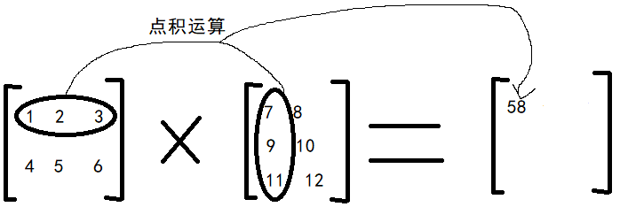
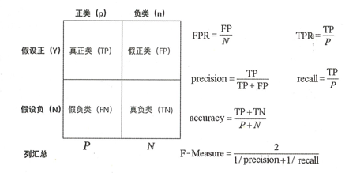
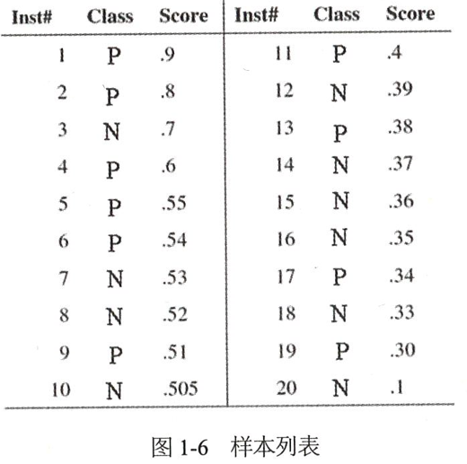
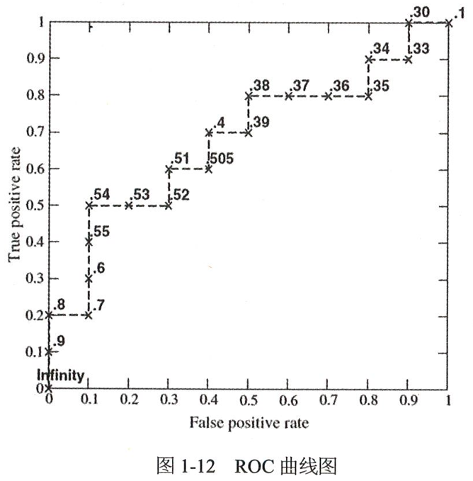

## 线性代数
### 1、向量点积
点积的结果是标量，点积的几何意义是$A$和$B$的模乘以二者余弦函数，意义是测量两个向量相同的程度。
$$
A\cdot B=\sum_{i=1}^{n}a_{i}b_{i}
$$
### 2、余弦相似度
通过向量的点积公式可以看出来，计算两个向量的点积，其实就是在计算两个向量的相似度。
余弦相似度的取值范围是$[-1, 1]$，值越大表示越相似。
$$
\cos \theta=\frac {A\cdot B} {\rvert\rvert A\rvert\rvert \times \rvert\rvert B \rvert\rvert}
$$
### 3、向量叉乘
两个向量的叉乘又叫向量积、外积、叉积。
叉乘的运算结果是一个向量，两个向量的叉乘结果与这两个向量组成的坐标平面垂直，又被称为法向量。
对于向量$a$和向量$b$：
$$
a = (x_1,y_1,z_1)\\
b = (x_2,y_2,z_2)
$$
向量$a$和向量$b$的叉乘公式为：
$$
a\times b=\begin{vmatrix} i&j&k\\x_1&y_1&z_1\\x_2&y_2&z_2 \end{vmatrix}=(y_1z_2-y_2z_1)i-(x_1z_2-x_2z_1)j+(x_1y_2-x_2y_1)k
$$
其中：
$$
i=(1,0,0)\quad j=(0,1,0)\quad k=(0,0,1)
$$
根据$i、j、k$间的关系，有：
$$
a\times b=((y_1z_2-y_2z_1),-(x_1z_2-x_2z_1),(x_1y_2-x_2y_1))
$$
### 4、矩阵乘法
矩阵相乘时。要求左矩阵的列数和右矩阵的行数一致。

$M\times K$维矩阵乘以$K\times N$维矩阵，其结果矩阵大小为$M\times N$。其中，结果矩阵的第i行第j列的值，等于左矩阵第i行的向量与右矩阵的第j列的向量的点积

### 5、矩阵点乘
矩阵进行点乘时要求矩阵维数必须相同，即$M\times N$维矩阵只能与$M\times N$维矩阵进行点乘，结果也是$M\times N$维矩阵，其值为两个矩阵对应未知上各元素相乘的结果。
### 6、内积/外积
线性代数中的内积和外积概念，与解析几何中的相关概念有所区别。

内积（Inner Product）是向量中对应位置的元素相乘，得到相同维数的向量。

外积（Outer Product）是线性代数中的张量积，与解析几何中的向量外积（Exterior Product）是不同的概念。
$$
u\otimes v=uv^T=\begin{bmatrix} u_1\\u_2\\u_3\\u_4 \end{bmatrix}\begin{bmatrix} v_1&v_2&v_3 \end{bmatrix}=\begin{bmatrix} u_1v_1&u_1v_2&u_1v_3\\u_2v_1&u_2v_2&u_2v_3\\u_3v_1&u_3v_2&u_3v_3\\u_4v_1&u_4v_2&u_4v_3 \end{bmatrix}
$$

## 概率与统计
概率论是用于表示不确定性声明（Statement）的数学框架。它不仅提供了量化不确定性的方法，也提供了用于导出新的不确定性声明的公理。
在机器学习领域，概率论主要用于两种用途。
首先，概法则告诉AI如何进行推理，据此可以设计一些算法来计算或者估算由概率论导出的表达式；
其次，可以用概率与统计方法从理论上分析AI系统的行为。
### 1、条件概率
设$A、B$是两个事件，且$P(A)>0$，称：
$$
P(B\rvert A)=P(AB)/P(A)
$$
为在事件$A$发生的条件下事件$B$发生的概率。

### 2、联合概率

多个事件同时发生的概率，联合概率公式。
$$
P(AB)=P(A)\times P(B\rvert A)
$$

### 3、边缘概率

单个事件的概率被称为边缘概率，如$P(A)$为事件$A$的边缘概率。

### 4、极大似然估计

首先介绍一下极大似然原理。假设有甲、乙两个箱子，甲箱子中有99个白球、1个黑球，乙箱子中有99个黑球、1个白球。在一次实验中取出1个黑球，请问：黑球是从哪个箱子里取出来的？人们的第一印象是，黑球最像从乙箱中取出来的，这个结论符合人们的经验，“最像”就是极大似然之一，这种想法被称为极大似然原理。

极大似然估计是建立在极大似然原理基础上的统计方法，是概率论在统计学中的应用。极大似然估计提供了一种给定观察数据来评估模型参数的方法，即“模型已定，参数未知”。通过若干次实验，观察其结果，利用实验结果得到某个能使样本出现的概率最大的参数值，则称其为极大似然估计。

由于样本集中的样本是独立分布，因此可以只考虑一类样本集$D$，以及估计参数向量$\theta$。已知的样本集为
$$
D=\{x_1,x_2,\dots,x_N\}
$$
似然函数（Likelihood Function）：莱讷河概率密度函数$P(D\rvert\theta)$被称为相对于$\{x_1,x_2,\dots,x_N\}$的$\theta$的似然函数
$$
l(\theta)=P(D\rvert\theta)=p(x_1,x_2,\dots,x_N\rvert\theta)=\prod_{i=1}^Np(x_i\rvert\theta)
$$
如果$\hat\theta$是参数空间中能使似然函数$l(\theta)$最大的$\theta$值，则$\hat\theta$应该是“最可能”的参数值，那么它就是$\theta$的极大似然函数估计值。它是样本的函数，记作：
$$
\hat\theta=d(x_1,x_2,\dots,x_N)=d(D)
$$
$\hat\theta(x_1,x_2,\dots,x_N)$被称作极大似然函数估计值。

### 5、分布函数

常见的分布函数如下表

| 分布     | 参数                | 数学期望    | 方差          |
| -------- | ------------------- | ----------- | ------------- |
| 0-1分布  | $0<p<1$             | $p$         | $p(1-p)$      |
| 二项分布 | $n\geqslant1,0<p<1$ | $np$        | $np(1-p)$     |
| 泊松分布 | $\lambda>0$         | $\lambda$   | $\lambda$     |
| 几何分布 | $o<p<1$             | $1/p$       | $(1-p)/p^2$   |
| 均匀分布 | $a<b$               | $(a+b)/2$   | $(b-a)^2/12$  |
| 指数分布 | $\lambda>0$         | $1/\lambda$ | $1/\lambda^2$ |
| 正态分布 | $M,\sigma>0$        | $\mu$       | $\sigma^2$    |

## 损失函数

损失函数（Loss Function）用于估计模型的预测值$f(x)$与真实值$Y$的不一致程度，它是一个非负实值函数，通常使用$L(Y,f(x))$来表示。损失函数越小，模型的健壮性就越好。损失函数是经验风险函数的核心部分，也是结构风险函数的重要组成部分。模型的结构风险函数包括经验项和正则项，通常可以表示成如下这样：
$$
\theta^*=argmin\frac {1} {N}\sum_{i=1}^NL(y_i,f(x_i;\theta_i))+\lambda\psi(\theta)
$$
其中，前面的均值函数表示的是经验风险安徽念书，$L$代表的是损失函数，后面的$\psi$是结构风险正则项，整个公式的意义就是我们需要用尽可能少的参数得到最准确的结果。

### 1、均方损失

最小二乘法是一种线性回归方法，它将回归问题转化凸优化问题。最小二乘法的基本原则是，最优拟合曲线应该使所有点到回归直线的距离和最小。通常用欧几里得祭礼进行距离的度量。均方损失安徽念书为：
$$
L(Y\rvert f(X))=\sum_N(Y-f(X))^2
$$

### 2、log对数损失函数

逻辑回归的损失函数就是对数损失函数，在逻辑回归的推导中，它假设样本服从伯努利分布（0-1分布），然后求得满足该分布的似然安徽念书，接着用对数求极值。逻辑回归并没有求对数似然函数的最大值，而是把极大值当作一个思想，进而推导它的风险系数啊含糊为最小化的负似然函数。log对数损失函数的标准形式如下：
$$
L(Y\rvert f(X))=-log P(Y\rvert X)
$$
在极大似然估计中，通常的执行步骤都是先取对数再求导，之后找极值点，这样做可方便计算极大似然估计值。损失函数$L(Y\rvert f(X))$指的是样本$X$在分类$Y$的情况下，使得概率$P(Y\rvert X)$达到最大值（利用已知的样本分布，找到最可能导致这种分布的参数值）。

### 3、制数损失函数

AdaBoost就是指数损失函数。指数损失函数的标准形式如下：
$$
L(Y\rvert f(X))=exp[-yf(x)]
$$

## 优化方法

优化问题指的是，给定目标函数$L(Y\rvert f(X))$，我们需要找到一组参数$X$使得$L(Y\rvert f(X))$的值最小。常见的优化方法主要包含两类：梯度法和牛顿法。其中梯度法包括梯度下降法（GD）、批量梯度下降法（BGD）、随机梯度下降法（SGD）、动量、Nesterov动量、AdaGrad、Adam等，而牛顿法包括牛顿法、共轭梯度法、有限内存拟牛顿法等。

### 1、SGD

随机梯度下降（SGD）的第k次训练迭代的更新：
::: info SGD
Require：学习率$\epsilon$

Require：初始参数$\theta$

> While 没有达到停止条件 do
> 
> > 从训练集中采集包含m个样本$\{x^{(1)},\dots,x^{(m)}\}$的小批量集合，$x^{(i)}$对应的目标为$y^{(i)}$。
> > 
> > 计算梯度估计：$\hat g\leftarrow+\frac{1}{m}\triangledown_{\theta}\sum_iL(f(x^{(i)};\theta),y^{(i)})$
> > 
> > 应用更新： $\theta\leftarrow\theta-\epsilon g$

end while
:::

### 2、动量

使用动量（Momentum）的梯度下降（SGD）在第k次训练迭代的更新：

::: info 动量
Require：学习率$\epsilon$，初始速度$\alpha$

Require：初始参数$\theta$，初始速度$v$

> While 没有达到停止条件 do
>
> > 从训练集中采集包含m个样本$\{x^{(1)},\dots,x^{(m)}\}$的小批量集合，$x^{(i)}$对应的目标为$y^{(i)}$。
> >
> > 计算梯度估计：$\hat g\leftarrow+\frac{1}{m}\triangledown_{\theta}\sum_iL(f(x^{(i)};\theta),y^{(i)})$
> >
> > 计算速度更新：$v\leftarrow \alpha v-\epsilon g$
> >
> > 应用更新： $\theta\leftarrow\theta+v$

end while
:::

特点：动量是模拟物理里的概念，通过积累动量来作为梯度使用。Momentum项能够在相关方向加速SGD。抑制振荡，从而加快收敛，比如在下降初期，如果下降的方向一致，则能够通过v进行加速；而在下降中后期，当局部最小值来回振荡的时候，能够通过v跳出陷阱（因为g趋近于0，可以通过v值跳出）。

### 3、Nesterov动量

使用Nesterov动量的梯度下降（SGD）在第k次训练迭代的更新：

::: info Nesterov动量
Require：学习率$\epsilon$，初始速度$\alpha$

Require：初始参数$\theta$，初始速度$v$

> While 没有达到停止条件 do
>
> > 从训练集中采集包含m个样本$\{x^{(1)},\dots,x^{(m)}\}$的小批量集合，$x^{(i)}$对应的目标为$y^{(i)}$。
> >
> > 应用临时更新：$\hat\theta\leftarrow\theta+\alpha v$
> >
> > 计算梯度估计：$\hat g\leftarrow+\frac{1}{m}\triangledown_{\theta}\sum_iL(f(x^{(i)};\theta),y^{(i)})$
> >
> > 计算速度更新：$v\leftarrow \alpha v-\epsilon g$
> >
> > 应用更新： $\theta\leftarrow\theta+v$

end while
:::

特点：Nesterov动量项在梯度更新时会做一个校正，以避免前进太快，同时提高灵敏度。Momentum项和Nesterov项都是为了使梯度下降更新更灵活，只是会通过人工指定不同的规则，使对不同情况有比较好的针对性。

### 4、AdaGrad

使用AdaGrad算法在k次训练迭代的更新：

::: info AdaGrad
Require：学习率$\epsilon$，初始速度$\alpha$

Require：初始参数$\theta$，初始速度$v$

Require：小常数$\delta$，为了使数值稳定，大约设为$10^{-7}$

初始化梯度累积变量r=0

> While 没有达到停止条件 do
>
> > 从训练集中采集包含m个样本$\{x^{(1)},\dots,x^{(m)}\}$的小批量集合，$x^{(i)}$对应的目标为$y^{(i)}$。
> >
> > 计算梯度估计：$\hat g\leftarrow+\frac{1}{m}\triangledown_{\theta}\sum_iL(f(x^{(i)};\theta),y^{(i)})$
> >
> > 累积平方梯度：$r\leftarrow r+g\odot g$
> >
> > 计算更新：$\triangle\theta\leftarrow - \frac {\epsilon} {\delta+\sqrt{r}}\odot g$（根据自适应学习率进行更新）
> >
> > 应用更新： $\theta\leftarrow\theta+\triangle\theta$

end while
:::

特点：AdaGrad其实是对学习率进行了约束，比如，当期g较小的时候，正则项较大，能够放大梯度；当后期g较大的时候，正则项较小，能够约束梯度。AdaGrad适合处理稀疏梯度，AdaGrad对全局学习率参数比较敏感。

### 5、Adam

使用Adam算法在第k次训练迭代的更新：

::: info Adam
Require：步长$\epsilon$

Require：矩估计的指数衰减速率，$\rho_1$和$\rho_2$在区间[0, 1]内（默认值是0.9和0.999）

Require：用户数值稳定的小常数$\delta$（默认值为$10^{-8}$）

Require：初始参数$\theta$

初始化一阶和二阶矩变量s=0、r=0

初始化时间步长t=0

> While 没有达到停止条件 do
>
> > 从训练集中采集包含m个样本$\{x^{(1)},\dots,x^{(m)}\}$的小批量集合，$x^{(i)}$对应的目标为$y^{(i)}$。
> >
> > 计算梯度估计：$\hat g\leftarrow+\frac{1}{m}\triangledown_{\theta}\sum_iL(f(x^{(i)};\theta),y^{(i)})$
> >
> > $t\leftarrow t+1$
> >
> > 更新有偏一阶矩估计：$s\leftarrow\rho_1s+(1-\rho_1)g$
> >
> > 更新有偏二阶矩估计：$s\leftarrow\rho_2s+(1-\rho_2)g\odot g$
> >
> > 修正一阶矩阵的偏差：$s\leftarrow\frac{s}{1-\rho_1^t}$
> >
> > 修正二阶矩阵的偏差：$\hat r\leftarrow\frac{s}{1-\rho_2^t}$
> >
> > 计算更新：$\triangle\theta\leftarrow - \epsilon\frac {\hat s} {\sqrt{\hat r}+\delta}$（逐元素应用操作）
> >
> > 应用更新： $\theta\leftarrow\theta+\triangle\theta$

end while
:::

特点：Adam算法会通过梯度的一阶矩估计和二阶矩估计动态调整每个参数的学习率。Adam的主要优点在于，经过偏置校正后，每一次迭代学习率都有确定的范围，使得参数值比较平稳。Adam对内存需求较小，适用于大数据集和高维空间，也适用于大多数非凸优化，是深度学习中比较常用的优化方法。

### 6、L-BFGS

目标为$J(\theta)=\frac{1}{m}\sum_{i=1}^mL(f(x^{(i)};\theta),y^{(i)})$的牛顿法在第k次训练迭代的更新：

::: info L-BFGS

Require：初始参数$\theta$

Require：包含m个样本的训练集

初始化梯度累积变量r=0

> While 没有达到停止条件 do
>
> > 从训练集中采集包含m个样本$\{x^{(1)},\dots,x^{(m)}\}$的小批量集合，$x^{(i)}$对应的目标为$y^{(i)}$。
> >
> > 计算梯度：$\hat g\leftarrow+\frac{1}{m}\triangledown_{\theta}\sum_iL(f(x^{(i)};\theta),y^{(i)})$
> >
> > 计算Hessian矩阵：$H\leftarrow+\frac{1}{m}\triangledown^2_{\theta}\sum_iL(f(x^{(i)};\theta),y^{(i)})$
> >
> > 计算Hessian逆：$H^{-1}$
> >
> > 计算更新：$\triangle\theta\leftarrow - H^{-1}g$（根据自适应学习率进行更新）
> >
> > 应用更新： $\theta\leftarrow\theta+\triangle\theta$

end while
:::

Broyden-Fletcher-Goldfarb-Shanno（BFGS）算法和存储受限的BFGS（或L-BFGS）算法是对牛顿法的优化。

特点：牛顿法的核心思想是“利用函数在当前点的一阶导数及二阶导数，寻找搜寻方向”（梯度下降法只用了当前点的一阶导数信息决定搜索方法）；L-BFGS算法比较适用于大规模的数值计算，其具备牛顿法收敛速度快的特点，但不需要像，但不需要像牛顿法那样存储Hessian矩阵，因此节省了大量的空间及计算资源。

### 7、梯度法和牛顿法的比较

梯度法和牛顿法的比较：牛顿法是二阶收敛，梯度法是一阶收敛，所以牛顿法更快，当然牛顿法的计算代价也比梯度法高。

牛顿法的主要缺点如下：其对初始值有一定的要求。在非凸优化问题（如神经网络训练）中，牛顿法很容易陷入鞍点（牛顿法的步长会越来越小），而梯度下降法则很容易逃离鞍点（梯度下降法在靠近最优点的时会振荡，这时候可以采用像Adam自适应学习率的方法跳出鞍点），因此在神经网络训练中一般使用梯度下降法（因为高维空间的神经网络中存在大量的鞍点），牛顿法常用于类似逻辑回归的优化方法中。

## 评价方法

个性化推荐就是计算出用户对物品的评分排序，对于这个排序结果及的评价是，我们能否把用户想要点积的物品尽可能地排在前面。对于推荐系统，我们常用混淆矩阵和ROC曲线来评价用户地排序结果集。

### 1、混淆矩阵

混淆矩阵（Confusion Matrix）是可视化方法，属于监督学习。其主要用于比较分类结果和实际预测值，并可以把分类结果地精度显示在一个混淆矩阵中。

混淆矩阵是除ROC曲线和AUC之外地另一个判断分类好坏程度地方法，矩阵地每一列表达了分类器对于样本地类别预测，矩阵地每一行表达了版本所属地真实类别。

下面为基本概念：

- 真正类（True Positive，简称TP）：示例是正类并且被预测成正类。

- 假正类（False Positive，简称FP）：实例是负类并且被预测成正类。

- 真负类（True Negative，简称TN）：实例是负类并且被预测成负类。

- 假负类（False Negative，简称FN）：实例是正类并且被预测成负类。

- TPR：在所有实际为正类地样本中，被正确地判断为正类地比率。
  $$
  TPR=\frac{TP}{TP+FN}
  $$

- FPR:在所有实际为负类地样本中，被错误地判断为正类地比率。
  $$
  FPR=\frac{FP}{FP+TN}
  $$
  

根据混淆矩阵可以计算以下分类指标：

- 精确度，$precision=TP/(TP+FP)$

  模型判为正的所有样本中有多少真正的正样本

- 召回率，$recall=TP/P$

  真正的正样本被预测准确的比例

- 综合评价指标（F-Measure）

  P和R指标有时候会出现矛盾的情况，这时候就需要对它们进行综合考虑，最常见的方法就是F-Measure（又称为F-Score）
  $$
  F=\frac{(\alpha^2+1)P\times R}{\alpha^2(P+R)}
  $$
  

  F-Measure是precision和recall的加权调和平均数，当参数$\alpha=1$时，就是最常见的$F_1$，即：
  $$
  F_1=\frac{2\times P\times R}{P+R}
  $$
  可知$F_1$综合了P和R的结果，当$F_1$较高时则说明实验方法比较有效。

### 2、ROC曲线

ROC的全名叫做Receiver Operating Characteristic，其主要分析工具是画在二维平面上的曲线——ROC曲线。平面的横坐标是False Positive Rate（FPR），纵坐标是True Positive Rate（TPR）。对于某个分类器而言，我们可以根据其在测试样本上的表现得到一个TPR和FPR点对。这样，次分类器就可以映射成ROC平面的一个点。通过调整这个分类器分类时使用的阈值，我们就可以得到一个经过$(0,1)$和$(1,1)$的曲线，这就是此分类器的ROC曲线。一般情况下，这个曲线都应该处于$(0,1)$和$(1,1)$的连线的上方。如果得到一个位于直线下方的分类器的话，可以将预测结果反向，即分类器输出结果为正类，则最终分类的结果为负类；反之，则为正类。

可以用ROC曲线来表示分类器的性能，可是，人们总是希望能有一个数值来衡量分类器的好坏。于是Area Under Roc Curve（AUC）就出现了，AUC的值就是处于ROC曲线下方的部分面积的大小。通常，AUC的值介于0.5到1.0之间，较大的AUC值代表了较好的性能。

举例：

下图中有10个正类和10个负类的样本，按照预测值Score降序排列。

这里选取当前样本的Score值作为阈值进行分类，即预测Score以上为预测正类，否则为预测负类，然后计算FPR和TPR，这里按照样本的Score降序排列后依次画图。

首先开始画初始点$(0,0.0)$,然后从第一个样本点开始，Score值为0.9，大于或等于0.9以上的Score预测为正样本，否则为负样本，得到$FPR=0/10=0$和$TPR=1/10=0.1$，在ROC曲线上画第二个点$(0,0.1)$

以此类推，可以画出所有的点。

​	ROC曲线最理想的情况就是，按照Score值降序排列样本，TPR值从0开始逐步增加1.0，而FPR值保持为0，意思是前面都是预测为正样本且是正类样本，在TPR为1.0后，后面的FPR从0开始逐步增加到1.0，而TPR保持1.0，意思是后面都是预测为负样本且是负类样本，最终该ROC曲线下的面积就是单位面积1，所以AUC为1.

ROC曲线最糟糕的情况就是，ROC曲线是从0到1的一条直线，意思是FPR和TPR在每次划分时都相等，这时ROC曲线下的面积就是0.5，所以AUC为0.5.
