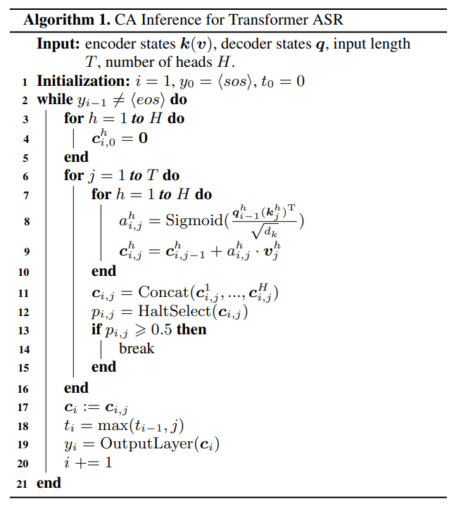
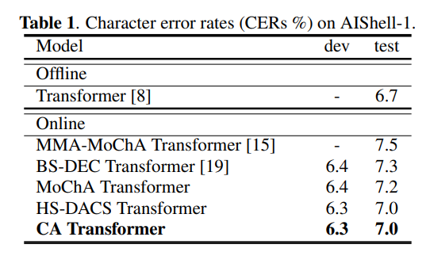
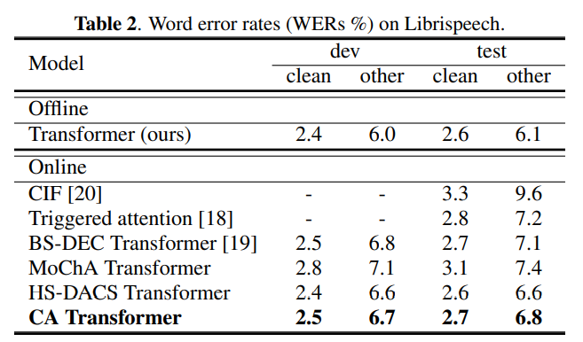
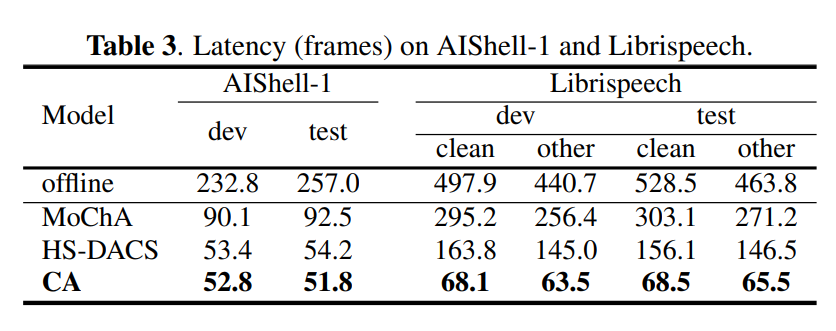
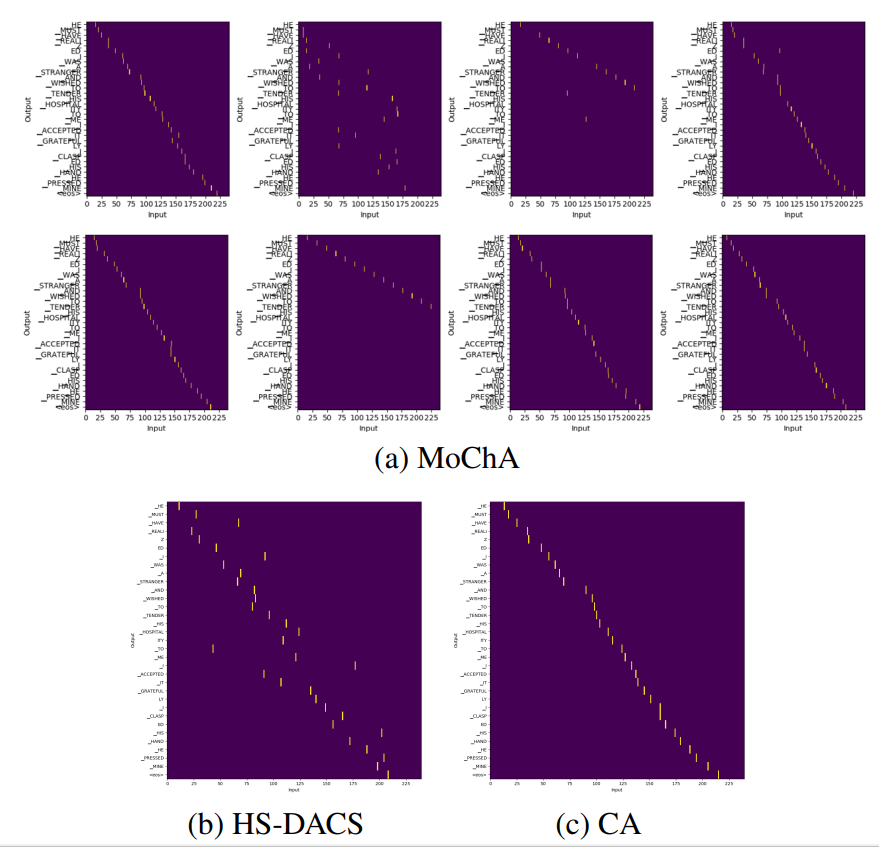

# Transformer-Based Streaming ASR with Cumulative Attention

基于 Transformer 的具有累积注意力的流式 ASR，[论文](https://export.arxiv.org/pdf/2203.05736v1)机翻版本，只保证公式块正确。

Mohan Li, Shucong Zhang, Catalin Zorila and Rama Doddipatla Cambridge Research Laboratory, Toshiba Europe Ltd, Cambridge, UK End-to-end ASR, Transformer, online attention

## Abstract

在本文中，我们提出了一种在线注意力机制，称为累积注意力（CA），用于基于 Transformer 的流式自动语音识别（ASR）。受单调分块注意力 (MoChA) 和头同步解码器端自适应计算步骤 (HS-DACS) 算法的启发，CA 根据每个编码时间步长积累的声学信息触发 ASR 输出，其中决策是使用可训练设备，称为停止选择器。在CA中，同一解码器层的所有注意力头被同步以具有统一的停止位置。此功能有效地缓解了由各个头的不同行为引起的问题，否则可能会导致 MoChA 遇到的严重延迟问题。在 AIShell-1 和 Librispeech 数据集上进行的 ASR 实验表明，与文献中的其他流式 Transformer 系统相比，所提出的基于 CA 的 Transformer 系统可以实现同等或更好的性能，并且推理过程中的延迟显着减少。

## Introduction

近年来，ASR 社区见证了端到端 (E2E) 系统开发的激增，与传统的基于隐马尔可夫模型 (HMM) 的系统相比，这些系统表现出较低的计算复杂性和具有竞争力的性能。对于端到端 ASR，声学模型（AM）、词典和语言模型（LM）被集成到一个整体网络中，并且可以在没有任何先验知识的情况下进行优化。 E2E技术通常可以分为三类，即连接主义时间分类（CTC）[1, 2]、循环神经网络传感器（RNN-T）[3]和基于注意力的编码器-解码器框架[4, 5, 6]。作为上一课的缩影，Transformer [7] 继在自然语言处理（NLP）领域取得压倒性成功后被引入 ASR。因此，许多标准 ASR 任务都报告了最先进的性能 [8]。支持 Transformer 架构的自注意力机制很快取代了 RNN 在声学和语言建模方面的主导作用，导致了 Speech Transformer [9]、Transformer Transducer [10, 11] 和 Transformer-XL [ 12]。与按时间顺序处理输入的 RNN 结构不同，自注意力模块捕获任意距离的元素之间的相关性，这有效地解除了长期依赖带来的限制。

尽管 Transformer 相对于基于 RNN 的系统表现出了显着的优势，但它在在线 ASR 方面面临着重大困难。编码器和解码器都需要访问完整的语音，导致较大的延迟，从而限制了实际场景的使用。在本文中，我们重点关注解码器中的流策略，以解决识别中的延迟问题。此前，以下方法已被提出，并被证明对流式 Transformer 架构有效：（1）硬单调注意机制，以单调分块注意（MoChA）[13,14,15]及其简化变体单调截断为代表注意（MTA）[16, 17]； （2）受CTC技术流式特征的启发，触发注意力（TA）[18]将CTC分数的峰值作为计算注意力权重的边界； （3）分块同步推理[19]对每个输入块独立执行标准注意，并将损坏的解码器状态延续到后续块； (4) 连续积分和激发 (CIF) [20]，以及解码器端自适应计算步骤 (DACS) [21] 及其头同步版本 (HS-DACS) [22] 将在线解码解释为参与置信度的累积过程，当累加器超过预定阈值时停止。

在上述流媒体方法中，MoChA 得到了广泛认可，它将 ASR 解码视为单调参与过程。输出在其声学端点周围发出。然而，MoChA 中的输出决策仅依赖于单个帧，增加了在复杂语音条件下意外触发的可能性。除此之外，在多头 Transformer 的背景下，某些头可能无法捕获有效的注意力，并且无法在到达语音结尾之前截断解码。 HS-DACS 通过以下方式规避了 MoChA 的问题：（i）将基于单帧激活的决策转变为参与信心的积累； (ii)合并停止概率以为解码器层中的所有注意力头产生相同的停止位置。尽管如此，仍然不能保证有足够的置信度来触发输出，并且引入了最大前瞻步骤形式的附加停止标准。

为了克服MoChA和HS-DACS遇到的上述问题，论文提出了累积注意力（CA）算法。基于 CA 的注意力头沿着每个编码时间步共同积累声学信息，一旦可训练设备认为积累的信息足够，就会触发 ASR 输出。所提出的算法不仅将多个帧纳入声学感知决策中，而且在每个解码步骤中为解码器层中的所有头实现统一的停止位置。

本文的其余部分组织如下：第 2 部分介绍了 Transformer ASR 的架构和一些在线注意力方法。第 3 节详细阐述了所提出的 CA 算法的工作流程。第 4 节展示了实验结果。最后，第 5 节得出结论。

## Streaming Transformer ASR System

典型的基于 Transformer 的 ASR 系统由三个组件组成：前端、编码器和解码器。前端通常作为卷积神经网络（CNN）实现，旨在增强声学特征提取并降低帧速率。 CNN 前端的输出进入一堆编码器层，每个编码器层由两个子层组成，作为多头自注意力模块和逐点前馈网络 (FFN)。解码器还堆叠了多个层，并且具有与编码器类似的架构，除了与编码器状态交互的附加交叉注意力子层之外。

Transformer 架构中的注意力模块采用点积注意力机制来建模语音间和语音到文本的依赖关系：
$$
\mathrm{Attention}(\mathbf{Q},\mathbf{K},\mathbf{V})=\mathrm{softmax}( \frac{\mathbf{Q}\mathbf{K}^{\mathrm{T}}}{\sqrt{d_{k}}})\mathbf{V}, \tag{1}
$$
其中$\mathbf{Q},\mathbf{K},\mathbf{V}\in\mathbb{R}^{T/L\times d_{k}}$表示自注意力中的编码器/解码器状态子层，或 $\mathbf{Q}\in\mathbb{R}^{L\times d_{k}}$ 表示解码器状态，$\mathbf{K},\mathbf{V}\in\mathbf{R}^{T\times d_{k}}$ 表示交叉注意力子层中的编码器状态，给定 $d_{k}$ 作为注意力维度，$T$, $L$ 作为长度分别是编码器和解码器状态。

Transformer 架构的强大之处还源于在每个子层利用多头注意力，其中头将原始信号投射到各个特征空间中，以便从各个方面捕获序列依赖性：
$$
\mathrm{MultiHead}(\mathbf{Q},\mathbf{K},\mathbf{V})=\mathrm{Concat}( \mathrm{head}_{1},...,\mathrm{head}_{H})\mathbf{W}^{O}, \tag{2}
$$

$$
\mathrm{where}\ \mathrm{head}_{h}=\mathrm{Attention}(\mathbf{Q}\mathbf{W}_{h}^ {Q},\mathbf{K}\mathbf{W}_{h}^{K},\mathbf{V}\mathbf{W}_{h}^{V}), \tag{3}
$$

其中 $\mathbf{W}_{h}^{Q,K,V}\in\mathbb{R}^{d_{h}\times d_{h}}$ 和 $\mathbf{W}^{ O}\in\mathbb{R}^{d_{m}\times d_{m}}$表示投影矩阵，$H$是给定时的注意力头数量$d_{m}=H\times d_{h}$。

对于流式 ASR 系统，Transformer 面临的主要挑战是它需要完整的语音来执行注意力计算。在编码器端，克服这个问题的一个相对简单的方法是将输入特征拼接成重叠的块，并按顺序将它们输入系统[17]。然而，这种策略不能应用于解码器端，因为 ASR 输出的注意力边界可能不限于单个块内。因此，提出了几种在线注意力机制。单调分块注意力（MoChA）是解决该问题的第一个方法。在解码期间，针对每个编码器状态单调地做出参与决策。一旦关注到某个时间步长，就会在一小块内进行第二次软关注，以作为层结果。后来提出了头同步解码器端自适应计算步骤（HS-DACS），以利用历史帧并更好地处理注意力头的独特性能。停止概率是沿着所有磁头的编码器状态产生和累积的，并且当累积达到阈值时触发输出。在下一节中，我们将介绍累积注意力 (CA) 算法，该算法结合了 MoChA 的声学感知决策和 HS-DACS 的头部同步能力。

## Proposed Cumulative Attention Algorithm

根据[15]中提出的调查，较低的 Transformer 解码器层往往会捕获噪声和无效的注意力，这对一般解码尤其是流媒体场景不利。类似地，我们采用层丢弃策略，将所提出的 CA 算法仅应用于顶部解码器层的交叉注意模块。同时，其余层仅配备自注意力模块并执行语言建模。某个解码步骤$i$的算法的工作流程描述如下。

与所有其他在线注意力机制一样，在头部 $h$ 处，对于每个编码时间步 $j$，在给定最后一个解码器状态 $\boldsymbol{q}_{i-1}^{h}$ 的情况下计算注意力能量 $e_{i,j}^{h}$ 和编码器状态 $\boldsymbol{k}*{j}^{h}$：
$$
e_{i,j}^{h}=\frac{\boldsymbol{q}_{i-1}^{h}(\boldsymbol{k}_{j}^{h})^{T}}{\sqrt{d _{k}}}. \tag{4}
$$
能量立即输入 sigmoid 单元以产生单调注意力权重：
$$
a_{i,j}^{h}=\mathrm{Sigmoid}(e_{i,j}^{h}). \tag{5}
$$
sigmoid 单元被认为是流情况下 softmax 函数的有效替代方案，它将能量缩放到 (0, 1) 范围，而无需访问整个输入序列。与 MoChA 和 HS-DACS 不同，其中等式的结果为： (5) 直接解释为指示输出触发的参与/停止概率，CA 将其解释为编码器状态与当前解码步骤的相关性。这与离线系统中的标准注意力机制或 MoChA 中执行的第二遍注意力相同。

接下来，以自回归方式在 $j$ 生成临时上下文向量：
$$
\boldsymbol{c}_{i,j}^{h}=\boldsymbol{c}_{i,j-1}^{h}+a_{i,j}^{h}\cdot \boldsymbol{v}_{i,j}^{h}, \tag{6}
$$
它携带了当前时间步累积的所有已处理的声学信息（当$j=1$时，术语$\boldsymbol{c}_{i,j-1}^{h}$被丢弃）。尽管 HS-DACS 以类似的方式在每个解码步骤执行累加，但它是针对停止概率而不是声学信息。

受 HS-DACS 的启发，为了迫使所有注意力头停在同一位置，不同头产生的临时上下文向量被连接成一个综合向量：
$$
\boldsymbol{c}_{i,j}=\text{Concat}(\boldsymbol{c}_{i,j}^{1},\dots,\boldsymbol{c}_{i,j}^{H}).\tag{7}
$$
我们引入了一种可训练的设备，称为停止选择器，以确定是否在每个时间步触发 ASR 输出，该设备在我们的系统中被实现为输出维度为 1 的单层/多层深度神经网络（DNN）。然后将 $c_{i,j}$ 输入到 DNN 来计算停止概率：
$$
\boldsymbol{p}_{i,j}=\text{Sigmoid}(\text{HaltSelect}(\boldsymbol{c}_{i,j})+\boldsymbol{r}+\epsilon),\tag{8}
$$
它表示在时间步 $j$ 停止 $i^{th}$ 解码步骤的可能性，前提是所有注意力头到目前为止都积累了声学特征。参数 $r$ 表示初始化为 -4 的偏差项，$\epsilon$ 是仅应用于训练的加性高斯噪声，以鼓励 $p_{i,j}$ 的谨慎性。

在这里，人们可能会注意到 CA 和其他流媒体方法之间的主要区别。在 CA 算法中，首先计算临时上下文向量，然后根据该向量激活 ASR 输出。而对于 MoChA 和 HS-DACS，首先做出参与决策，然后生成最终的上下文向量。如果决策不恰当，则相应的上下文向量可能包含对解码器无效的声学信息。

由于停止选择器分配硬决策，使系统参数不可微，因此训练需要通过边缘化所有可能的停止位置来获取 $c_{i}$ 的期望值。因此，停止假设的分布如下：
$$
\boldsymbol{\alpha}_{i,j}=\boldsymbol{p}_{i,j}\prod_{k=1}^{j-1}(1-\boldsymbol{p}_{i,k}),\tag{9}
$$
这是 MoChA [13] 中计算的对应部分的简化版本。最后，解码步骤 $i$ 的预期上下文向量计算如下：
$$
\boldsymbol{c}_{i}=\sum_{j=1}^{T}\boldsymbol{\alpha}_{i,j}\cdot\boldsymbol{c}_{i,j}.\tag{10}
$$
值得注意的是，HS-DACS 在训练中不会计算这样的期望，因为累积会被预设阈值截断，并且仅导出一个最佳上下文向量。

在 CA 推理期间，$p_{i,j}$ 在每个时间步从 $j = 1$ 开始单调计算，并且解码步骤 $i$ 将在最早的 $j$ 处停止，其中 $p_{i,j} \geqslant 0.5$。选择相应的临时上下文向量 $c_{i,j}$ 并将其发送到输出层以预测 ASR 输出。上述推理过程的伪代码如算法1所示。

应该意识到，虽然 CA 算法在单个时间步上采用伯努利采样过程，类似于 MoChA 的做法，但停止决策是基于整个编码历史的。与 MoChA 中各个头检测单独的停止位置不同，在 CA 中，所有注意力头同时对 $c_{i,j}$ 做出贡献并具有统一的停止位置。这使得它不易受到单帧干扰的影响。此外，CA 排除了像 HS-DACS 中那样使用任意累积阈值，允许在弱注意力场景下灵活地停止解码。

## EXPERIMENTS

### Experimental setup

所提出的 CA 算法已在 AIShell-1 中文任务和 Librispeech 英语任务上进行了评估。遵循 ESPNet 工具包 [23] 中的标准配方，将语音扰动应用于 AIShell-1，并在 Librispeech 上进行 SpecAugment [24]。声学特征是 80 维滤波器组系数以及 3 维音调信息。上述数据集的词汇量分别为 4231 个汉字和 5000 个 BPE 标记化单词片段 [25]。

两个任务都采用类似的 Transformer 架构。前端由 2 个 CNN 层组成，每个层有 256 个内核，宽度为 3 × 3，步长为 2 × 2，帧速率降低了 2 倍。为了处理在线输入，12层编码器采用如[17]中的分块流策略，其中左、中、右块的大小为{64,64,32}帧。在每个编码器层，AIShell-1 的头数、注意力维度和 FFN 单元大小为 {4, 256, 2048}，Librispeech 为 {8, 512, 2048}。系统的解码器堆叠了 6 个层，每个任务的参数与编码器相同，并且停止选择器中只有 1 个 DNN 层。

在训练过程中，联合CTC/注意力损失用于多目标学习，权重$λ_{CTC}$ = 0.3。两个任务的学习率 (lr) 均遵循 Noam 权重衰减方案 [7]，其中 AIShell-1 的初始 lr、预热步骤和历元数设置为 {1.0, 25000, 50} 和 {5.0, 25000, 120}对于 Librispeech。就推理而言，CTC 联合解码的执行方式为：AIShell-1 的 $λ_{CTC}$ = 0.3，Librispeech 的 $λ_{CTC}$ = 0.4。结合使用训练集文本训练的外部 LM 来对系统解码的波束搜索（波束宽度 = 10）假设进行重新评分，其中 LM 是一个 650 个单元的 2 层长短期记忆 (LSTM) 网络，分别用于 AIShell-1 和 Librispeech 的 2048 个单元的 4 层 LSTM。

### Experimental results

表 1 和表 2 分别从字符错误率 (CER) 和单词错误率 (WER) 方面展示了所提出的系统在 AIShell-1 和 Librispeech 数据集上的 ASR 性能。选择的参考系统具有类似的 Transformer 架构、输入块大小和外部 LM。此外，为了与 CA 进行公平比较，基于 MoChA 和 HS-DACS 的系统都仅使用一个交叉注意力层（$D=1$）进行训练，除了 Librispeech 上的 HS-DACS 具有三个交叉注意力层（$D= 3$，因为 $D=1$ 或 2 的模型未能很好地收敛）。

我们观察到，在这两项任务上，CA 系统都比文献中的其他系统取得了更好的准确性。对于再现的MoChA和HS-DACS模型，在AIShell-1上，与MoChA相比，CA获得了2.8%的相对增益，与HS-DACS的性能相似。就 Librispeech 而言，CA 在干净和噪声条件下均优于 MoChA，相对增益分别为 16.1% 和 10.8%。此外，鉴于 CA 系统中使用的交叉注意层较少，CA 仍然实现了与 HS-DACS 相当的 WER。

### Latency measurement

还与 MoChA 和 HS-DACS 一起测量了所提出的算法的推理延迟。这里我们采用[26]中定义的语料库级延迟，其计算为停止位置所在的右输入块 $\hat{b}*{i}^{k}$ 边界之间的差异，以及通过HMM强制对齐得到的输出token $b*{i}^{k}$的实际边界：
$$
\triangle_{corpus}=\frac{1}{\sum_{k=1}^{N}|\mathbf{y}^{k}|}\sum_{k=1}^{N}\sum_{i= 1}^{|\mathbf{y}^{k}|}(\hat{b}_{i}^{k}-b_{i}^{k}), \tag{11}
$$
其中 $N$ 表示数据集中的话语总数，$|\mathbf{y}^{k}|$ 是每个话语中输出标记的数量。由于假设序列中可能存在 ASR 错误，从而导致延迟计算错误，因此我们在上式中仅包含 $\hat{b}*{i}^{k}$ 正确解码的标记。尽管这可能会导致等式中的分母不同。 (11) 考虑到三个系统实现的 ASR 精度相似，延迟的比较仍然是合理的。此外，由于我们实验中的所有在线注意力机制都是在每个解码步骤中独立执行的，因此不能保证停止位置是单调的。因此，在计算延迟时，$\hat{b}*{i}^{k}$ 始终与解码过程中见过的最远时间步同步（参见算法 1 第 18 行）。

表 3 列出了在 AIShell-1 和 Librispeech 数据集上评估的基于 MoChA、HS-DACS 和 CA 的系统的延迟水平。为了与 CA 进行公平比较，在 MoChA 和 HS-DACS 中，在解码过程中未应用最大前瞻步骤 ($M$)。在 AIShell-1 上，我们观察到与离线系统相比，两个系统的延迟水平似乎是合理的，而在 Librispeech 上，我们注意到延迟水平接近离线系统，因为冗余头无法吸引有效的注意力。为了减少延迟，仅在 Librispeech 任务的识别过程中施加最大前瞻步骤 $M=16$。可以观察到，在 AIShell-1（没有 $M$）和 Librispeech（有 $M$）上，CA（没有 $M$）比 MoChA 和 HS-DACS 实现了更好的延迟水平。

MoChA 和 HS-DACS 给出的较差延迟性能可以通过查看各个头生成 ASR 输出的停止决策来解释，如图 1 所示。可以从图 1 (a) 中观察到，头 2、 MoChA 中的 3 和 6 大多无法停止解码，必须依赖于最大前瞻步骤执行的截断。类似地，在图1（b）中，在某些解码步骤中，HS-DACS头中停止概率的累积未能超过联合阈值（头数，8），使得推理过程在早期阶段到达语音结尾。另一方面，CA 的停止决策是单调且总是及时做出的，如图 1（c）所示。虽然 CA 也可能有冗余磁头，但这些磁头可以由其他功能磁头支持，因为所有磁头都是同步的，并且停止决策基于整体声学信息。

## Conclusion

该论文提出了一种新颖的在线注意力机制，称为流式 Transformer ASR 的累积注意力（CA）。 CA 算法结合了声学感知方法 (MoChA) 和基于累积的方法 (HS-DACS) 的优点，利用称为停止选择器的可训练设备来确定稳健的停止位置以触发 ASR 输出。 CA 层中的注意力头被同步以在解码器层中产生统一的停止位置。通过这样做，所有头部同时为潜在的 ASR 输出做出贡献，从而有效地缓解了头部不同行为引起的问题。 AIShell-1 和 Librispeech 上的实验表明，与文献中的现有算法相比，所提出的 CA 方法实现了相似或更好的 ASR 性能，并且在推理过程中延迟显着增加。

图 1：流式 Transformer 系统中在线注意力头给出的 ASR 输出的单独/联合停止决策。
