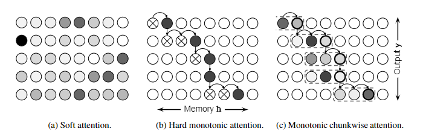
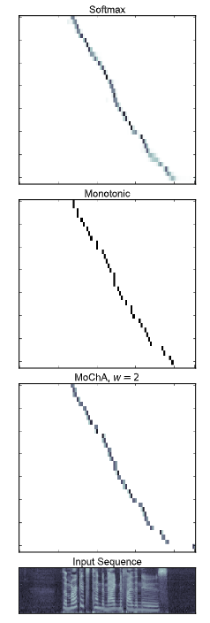
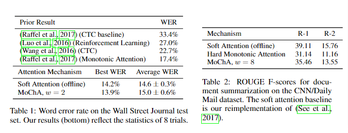
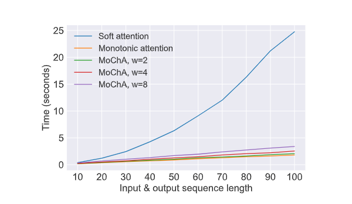
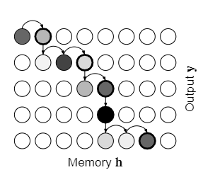

# Monotonic Chunkwise Attention

单调分块注意力，[论文](https://export.arxiv.org/pdf/1712.05382v2)的机器翻译文档，只能确保公式块\模块顺序和图的正确。

Chung-Cheng Chiu & Colin Raffel\Google Brain\Mountain View, CA, 94043, USA\{chungchengc,craffel}@google.com\Equal contribution.

## Abstract

具有软注意力的序列到序列模型已成功应用于各种问题，但其解码过程会产生二次的时间和空间成本，并且不适用于实时序列转换。为了解决这些问题，我们提出了单调分块注意力（MoChA），它自适应地将输入序列分割成小块，在这些小块上计算软注意力。我们证明，利用 MoChA 的模型可以通过标准反向传播进行有效训练，同时允许在测试时进行在线和线性时间解码。当应用于在线语音识别时，我们获得了最先进的结果，并与使用离线软注意机制的模型的性能相匹配。在我们不期望单调对齐的文档摘要实验中，与基于基线单调注意的模型相比，我们表现出显着提高的性能。

## 1 Introduction

具有软注意机制（Bahdanau et al., 2015）的序列到序列模型（Sutskever et al., 2014; Cho et al., 2014）已成功应用于大量序列转导问题（Luong et al., 2015）。 ，2015；Xu 等，2015；Chorowski 等，2015；Wang 等，2017；参见等，2017）。这些模型以最熟悉的形式，使用编码器递归神经网络 (RNN) 处理输入序列，以产生一系列隐藏状态，称为记忆。然后，解码器 RNN 自回归生成输出序列。在每个输出时间步，解码器直接受到注意机制的调节，该机制允许解码器引用编码器隐藏状态序列中的条目。将编码器的隐藏状态用作存储器使模型能够桥接较长的输入输出时间滞后（Raffel & Ellis，2015），这比缺乏注意机制的序列到序列模型具有明显的优势（Bahdanau 等人）等，2015）。此外，可视化模型在每个输出时间步关注输入中的位置会产生输入输出对齐，从而提供对模型行为的有价值的洞察。

正如最初定义的那样，软注意力在每个输出时间步检查内存的每个条目，从而有效地允许模型以任何任意输入序列条目为条件。这种灵活性是有明显成本的，即使用软注意机制进行解码具有二次时间和空间成本 $\mathcal{O}(TU)$，其中 $T$ 和 $U$ 分别是输入和输出序列长度。这妨碍了它在很长的序列上的使用，例如总结极长的文档。此外，由于软注意力考虑了在每个输出时间步关注内存中每个条目的可能性，因此它必须等到输入序列被处理后再产生输出。这使得它不适用于实时序列转导问题。拉斐尔等人。 （2017）最近指出，当输入输出对齐是*单调*时，这些问题可以得到缓解，即输入和输出序列中元素之间的对应关系不涉及重新排序。此属性存在于各种现实世界问题中，例如语音识别和合成，其中输入和输出共享自然时间顺序（例如，参见图 2）。在其他设置中，对齐仅涉及本地重新排序，例如某些语言对的机器翻译（Birch et al., 2008）。

基于这一观察，拉斐尔等人。 (2017) 引入了一种注意力机制，该机制明确强制执行硬单调输入输出对齐，从而允许在线和线性时间解码。

图 1：本文讨论的注意力机制示意图。每个节点表示模型在给定输出时间步长（纵轴）处理给定内存条目（横轴）的可能性。 (a) 在软注意力中，模型为每个输出时间步的每个内存条目分配一个概率（由每个节点的灰色阴影表示）。上下文向量被计算为记忆的加权平均值，并按这些概率进行加权。 (b) 在测试时，单调注意从左到右检查记忆条目，选择是继续到下一个记忆条目（显示为带有 $\times$ 的节点）还是停止并参加（显示为黑色节点）。上下文向量被硬分配给所关注的内存条目。在下一个输出时间步，它从上次停止的地方重新开始。 (c) MoChA 利用硬单调注意机制来选择它所关注的块的端点（显示为带有粗体边框的节点）。块边界（此处窗口大小为 $3$）显示为虚线。然后，模型对块执行软注意力（注意力权重显示为灰色阴影），并将上下文向量计算为块的加权平均值。

然而，与软注意力（可以引起任意软对齐）相比，硬单调性约束也限制了模型的表达能力。事实上，实验表明，利用这种单调注意机制的序列到序列模型的性能落后于标准软注意的性能。

在本文中，我们的目标是通过引入一种新颖的注意力机制来缩小这一差距，该机制保留了硬单调注意力的在线和线性时间优势，同时允许软对齐。我们的方法被称为“**Mon**otonic **Ch**unkwise **A**ttention”（MoChA），允许模型对硬单调注意机制之前的小块内存执行软注意已选择参加。它还具有一个训练程序，可以直接应用于现有的序列到序列模型，并使用标准反向传播进行训练。我们通过实验证明，MoChA 有效地缩小了在线语音识别中单调注意力和软注意力之间的差距，并且在文档摘要（不表现出单调对齐的任务）上比单调注意力有 20% 的相对改进。这些好处只会导致参数数量和计算成本的适度增加。我们还使用我们提出的机制对相关工作和未来研究的想法进行了讨论。

## 2 Defining MoChA

为了开发我们提出的注意力机制，我们将首先回顾序列到序列框架以及与之一起使用的最常见的软注意力形式。因为 MoChA 可以被认为是单调注意力的推广，所以我们重新推导了这种方法并指出了它的一些缺点。从那里，我们展示了如何将块上的软注意力直接添加到硬单调注意力中，从而为我们提供了 MoChA 注意力机制。我们还展示了如何根据机制的预期输出有效地训练 MoChA，这使我们能够使用标准反向传播。

### Sequence-to-Sequence Models

序列到序列模型是将输入序列 $\mathbf{x}={x_{1},\dots,x_{T}}$ 转换为输出序列（可能具有不同模态） $\mathbf {y}={y_{1},\dots,y_{U}}$。通常，输入序列首先通过编码器递归神经网络（RNN）转换为隐藏状态序列 $\mathbf{h}={h_{1},\dots,h_{T}}$：

$$
h_{j}=\mathrm{EncoderRNN}(x_{j},h_{j-1}) \tag{1}
$$
然后，解码器 RNN 自回归更新其隐藏状态，输出层（通常使用 $\mathrm{softmax}$ 非线性）生成输出序列：

$$
s_{i} =\mathrm{DecoderRNN}(y_{i-1},s_{i-1},c_{i}) \tag{2}
$$

$$
y_{i} =\mathrm{Output}(s_{i},c_{i}) \tag{3}
$$

其中$s_{i}$是解码器的状态，$c_{i}$是一个“上下文”向量，它是作为编码器隐藏状态序列$\mathbf{h}$的函数计算的。请注意，$c_{i}$ 是解码器访问有关输入序列的信息的唯一渠道。

在最初提出的序列到序列框架（Sutskever et al., 2014）中，上下文向量被简单地设置为最终编码器隐藏状态，即 $c_{i}=h_{T}$。随后发现，这种方法在转导长序列时表现出性能下降（Bahdanau 等人，2015）。相反，使用“注意机制”已成为标准，它将隐藏状态序列视为（软）可寻址存储器，其条目用于计算上下文向量 $c_{i}$。在以下小节中，我们讨论计算 $c_{i}$ 的三种此类方法；否则，序列到序列框架保持不变。

### Standard Soft Attention

目前，最常用的注意力机制是最初提出的（Bahdanau et al., 2015）。在每个输出时间步 $i$，该方法进行如下：首先，为每个内存条目生成一个非标准化标量“能量”值 $e_{i,j}$：

$$
e_{i,j}=\mathrm{Energy}(h_{j},s_{i-1}) \tag{4}
$$
A common choice for $\mathrm{Energy}(\cdot)$ is

$\mathrm{Energy}(\cdot)$ 的常见选择是

$$
\mathrm{Energy}(h_{j},s_{i-1}):=v^{\top}\tanh(W_{h}h_{j}+W_{s}s_{i-1}+b) \tag{5}
$$
其中$W_{h}\in\mathbb{R}^{d\times\dim(h_{j})}$, $W_{s}\in\mathbb{R}^{d\times\dim(s_ {i-1})}$..$b\in\mathbb{R}^{d}$ 和 $v\in\mathbb{R}^{d}$ 是可学习参数，$d$ 是隐藏维度能量函数。其次，使用 $\mathrm{softmax}$ 函数在内存中对这些能量标量进行归一化，以生成权重值 $\alpha_{i,j}$：

$$
\alpha_{i,j}=\frac{\exp(e_{i,j})}{\sum_{k=1}^{T}\exp(e_{i,k})}=\mathrm{softmax }(e_{i,:})_{j} \tag{6}
$$
最后，上下文向量被计算为 $\mathbf{h}$ 的简单加权平均值，并由 $\alpha_{i,:}$ 加权：

$$
c_{i}=\sum_{j=1}^{T}\alpha_{i,j}h_{j} \tag{7}
$$
我们在图 2 中可视化了这种软注意力机制。
请注意，为了计算任何输出时间步 $i$ 的 $c_{i}$，我们需要计算 $j\in{1,\dots,T} $的所有编码器隐藏状态 $h_{j}$。这意味着这种形式的注意力不适用于在线/实时序列转导问题，因为它需要在产生任何输出之前观察整个输入序列。此外，生成每个上下文向量 $c_{i}$ 涉及计算 $T$能量标量项和权重值。虽然这些操作通常可以并行化，但这仍然会导致解码在时间和空间上产生 $\mathcal{O}(TU)$ 成本。

### Monotonic Attention

为了通过软关注解决上述问题，Raffel 等人。 (2017)提出了一种硬单调注意机制，其注意过程可以描述如下：在输出时间步$i$，注意机制开始检查从它在前一个输出时间步关注的内存索引开始的内存条目，称为$ t_{i-1}$。然后，它计算 $j=t_{i-1},t_{i-1}+1,\dots$ 的非标准化能量标量 $e_{i,j}$ 并将这些能量值传递到逻辑 sigmoid 函数 $\ sigma(\cdot)$ 产生“选择概率”$p_{i,j}$。然后，从由 $p_{i,j}$ 参数化的伯努利随机变量中采样离散参加/不参加决策 $z_{i,j}$。到目前为止，我们总共有
$$
e_{i,j} = \tag{8}  \mathrm{MonotonicEnergy}(s_{i-1},h_{j})
$$

$$
\tag{9}  p_{i,j} =\sigma(e_{i,j})
$$

$$
\tag{10} z_{i,j} \sim\mathrm{Bernoulli}(p_{i,j})
$$

一旦对于某些 $j$，$z_{i,j}=1$，模型就会停止并设置 $t_{i}=j$ 和 $c_{i}=h_{t_{i}}$。这个过程如图所示。 1b.请注意，由于这种注意力机制仅对内存进行一次传递，因此它具有 $\mathcal{O}(\max(T,U))$ （线性）成本。此外，为了处理内存条目$h_{j}$，编码器RNN只需要处理输入序列条目$x_{1},\ldots,x_{j}$，这使得它可以用于在线序列转导。最后，请注意，如果 $p_{i,j}\in{0,1}$ （鼓励的条件，如下所述），则 $c_{i}=h_{t_{i}}$ 的贪婪赋值相当于边缘化可能的对齐路径。

由于此注意力过程涉及采样和硬分配，因此无法通过反向传播来训练利用硬单调注意力的模型。为了解决这个问题，拉斐尔等人。 (2017) 通过计算注意力过程引起的记忆的概率分布，提出针对 $c_{i}$ 的期望值进行训练。该分布采用以下形式：

$$
\alpha_{i,j}=p_{i,j}\left((1-p_{i,j-1})\frac{\alpha_{i,j-1}}{p_{i,j-1}}+\alpha _{i-1,j}\right) \tag{11}
$$
然后将上下文向量 $c_{i}$ 计算为内存的加权和，如式（1）所示。 （7）。可以通过观察 $(1-p_{i,j-1})\alpha_{i,j-1}/p_{i,j-1}$ 来解释方程 (11) 是参与内存条目的概率当前输出时间步 ($\alpha_{i,j-1}$) 处的 $j-1$ 纠正了模型没有考虑内存条目 $j$ 的事实（通过乘以 $(1-p_{i ,j-1})$ 并除以 $p_{i,j-1}$)。 $\alpha_{i-1,j}$ 的添加表示模型在前一个输出时间步关注条目 $j$ 的额外可能性，最后将其全部乘以 $p_{i,j}$ 反映了概率模型在当前输出时间步 $i$ 选择了记忆项 $j$。请注意，此递归关系不可跨内存索引 $j$ 并行化（与 $\mathrm{softmax}$ 不同），但幸运的是替换 $q_{i,j}=\alpha_{i,j}/p_{i ,j}$ 产生一阶线性差分方程 $q_{i,j}=(1-p_{i,j-1})q_{i,j-1}+\alpha_{i-1,j} $ 具有以下解决方案（Kelley 和 Peterson，2001）：
$$
q_{i,:}=\texttt{cumprod}(1-p_{i,:}),\texttt{cumsum}\left(\frac{\alpha_{i- 1,:}}{\texttt{cumprod}(1-p_{i,:})}\right) \tag{12}
$$

其中$\texttt{cumprod}(\mathbf{x})=[1,x_{1},x_{1}x_{2},\ldots,\prod_{i}^{|x|-1}x_{ i}]$ 和 $\texttt{cumsum}(\mathbf{x})=[x_{1},x_{1}+x_{2},\ldots,\sum_{i}^{|x|}x_ {i}]$。由于累积和和乘积可以并行计算（Ladner 和 Fischer，1980），因此仍然可以使用这种方法有效地训练模型。

请注意，训练不再是在线或线性时间，但建议的解决方案是使用这种“软”单调注意进行训练，并在测试时使用硬单调注意过程。为了鼓励谨慎，拉斐尔等人。 (2017) 使用了向逻辑 sigmoid 函数的激活添加零均值\单位方差高斯噪声的常见方法，这使得模型能够学习有效生成二进制 $p_{i,j}$。如果 $p_{i,j}$ 是二进制的，则 $z_{i,j}=1(p_{i,j}>.5)$，因此实际上在测试时避免采样，而采用简单的阈值处理。另外，据观察，从 $\mathrm{softmax}$ 非线性切换到逻辑 sigmoid 会因饱和和对偏移的敏感性而导致优化问题。为了缓解这个问题，使用了稍微修改的能量函数：
$$
\mathrm{MonotonicEnergy}(s_{i-1},h_{j})=g\frac{v^{\top}}{||v||}\tanh(W_{s}s_{i-1 }+W_{h}h_{j}+b)+r \tag{13}
$$
其中 $g,r$ 是可学习标量，$v,W_{s},W_{h},b$ 如等式中所示。 （5）。 (Raffel et al., 2017) 附录 G 中提供了对这些修改的进一步讨论。

### Monotonic Chunkwise Attention

虽然硬单调注意力提供了在线和线性时间解码，但它仍然对模型施加了两个重要的约束：首先，解码器只能在每个输出时间步关注内存中的单个条目，其次，输入输出对齐必须是*严格*单调的。这些约束与标准软注意力形成对比，后者允许潜在任意且平滑的输入输出对齐。实验表明，（Raffel et al., 2017）中测试的所有任务的性能都会有所下降。我们的假设是，这种退化源于上述硬单调注意力所施加的限制。

::: info

**Algorithm 1** MoChA decoding process (test time). During training, lines 4-19 are replaced with eqs. (20) to (26) and $y_{i-1}$ is replaced with the ground-truth output at timestep $i-1$.

1:Input: memory h of length $T$, chunk size $w$

2:State:$s_{0}=\vec{0},t_{0}=1$, $i=1$, $y_{0}=\mathrm{StartOfSequence}$

3:while$y_{i-1}\neq\mathrm{EndOfSequence}$do//Produce output tokens until end-of-sequence token is produced

4:for$j=t_{i-1}$ to $T$do//Start inspecting memory entries $h_{j}$ left-to-right from where we left off

5:$e_{i,j}=\mathrm{MonotonicEnergy}(s_{i-1},h_{j})$//Compute attention energy for $h_{j}$

6:$p_{i,j}=\sigma(e_{i,j})$//Compute probability of choosing $h_{j}$

7:if$p_{i,j}\geq 0.5$then//If$p_{i,j}$ is larger than $0.5$, we stop scanning the memory

8:$v=j-w+1$//Setnts start location

9:for$k=v$ to $j$do//Compute chunkwise $\mathrm{softmax}$ energies over a size-w chunk before $j$

10:$u_{i,k}=\mathrm{ChunkEnergy}(s_{i-1},h_{k})$

11:endfor

12:$c_{i}=\sum_{k=v}^{j}\frac{\exp(u_{i,k})}{\sum_{l=v}^{t_{i}}\exp(u_{i,l})}h_{k}$//Compute $\mathrm{softmax}$-weighted average over the chunk

13:$t_{i}=j$//Remember where we left off for the next output timestep

14:break$\big{/}$Stop scanning the memory

15:endif

16:endfor

17:if$p_{i,j}<0.5,\forall j\in\{t_{i-1},t_{i-1}+1,\dots,T\}$then

18:$c_{i}=\vec{0}$//If we scanned the entire memory without stopping, set $c_{i}$ to a vector of zeros

19:endif

20:$s_{i}=\mathrm{DecoderRNN}(s_{i-1},y_{i-1},c_{i})$//Update output RNN state based on the new context vector

21:$y_{i}=\mathrm{Output}(s_{i},c_{i})$//Output a new symbol using the $\mathrm{softmax}$ output layer

22:$i=i+1$

23:endwhile

:::

为了解决这些问题，我们提出了一种新的注意力机制，我们称之为 MoChA，即 **Mon**otonic **Ch**unkwise **A**attention。我们想法的核心是允许注意力机制在硬单调注意力机制决定停止之前对小内存“块”执行软注意力。这有利于输入输出对齐的一定程度的软化，同时保留在线解码和线性时间复杂度的优点。

在测试时，我们遵循 2.3 节的硬单调注意过程来确定 $t_{i}$ （硬单调注意机制决定在输出时间步 $i$ 停止扫描内存的位置）。然而，我们不是设置 $c_{i}=h_{t_{i}}$，而是允许模型对 $t_{i}$ 之前并包括 $t_{i}$ 的内存条目的长度 $w$ 窗口执行软关注：
$$
v =t_{i}-w+1 \tag{14}
$$

$$
u_{i,k} =\mathrm{ChunkEnergy}(s_{i-1},h_{k}),k\in\{v,v+1,\dots,t_{i}\} \tag{15}
$$

$$
c_{i} =\sum_{k=v}^{t_{i}}\frac{\exp(u_{i,k})}{\sum_{l=v}^{t_{i}}\exp(u_{i,l})}h*{k} \tag{16}
$$

其中 $\mathrm{ChunkEnergy}(\cdot)$ 是类似于等式的能量函数。 (5)，它与 $\mathrm{MonotonicEnergy}(\cdot)$ 函数不同。 MoChA 的注意力过程如图 1 所示。 0(c)。请注意，MoChA 允许非单调对齐；具体来说，它允许对内存条目 $h_{v},\dots,h_{t_{i}}$ 进行重新排序。包括对块的软关注只会将运行时复杂性增加常数因子 $w$，并且解码仍然可以以在线方式进行。此外，使用 MoChA 只会导致参数总数略有增加（相当于添加第二个注意力能量函数 $\mathrm{ChunkEnergy}(\cdot)$）。例如，在3.1节描述的语音识别实验中，模型参数总数仅增加了约1%。最后，我们指出设置 $w=1$ 可以恢复硬单调注意力。为了完整起见，我们在算法 1 中完整展示了 MoChA 的解码算法。

在训练过程中，我们以与单调注意力类似的方式进行，即使用基于 MoChA 诱导概率分布（我们表示为 $\beta_{i,j}$）的 $c_{i}$ 期望值来训练模型。这可以计算为
$$
\beta_{i,j}=\sum_{k=j}^{j+w-1}\left(\alpha_{i,k} \exp(u_{i,j}) \Big/ \sum_{l=k-w+ 1}^{k}\exp(u_{i,l})\right) \tag{17}
$$
$k$ 上的总和反映了单调注意力可能停止扫描内存的可能位置，以便为 $\beta_{i,j}$ 贡献概率，总和中的项表示 $\mathrm{softmax} $ 块上的概率分布，由单调注意力概率 $\alpha_{i,k}$ 缩放。由于嵌套求和，以这种方式计算每个 $\beta_{i,j}$ 的成本很高。幸运的是，有一种有效的方法可以并行计算 $j\in{1,\dots,T}$ 的 $\beta_{i,j}$：首先，对于序列 $\mathbf{x}={x_{ 1},\dots,x_{T}}$ 我们定义
$$
\mathrm{MovingSum}(\mathbf{x},b,f)_{n}:=\sum_{m=n-(b-1)}^{n+f-1}x_{m} \tag{18}
$$
该函数可以有效地计算，例如，通过将 $\mathbf{x}$ 与 $1$s 的长度 $(f+b-1)$ 序列进行卷积并适当截断。现在，我们可以有效地计算 $\beta_{i,:}$ 为
$$
\beta_{i,:}=\exp(u_{i,:}),\mathrm{MovingSum}\left(\frac{\alpha_{i,:}}{ \mathrm{MovingSum}(\exp(u_{i,:}),w,1)},1,w\right) \tag{19}
$$
将它们放在一起产生以下在训练期间计算 $c_{i}$ 的算法：
$$
e_{i,j} =\mathrm{MonotonicEnergy}(s_{i-1},h_{j}) \tag{20}
$$

$$
\epsilon \sim\mathcal{N}(0,1) \tag{21}
$$

$$
p_{i,j} =\sigma(e_{i,j}+\epsilon)\tag{22}
$$

$$
\alpha_{i,:} =p_{i,:}\texttt{cumprod}(1-p_{i,:})\texttt{cumsum}\left(\frac{ \alpha_{i-1,:}}{\texttt{cumprod}(1-p_{i,:})}\right)\tag{23}
$$

$$
u_{i,j} =\mathrm{ChunkEnergy}(s_{i-1},h_{j})\tag{24}
$$

$$
\beta_{i,:} =\exp(u_{i,:}),\mathrm{MovingSum}\left(\frac{\alpha_{i,:}}{ \mathrm{MovingSum}(\exp(u_{i,:}),w,1)},1,w\right)\tag{25}
$$

$$
c_{i} =\sum_{j=1}^{T}\beta_{i,j}h_{j} \tag{26}
$$

方程（20）到（23）反映了单调注意力概率分布的（不变）计算，方程。 (24)和(25)计算MoChA的概率分布，最后方程： (26) 计算上下文向量$c_{i}$的期望值。总之，我们开发了一种新颖的注意力机制，允许在小块内存上计算软注意力，其位置是自适应设置的。该机制具有高效的训练时算法，并在测试时享受在线和线性时间解码。我们尝试使用附录 B 中的综合基准来量化与软注意力相比所产生的加速。

## 3 Experiments

为了测试 MoChA，我们将其应用于两个示例性序列转导任务：在线语音识别和文档摘要。语音识别对于 MoChA 来说是一个很有前景的设置，因为它会产生自然单调的输入输出对齐，而且现实世界中通常需要在线解码。另一方面，文档摘要并不表现出单调对齐，我们主要将其作为测试模型局限性的一种方式。我们强调，在所有实验中，我们采用了具有标准软注意力的强大基线序列到序列模型，并且**仅**改变了注意力机制；所有超参数\模型结构\训练方法等都保持完全相同。这使我们能够隔离由于切换到 MoChA 而导致的有效性能差异。当然，这可能是对 MoChA 最佳情况性能的人为低估计，因为它可能受益于稍微不同的超参数设置。我们将在未来的工作中争取最好的表现。

具体来说，对于 MoChA，我们对 $\mathrm{MonotonicEnergy}$ 和 $\mathrm{ChunkEnergy}$ 函数使用公式 13。接下来（Raffel et al., 2017），我们初始化了 $g=1/\sqrt{d}$ （$d$ 是注意力能量函数隐藏维度），并根据验证集性能调整了 $r$ 的初始值，使用对于 MoChA 的语音识别，$r=-4$；对于 MoChA 的摘要，$r=0$；对于摘要的单调注意力基线，$r=-1$。我们同样调整了块大小 $w$：对于语音识别，我们惊讶地发现所有 $w\in{2,3,4,6,8}$ 的性能相当，因此选择了 $w= 的最小值2 美元。总而言之，我们发现 $w=8$ 效果最好。我们凭经验证明，即使是这些小的窗口大小也比硬单调注意力（$w=1$）有显着的提升，同时只产生很小的计算损失。在所有实验中，我们在验证集的最佳性能训练步骤中报告测试集的指标。

### Online Speech Recognition

首先，我们将 MoChA 应用于其自然环境，即我们期望大致单调对齐的领域：1 华尔街日报 (WSJ) 语料库上的在线语音识别（Paul & Baker，1992）。此任务的目标是生成录制的语音中的单词序列。在这种情况下，基于 RNN 的模型必须是单向的才能满足在线要求。我们使用（Raffel et al., 2017）的模型，该模型本身基于（Zhang et al., 2016）的模型。完整的模型和训练细节在附录 A.1 中提供，但作为一个广泛的概述，网络将语音作为梅尔滤波器组谱图摄取，该谱图被传递到由卷积层\卷积 LSTM 层和单向 LSTM 层组成的编码器。解码器是一个单向 LSTM，它通过 MoChA 或标准软注意机制关注编码器状态序列。解码器生成字符和单词分隔符标记的分布序列。根据生成的单词分隔符标记将模型输出的字符分割为单词后，以单词错误率 (WER) 来衡量性能。我们报告的模型都没有集成单独的语言模型。

我们在表 1 中展示了我们的实验结果以及之前工作获得的结果。MoChA 能够大幅击败最先进的技术（相对 20%）。由于 MoChA 和软注意力基线的性能非常接近，因此我们对两种注意力机制进行了 8 次重复试验，并报告了这些试验中单词错误率的最佳偏差\平均偏差和标准偏差。我们发现基于 MoChA 的模型在各个试验中具有稍高的方差，这导致它与软注意力相比具有较低的最佳 WER，但平均 WER 稍高（尽管在 $N=8$ 下，均值差异并不具有统计显着性）未配对的学生 t 检验）。据我们所知，这是第一次在线注意力机制与标准（离线）软注意力的性能相匹配。为了了解不同注意力机制的行为，我们展示了图 2 中《华尔街日报》验证集示例的注意力对齐。正如预期的那样，所有注意力机制的对齐方式看起来大致相同。我们特别注意到 MoChA 确实利用这个机会在每个长度为 2 美元的块上产生软注意力分布。

图 2：语音识别任务的注意力对齐图和语音特征序列。

由于我们凭经验发现 $w=2$ 的小值足以实现这些收益，因此我们进行了一些额外的实验来确认它们确实可以归因于 MoChA。首先，使用第二个独立注意力能量函数 $\mathrm{ChunkEnergy}(\cdot)$ 会导致参数数量适度增加 - 在我们的语音识别模型中大约增加 1%。为了确保性能的提高不是由于参数的增加，我们还使用具有双倍隐藏维度的能量函数重新训练了单调注意力基线（这以自然的方式产生了参数数量的可比增加）。在八项试验中，与基线相比，性能差异（WER 下降 0.3%）并不显着，与 MoChA 取得的成果相比也相形见绌。我们还用一半的注意力能量隐藏维度（这同样协调了参数差异）训练了 $w=2$ MoChA 模型，发现它并没有显着削弱我们的收益，仅使 WER 增加了 0.2%（在八次试验中并不显着） 。另外，MoChA 的一个可能的好处是，注意力机制在生成上下文向量时可以访问更大的输入窗口。实现这一目标的另一种方法是增加卷积前端的时间感受野，因此我们还通过这种变化重新训练了单调注意力基线。同样，八项试验的表现差异（WER 增加 0.3%）并不显着。这些额外的实验强化了使用 MoChA 进行在线语音识别的优势。

### Document Summarization

在证明了 MoChA 在舒适的语音识别环境中的有效性后，我们现在在没有单调输入/输出对齐的任务中测试其局限性。拉斐尔等人。 (2017) 在 Gigaword 数据集上进行了句子摘要实验，该数据集经常表现出单调对齐并涉及短序列（句子长度的单词序列）。与软注意力基线相比，他们在硬单调注意力下的性能仅略有下降。因此，我们转向一项更困难的任务，由于缺乏单调对齐，硬单调注意力更加困难：CNN/每日邮报语料库上的文档摘要（Nallapati 等人，2016）。虽然我们主要研究这个问题，因为它可能具有挑战性，但在线和线性时间注意力在现实场景中也可能是有益的，在现实场景中，在创建很长的文本体时需要对其进行总结（例如生成摘要）正在发表的演讲）。

此任务的目标是从新闻文章中生成一系列“亮点”句子。作为基线模型，我们选择了（参见 et al., 2017）的“指针生成器”网络（没有覆盖惩罚）。有关完整的模型架构和训练详细信息，请参阅附录 A.2。简而言之，输入单词被转换为学习的嵌入并传递到模型的编码器中，该编码器由单个双向 LSTM 层组成。解码器是一个具有注意机制的单向 LSTM，其状态被传递到 $\mathrm{softmax}$ 层，该层在词汇表上生成一系列分布。该模型通过复制机制进行了增强，该机制在使用 $\mathrm{softmax}$ 输出层的单词分布或由给定输出时间步的注意力分布加权的单词 ID 分布之间进行线性插值。我们使用标准软注意力（如 (See et al., 2017) 中使用的）\硬单调注意力和 $w=8$ 的 MoChA 测试了该模型。

结果如表 2 所示。我们发现，使用硬单调注意机制会大幅降低性能（接近 8 个 ROUGE-1 点），可能是因为该任务需要强烈的重新排序。然而，尽管使用 $w=8$ 的适度块大小，MoChA 仍能够有效地将单调注意力和软注意力之间的差距缩小一半。我们认为这是一个令人鼓舞的迹象，表明能够处理本地重新订购的好处。

## 4 Related Work

与 MoChA 类似的模型是“Neural Transducer”（Jaitly et al., 2015），其中输入序列被预先分割成大小相等的非重叠块，并且在每个块上分别执行细心的序列到序列转换。完整的输出序列是通过边缘化从每个块生成的序列的可能的序列结束位置来生成的。虽然我们的模型还对块执行软注意，但块的位置是通过硬单调注意机制自适应设置的，而不是固定的，并且它避免了对块序列结束标记的边缘化。

乔罗夫斯基等人。 （2015）提出了类似的想法，其中在每个输出时间步长计算软注意力的范围仅限于前一个输出时间步长最大注意力概率的记忆索引周围的固定大小的窗口。虽然这也会产生对块的软注意，但我们的方法的不同之处在于块边界是由独立的硬单调注意机制设置的。这种差异导致了 Chorowski 等人。 （2015）使用非常大的块大小 150，这有效地阻止了它在在线设置中的使用，并且比我们只需要较小的 $w$ 值的方法产生显着更高的计算成本。

可以在在线设置中使用的一类相关的非注意力序列转导模型是联结主义时间分类（Graves 等，2006）\RNN 转换器（Graves，2012）\段到段神经转导（Yu 等） ., 2016) 和分段 RNN (Kong et al., 2015)。这些模型与具有注意机制的序列到序列模型的区别在于，解码器不直接以输入序列为条件，并且解码是通过动态程序完成的。 (Prabhavalkar et al., 2017) 中提供了此类方法和基于注意力的模型的详细比较，其中表明基于注意力的模型在语音识别实验中表现最佳。此外，Hori 等人。 (2017) 最近提出联合训练具有 CTC 损失和注意力机制的语音识别模型。这种组合鼓励模型学习单调对齐，但 Hori 等人。 （2017）仍然使用标准的软注意机制，这阻止了模型在在线设置中的使用。

最后，我们注意到还有一些其他工作考虑了硬单调对齐，例如使用强化学习（Zaremba & Sutskever，2015；Luo 等人，2016；Lawson 等人，2017），通过使用单独计算的目标对齐（Aharoni & Goldberg，2016）或假设严格对角对齐（Luong 等人） .，2015）。我们怀疑这些方法可能会通过增加分块注意力来带来类似的好处。

## 5 Conclusion

我们提出了 MoChA，一种注意力机制，它对输入序列的自适应定位块执行软注意力。 MoChA 允许在线和线性时间解码，同时还促进本地输入输出重新排序。通过实验，我们表明 MoChA 在在线语音识别任务上获得了最先进的性能，并且在文档摘要方面远远优于基于硬单调注意的模型。在未来的工作中，我们有兴趣将 MoChA 应用于（近似）单调对齐的其他问题，例如语音合成（Wang 等人，2017）和形态变化（Aharoni & Goldberg，2016）。我们还想研究允许块大小 $w$ 也自适应变化的方法。为了方便我们的工作，我们在线提供了 MoChA 的实现示例2。

#### Acknowledgments

We thank Ying Xiao, Kevin Clark, Jacob Buckman, our anonymous reviewers, and members of the Google Brain Team for their helpful comments on this paper.

Footnote 2: https://github.com/craffel/mocha

## Appendix A Experiment Details

在本附录中，我们提供了第 3 节中进行的实验的详细信息。所有实验都是使用 TensorFlow 完成的（Abadi 等人，2016）。

### Online Speech Recognition

总的来说，我们的模型遵循（Raffel et al., 2017）的模型，但我们在这里为后代重复细节。我们将语音表达表示为具有 80 个系数以及 delta 和 delta-delta 系数的梅尔标度频谱图。特征序列首先被输入两个卷积层，每个卷积层有 $3\times 3$ 过滤器和 $2\times 2$ 步长，每层有 $32$ 过滤器。每个卷积之后都进行批量归一化（Ioffe & Szegedy，2015），然后再进行 ReLU 非线性。卷积层的输出被输入到卷积 LSTM 层，使用 $1\times 3$ 滤波器。接下来是一个额外的 $3\times 3$ 卷积层，带有 $32$ 过滤器和 $1\times 1$ 的步长。最后，编码器具有三个额外的单向 LSTM 层，隐藏状态大小为 256，每个层后面都有一个具有 256 维输出的密集层，具有批量归一化和 ReLU 非线性。

解码器是一个单向 LSTM 层，隐藏状态大小为 256。其输入由先前输出符号的 64 维学习嵌入和注意力机制生成的 256 维上下文向量组成。注意力能量函数的隐藏维度 $d$ 为 128。$\mathrm{softmax}$ 输出层将注意力上下文向量和解码器状态的串联作为输入。

该网络使用 Adam 优化器（Kingma & Ba，2014）进行训练，其中 $\beta_{1}=0.9$\$\beta_{2}=0.999$ 和 $\epsilon=10^{-6}$。初始学习率 $0.001$ 在 600,000\800,000 和 1,000,000 步后下降了 $10$。请注意，拉斐尔等人。 （2017）使用了稍微不同的学习率计划，但我们发现上述计划提高了软注意力基线和 MoChA 的性能，但损害了硬单调注意力的性能。因此，我们报告了（Raffel et al., 2017）的硬单调注意力表现，而不是重新运行该基线。使用标准教师强制，将输入分批输入网络，每批 8 个话语。局部标签平滑（Chorowski & Jaitly，2017）应用于目标输出，其权重为 $[0.015,0.035,0.035,0.015]$，邻居为 $[-2,-1,1,2]$。我们使用梯度裁剪，每当全局梯度向量超过该阈值时，将其范数设置为 1。从 20,000 个训练步骤开始，我们向 LSTM 层参数和嵌入添加了变分权重噪声，标准差为 0.075 美元。我们还应用了 L2 权重衰减，系数为 $10^{-6}$。在测试时，我们使用了波束搜索，并在 8 个假设下进行了秩剪枝，剪枝阈值为 3。

### Document Summarization

为了总结，我们重新实现了 See 等人的指针生成器。 （2017）。输入作为表示 50,000 个单词词汇表中的 ID 的单热向量提供，这些向量被映射到 512 维的学习嵌入。编码器由具有 512 个隐藏单元的单个双向 LSTM 层组成，解码器是具有 1024 个隐藏单元的单个单向 LSTM 层。我们的注意力机制的隐藏维度 $d$ 为 1024。输出单词被嵌入到学习的 1024 维嵌入中，并在反馈到解码器之前与上下文向量连接。

对于训练，我们使用 Adam 优化器，其中 $\beta_{1}=0.9$\$\beta_{2}=0.999$ 和 $\epsilon=0.0000008$。我们的优化器的初始学习率为 0.0005 美元，从 50,000 步开始不断衰减，每 10,000 步学习率减半，直到达到 0.00005 美元。序列被输入到模型中，批量大小为 64 美元。正如参见等人。 (2017)，我们将所有输入序列截断为最大长度为 400$ 个单词。梯度的全局范数被限制为永远不会超过 5 美元。请注意，我们没有包括 See 等人中讨论的“覆盖惩罚”。 （2017）在我们的模型中。在评估过程中，我们使用了与语音识别实验中相同的波束搜索，在 8 个假设下进行秩剪枝，剪枝阈值为 3。

Figure 3: Speeds of different attention mechanisms on a synthetic benchmark.

## Appendix B Speed Benchmark

附录 B 速度基准

为了了解使用 MoChA 而不是标准软注意力可能带来的加速，我们执行了一个简单的综合基准，类似于（Raffel et al., 2017）附录 F 中的基准。在此测试中，我们仅实现了* *注意机制并测量了不同输入/输出序列长度的速度。这隔离了我们正在研究的网络部分的速度；实际上，网络的其他部分（例如编码器 RNN\解码器 RNN 等）可能会主导运行完整模型的计算成本。因此，任何由此产生的加速都可以被视为现实世界中可能观察到的上限。此外，我们使用 Eigen 库（Guennebaud 等人，2010）用 C++ 编写了基准测试，以消除特定模型框架产生的任何开销。

在这种综合设置中，使用随机解码器状态对随机生成的编码器隐藏状态序列进行注意。编码器和解码器状态维数设置为 $256$。我们同时改变输入和输出序列长度 $T$ 和 $U$，范围为 ${10,20,30,\dots,100}$。我们测量了软注意力\单调注意力（即 $w=1$ 的 MoChA）和 $w={2,4,8}$ 的 MoChA 的速度。对于所有时间，我们报告 100 次试验的平均值。

结果如图所示。 3. 正如预期的那样，软注意力表现出大致二次的时间复杂度，而 MoChA 的时间复杂度是线性的。随着 $T$ 和 $U$ 的增加，这会导致更大的加速因子。此外，MoChA 的复杂性随着 $w$ 线性增加。最后，请注意，对于 $T,U=10$ 和 $w=8$，MoChA 和软注意力的速度相似，因为块有效地跨越了整个内存。这证实了这样的直觉：对于较大的 $T$ 和 $U$ 以及相对较小的 $w$，MoChA 的加速效果最为显着。

## Appendix C Monotonic Adaptive Chunkwise Attention (MatCha)

附录 C 单调自适应分块注意力 (MatCha)

图 4：MAtChA 测试时解码过程示意图。节点以及水平轴和垂直轴的语义如图2和3所示。 0(a)至0(c)。 MAtChA 对由单调注意机制关注的位置设置的可变大小的块执行软注意。

在本文中，我们考虑了一种注意机制，该机制关注单调注意机制设置的位置之前的小\固定长度的块。与这项工作并行，我们还考虑了另一种在线线性时间注意机制，它将块设置为 $t_{i}$ 和 $t_{i-1}$ 之间的内存区域。我们将这种方法称为 MAtChA，代表 **M**onotonic **A**d**aptive **Ch**unkwise **A**ttention。这种替代方案背后的动机是，在某些情况下，对所有序列中的所有位置使用固定的块大小可能不是最佳的。然而，正如我们将在下面讨论的，我们发现尽管训练时算法增加了内存和计算要求，但它在我们尝试的任何任务上都没有比 MoChA 提高性能。我们在这里为后代提供了 MAtChA 的讨论和推导，以防其他研究人员有兴趣追求类似的想法。

总的来说，MAtChA 的测试时解码过程（也是在线和线性时间）与算法 1 非常相似，除了我们没有将块起始位置 $v$ 设置为 $v=j-w+1$，而是设置 $v=t_{i-1}$ 使得
$$
c_{i}=\sum_{k=t_{i-1}}^{t_{i}}\frac{\exp(u_{i,k})}{\sum_{l=t_{i-1}}^{t_{i}} \exp(u_{i,l})}h_{k} \tag{27}
$$
这个过程如图所示。 4. 请注意，如果 $t_{i}=t_{i-1}$，则 MAtChA 必须将所有注意力分配给内存条目 $t_{i}$，因为必须为块的唯一条目分配 $1$ 的概率。

MAtChA 在输出时间步 $i$ 处对记忆条目 $j$ 的注意力的总体方程可以表示为
$$
\beta_{i,j}=\sum_{k=1}^{j}\sum_{l=j}^{T}\left(\frac{\exp(u_{i,j})}{\sum_{m=k} ^{l}\exp(u_{i,m})}\alpha_{i-1,k}p_{i,l}\prod_{n=k}^{l-1}(1-p_{i,n})\right) \tag{28}
$$
这个方程可以从左到右解释如下：首先，我们必须对单调注意力在前一个时间步 $k\in{1,\dots,j}$ 可能关注的所有可能位置求和。其次，我们对当前输出时间步 $l\in{j,\dots,T}$ 可以参与的所有可能位置求和。第三，对于给定的输入/输出时间步长组合，我们计算从 $k$ 到 $l$ 的块上内存条目 $j$ 的 softmax 概率（如在正文中，我们指的是 $\text{ChunkEnergy}$ 为 $u_{i,j}$)。第四，我们乘以 $\alpha_{i-1,k}$，它表示单调注意机制在前一个时间步关注内存条目 $k$ 的概率。第五，我们乘以 $p_{i,l}$，即单调注意机制在当前输出时间步选择内存条目 $l$ 的概率。最后，我们乘以“不”选择从 $k$ 到 $l-1$ 中任何内存条目的概率。使用等式。 (28) 计算 $\beta_{i,j}$ 以获得上下文向量 $c_{i}$ 的期望值，允许使用 MAtChA 的模型通过反向传播进行训练。

请注意，等式。 (28) 包含用于计算每个 $i,j$ 对的多个嵌套求和和乘积。幸运的是，与单调注意力和 MoChA 一样，有一个动态程序允许 $\beta_{i,j}$ 完全并行计算，其推导如下：
$$
\beta_{i,j} =\sum_{k=1}^{j}\sum_{l=j}^{T}\left(\frac{\exp(u_{i,j})}{\sum_{m= k}^{l}\exp(u_{i,m})}\alpha_{i-1,k}p_{i,l}\prod_{n=k}^{l-1}(1-p_{i,n})\right) \tag{29}
$$

$$
=\exp(u_{i,j})\sum_{k=1}^{j}\sum_{l=j}^{T}\left(\frac{\alpha_{i- 1,k}}{\sum_{m=k}^{l}\exp(u_{i,m})}p_{i,l}\prod_{n=k}^{l-1}(1-p_{i,n})\right)\tag{30}
$$

$$
=\exp(u_{i,j})\sum_{l=j}^{T}\sum_{k=1}^{j}\left(\frac{\alpha_{i- 1,k}}{\sum_{m=k}^{l}\exp(u_{i,m})}p_{i,l}\prod_{n=k}^{l-1}(1-p_{i,n})\right) \tag{31}
$$

$$
=\exp(u_{i,j})\sum_{l=j}^{T}p_{i,l}\sum_{k=1}^{j}\left(\frac{\alpha_{i- 1,k}}{\sum_{m=k}^{l}\exp(u_{i,m})}\prod_{n=k}^{l-1}(1-p_{i,n})\right) \tag{32}
$$

$$
=\exp(u_{i,j})\sum_{l=j}^{T}p_{i,l}\sum_{k=1}^{j}\left(\frac{ \alpha_{i-1,k}}{\sum_{m=k}^{l}\exp(u_{i,m})}\prod_{n=k}^{j-1}(1-p_{i,n})\prod_{ o=j}^{l-1}(1-p_{i,o})\right)\tag{33}
$$

$$
=\exp(u_{i,j})\sum_{l=j}^{T}p_{i,l}\prod_{o=j}^{l-1}(1-p_{i,o}) \sum_{k=1}^{j}\left(\frac{\alpha_{i-1,k}}{\sum_{m=k}^{l}\exp(u_{i,m})}\prod_{n =k}^{j-1}(1-p_{i,n})\right)\tag{34}
$$

$$
r_{i,j,l} =\sum_{k=1}^{j}\left(\frac{\alpha_{i-1,k}}{\sum_{m=k}^{l}\exp(u_ {i,m})}\prod_{n=k}^{j-1}(1-p_{i,n})\right)\tag{35}
$$

$$
=\sum_{k=1}^{j-1}\left(\frac{\alpha_{i-1,k}}{\sum_{m=k}^{l}\exp(u *{i,m})}\prod_{n=k}^{j-1}(1-p_{i,n})\right)+\frac{\alpha_{i-1,j}}{\sum_{m=j}^ {l}\exp(u_{i,m})}\tag{36}
$$

$$
=(1-p_{i,j-1})\sum_{k=1}^{j-1}\left(\frac{\alpha_{i-1,k}}{\sum_{ m=k}^{l}\exp(u_{i,m})}\prod_{n=k}^{j-2}(1-p_{i,n})\right)+\frac{\alpha_{i-1,j}}{ \sum_{m=j}^{l}\exp(u_{i,m})}\tag{37}
$$

$$
=(1-p_{i,j-1})r_{i,j-1,l}+\frac{\alpha_{i-1,j}}{\sum_{m=j}^{l} \exp(u_{i,m})}\tag{38}
$$

$$
\beta_{i,j} =\exp(u_{i,j})\sum_{l=j}^{T}p_{i,l}\prod_{o=j}^{l-1}(1-p_{i,o})r_ {i,j,l} \tag{39}
$$

请注意，等式。 (38) 与式(38)具有相同的形式。 (11);根据（Raffel et al., 2017）附录 C.1 的推导，它可以类似地用（可并行的）累积和和累积乘积运算来表达。然而，等式之间存在显着差异。 (38) 和等式。 (11) 是前者依赖于附加索引变量$l$。这是因为计算所有 $j$ 和 $l$ 的 $r_{i,j,l}$ 需要计算 $\exp(u_{i,\cdot})$ 所有可能子序列的总和。幸运的是，这些子序列和也可以被有效地计算；首先，定义
$$
\text{AllPartialSums}(\textbf{x})_{j,l}=\begin{cases} \sum_{m=j}^{l}x_{m,j}\leq l\\ 1,j>l\end{cases} \tag{40}
$$
请注意，对于长度为 $T$ 的序列 **x**，$\text{AllPartialSums}(\textbf{x})$ 会生成形状为 $T\times T$ 的矩阵。现在，对于 $j\leq l$ 我们有
$$
\text{AllPartialSums}(\textbf{x})_{j,l}=(x*{1}+x_{2}+\ldots+x_{l})-(0+x_{1}+ \ldots+x_{j-1}) \tag{41}
$$
第一组括号中的和只是 $\textbf{x}$ 的累积和的第 $l$ 项；第二个中的总和是 $x$ 的*独*累积总和的第 $j$ 个条目。由此可见，通过计算累积和并适当相减，$\text{AllPartialSums}(\textbf{x})$ 的所有条目都可以有效地并行计算。结合上述内容和（Raffel et al., 2017）附录 C.1 的推导，我们有
$$
r_{i,\cdot:}=\texttt{cumprod}(1-p_{i,\cdot}),\texttt{cumsum}\left(\frac{ \alpha_{i-1,\cdot}}{\text{AllPartialSums}(\exp(u_{i,\cdot})),\texttt{cumprod} (1-p_{i,\cdot})}\right) \tag{42}
$$
其中，作为一种轻微的滥用，我们使用“广播”3 符号。以类似的方式，方程中项 $(1-p_{i,o})$ 的乘积： (39) 涉及计算所有可能子序列的乘积。函数 $\text{AllPartialProducts}(\cdot)$ 可以类似地定义为等式： (40) 并通过累积乘积和除法进行有效计算。将它们放在一起，我们可以针对给定的输出时间步长 $i$ 并行计算所有项 $\beta_{i,j}$ 为

Footnote 3: https://docs.scipy.org/doc/numpy-1.13.0/user/basics.broadcasting.html

$$
\beta_{i,:}=\exp(u_{i,\cdot})\sum_{l=j}^{T}p_{i,\cdot},\text{AllPartial Products}(1-p_{i,\cdot})_{:,l}r_{i,:,l} \tag{43}
$$
虽然我们已经演示了计算 MAtChA 注意力分布的可并行过程，但所有可能的块起始和边缘化结束位置需要为每个输出时间步/内存条目组合计算二次项。即使在完全高效并行化的情况下，结果也是需要 $\mathcal{O}(UT^{2})$ 内存进行解码的算法（而不是所需的 $\mathcal{O}(UT)$ 内存当训练标准软注意力\单调注意力或 MoChA 时）。这使其处于明显的劣势，特别是对于较大的 $T$ 值。在实验上，我们曾希望 MAtChA 卓越的经验性能能够抵消这些缺点，但不幸的是我们发现，对于我们尝试的任务，它的表现并不比 MoChA 更好。因此，我们决定不在正文中包含对 MAtChA 的讨论，并建议不要以当前形式使用它。尽管如此，我们有兴趣在未来的工作中混合 MoChA 和 MAtChA，试图获得它们综合优势的好处。