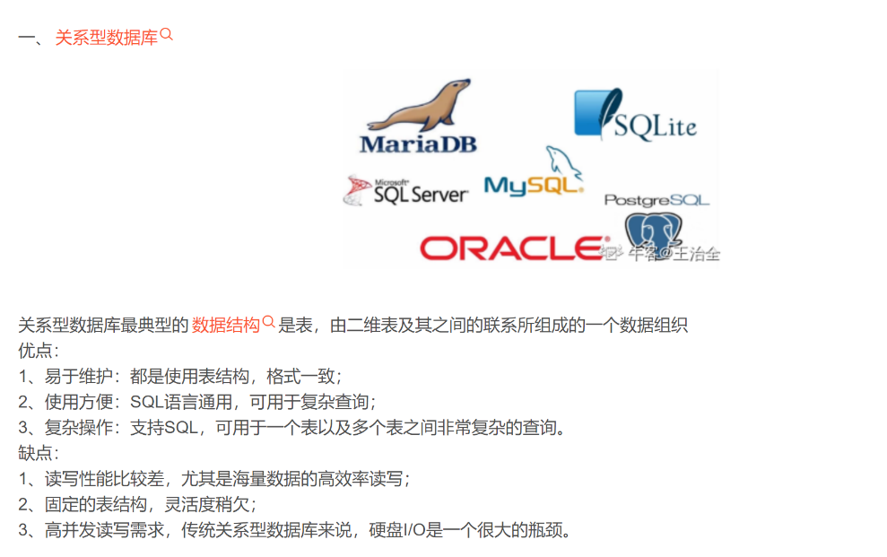
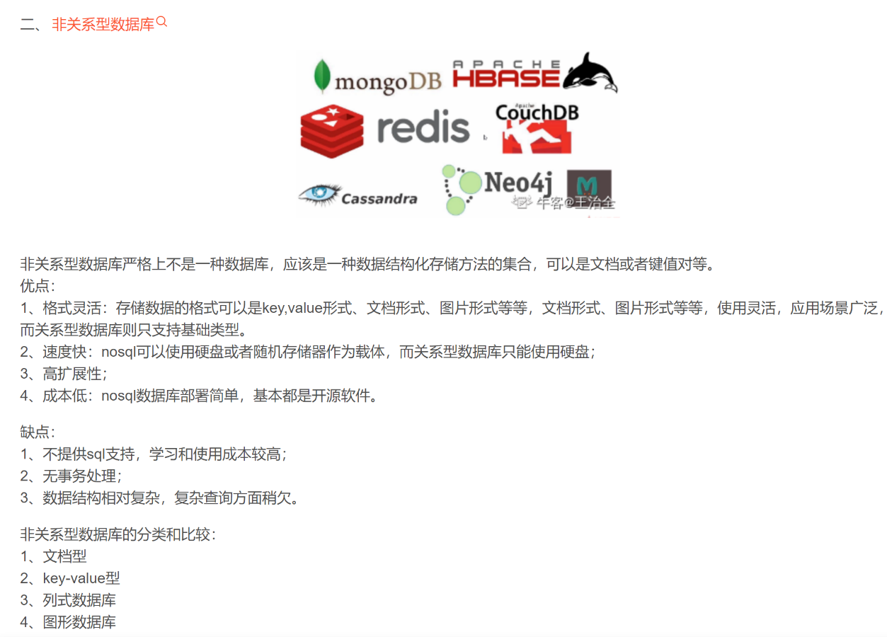
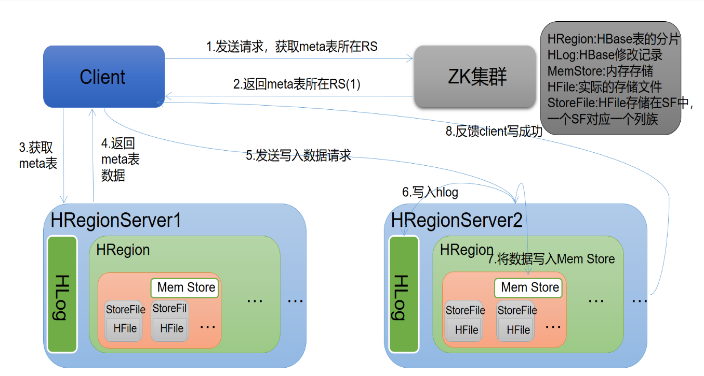
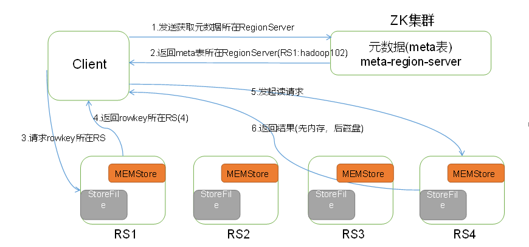

## HBase介绍
### 1、Hbase 简介
（1）HBase – Hadoop Database，是一个高可靠性、高性能、面向列、可伸缩的分布式存储系统。

（2）利用 HBase 技术可在廉价 PC Server 上搭建起大规模结构化存储集群。

（3）HBase 利用 Hadoop HDFS 作为其文件存储系统，利用 Hadoop MapReduce 来处理HBase 中的海量数据，利用 Zookeeper 作为协调工具。
### 2、Hbase 的基本介绍
HBase 是 BigTable 的开源 java 版本。是建立在 HDFS 之上，提供高可靠性、高性能、列存储、可伸缩、实时读写 NoSQL 的数据库系统。HBase 仅能通过主键(row key)和主键的 range来检索数据，仅支持单行事务。
### 3、关系型数据库与非关系型数据库重点


### 4、SQL 语句分类
数据定义语言：简称 **DDL**(Data Definition Language)，用来定义数据库对象：数据库，表，列等。关键字：create，alter，drop 等。

数据操作语言：简称 **DML**(Data Manipulation Language)，用来对数据库中表的记录进行更新。关键字：insert，delete，update 等。

数据控制语言：简称 **DCL**(Data Control Language)，用来定义数据库的访问权限和安全级别，及创建用户。

数据查询语言：简称 **DQL**(Data Query Language)，用来查询数据库中表的记录。关键字：select， from，where 等。
### 5、hadoop 发展史
2003 年：谷歌分布式文件系统（GFS）

2004 年：谷歌版的 MapReduce 系统，以谷歌为基础开源实现 HDFS 和 MAPREDUCE

2006 年：Google 发表了论文是关于 BigTable 的，这促使了后来的 Hbase 的发展。
### 6、hbase 数据模型
数据存放在带标签的表中.

Tables 由 rows 和 columns 组成.

Table cells 单元格有版本是 HBase 插入单元格时候的时间戳。

**列组成“列族”.所有的列族成员有相同的前缀。**
  - 物理上，所有的列族成员都一起存放在文件系统中.
  - HBase 实际上就是一个面向列族的存储器
  - HBase 中的每一张表，就是所谓的 BigTable。稀疏表。
  - RowKey 和 ColumnKey 是二进制值 byte[]，按字典顺序排序；
  - Timestamp 是一个 64 位整数；
  - value 是一个未解释的字节数组 byte[]。
  - 表中的不同行可以拥有不同数量的成员。即支持“动态模式”模型
## HBase 使用
###  1、启动 hbase、启动 hbase-shell、退出 shell
  - start-hbase.sh
  - hbase shell
  - quit
### 2、 shell 常用命令（速记）
|**名称**|**命令表达式**|
|----|----|
|创建表|create '表名称', '列族名称1', '列族名称2', '列族名称3'|
|添加记录|put '表名称', '行名称', '列名称', '值'|
|查看记录|get '表名称', '行名称'|
|查询表中记录总数|count '表名称'|
|删除记录|delete '表名称', '行名称', '列名称'|
|删除表|先disable表，然后drop表|
|查看所有记录|scan '表名称'|
|查看表中某一列的所有数据|scan '表名称', {COLUMNS=>'列族名称:列名称'}
|更新数据|在同一位置重复写入即可|
### 3、命令具体演示
#### 1）创建表
`create 'users','user_id','address','info'`

表 users,有三个列族 user_id,address,info
#### 2）列出全部表
`list`
#### 3）得到表的描述
`describe 'users'`
#### 4）删除表
`disable 'users_tmp'`

`drop 'users_tmp'`
#### 5）查看表状态
`exists 'users'`

`is_enabled 'users'`

`is_disabled 'users’`
#### 6）插入数据：使用 put 命令添加记录
`put 'users','xiaoming','info:age','24';`
#### 7）获取数据：使用 get 命令获取一条记录
取得一个 id 的所有数据

`get 'users','xiaoming'`

获取一个 id，一个列族的所有数据

`get 'users','xiaoming','info'`

获取一个 id，一个列族中一个列的所有数据

`get 'users','xiaoming','info:age'`
#### 8）查看数据、查看所有记录：scan "表名称“
`scan 'test‘`
#### 9）查看 test 表中的所有数据、查看某个表某个列中所有数据
`scan "表名称" , '列名称'`
#### 10）更新记录
`put 'users','xiaoming','info:age' ,'29'`
#### 11）获取单元格版本数据
`get 'users','xiaoming',{COLUMN=>'info:age',VERSIONS=>1}`
#### 12）获取单元格某个版本的信息（指定时间戳）
`get 'users','xiaoming',{COLUMN=>'info:age',TIMESTAMP=>1364874937056}`
#### 13）全表扫描
`scan 'users'`
#### 14）删除表的某个字段
`delete 'users','xiaoming','info:age'`
#### 15）删除整行
`deleteall 'users','xiaoming'`
#### 16）统计表的行
`count 'users'`
#### 17）清空表
`truncate 'users'`
### 4、 关于名称空间的命令
  - 1）创建命名空间 : `create_namespace ‘MOMO_CHAT’`
  - 2）查看命名空间列表 : `list_namespace`
  - 3）查看命名空间: `describe_namespace ‘MOMO_CHAT’`
  - 4）命名空间创建表: `create ‘MOMO_CHAT:MSG’,’C1’`

**注意: 带有命名空间的表, 使用冒号将命名空间和表名连接到一起**
  - 5）删除命名空间: `drop_namespace ‘MOMO_CHAT’`

**注意: 删除命名空间, 命名空间中必须没有表, 否则无法删除**

**注意:**
1. `deleteall` 是在 hbase 2.0 版本后出现的, 在 2.0 版本之前, 只需要使用 `delete` 这个命令即
可完成所有的删除数据工作,
2. `delete` 删除数据时候, 只会删除最新版本的数据, 而 `deleteall` 直接将对应数据的所有的历
史版本全部删除
## HBase 基本概念
### 1、 基本架构
HBase 具有三个主要组件，即 HMaster Server、HBase Region Server 和 Zookeeper。Hbase 集群 由一个Hmaster（主节点，管理者）、多个 regionserver(从节点)组成。通过zookeeper 提供协调服务，通过 zookeeper 监控集群中每个节点的运行状态，当出现问题时，由 zookeeper 通知集群中的其他节点。同时 zookeeper 协助 hmaster 处理客户端发出的读写请求。
### 2、 具体
#### **1）Zookeeper**
保证任何时候，集群中只有一个 running master

存贮所有 Region 的寻址入口

实时监控 Region Server 的状态，将 Region server 的上线和下线信息，实时通知给 Master

存储 HBase 的 schema,包括有哪些 table，每个 table 有哪些 column family
#### **2）HMaster**
管理用户对 Table 的增、删、改、查操作

管理 RegionServer 的负载均衡、调整 Region 的分布

在 Region Split 后，将新 Region 分布到不同的 RegionServer。

在 RegionServer 宕机后，该 RegionServer 上所管理的 Region 由 HMaster 进行重新分配。
#### **3）RegionServer**
RegionServer 是 HBase 集群运行在每个工作节点上的服务组件

RegionServer 维护 Master 分配给它的 region，处理对这些 region 的 IO 请求

Region server 负责切分在运行过程中变得过大的 region
#### **4）Region**
Region 可理解为关系型数据库中的“分区”

处理 RegionServer 分配给它的任务
### 3、 读写流程
#### **写**

Client 向 HRegionServer 发送写请求；

HRegionServer 将数据写到 HLog（write ahead log）。为了数据的持久化和恢复；

HRegionServer 将数据写到内存（MemStore）；

反馈 Client 写成功。
#### **读**

Client 先访问 zookeeper，从 meta 表读取 region 的位置，然后读取 meta 表中的数据。meta 中又存储了用户表的 region 信息；

根据 namespace、表名和 rowKey 在 meta 表中找到对应的 region 信息；

找到这个 region 对应的 region server；

查找对应的 region；

先从 MemStore 找数据，如果没有，再到 BlockCache 里面读；

BlockCache 还没有，再到 StoreFile 上读(为了读取的效率)；

如果是从StoreFile里面读取的数据，不是直接返回给客户端，而是先写入BlockCache，

再返回给客户端。
## HBase API
### 1、连接
```java
//指定通过 zookeeper 来获取 hbase 的元数据信息
/*Configuration conf = new Configuration();*/
Configuration conf = HBaseConfiguration.create();
conf.set("hbase.zookeeper.quorum", "192.168.88.161:2181,192.168.88.162:2181,192.168.88.163:2181");
//1、hbase 的工厂类对象创建 java 客户端连接对象（Connection）
conn = ConnectionFactory.createConnection(conf);
//2、根据连接对象，获取管理器对象；admin(跟表相关的操作)，table(跟表数据相关操作)（Admin）
admin = conn.getAdmin();
//根据连接对象获取表数据处理对象（Table）
table = conn.getTable(TableName.valueOf(tableName));
```
### 2、创建表（1）
```java
boolean flag = admin.tableExists(TableName.valueOf(tableName));
if (!flag) {//表不存在继续执行
    //创建表的描述器对象
    TableDescriptorBuilder tableDescriptorBuilder = TableDescriptorBuilder.newBuilder(TableName.valueOf(tableName));
    //创建列族的描述器对象
    //通过 newBuilder 指定列族的名称
    ColumnFamilyDescriptorBuilder columnFamilyDescriptorBuilder = ColumnFamilyDescriptorBuilder.newBuilder("C1".getBytes());
    //通过 build 方法创建 ColumnFamilyDescriptor 对象
    ColumnFamilyDescriptor columnFamilyDescriptor = columnFamilyDescriptorBuilder.build();
    //把列族的描述器对象添加到表的描述器构建器中
    tableDescriptorBuilder.setColumnFamily(columnFamilyDescriptor);
    TableDescriptor tableDescriptor = tableDescriptorBuilder.build();
    //4、管理器对象创建表
    admin.createTable(tableDescriptor);
}
```
### 3、创建表（2）
```java
boolean flag = admin.tableExists(TableName.valueOf(tableName));
if (!flag) {//表不存在继续执行
    HTableDescriptor hTableDescriptor = new HTableDescriptor(TableName.valueOf(tableName));
    HColumnDescriptor hColumnDescriptor01 = new HColumnDescriptor("f1");
    hColumnDescriptor01.setVersions(1, 3);
    HColumnDescriptor hColumnDescriptor02 = new HColumnDescriptor("f2");
    hColumnDescriptor02.setVersions(1, 5);
    hTableDescriptor.addFamily(hColumnDescriptor01)
                    .addFamily(hColumnDescriptor02);
    admin.createTable(hTableDescriptor);
}
```
### 4、 获取数据
```java
Get get = new Get("rk01".getBytes());
get.addColumn("C1".getBytes(),"name".getBytes());
//get 方法获取数据
Result result = table.get(get);
//处理结果
List<Cell> cells = result.listCells();
//遍历集合获取每个单元格数据
for (Cell cell : cells) {
    //System.out.println(cell);
    byte[] rowkeyArray = CellUtil.cloneRow(cell);
    byte[] familyArray = CellUtil.cloneFamily(cell);
    byte[] qualifierArray = CellUtil.cloneQualifier(cell);
    byte[] valueArray = CellUtil.cloneValue(cell);
    String rowkey = Bytes.toString(rowkeyArray);
    String family = Bytes.toString(familyArray);
    String qualifier = Bytes.toString(qualifierArray);
    String value = Bytes.toString(valueArray);
    System.out.println("rowkey:" + rowkey + ";family:" + family + ";qualifier:" + qualifier + ";value:" + value);
}
```
### 5、 删除表
```java
flag = admin.tableExists(TableName.valueOf(tableName));
if (flag) {
    admin.disableTable(TableName.valueOf(tableName));
    admin.deleteTable(TableName.valueOf(tableName));
}
```
### 6、过滤器
**使用方法：`scan.setFilter(filter);`**
### （1） 行键过滤器 RowFilter
`Filter filter = new RowFilter(CompareOp.LESS_OR_EQUAL, new BinaryComparator(Bytes.toBytes("row-22")));`
### （2） 列族过滤器 FamilyFilter
`Filter filter = new FamilyFilter(CompareFilter.CompareOp.LESS, new BinaryComparator(Bytes.toBytes("colfam3")));`
### （3） 列过滤器 QualifierFilter
`Filter filter = new QualifierFilter(CompareFilter.CompareOp.LESS_OR_EQUAL, new BinaryComparator(Bytes.toBytes("col-2")));`
### （4） 值过滤器 ValueFilter
`Filter filter = new ValueFilter(CompareFilter.CompareOp.EQUAL, new SubstringComparator(".4") );`
### （5） 单列值过滤器 SingleColumnValueFilter
```java
SingleColumnValueFilter filter = new SingleColumnValueFilter(Bytes.toBytes("colfam1"), Bytes.toBytes("col-5"),
    CompareFilter.CompareOp.NOT_EQUAL, new SubstringComparator("val-5"));
//如果不设置为 true，则那些不包含指定 column 的行也会返回
filter.setFilterIfMissing(true);
scan.setFilter(filter); 
```
### （6） 前缀过滤器 PrefixFilter----针对行键
`Filter filter = new PrefixFilter(Bytes.toBytes("row1"));`
### （7） 列前缀过滤器 ColumnPrefixFilter
`Filter filter = new ColumnPrefixFilter(Bytes.toBytes("qual2"));`
## Hbase 设计
### Rowkey 设计
#### 1) 避免使用递增行键/时序数据 当做 rowkey 的前缀
因为递增行键或者时序数据, 前面数字有可能是一成不变, 此时会出现数据热点问题(所有数据都跑到一个 region 中)
#### 2) 避免 rowkey 和列的长度过大(长)
因为希望数据能够在内存中保留的越多, 读取的效率越高, 如果 rowkey 或者列设置比较长,导致在有限内存中存储数据更小, 从而让数据提前的就 flush 磁盘上, 影响读取效率,建议 rowkey 长度一般为 10~100 字节左右 , 尽可能的越短越好
#### 3) 使用 Long 类型比 String 类型更节省空间:
如果 rowkey 中都是数字, 建议使用 Long 获取其他数值类型
#### 4) 保证 rowkey 的唯一性
  - 1、反转策略:比如说可以将手机号或者时间戳等 这种前面一样但是后面会呈现随机的数据,进行反转工作就可以保证 rowkey 的前缀都不尽相同, 从而让数据能够落在不同的 region 中
  - 2、加盐策略: 给 rowkey 前缀添加固定长度的随机数 , 来保证让数据落在不同 region 中
  - 3、hash 取模: 给相同的数据加上同样的盐, 从而保证相关联的数据都在一起, 也可以保证数据落在笔筒 region 中
