## 直接生成序列帧

**来自群主的分享**

### 完整对话

```component ArtPlayer
src: video/GeminiDemo.mp4
```

### 结果

```component ArtPlayer
src: video/GeminiResult.mp4
```

## 文生图提示词

**来自群友：剑心焚琴**

https://labs.google/fx/zh/tools/image-fx

```
厨房工具，如勺子、过滤器和锅，以及像素化菜单板、客户满意度指标和食材和特殊食谱的库存槽。
该设计通过动画像素细节得到了增强，比如煮一锅肉汤和满意的顾客吃面条，从而产生了一种引人入胜、美味可口的体验。
```

```
Kitchen tools such as spoons, strainers, and pots, along with a pixelated menu board, customer satisfaction indicators,
and inventory slots for ingredients and special recipes. The design is enhanced with animated pixel details, 
such as simmering a pot of soup and satisfied customers eating noodles, creating an engaging and delicious experience
```

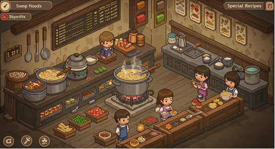

```
下装、连衣裙和配饰，以及一个详细的人体模型或化身来展示这些服装。
还有各种时尚风格的主题标签，如复古现代和幻想，以及一个类似壁橱的库存，用于存储和管理大量的服装。
通过旋转连衣裙等动画细节进一步增强了设计。
```

```
Bottoms, dresses, and accessories, along with a detailed mannequin or avatar to showcase these outfits. 
There are also various fashion-themed tags, such as retro-modern and fantasy, 
and a wardrobe-like inventory for storing and managing a large collection of clothes. 
The design is further enhanced with animated details, such as rotating dresses.
```

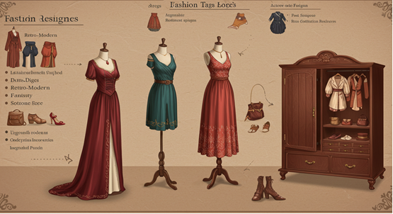

```
显示一个战场情况的迷你地图。
界面上清晰地显示了英雄的状态指标，如生命值、魔法值和冷却时间，并且有互动按钮供执行各种操作，例如攻击、移动和使用技能。
设计还通过动画效果得到了增强，例如技能动画和战斗效果。
```

```
A mini-map displaying the battlefield situation. 
The interface clearly shows the hero's status indicators, 
such as health points, mana, and cooldown times, with interactive buttons to perform various actions, 
such as attack, move, and use skills. 
The design is also enhanced with animated effects, such as skill animations and battle effects.
```

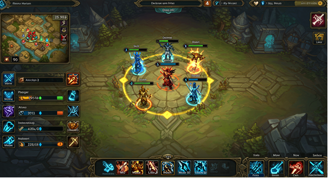

```
测试仪和食品分配器。有一个像素化的水箱显示，显示了水族馆的当前状态，包括水的透明度、温度计和鱼的数量等细节。
它还包括一份可添加的鱼类和植物目录，以及生长和护理指标。
该设计点缀着动画像素细节，如游泳的鱼、轻轻漂浮的气泡和生长的植物。
```

```
Testers and food dispensers. 
There is a pixelated tank display showing the current status of the aquarium, 
including details such as water transparency, temperature gauge, and the number of fish. 
It also includes a catalog of fish and plants that can be added, along with growth and care indicators. 
The design is adorned with animated pixel details, such as swimming fish, gently floating bubbles, and growing plants.
```

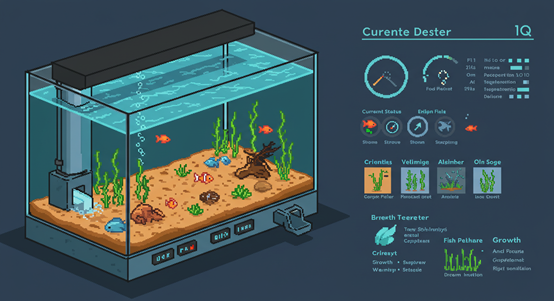

```
喂食槽和动物玩具。有一个像素化的动物园地图显示，显示了不同动物栖息地的布局，包括动物种群数量、幸福水平和清洁指标等细节。
它还提供了一份可供救援或购买的动物目录，以及它们的特定护理要求和生长阶段。
设计中融入了动画像素细节
```

```
Feeding troughs and animal toys. 
There is a pixelated zoo map displayed, showing the layout of different animal habitats, 
including details such as animal population numbers, happiness levels, and cleanliness indicators. 
It also provides a catalog of animals available for rescue or purchase, 
along with their specific care requirements and growth stages. 
The design incorporates animated pixel details.
```

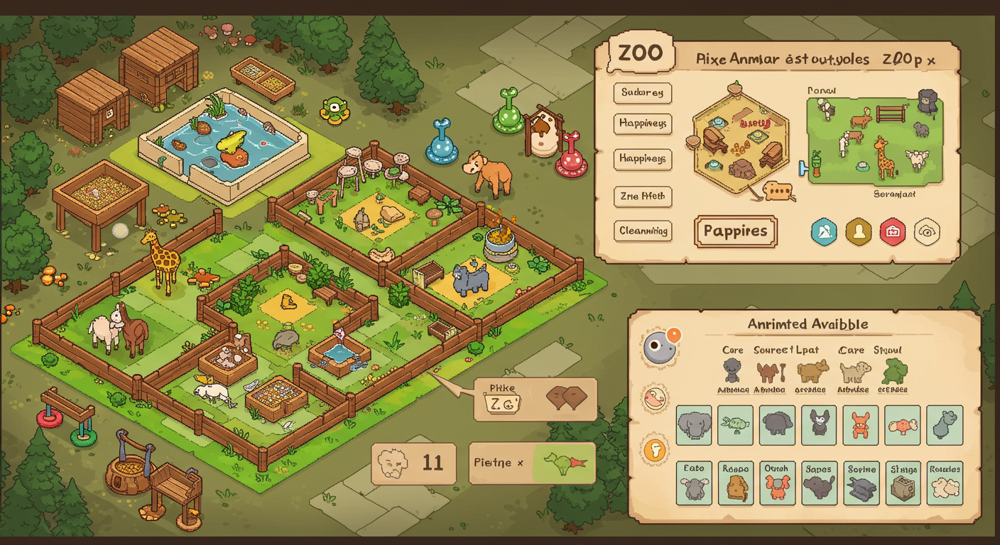

```
房屋展示，显示猫的当前位置，无论是在床上打盹，在地板上玩玩具，还是栖息在窗台上。
它还包括一个菜单，用于选择不同的猫品种，每种猫都有独特的个性和外观。
设计中充满了动画像素细节，比如猫扑向玩具鼠标，伸展身体，喵喵叫 。
```

```
A house display showing the cat's current location, 
whether it's napping on the bed, playing with toys on the floor, 
or resting on the windowsill. It also includes a menu to select different cat breeds, 
each with unique personalities and appearances. 
The design is filled with animated pixel details, 
such as the cat pouncing on a toy mouse, stretching its body, and meowing.
```

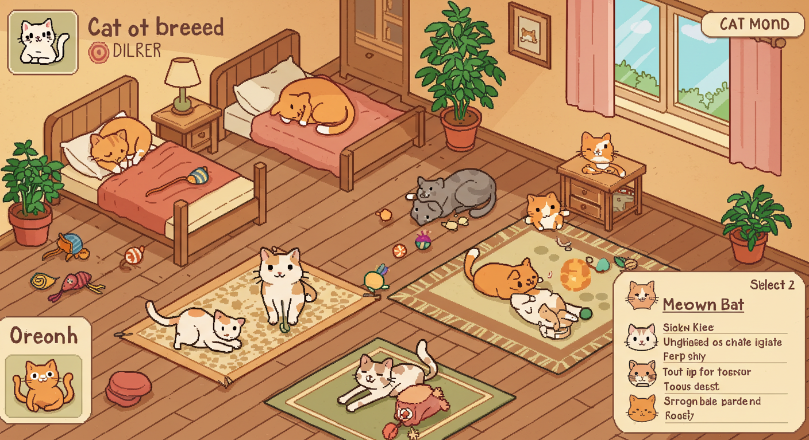

```
艺术设计程序和声音编辑器。有一个像素化的办公室布局显示，显示了不同的部门和工作站，以及正在进行的项目的状态以及团队成员的技能和精力水平。
它还具有一个游戏资产库，如角色模型背景、音乐曲目和市场。
```

```
Art design programs and sound editors. 
There is a pixelated office layout display, showing different departments and workstations, 
along with the status of ongoing projects and the skills and energy levels of team members. 
It also features a game asset library, including character models, backgrounds, music tracks, and marketplaces. 
```

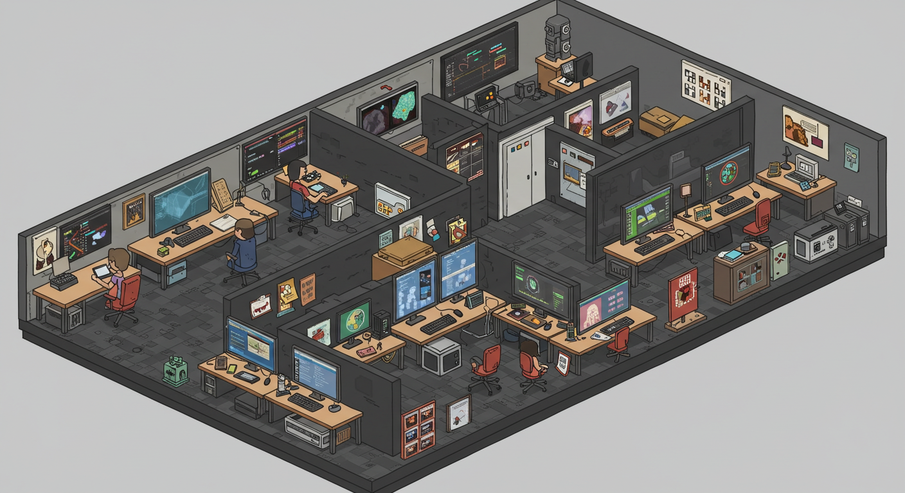

```
装饰工具和材料，如锤子、油漆辊、壁纸样品和织物样本。
有一个像素化的平面图，允许玩家轻松导航，并设计不同的房间，可以更改布局和尺寸。它还有家具目录。
```

```
Decorative tools and materials, such as hammers, paint rollers, wallpaper samples, and fabric swatches. 
There is a pixelated floor plan that allows players to easily navigate and design different rooms, 
with the option to change layouts and dimensions. 
It also includes a furniture catalog.
```

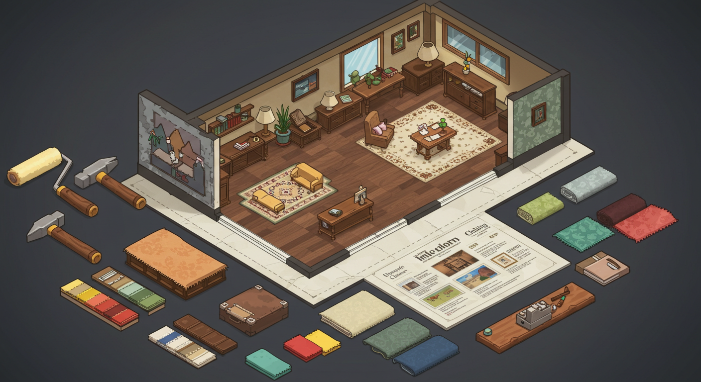

```
精美的Ul设计，模拟了一款色彩缤纷的卡通冒险游戏，带有欢快的幻想元素。
在中心，有一个俏皮的角色标志，上面有一条微笑的胖乎乎的龙，手里拿着一颗明亮的金色星星，周围是柔和的云朵和闪闪发光的光芒。
调色板包括柔和的粉红色、天蓝色和阳光黄色。
```

```
The exquisite UI design simulates a colorful cartoon adventure game, 
with cheerful fantasy elements. At the center, there’s a playful character logo featuring a smiling, 
chubby dragon holding a bright golden star, surrounded by soft clouds and sparkling rays of light. 
The color palette includes soft pinks, sky blues, and sunny yellows.
```

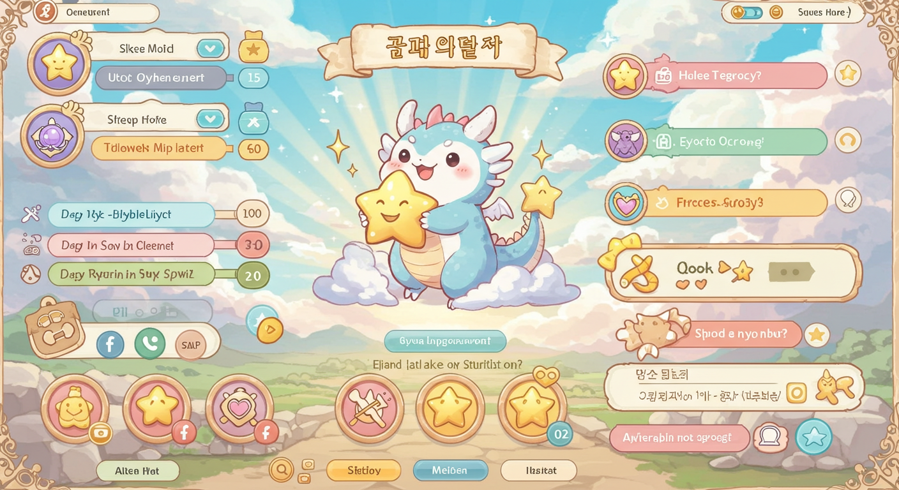

```
Ul设计迷人，是一款舒适而充满活力的便利店模拟游戏，氛围可爱而诱人。
在中心，有一个可爱的标志，上面有一个微笑的店面，上面有条纹遮阳篷，周围是卡通风格的东西，如零食、饮料和收银机。配色方案由柔和的淡绿色组成。
```

```
The charming UI design is for a cozy and vibrant convenience store simulation game, 
with a cute and inviting atmosphere. 
At the center, there’s a delightful logo featuring a smiling storefront with a striped awning, 
surrounded by cartoon-style items such as snacks, drinks, and a cash register. 
The color scheme is composed of soft pastel greens.
```

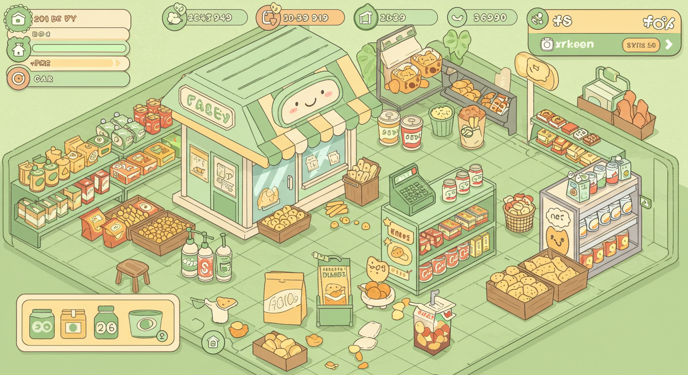

```
设计精美的UI，为时尚而充满活力的服装店、模拟游戏，营造出别致而诱人的氛围。
在中心，有一个可爱的标志，上面有一个漂亮的精品店店面，里面有一个穿着时尚服装的人体模型，还有一个条纹遮阳篷，周围环绕着衣架等卡通风格的物品 。
```

```
The beautifully crafted UI is for a fashionable and vibrant clothing store simulation game, 
creating a chic and inviting atmosphere. At the center, there’s a cute logo featuring a stylish boutique storefront,
with a mannequin dressed in fashionable clothes, and a striped awning, surrounded by cartoon-style items such as hangers.
```

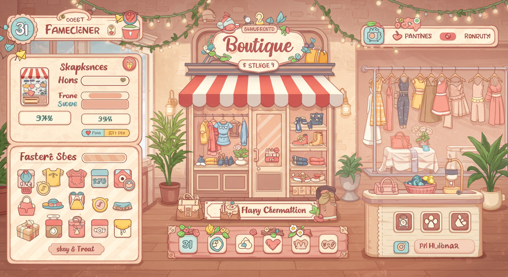

```
沉浸式设计的Ul是一款冒险而充满活力的海洋生存游戏，氛围粗犷而诱人。
在中心，有一个大胆的标志，上面有一个临时木筏，上面有破旧的帆，周围环绕着鱼椰子和木板等卡通风格的元素。配色方案由深海蓝组成。
```

```
The immersive UI design is for an adventurous and vibrant ocean survival game, with a rugged and enticing atmosphere. 
At the center, there’s a bold logo featuring a makeshift raft with a tattered sail, 
surrounded by cartoon-style elements such as fish, coconuts, and wooden planks. 
The color scheme is composed of deep sea blues.
```

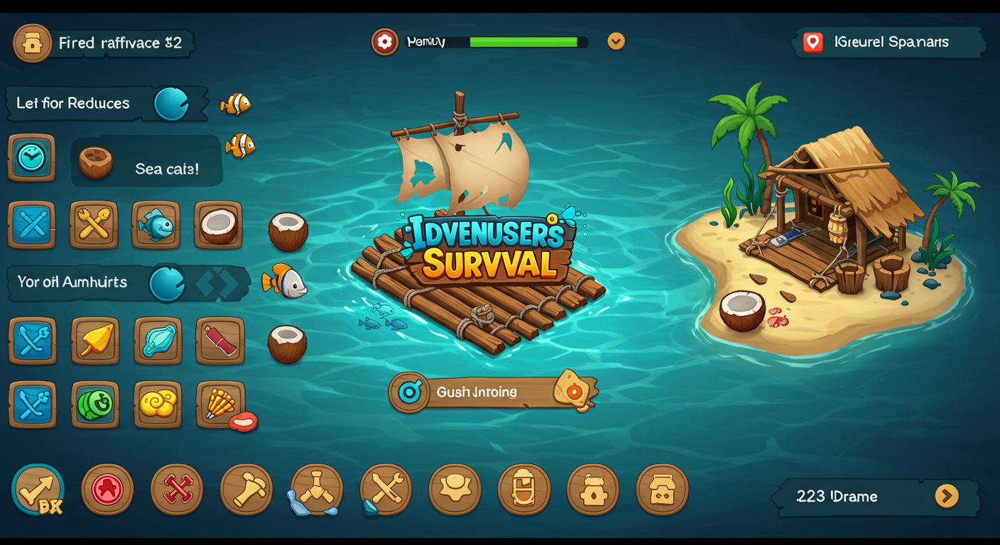

```
设计迷人的Ul，是一款充满活力和动作的侧滚平台游戏，具有俏皮和冒险的氛围。
在中心，有一个动态的标志，上面有一个英雄人物跳投，手持剑或电源，周围环绕着硬币、宝箱和敌人Creste等卡通风格元素。
```

```
The enchanting UI design is for a vibrant and action-packed side-scrolling platformer, with a playful and adventurous atmosphere. 
At the center, there’s a dynamic logo featuring a hero character performing a jump shot, 
holding a sword or power-up, surrounded by cartoon-style elements such as coins, treasure chests, and enemy crests.
```

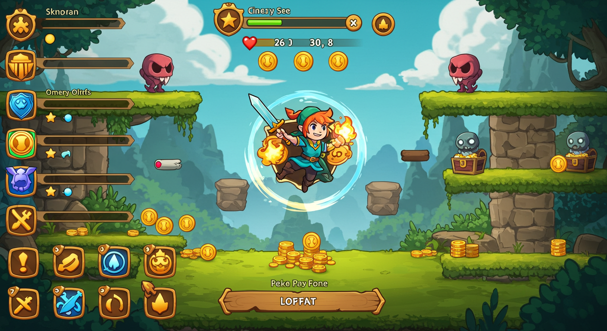

```
令人振奋的UI设计，适用于高速和肾上腺素刺激的赛车游戏，具有时尚和竞争的氛围。
在中心，有一个大胆的标志，上面有一辆咆哮的赛车，轮胎燃烧着，周围环绕着方格、速度计和轮胎打滑痕迹等动态元素。
```

```
An exhilarating UI design, perfect for a high-speed and adrenaline-pumping racing game, with a stylish and competitive atmosphere. 
At the center, there’s a bold logo featuring a roaring race car with burning tires, 
surrounded by dynamic elements such as checkered flags, speedometers, and tire skid marks.
```

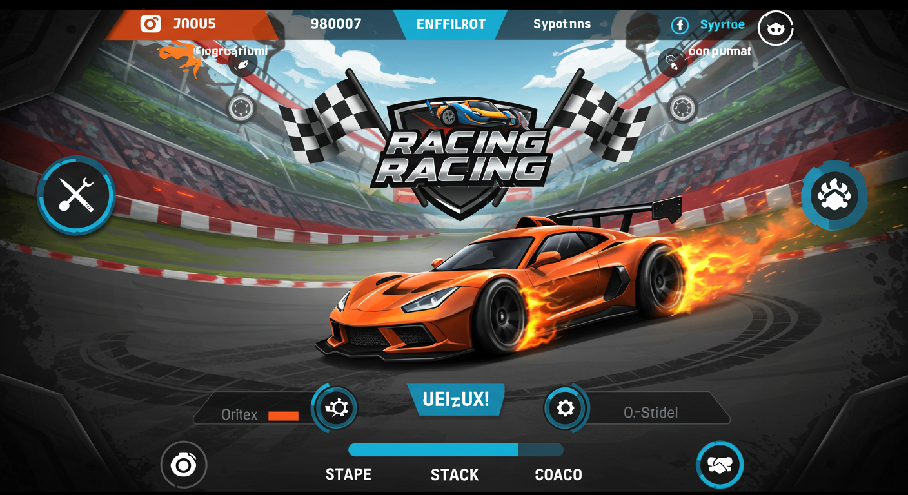

```
设计明亮的Ul是一款色彩丰富、令人上瘾的三对一益智游戏，氛围欢快而异想天开。
在中心，有一个俏皮的标志，上面有各种形状的闪亮的宝石般的碎片——星星、心形和宝石，周围是闪闪发光和俏皮的爆炸。配色方案包括鲜艳的粉红色、蓝色、黄色和绿色，以及迷人的图标。
```

```
The bright UI design is for a colorful and addictive 3-on-1 puzzle game with a cheerful and whimsical atmosphere. 
At the center, there’s a playful logo featuring shiny, 
gem-like fragments in various shapes—stars, hearts, and jewels—surrounded by sparkling and playful explosions. 
The color scheme includes vibrant pinks, blues, yellows, and greens, along with charming icons.
```

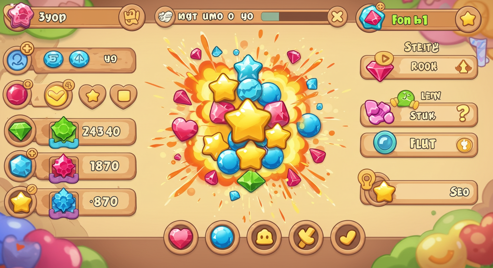

```
Ul设计优雅，是一款战略和沉浸式纸牌游戏，具有神秘和竞争的氛围。
在中心，有一个详细的标志，上面有一张发光的魔法卡，周围环绕着旋转的魔法能量和剑、盾牌和元素图标等符号。配色方案包括深紫色、金色和深蓝色 。
```

```
The UI design is elegant, for a strategic and immersive card game with an atmosphere of mystery and competition. 
At the center, there is a detailed logo featuring a glowing magical card, 
surrounded by swirling magical energy and symbols such as swords, shields, and elemental icons. 
The color scheme includes deep purples, gold, and dark blues.
```

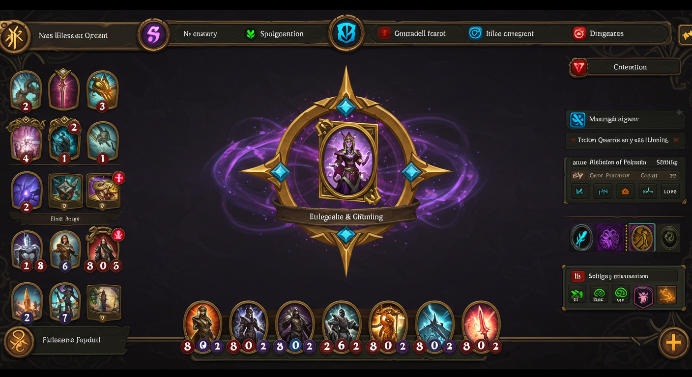

```
一款充满动作的战略塔防游戏设计的生动界面，带有一种富有趣味性和沉浸感的氛围。
在界面中央，有一个大胆的logo，呈现了一座坚固的塔楼，周围环绕着箭矢、炮弹和魔法符文。色彩搭配包括大地色的棕色、充满活力的绿色和火红色，唤起了一种战斗的氛围。
```

```
A vivid interface design for an action-packed strategic tower defense game, with a playful and immersive atmosphere. 
At the center of the interface, a bold logo showcases a fortified tower, 
surrounded by arrows, cannonballs, and magical runes. 
The color scheme includes earthy browns, vibrant greens, and fiery reds, evoking a sense of battle.
```

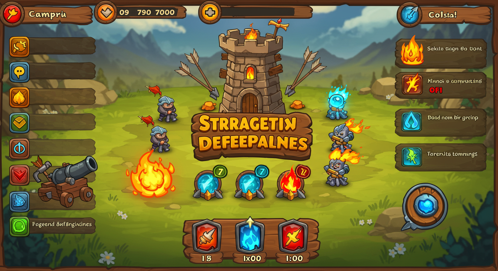

```
设计迷人的Ul是一款舒适而怀旧的像素艺术农业游戏，氛围温暖而放松。
在中心，有一个可爱的标志，上面有一个像素化的谷仓，周围是庄稼、一个水罐和一头快乐的奶牛。配色方案包括泥土色调，如柔和的绿色和暖棕色 。
```

```
Designing an enchanting UI for a cozy and nostalgic pixel art farming game, with a warm and relaxing atmosphere. 
At the center, there’s a cute logo featuring a pixelated barn, surrounded by crops, a water jar, and a happy cow. 
The color scheme includes earthy tones like soft greens and warm browns.
```

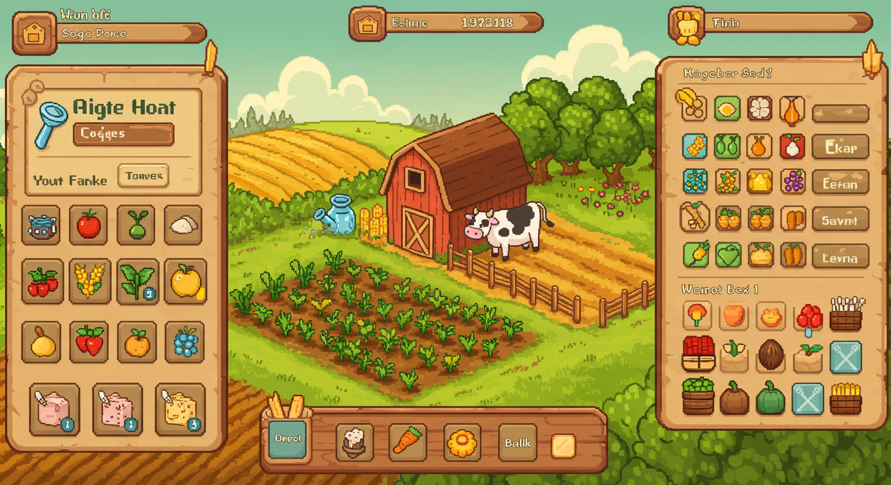