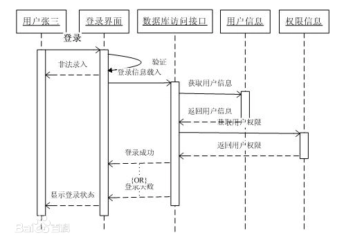
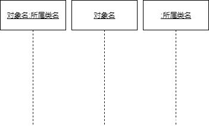
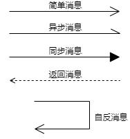
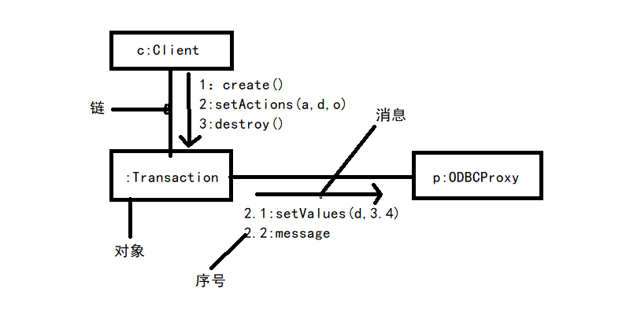

1、高级加密标准（AES）是一种分组，对称加密算法，替代了原先的DES，是目前最流行的算法之一;非对称加密算法也称为公开钥加密算法，是指加密密钥和解密密钥完全不同，其中一个为公钥，另一个为私钥，并且不可能任何一个推导出另一个。常见的公开加密算法有：ECC、DSA、RSA；RC-5、DES属于对称加密算法。MD5为摘要算法。DES算法密钥长度为56位。

2、面向对象设计时包含的主要活动是识别类及对象、定义属性、定义服务、识别关系、识别包。

3、数据库的三级模式：

| 概念模式                                                     | 外模式                                                       | 内模式                                                       |
| ------------------------------------------------------------ | ------------------------------------------------------------ | ------------------------------------------------------------ |
| 概念模式是数据库中全体数据的逻辑结构和特征的描述，是所有用户的公共数据视图。一个数据库只有一个概念模式 | 外模式（子模式、用户模式）描述用户看到或者使用的那部分数据的逻辑结构，用户根据外模式用数据操作语句或应用程序去操作数据库中的数据 | 内模式定义的是存储记录的类型、存储域的表示以及存储记录的物理顺序，指引元、索引和存储路径等数据的存储组织。一个数据库只有一个内模式。 |

4、PCI总线是PC机常用总线，SCSI是软硬磁盘、光盘、扫描仪常用总线。都是并行总线。

5、构建最大顶堆：先按照元素顺序构造二叉树、选择最大的非叶子节点，与其左右子节点分别进行比较，如果比子节点小，则交换位置，重复这个过程直到父节点比子节点都大。

6、在电子邮件服务协议中，smtp（简单邮件传输协议）是发信服务器的协议，常用端口为25；pop3（邮局协议）是收信服务器的协议，常用端口为110；imap协议用于接收邮件，常用端口为143；TCP和UDP均使用16位端口。MIME（多用途互联网邮件扩展类型），intnet电子邮件由一个邮件头部和一个可选地邮件主体组成，其中邮件头部含有邮件地发送方和接收方地有关信息。而MIME是针对邮件主体的一种扩展机制。它设定某种扩展名的文件用一种应用程序来打开的方式类型，当该扩展名文件被访问的时候，浏览器会自动使用指定应用程序来打开。S/MIME是MIME在安全方面的扩展。它可以把MIME实体封装成安全对象。增强安全服务，例如接收方确认接收的功能。还可以用于提供数据保密、完整性保护、认证和鉴定服务等功能。S/MINE只对邮件主体保护，对头部信息不加密，以便于让邮件成功地在发送者和接收者地网关之间传递。

7、接口分离原则（ISP）定义可以解释为：不应该强迫客户依赖于他们不使用的方法。

8、精简指令与复杂指令

| 指令系统类型 | 指令                                                         | 寻址方式   | 实现方式                                         | 其他                         |
| ------------ | ------------------------------------------------------------ | ---------- | ------------------------------------------------ | ---------------------------- |
| CISC（复杂） | 数量多，使用频率差别大，可变长格式。                         | 支持多种   | 微程序控制技术                                   |                              |
| RISC（精简） | 数量少，使用频率接近，定长格式，大部分为单周期指令，操作寄存器，只有Load/Store操作内存。 | 支持方式少 | 增加通用寄存器，硬布线逻辑控制为主，采用流水线。 | 优化编程，有效支持高级语言。 |

9、每个索引块大小1024字节，每个地址项的大小为4字节，每个索块的地址数为1024/4=256个，5个直接索引：5\*1024=5K；2个一级间接索引：2\*256\*1024=512k；1个二级间接索引：1\*256\*256\*256=65536k。

10、一般将多态分为通用多态与特殊多态。其中通用多态包括参数多态和包含多态，参数多态利用泛型编程，是发散式的，是静态绑定的，让相同的实现代码应用于不同的场合，看重的是算法的普适性，包含多态利用OOP,是收敛式的，是动态绑定的，让不同的实现代码应用于相同的场合，看重的是接口于实现的分离度。特殊多态包括强制多态和过载多态，其中强制多态即一种类型的变量在作为参数传输时隐式转换成另一种类型，比如一个整形变量可以匹配浮点数变量的函数参数，过载多态同一个名（操作符，函数名）在不同的上下文中有不同的类型。程序设计语言中基本类型的大多数操作符都是过载多态。

11、两个浮点数相加运算时，首先进行对阶，阶码小的向阶码大的对齐。

12、nslookup命令用于查询DNS的记录，查看域名解析是否正常。

13、rip（路由信息协议）是在一个AS系统中使用的内部路由选择协议，shi基于距离向量路由器选择的协议。ospf（开放最短路径优先）协议采用链路状态路由选择技术，开放最短路径优先算法。bgp是自治系统之间的路由选择技术；udp为用户数据报协议。

14、使用C/C++形成程序，经过预处理、编译、汇编、链接后形成可执行程序。

15、磁盘调度分为移臂调度和旋转调度两类、并且是先移臂、后旋转。

16、词法分析器的任务是把源文件的字节流转换成记号流。语法分析器根据语法规则识别出记号流中的结构（短语，句子），并构造一棵能够正确反映该结构的语法树。

17、UML状态图中，活动可以在状态内执行，也可以迁移时执行；迁移可以包含事件触发器，监护条件和状态；事件触发迁移。

18、在TCP/IP网络中，建立连接进行可靠通信是在____完成，此功能在OSI/RM中是在会话层来实现的。

19、并列争求法scrum使用迭代的方法。在scrum开发中，项目团队由scrum主管、产品负责人和开发团队人员三种不同的角色组成，其开发过程由若干个sprint（短的迭代周期，通常为2到4周）活动组成。ProductBacklog（PB）是在scrum过程初期产生的一个按照商业价值排序的需求列表，该列表条目的体现形式通常为用户故事。在每一个sprint活动中，项目团队从PB中挑选最高优先级的用户故事进行开发。被挑选的用户故事子啊sprint计划回忆上经过细化分解为任务，同时初步估算每一个任务的预计完成时间，编写SprintBacklog（SB）。在sprint活动期间，项目团队每天早晨需举行每日站立会议，重新估算剩余任务的预计完成时间，更新SB、Sprint燃尽图和Release燃尽图。每个Sprint活动结束时，项目团队召开评审会议和回顾会议，交付产品增量，总结sprint期间的工作情况和问题。此时，如果PB中还有未完成的用户故事，则项目团队开始筹备下一个sprint活动迭代。不包含Refactoring重构。

20、当树具有n个节点，其中所有分支节点的度为k，则该树中叶子节点的个数为（n(k-1)+1)/k；n个节点的二叉树有：(2n)!/(n!(n+1)!)

21、位视图是利用二进制的一位来表示磁盘中的一个磁盘块的使用情况。当其值为“0”时，表示对应的盘块空闲，为“1”时，表示已经分配使用.

22、采用模二除法运算的只有循环冗余检验CRC，此检验方法使用给定位数的二进制数中1的个数是奇数还是偶数来检验。海明码：2^k>=k+n+1;

23、功能性特性的质量特性包括适合行、准确性、互用性、依从性和安全性。

24、COCOMO用三个不同层次的模型来反映不同程度的复杂性，它们分别为：基本模型（Basic Model）：是一个静态单变量模型，它用一个以已估算出来的源代码行数（LOC）为自变量的函数计算软件开发工作量。中级模型（Intermediate Model）：在用LOC位自变量的函数计算软件开发工作量的基础上，再用涉及产品、硬件、人员、项目等方面属性的影响因素来调整工作量的估算。详细模型（Detailed MOdel）：包括中级COCOMO的所有特征，但在上述各种因素调整工作量估算时，还要考虑对软件工程过程中分析、设计等各步骤的影响。

25、统一过程（UP）的基本特征是用例和风险驱动，以架构为中心，受控的迭代式的增量开发。UP定义了四个阶段：起始阶段（inception）：该阶段的主要目的是建立项目的范围和版本，确定项目目标的可行性和稳定性，结交结果包括需求和用例。精化阶段（elaboration）：该阶段的目的是对问题域进行分析，建立系统需求和构架，确定实现的可行性和稳定性，提交结果包括系统构架，问题领域、修改后的需求及项目开发计划等相关文档。构建阶段（construction）：增量式开发可以交付用户的软件产品。移交阶段（transition）目的是将软件产品交付给用户。迭代并且增量的开发过程，每次迭代都包含计划，分析，设计，构建，集成，测试以及内部和外部分布，每个迭代都有五个核心工作流。//TODO 有疑问。

26、包过滤技术是一种基于网络层、传输层的安全技术，优点是简单实用，实现成本较低，包过滤操作对于应用层来说是透明的，它不要求客户与服务器程序做出任何修改。包过滤型防火墙是在网络层对数据包进行分析、选择，选择得依据是系统内设置得过滤规则（访问控制表）。通过检查每个数据包得源地址、目的地址、端口和协议状态等因素，确定是否允许该数据包通过。但是包过滤无法识别基于应用层的恶意入侵（如恶意java程序以及电子邮箱中携带的病毒）。代理服务技术基于应用层，需要检查数据包的内容，能够对基于高层协议的攻击进行拦截，安全性比包过滤要好，缺点是处理速度慢，不适用于高速网之间的应用；代理使用一个客户程序与特定的中间节点连接，然后中间节点与代理服务器进行实际连接，所以防火墙发生问题时，外部网络也无法与被保护的网络连接。 

27、国际电信联盟确定W-CDMA,CDMA2000和TDS-CDMA（3G通信标准），中国独自制定的为TD-SCDMA。

28、改变FM信号幅度可以改变音高。

29、MPEG是Moving Picture Expert Group的简称，最初是指由国际标准化组织（ISO）和国际电工委员会（IEC）联合组成的一个研究视频和音频编码标准的专家组。同时MPEG也用来命名这个小组所负责开发的一系列音、视频编码标准和多媒体应用标准。这个专家组至今为止已制定和制定中的标准包括MPEG-1、MPEG-2、MPEG-4、MPEG-7和MPEG-7是多媒体内容描述接口标准，MPEF21是多媒体应用框架标准。VSD使用MPEG-1标准作为其音视频信息压缩编码方案，而MPEG-2标准中的音、视频压缩编码技术被应用子啊DVD中。

30、有限自动机：具有初态，终态，ε表示没有输入也可以到达下一个状态，只要能到达终态，就是自动机可以识别的。

31、磁盘容量分为格式化容量和非格式化容量：非格式化：面数\*内圈周长\*最大位密度格式化容量=面数\*（磁盘数/面）\*(扇区数/值)\*(字节数/扇区)。

32、评价需求的主要内容是描述评价的目标，特别是描述了产品的质量需求。评价规格说明是确定对软件及其部件实行的所有分析和测量，标识要分析和测量的软件部件。评价记录是评价执行计划时详细记载的动作组成。评价报告的主要内容是执行测量和分析的结果，以及能别重复和重新评价的重要信息。

## 33、设计模式

设计模式是一套反复使用、经过分类编目的代码设计经验的总结。使用设计模式是为了复用成功和设计和体系结构、复用相似问题的相同解决方案，保证代码可靠性，使代码编制真正工程化，能够适应需求的变化。总共有23种。

### 组合模式（Composite）

将对象组合成树形结构

以表示“部分-整体”电费层次结构。它使得客户对单个对象和复合对象的使用具有一致性。

------

### 设计模式分类

创建型模式、结构型模式、行为型模式。

### 创建型模式

单独对对象的创建进行研究，从而能够高效地创建对象。总共有6个创建型模式。

**简单工厂模式（SimpleFactory）**

**工厂方法模式（FactoryMethod）**

定义一个创建对象的接口，但由子类决定需要实例化哪一个类。工厂方法使得子类实例化的过程推迟。

**抽象工厂模式（AbstractFactory）**

提供一个接口，可以创建一系列相关或者互相依赖的对象，而无需指定它们具体的类。

**创建者模式（Builder）**

将一个复杂类的表示与其构造相分离，使得相同的构建过程能够得出不同的表示。

**原型模式（Prototype）**

使用原型实例指定创建对象的类型，并且通过拷贝这个原型来创建新的对象。

**单例模式（Singleton）**

保证一个类只有一个实例，并提供一个访问它的全局访问点。

### 结构型模式

研究对象地组成以及对象之间地依赖关系，如何设计对象地结构、继承和依赖关系会影响到后续程序地维护性、代码的健壮性、耦合性等，总共有7个结构型模式

**外观模式（Facade）**

要求子系统的外部与其内部的通信必须通过一个统一的对象进行交互。它提供一个高层次的接口使其子系统更易于使用。

适用条件：为子系统提供一个简单的接口；客户程序与抽象类的实现部分之间存在很大的依赖性；构建一个层次结构的子系统时，适用外观模式定义子系统中每层的入口点。

**适配器模式（Adapter）**

将一个类的接口转换成客户希望的另外一个接口，设配器模式使得原本由于接口不兼容而不能一起工作的那些类可以一起工作。适配器有类结构和对象结构两种模式。在类适配器中，因为Adapter类继承了Adaptee（被适配类），也实现了Target接口，在Client类中我们可以根据需要选择并创建一种符合需求得子类，来实现具体功能。在对象适配器中，Adapter不是使用多继承或继承再实现得方式，而是使用直接关联，或者称为委托得方式。

**代理模式（Proxy）**

为其他对象提供一种代理以控制这个对象地访问。

**装饰模式（Decorator）**

用于动态地给一个对象添加一些额外的职责或者行为。装饰器模式提供改变子类的灵活方案。装饰器模式在不必改变原类文件和使用继承的情况下，动态的扩展一个对象的功能。它是通过创建一个包装对象，也就是装饰来包装真实的对象。当用于一组子类时，装饰器模式更加有用。如果在拥有一组子类（从同一个父类派生而来），需要与子类独立使用情况下添加额外的特效，此时使用装饰器模式。以避免代码重复和具体子类数量的增加。

**桥接模式（Bridge）**

将类的抽象部分和它的实现部分分离，使它们可以独立地变化。

**组合模式（Composite）**

将对象组合成树型结构以表示“整体-部分”地层次结构，使得用户对单个对和组合对象地使用具有一致性。

**享元模式（Flyweight）**

提供支持打量细粒度对象共享地有效方法。

复用内存中已存在的对象，降低系统创建对象实例组合模式（CompositePattern），有时候又叫做部分-整体模式，它使我们树型结构的问题中，模糊了简单元素和复杂元素的概念，客户程序可以处理像简单元素一样来处理复杂元素，从而使得客户程序与复杂元素的内部结构解耦。

### 行为型模式

行为型设计模式是对对象的行为进行研究。总共有11种行为型模式。

**模板方法模式（TemplateMethod）**

**观察者模式（Observer）**

定义对象间地一种一对多依赖关系，使得每当一个对象改变状态，则其相关依赖对象皆得到通知并被自动更新。

**状态模式（State）**

**策模式（Strategy）**

定义一系列地算法，将每一个算法封装起来，并让它们可以互相替换。此模式让算法独立于使用它地客户而变化。

**责任链模式（ChainofResponsibility）**

**命令模式（Command）**

**访问者模式（Visitor）**

**调停者模式（Mediator）**

**备忘录模式（Memento）**

**迭代器模式（Iterator）**

**解释器模式（Interpreter）**

## 34、UML模型

### 事物

模型中的基本成员。UML中包括结构事物、行为事物、分组事物和注释事物。

**结构事物**

模型中静态事物。【类Class】、【接口Interface】、【协作Collaboration】、【用例UseCase】、【主动类Active Class】、【构件Component】、【结点Node】、【制品Artifact】

**行为事物**

模型中的动态部分。【交互】、【状态机】、【活动】

**分组事物**

可以把它看作一个“盒子”，模型可以在其中被分解。结构事物、行为事物、甚至分组事物都有可能放在一个包中，包纯粹时概念上的，只存在于开发阶段，而组件子啊运行时存在。【包Package】

**注释事物**

UML模型中的注释部分

### 关系

**依赖（Dependency）**

依赖使两个事物之间地语义关系。其中一个事物（独立事物）发生变化会影响另一个事物（依赖事物）的语义。画成一条可能有方向的虚线。

**关联（Association）**

关联是一种结构关系，它描述了一组链，链是对象之间的连接。画成实线，左右用数字表示对应数量。**聚集（Aggregation）**是一种特殊类型的关联，它描述了整体和部分间的结构关系。画成实线末端一个菱形。

**泛化（Generalization）**

泛化是一般化和特殊化地关系，描述特殊元素地对象可替换一般元素地对象。画成一条带有空心箭头的实线

**实现（Relization）**

实现是类之间地语义关系，其中地一个类指定了由另一个类保证执行的契约。画成带空心箭头的虚线。

### 图

#### 类图

通常包括：类、接口、协作、依赖/泛化和关联关系。

类图用于对系统静态设计视图的建模。这种视图主要支持系统的功能需求，即系统要提供给用户的服务。通常以下方式使用类图：

1）对系统的词汇建模。对系统的词汇建模设计做出决定：哪些抽象是考虑中的系统的一部分，哪些抽象处于系统边界之外。

2）对简单的协作建模。协作是一些共同工作的类、接口和其他元素的群体，该群体提供的一些合作行为强于所有这些元素的行为之和。

3）对逻辑数据库模式建模。将模式看作为数据库的概念设计的蓝图。

#### 对象图

展现某一时刻一组对象以及它们之间的关系，描述了类图中所建立的事物的实例的静态快照。一般包括对象和链。

#### 用例图

展现了一组用例、参与者以及它们之间的关系。通常包括：用例、参与者、用例之间的扩展关系（extend）和包含关系（include）

主要用于：

1）对系统的语境建模。对一个系统的语境进行建模，包括围绕整个系统画一条线，并声明有哪些参与者位于系统之外并于系统进行交互。

2）对系统的需求建模。对一个系统的需求进行建模，包括说明这个系统应该做什么（从系统外部的一个观点出发），而不考虑系统应该怎么做。

#### 交互图

用于对系统的动态方面进行建模。一张交互图表现得是一个交互，由一组对象和它们之间得关系组成，包含它们之间可能传递得信息。交互图表现为序列图、通信图、交互概览图和计时图。

**序列图强调消息时间顺序得交互图；**

是场景的图形化表示，描述了以时间顺序组织的对象之间的交互活动。

不同于通信图的地方：

序列图有对象生命线。垂直的虚线，通过一个×表示对象的销毁。

序列图有控制焦点。

**通信图是强调接收和发送消息得对象得结构组织得交互图；**

强调收发消息的对象的结构组织，在早期的版本中也被称为协作图。强调参加交互的对象的组织。

不同于序列图的地方：

通信图有路径、通信图有顺序号。

**通信图和序列图是同构的 ，它们可以互相转换。**

**交互概览图强调控制流的交互图；**

它是活动图的变体，是2.0新增的。描述业务过程中的控制流概览，软件过程中的详细逻辑概览，以及将多个图进行连接，抽象掉了消息和生命线。

### 视图

**逻辑视图**

逻辑视图也称为设计视图，它表示了设计模型中在架构方面具有重要意义的部分，即类、子系统、包和用例实现的子集。

**进程视图**

进程视图是可执行线程和进程作为活动类的建模，它是逻辑视图的一次执行实例，描述了并发与同步结构。

**实现视图**

实现视图对组成基于系统的物理代码的文件和构件进行建模。

**部署视图**

部署视图把构件部署到一组物理节点上，表示软件到硬件的映射和分布结构。

**用例视图**

用例视图是最基本的需求分析模型。

### 组合结构图（composite structure disgram）

描述结构化类（如构件或类）的内部结构，包括结构化类与系统其余部分的交互点。它显示联合执行包含结构化类的行为的构建配置。组合结构图用于画出结构化类的内部内容。

### 包图（package diagram）

描述由模型本身分解而成的组织单元，以及它们的依赖关系。

### 部署图（deployment diagram）

描述对运行时的处理节点以及其中生存的构件的配置。部署图给出了架构的静态部署视图，通常一个节点包含一个或多个部署图。

### 构件图（component diagram）

描述一个封装的类和它的接口、端口，以及由内嵌的构件和连接件的内部结构。构件图用于表示系统的静态设计实现视图，对于由小的部件构建大的系统来说，构件图是很重要的。构件图是类图的变体。

### 顺序图

由一组对象或参与者以及它们之间可能发送的消息构成。强调信息的时间次序的交互图。

### 通信图

强调收发消息的对象或参与者的结构组织。强调的是对象之间的组织结构（关系）。

### 用例图

用来对功能需求进行建模。非功能需求描述软件必须具有的质量特性，如性能、安全等，过程约束是对于构建系统的技术和资源的限制。设计约束是已经做出的设计决策或限制问题解决方案的设计决策。

### 定时图

也称计时图，定时图也是一种交互图，它强调消息跨越不同对象或参与者的实际时间，而不仅仅是关心消息的相对顺序。

### 制品图

描述计算机中一个系统的物理结构。制品包括文件、数据库和类似的物理比特集合。制品图通常与部署图一起使用。制品也给出了它们实现的类和构件。

### 交互概念图

是活动图和顺序图的混合物。

## 35、设计原则

### 开-闭原则（Open-ClosePrinciple，OCP）

要求一个软件实体应对扩展开放，对修改关闭。是面向对象的可复用设计的基石。

### 里氏代换原则（LiskovSubstitutionPrinciple，LSP）

要求子类型必须能够替换它们的基类型，所以在里氏代换原则中，任何可基类对象可以出现的地方，子类对象也一定可以出现。

### 依赖倒转原则（DependenceInversionPrinciple，DIP）

要依赖于抽象，不要依赖于具体。针对接口编程，不针对实现编程。

36、接口设计的主要依据是数据流图，接口设计的任务主要是描述与外部环境之间的交互关系，软件内模块之间的调用关系。定义软件的主要结构元素及其之间的关系是构架阶段的任务；确定软件涉及的文件系统的结构及数据库的表结构是数据存储设计阶段的任务；确定软件各个模块内部的算法和数据结构是详细设计阶段的任务。

## 37、螺旋软件开发模型

它将瀑布模型和快速原型开发结合起来强调了其他模型所忽视的风险分析，特别适合于大型复杂的系统。螺旋模型沿着螺线进行若干次迭代。

制定计划：确定软件目标，选定实施方案，弄清项目开发的限制条件。风险分析：分析评估所选方案，考虑如何识别和消除风险。实施工程：实施软件开发和验证；客户评估：评价开发工作，提出修正建议，制定下一步计划。

螺旋模型由风险驱动，强调可选方案和约束条件从而支持软件的重用，有助于软件质量作为特殊目标融入产品开发之中，但是，螺旋开发具有限制条件：

螺旋模型强调风险分析，但要求许多客户接受和相信这种分析，并做出相关反应是不容易的，因此，这种模型往往适应于内部的大规模开发。如果执行风险分析将大大影响项目的利润，那么进行风险分析毫无意义，因此，螺旋模型只适合大规模软件项目；软件开发人员应该擅长寻找可能的风险，准确地分析风险，否则将会带来更大地风险。首先确定一个阶段的目标，完成这些目标地选择方案及其约束条件，然后从风险角度分析方案地开发策，努力排除各种潜在的风险，有时候需要通过建造原型来完成。如果某些风险不能排除，该方案立即终止，否则启动下一个开发步骤。最后，评价该阶段的结果，并设计下一个阶段。

38、ARP request报文用来获取主机的MAC地址，ARP request报文采用广播方式在网络上传送，该网路中所有主机包括网关都会接受到此ARP request报文。接收到报文的目的主机会返回一个ARP response报文来响应，这个报文是以单播的方式传送。

39、排序方法

| 排序方法 | 时间复杂度（最好） | 时间复杂度（最坏） | 时间复杂度（平均） | 稳定性 |
| -------- | ------------------ | ------------------ | ------------------ | ------ |
| 直接插入 | n                  | n^2                | n^2                | 稳定   |
| 简单选择 | n^2                | n^2                | n^2                | 不稳定 |
| 冒泡排序 | n                  | n^2                | n^2                | 稳定   |
| 希尔排序 | n                  | n^1.3              | n^1.3              | 不稳定 |
| 快速排序 | nlog2n             | n^2                | nlog2n             | 不稳定 |
| 堆排序   | nlog2n             | nlog2n             | nlog2n             | 不稳定 |
| 归并排序 | nlog2n             | nlog2n             | nlog2n             | 稳定   |

40、面向对象设计时包含的主要活动是识别类及对象、定义属性、定义服务、识别关系、识别包。

41、用户使用手册是概要设计阶段产生的文档，除此之外，概要设计阶段产生的文档还有概要设计说明书、数据库设计说明书、修订测试计划。

42、数据流图表现得是数据流而不是控制流。

## 43、软件配置项

随着软件开发工作的开展，会得到许多工作产品或者阶段产品，还会用到许多工具软件。所有这些独立的信息项都要得到妥善的管理，绝对不能出现混乱，以便于在提出某些特定要求时，将它们进行约定的组合来满足使用目的。这些信息项目是配置管理的对象，称为软件配置项。可以分为一下几类：

1）环境类，指软件开发环境或者软件维护环境，例如编译器、操作系统、编辑器、数据库管理系统、开发工具、项目管理工具、文档编制工具等。

2）定义类，是需求分析与定义阶段结束后得到的工作产品，例如需求规格说明、项目开发计划、设计标准或设计准则、验收测试计划等。

3）测试类，系统测试完成后的工作产品，例如系统测试数据、系统测试结果、操作手册、安装手册等。

5）维护类，进入维护阶段以后产生的工作产品。

## 44、敏捷开发方法

敏捷开发方法是从20世纪90年代开始引起广泛关注的一些新型软件开发方法，以应对快速变化的需求。虽然它们的具体名称、理念、过程、术语都不尽相同，但对于“非敏捷”而言，它们更强调开发团队与用户之间的紧密协作、面对面的沟通、频繁交付新的软件版本、紧凑而自我组织型的团队等，也更注重人的作用。

敏捷方法强调，让客户满意和软件尽早增量发布；小而高度自主的项目团队；非正式的方法；最小化软件工程工作产品以及整体精简开发。产生这种情况的原因是，在绝大多数软件开发过程中，提前预测哪些需求是稳定和哪些需求会变化非常困难；对于软件项目构建来说，设计和实现是交错的；从指定计划的角度来看，分析、设计、实现和测试并不容易预测；可执行原型和部分实现的可运行系统是了解用户需求和反馈的有效媒介从以上描述可以看出，敏捷方法会更强调个体和交互，而不是软件过程。

敏捷开发原则：

敏捷开发是一种以人为核心、迭代、循环渐进的开发方法。在敏捷开发中，软件项目的构建被分成多个子项目，各个子项目的成果都是经过测试，具体集成和可运行的特征。换言之，就是把一个大项目分成多个互相联系，但可独立运行的小项目，分别完成，在此过程中软件一直处于可使用状态。敏捷开发的原则包括：

1）我们最优先要做的是通过尽早的、持续的交付有价值的软件来使顾客满意；

2）即使到了开发的后期，也欢迎改变需求。敏捷过程利用变化来为客户创建竞争优势。

3）经常性的交付可以工作的软件，交付的间隔可以从几周到几个月，交付的时间间隔越短越好，但不要求每次交付的都是系统的完整功能。

4）在整个项目开发期间，业务人员和开发人员必须天天都在一起工作。

5）围绕被激励起来的人来构建项目。给它们提供所需要的环境和支持，并且信任他们能够完成工作。

6）在团队内部，最具有效果并且富有效率的传递信息的方法，就是面对面的交谈。

7）工作的软件是首要进度度量标准。

8）敏捷过程是可持续的开发速度，责任人、开发者和用户应该能够保持一个长期的、恒定的开发速度。

9）不断地关注优秀的技能和好的设计会增强敏捷能力。

**10）简单--使未完成的工作最大化的艺术--是根本的（完全看不懂这说的啥玩意）**

11）最好的构架、需求和设计出自于自组织的团队

12）每隔一段时间，团队会在如何才能更有效地工作方面进行反省，然后相应地对自己地行为进行调整。

45、软件过程地基本概念：软件过程是制作软件产品的一组活动以及结果，这些活动主要由软件人员来完成、软件活动主要有：

1）软件描述，必须定义软件功能以及使用的限制。

2）软件开发，也就是软件的设计和实现，软件工程人员制作出能满足描述的软件。

3）软件有效性验证。软件必须经过严格的验证，以保证能够满足客户的需求。

4）软件进化。软件随着客户需求的变化不断改进

## 46、瀑布模型

瀑布模型的特点是因果关系紧密相连，前一个阶段工作的结果是后一个阶段工作的输入。或者说，每个阶段多是建立在前一个阶段的结果之上的，前一个阶段的错漏会隐蔽地带到后一个阶段，这种错误有时甚至困难是灾难性地。因此每一个阶段工作完成后，都要进行审查和确认，这是非常重要地。历史上，瀑布模型起到了重要作用，它的出现有利于人员地组织管理，有利于软件开发方法和工具地研究。

47、统一过程（UP）定义了初启阶段、精化阶段、构建阶段、移交阶段和产生阶段，每个阶段达到某个里程碑时结束，其中初启阶段的里程碑是生命周期目标，精华阶段的里程碑式生命周期架构，构建阶段的里程碑是初始运作能力，移交阶段的里程碑是产品发布。

48、流水线处理机在执行指令时，把执行过程分为若干个流水级，若各流水级需要的时间不同，则流水线必须选择各级中时间较大者为流水线的处理时间。

理想情况下，当流水线充满时，每个流水级时间流水线输出一个结果。

流水线的吞吐量是指单位时间流水线处理机输出结果的数目，因此流水线的吞吐率为一个流水级时间的倒数，即最长流水级时间的倒数。

## 48、CPU各部件工作流程

指令寄存器（IR）用来保存当前正在执行的指令。当执行一条指令是，先把它从内存取到数据寄存器（DR）中，然后再传送到IR。为了执行任何给定的指令，必须对操作码进行测试，以便识别所要求的操作。指令译码器（ID）就是做这项工作的。指令寄存器中操作码字段的输出就是指令译码器的输入。操作码一经译码后，即可向操作控制器发出具体操作的特定信号。

地址寄存器（AR）用来保存当前CPU所访问的内存单元的地址。由于在内存和CPU之间存在者操作速度上的差别，所以必须使用地址寄存器来保存地址信息，直到内存的读/写操作完成为止。为了保证程序指令能够连续地执行下去，CPU必须具有某些手段来确定下一条指令的地址。而程序计数器（PC）正是起到这种作用，所以通常又称为指令计数器，在程序开始执行前，必须将它的起始地址，即程序的第一条指令所在的内存单元的地址送入PC，因此PC的内容是从内存提取的第一条指令的地址。当执行指令时，CPU将自动修改PC的内容，即每执行一条指令，PC增加一个量，这个量等于指令所含的字节数，以便于其保持的总是要执行的下一条指令的地址。由于大多数指令都是按顺序来执行的，所以修改的过程通常之上简单地对PC加一。

在计算机执行程序时，在一个指令周期地过程中，为了能够从内存中读取操作码，首先将PC地内容送到地址总线上。

49、在系统开发中，原型可以分为不同地种类。从原型是否实现功能来分，可以分为水平原型和垂直原型；从原型最终结果来分，可以分为抛弃式原型和演化式模型。抛弃式原型主要用于界面设计。演化式原型会将原型保留，通过不断地演化，逐渐形成最终产品。

## 50、类的关系与类型

类封装了信息的行为，是面向对象的重要组成部分在面向对象设计中，类可以分为三种类型：实体类、边界类和控制类。

1）实体类映射需求中的每个实体，实体类保存需要存储子啊永久存储体中的信息。实体类是对用户来说最有意义的类，通常采用业务领域术语命名，一般来说是一个名词，在用例模型向领域模型转化中，一个参与者一般对应于实体类。

2）控制类是用于控制用例工作的类，一般是由动宾结构的短语（动词+名词/名词+动词）转化来的名词。控制类用于对一个或几个用例所特有的控制行为进行建模，控制对象通常控制其他对象，因此它们的行为具有协调性。

3）边界类用于封装在用例内、外流动的信息或数据流。边界类是一种用于对系统外部环境与其内部运作之间的交互进行建模的类，边界对象将系统与其外部环境的变更隔离开，使这些变更不会对系统的其他部分造成影响。

组合于聚合都体现着”部分“和”整体“地关系，但组合是一种很强地”拥有“关系，”部分“和”整体“地生命周期通常一样。整体对象完全支配其组成部分，包括它们地创建和销毁等；而聚合有时候”部分“对象”对象可以在不同地“整体”对象之间共享，并且“部分”对象地生命周期也可以与“整体”对象不同，甚至“部分”对象可以脱离“整体”对象而单独存在。**组合与聚合都是关联关系地特殊种类**

## 51、测试

白盒测试也称为结构测试，主要用于软件单元测试阶段，测试人员按照程序内部逻辑结构设计测试用例，检测程序中的主要执行通路是否能按预定要求正确工作。白盒测试的主要有控制流测试、数据流测试和程序变异测试等，控制流测试根据程序的内部逻辑结构设计测试用例，常用的技术是逻辑覆盖。主要的覆盖标准有语句覆盖、判定覆盖、条件覆盖、条件/判定覆盖、条件组合覆盖、修正的条件/判定覆盖和路径覆盖等。

语句覆盖是指选择足够多的测试用例，使得运行这些测试用例时，被测程序的每个语句至少执行一次。

判定覆盖也称分支覆盖，它是指不仅每个语句至少执行一次，而且每个判定的每种可能的结果（分支）都至少执行一次。

条件覆盖是指不仅每个语句至少执行一次，而且使判定表达式的每种可能都取得各种可能的结果。

条件/判定覆盖同时满足判定覆盖和条件覆盖。它的含义是选取足够多的测试用例，使得判定表达式中每个条件的所有可能结果至少出现一次，而且每个判定本身的所有可能结果也至少出现一次。

条件组合覆盖是指选取足够的测试用例，使得每个判定表达式中条件结果的所有可能组合至少出现一次。

修正的条件/判定覆盖，需要足够的测试用例来确定各个条件能够影响到包含的判定结果。

路径覆盖是指选取足够的测试用例，使得程序的每一条可能执行的路径都至少经过一次（如果有环路，则要求每条环路至少经过一次）。

## 52、开发方法

### xp极限编程

高效，低风险，测试先行（先写测试代码，再编写程序）

### Cokburn水晶方法

不同项目，不同策略

### SCRUM并列争求法

迭代，30天为一个迭代周期，按照需求优先级实现。

### FDD功用驱动方法

开发人员分类，分为指挥者（首席程序员）、类程序员。

### 开放式源码

虚拟团队，开发人员分布各地。

### ASD自适应方法

预测——协作——学习

53、当有并行进程竞争资源时，首先给每个进程分配所需资源数减一个资源，然后系统还有一个资源，总数即为系统不发生死锁的最小资源数。

54、内聚表示模块内部各部件之间的联系程度，系统内聚度从高到低排序：功能内聚、顺序内聚、瞬时内聚、逻辑内聚。

## 55、耦合

耦合表示模块之间联系的程度。紧密耦合表示模块之间联系非常强，松散耦合表示模块之间联系比较弱，非耦合表示模块之间无任何联系，是完全独立的。模块的耦合类型通常分为7种，根据耦合度从低到高排序：

**非直接耦合**：两模块无直接关系，联系完全通过主模块的控制和调用

**数据耦合**：借助参数来传递简单数据

**标记耦合**：通过参数表传递记录信息（数据结构）

**控制耦合**：传递的信息中包含用于控制模块内部逻辑的信息

**外部耦合**：访问同一全局变量（非全局数据结构），不是通过参数表传递

**公共耦合**：访问同一个公共数据环境（如全局数据结构、共享通信区、公共内存

**内容耦合**：不通过正常入口直接访问另外一个模块的内部数据，代码重叠，模块有多个入口。

56、RUP中的软件过程在时间上被分解成4个顺序的阶段，分别是初始阶段、细化阶段、构建阶段和移交阶段。

初始阶段的任务是为了系统建立业务模型并确定项目的边界。

细化阶段的任务是分析问题领域，建立完善的架构，淘汰项目中的最高风险的元素。

在构建阶段，要开发所有剩余的构件和应用程序功能，把这些构件集成为产品。

移交阶段的重点是确保软件对最终用户是可用的。

基于RUP的软件过程是一个迭代过程，通过初始，细化，构建和移交4个阶段就是一个开发周期，每经过这4个阶段就会产生一代产品，在每一轮迭代中都要进行测试与集成。

## 56、软件质量

软件复杂度是度量软件的一种重要标准，其参数主要包括规模、难度、结构、智能度等，规模，即总指令数，或源程序行数；难度，通常由程序中出现德 操作数数目所决定的量表示；结构，通常用与程序结构有关的度量来表示；智能度。即算法的难易程度。

57、相联存储器：一种按内容进行存储和访问的存储器。

58、寄存器的地址映像方式中，全相联映像冲突最小，其次为组相联映像、直接映像冲突最大。

59、流水线方式执行命令时，对只有单条指令的情况下，流水线方式和顺序执行没有区别；流水线的原理是在某一时刻可以让多个部件同时处理多条指令，避免各部件等待空闲，由此提高了各部件的利用率，也提高了系统的吞吐率。

60、中断向量就是指中断服务程序的入口地址，它存放着一条跳转到中继服务程序入口地址的跳转指令。

61、存储器

DRAM：动态随机存取器存储器，又叫主存，是与CPU直接交换数据的内部存储器。它可以随时读写（刷新时除外），而且速度快、通常作为操作系统或其他正在运行中的程序的临时存储媒介，通过周期性刷新来保持数据的存储器件，断电丢失。

SRAM：静态随机存取器存储器，是随机存取存储器的一种。所谓静态，是指这种存储器只要保持通电，里面存储的数据就可以恒常保持。

FLASH：闪存，特性介于EPROM和EEPROM之间，类似EEPROM，也可以使用电信号进行信息擦除操作，整块闪存可以子啊数秒内删除。

EEPROM：电擦除可编程的只读存储器，与EPROM相似，其中内容既可以读出，也可以改写。
