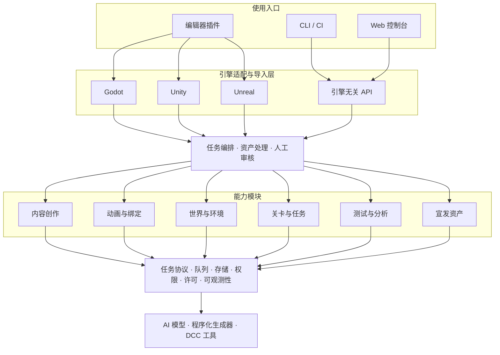
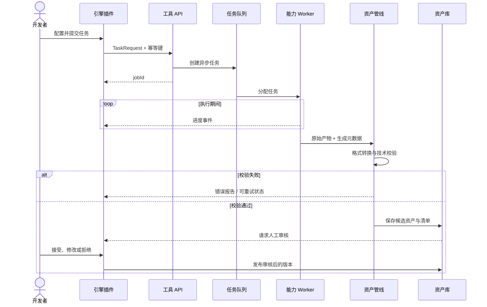
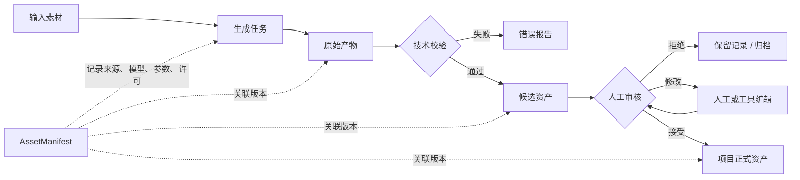

# 面向独立游戏的 AI 工具平台架构

这套架构用于组织和接入生成式 AI、程序化生成器及自动化工具。它不规定游戏应该按什么流程开发，也不把项目绑定到某个模型；目标是让工具能力可以替换、资产可以追溯，并能稳定接入 Godot、Unity、Unreal 或自研引擎。

> 架构推荐与资料分享：群友 **夜黛冷凝眉** · [playjoy.top](https://playjoy.top/)

本文根据分享的 **Indie Game Dev Toolkit** 架构图重新整理。图片中的仓库地址暂未找到可核验的公开实现，因此下文把它视为架构提案，并补充实际工程中需要的边界。

## 总体分层



关键点不是把所有功能做进一个“大平台”，而是先统一任务和资产协议，再让各能力模块独立替换。

## 能力模块

| 模块 | 可接入的能力 | 典型产物 |
| --- | --- | --- |
| 内容创作 | 概念图、纹理、材质、3D 建模、风格迁移、变体生成 | PNG、EXR、材质描述、glTF、USD |
| 动画与绑定 | 自动绑定、动作生成、动作匹配、IK、口型与表情 | 骨架、动画片段、Blend Shape、动作元数据 |
| 世界与环境 | 地形、生物群系、生态、天气、环境资产放置 | 高度图、场景块、生成参数、导航数据 |
| 关卡与任务 | 地牢布局、任务草案、叙事节点、遭遇和掉落配置 | 图结构、关卡数据、配置表、验证报告 |
| 测试与分析 | Bot 测试、行为分析、难度评估、遥测和热力图 | 回放、事件流、指标、问题摘要 |
| 宣发资产 | 预告片草案、截图、商店图、文案和社区素材 | 视频、图片、字幕、文案及版本清单 |

这些是能力目录，不是开发阶段。项目可以只接入其中一个模块，例如只做纹理生成或自动化试玩。

## 核心基础设施

### 统一任务协议

每个工具都应该接受结构化任务，而不是让编辑器插件直接调用某家模型 API。任务至少包含：

- 任务类型、输入资产和参数
- 项目、场景和调用者
- 期望的输出格式与引擎约束
- 使用的供应商、模型版本和随机种子
- 超时、重试、优先级与成本上限
- 数据隐私、许可和人工审核要求

```json
{
  "type": "texture.generate",
  "projectId": "forest-rpg",
  "inputs": [{ "artifactId": "concept-018" }],
  "parameters": {
    "usage": "terrain_albedo",
    "size": [2048, 2048],
    "seamless": true
  },
  "target": {
    "engine": "godot",
    "renderer": "forward_plus"
  },
  "policy": {
    "maxCost": 0.5,
    "allowTrainingUse": false,
    "requireReview": true
  }
}
```

### 异步任务系统

生成、烘焙、转码和自动测试都可能运行数分钟，不应占用一次 HTTP 请求直到完成。推荐采用：



任务要支持幂等键、取消、有限重试和失败原因记录。编辑器掉线后重新连接，也应该能恢复任务状态。

### 资产管线与产物清单

模型返回的文件不能直接成为“最终游戏资产”。资产管线应负责：

- 格式转换、尺寸与坐标系统一
- 网格、骨架、贴图和音频的技术校验
- 缩略图、预览和引擎导入文件生成
- 原始输入、中间结果与最终产物的版本关联
- 模型、提示词、参数、人工修改和许可来源记录

每个产物使用稳定 ID，并附带 `AssetManifest`。文件放在对象存储中，数据库只保存元数据、关系和状态，避免把大型二进制文件塞进业务表。



### 模型与供应商适配层

业务模块不应直接依赖某个模型名称。统一适配层至少暴露：

```ts
interface GenerationProvider {
  capabilities(): Capability[];
  estimate(request: TaskRequest): Promise<CostEstimate>;
  submit(request: TaskRequest): Promise<ProviderJob>;
  poll(job: ProviderJob): Promise<JobState>;
  cancel(job: ProviderJob): Promise<void>;
  collect(job: ProviderJob): Promise<Artifact[]>;
}
```

适配层负责供应商鉴权、参数映射、速率限制和结果规范化。工具推荐变化时，只替换适配器或路由策略，不重写 Godot 插件与资产数据库。

### 权限、许可和数据边界

- 区分项目成员、自动化账号和外部服务的权限。
- API Key 保存在服务端密钥系统中，不写进游戏工程或编辑器插件。
- 为输入素材、参考图、模型输出和人工修改分别记录来源与许可。
- 明确供应商是否保留输入、是否用于训练，以及项目是否允许上传未公开资产。
- 记录成本、配额和每次生成的调用者，避免共享 Key 导致费用失控。

### 可观测性

至少记录成功率、排队时间、执行耗时、单次成本、缓存命中率和人工通过率。质量不能只看“API 成功”：生成成功但被全部弃用，同样意味着工具或参数需要调整。

## 引擎适配层

引擎插件应该保持轻量，只承担用户交互和导入，不承载供应商业务逻辑。

| 接入目标 | 推荐边界 |
| --- | --- |
| Godot | `GDExtension`、GDScript 编辑器插件、导入插件与 HTTP/WebSocket 客户端 |
| Unity | Editor Window、Importer、C# SDK 与 Package |
| Unreal | Editor Module、Importer、Blueprint Node 与 C++ SDK |
| 引擎无关 | REST/OpenAPI、WebSocket/SSE、CLI，以及 glTF、USD 等开放格式 |

一个健康的适配器通常只做四件事：收集上下文、提交任务、展示进度、把审核后的产物导入正确目录。这样引擎升级或更换模型时，变化不会穿透整个系统。

## 推荐的最小落地版本

独立团队不需要一开始就部署 Kubernetes。可以按规模渐进实现：

### 本地优先

- 一个 CLI 或本地服务
- SQLite 保存任务和元数据
- 本地目录保存产物
- 一个 Godot/Unity/Unreal 编辑器插件
- 一个具体能力，例如纹理生成或语音生成

### 小团队服务

- REST API 与后台 Worker
- PostgreSQL 保存项目、任务和资产关系
- S3 兼容对象存储保存二进制产物
- Redis 或数据库任务队列
- OAuth/团队账号、配额和审计日志

### 多项目平台

- 按能力拆分 Worker 池，并为 GPU 和外部 API 分别调度
- 事件总线连接生成、校验、审核和发布步骤
- 供应商路由、成本预算、失败降级和区域策略
- 集中式指标、日志、追踪与资产许可审计

## 可选技术栈

架构图给出的 Python/TypeScript、FastAPI/GraphQL、Celery/Redis、PostgreSQL/MinIO、Docker/Kubernetes 是可行组合，但不是架构本身。选型时更重要的是边界：

| 需求 | 可选实现 |
| --- | --- |
| API | FastAPI、ASP.NET Core、NestJS；对外优先提供 OpenAPI |
| 任务队列 | Celery、BullMQ、Temporal、云队列或数据库队列 |
| 元数据 | PostgreSQL；单机原型可用 SQLite |
| 二进制资产 | S3、MinIO、云对象存储或本地内容寻址目录 |
| 实时进度 | WebSocket、SSE 或消息代理 |
| 资产处理 | Blender 后台模式、FFmpeg、引擎命令行导入器及自定义校验器 |
| 部署 | 本机进程、Docker Compose；确有扩缩容需求后再考虑 Kubernetes |

## 常见失败模式

- 编辑器插件直接绑定某家模型 API，导致密钥泄露且无法替换供应商。
- 只保存最终文件，没有记录模型版本、参数、输入来源和人工修改。
- 把长任务做成同步接口，超时后既不知道是否完成，也无法安全重试。
- 不区分“生成完成”和“资产可用”，跳过格式校验与人工审核。
- 过早拆成大量微服务，维护成本超过工具本身带来的收益。
- 为追求引擎无关而只定义最低公分母，丢失 Godot、Unity 或 Unreal 的关键导入能力。

## 核心原则

1. **开放格式优先**：减少对模型、引擎和 DCC 软件的绑定。
2. **能力模块化**：生成器可替换，任务和资产协议保持稳定。
3. **异步且可恢复**：长任务能追踪、取消、重试和恢复。
4. **产物可追溯**：知道资产由什么输入、模型、参数和人工修改产生。
5. **人工确认发布**：AI 输出先进入候选区，不直接覆盖项目正式资产。
6. **从单个痛点开始**：先证明一个工具确实节省时间，再扩展平台能力。

::: tip 与“AI 工具推荐”的关系
本页解决“怎样把工具可靠地接入项目”；[AI 工具推荐](/tools/)解决“当前优先选择哪些工具”。具体模型可以快速变化，任务协议、资产管线和引擎适配边界应尽量保持稳定。
:::
