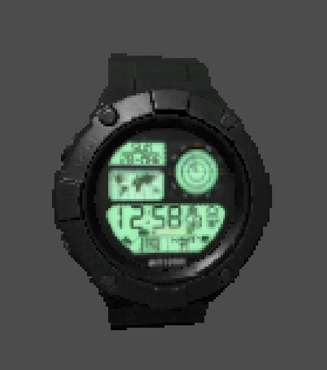
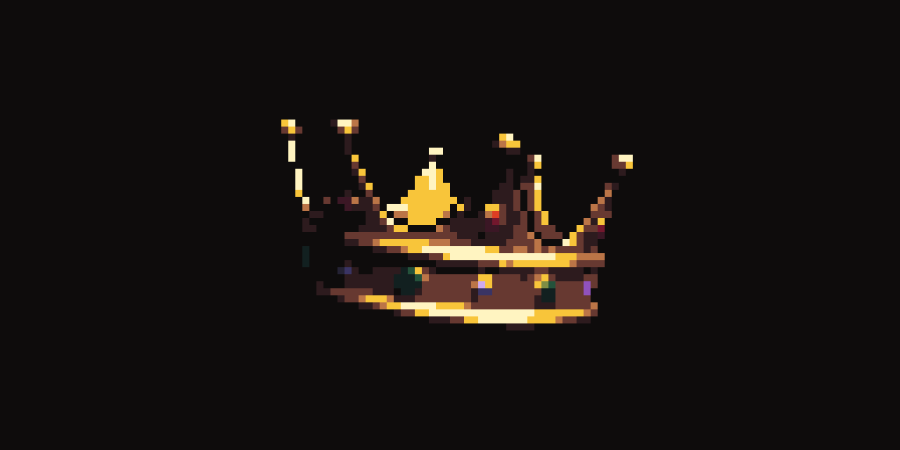

# Godot 三渲二：低分辨率像素化与轮廓

三渲二不是单一 Shader，而是一组把 3D 场景压缩成 2D 视觉语言的方法。像素风项目最稳定的基础方案，是让 3D 场景先在低分辨率 `SubViewport` 中渲染，再以最近邻过滤放大；需要轮廓、抖色或调色时，再叠加后处理。

## 推荐结构：低分辨率视口

```text
3D 场景 → SubViewport（低分辨率）→ ViewportTexture → TextureRect → 最近邻放大
```

1. 创建一个非零尺寸的 `SubViewport`，让 3D 相机和场景在其中渲染。
2. 通过 `SubViewportContainer` 显示它，或把 `ViewportTexture` 交给 `TextureRect`。
3. 将纹理过滤设为 `Nearest`，按整数倍缩放，避免像素被线性插值抹平。
4. UI 通常放在低分辨率画面之后渲染，否则文字和细线也会一起像素化。

这个方案的像素尺寸稳定，镜头移动时也更容易控制。Godot 官方文档可参考 [SubViewport](https://docs.godotengine.org/zh-cn/stable/classes/class_subviewport.html)、[ViewportTexture](https://docs.godotengine.org/zh-cn/stable/classes/class_viewporttexture.html) 与[多分辨率支持](https://docs.godotengine.org/zh-cn/stable/tutorials/rendering/multiple_resolutions.html)。

## 原始分享：UV 像素化与透明轮廓

下面的 `canvas_item` Shader 来自群聊原始分享。它把 UV 对齐到较粗的采样网格，并检查上下左右的透明度来生成外轮廓。

```gdshader
shader_type canvas_item;

uniform vec2 scale = vec2(4.0);
uniform vec2 viewport_size = vec2(512.0);

uniform float outline_width = 1.0;
uniform vec4 outline_color : source_color = vec4(0.0, 0.0, 0.0, 1.0);

void fragment() {
    vec2 uv = UV;

    uv *= viewport_size / scale;
    uv = floor(uv);
    uv /= viewport_size / scale;

    vec2 uv_up = uv + vec2(0.0, TEXTURE_PIXEL_SIZE.y) * outline_width * scale;
    vec2 uv_down = uv - vec2(0.0, TEXTURE_PIXEL_SIZE.y) * outline_width * scale;
    vec2 uv_left = uv + vec2(TEXTURE_PIXEL_SIZE.x, 0.0) * outline_width * scale;
    vec2 uv_right = uv - vec2(TEXTURE_PIXEL_SIZE.x, 0.0) * outline_width * scale;

    vec4 outline = texture(TEXTURE, uv_up)
        + texture(TEXTURE, uv_down)
        + texture(TEXTURE, uv_left)
        + texture(TEXTURE, uv_right);
    outline.rgb = outline_color.rgb;

    vec4 original_color = texture(TEXTURE, uv);
    COLOR = mix(outline, original_color, original_color.a);
}
```



### 适用边界

- 透明背景的角色纹理、精灵或单独渲染层，可以直接用邻域透明度得到外轮廓。
- 整张不透明的 3D 相机画面没有可供判断的透明边缘，这段代码无法识别物体内部边界。此时应使用深度、法线或颜色差异做边缘检测。
- 如果 Shader 直接读取屏幕画面，应使用 Godot 的 `hint_screen_texture` 与 `SCREEN_UV`；官方的[屏幕读取 Shader](https://docs.godotengine.org/zh-cn/stable/tutorials/shaders/screen-reading_shaders.html)和[自定义后处理](https://docs.godotengine.org/zh-cn/stable/tutorials/shaders/custom_postprocessing.html)说明了对应做法。

## 继续调风格时优先控制什么

- `SubViewport` 分辨率决定像素颗粒，而不是最终窗口分辨率。
- 固定整数缩放可减少大小不一致的像素块。
- 低色阶、色板映射和抖色比单纯降低分辨率更能形成统一风格。
- 轮廓宽度应按低分辨率像素计算；直接按高分辨率屏幕像素计算，缩放后容易忽粗忽细。
- 先处理镜头抖动和亚像素移动，再增加复杂后处理，否则画面会出现明显闪烁。

## Blender 方向的原始参考

[Blender To Pixels](https://astropulse.gumroad.com/l/BlenderToPixels) 展示了在离线渲染流程中实现类似风格的一种方案。



> 来源：[群聊原始记录](/reference/3dShade2d.html)。本页保留原思路，并补充了 Godot 当前文档对应的实现路径和限制。
